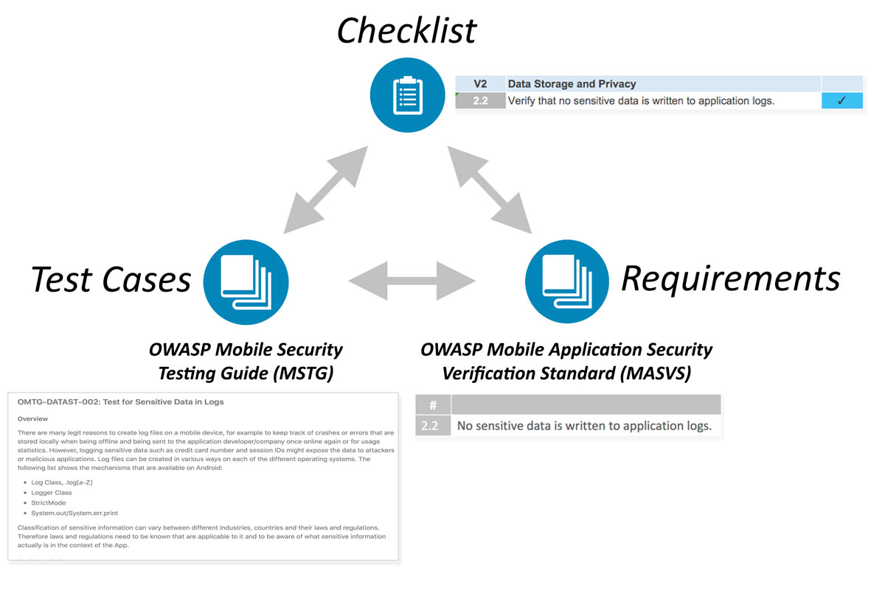

# 概述

## OWASP 移动安全测试指南简介

新技术总是带来新的安全风险，移动计算也不例外。移动应用程序的安全问题在一些重要方面与传统桌面软件不同。现代移动操作系统可以说比传统的桌面操作系统更安全，但当我们在移动应用开发过程中不仔细考虑安全性时，问题仍然会出现。数据存储、应用间通信、正确使用加密 API 和安全网络通信只是其中一些注意事项。

### 移动应用安全中的关键领域

许多移动应用渗透测试人员都有网络和 Web 应用渗透测试的背景，这种质量对于移动应用测试很有价值。几乎每个移动应用都与后端服务对话，这些服务容易受到我们在台式计算机上的 Web 应用中熟悉的相同类型的攻击。移动应用的不同之处在于，攻击面较小，因此对注射和类似攻击的安全性更大。相反，我们必须优先处理设备和网络上的数据保护，以提高移动安全性。

让我们讨论移动应用安全方面的关键领域。

#### 本地数据存储

保护敏感数据（如用户凭据和私有信息）对于移动安全至关重要。如果应用错误地使用操作系统 API（如本地存储或进程间通信 （IPC），则应用可能会将敏感数据公开给在同一设备上运行的其他应用。它还可能无意中将数据泄漏到云存储、备份或键盘缓存。此外，与其他类型的设备相比，移动设备更容易丢失或被盗，因此个人更有可能获得对设备的物理访问权限，从而更容易检索数据。

在开发移动应用程序时，在存储用户数据时必须格外小心。例如，我们可以使用适当的密钥存储 API，并利用硬件支持的安全功能（如果可用）。

碎片化是我们处理的问题，尤其是在 Android 设备上。并不是每个 Android 设备都提供硬件支持的安全存储，并且许多设备都运行过时的 Android 版本。要在这些过期设备上支持应用，必须使用旧版本的 Android API 创建应用，该 API 可能缺乏重要的安全功能。为了获得最大的安全性，最好的选择是使用当前 API 版本创建应用，即使这排除了某些用户。

#### 与受信任的端点通信

移动设备定期连接到各种网络，包括与其他（潜在恶意）客户端共享的公共 WiFi 网络。这为各种基于网络的攻击创造了机会，从简单到复杂，从旧到新。保持移动应用和远程服务终结点之间交换信息的机密性和完整性至关重要。作为基本要求，移动应用必须使用具有适当设置的 TLS 协议为网络通信设置安全、加密的通道。

#### 身份验证和授权

在大多数情况下，发送用户登录到远程服务是整个移动应用体系结构中不可或缺的一部分。尽管大多数身份验证和授权逻辑都发生在终结点，移动应用端也存在一些实现难题。与 Web 应用不同，移动应用通常存储使用用户到设备身份验证功能（如指纹扫描）解锁的长期会话令牌。虽然这允许更快的登录和更好的用户体验（没有人喜欢输入复杂的密码），但它也带来了额外的复杂性和出错的空间。

移动应用体系结构还越来越多地包含授权框架（如 OAuth2），这些授权框架将身份验证委派给单独的服务或将身份验证过程外包给身份验证提供程序。使用 OAuth2 允许将客户端身份验证逻辑外包给同一设备上的其他应用（例如系统浏览器）。安全测试人员必须知道不同可能的授权框架和体系结构的优缺点。

#### 与移动平台的互动

移动操作系统体系结构在重要方面不同于传统的桌面架构。例如，所有移动操作系统都实施应用权限系统，以规范对特定 API 的访问。它们还提供更多（安卓）或更丰富的 （iOS） 进程间通信 （IPC） 功能，使应用能够交换信号和数据。这些特定于平台的功能带有一系列自己的缺陷。例如，如果 IPC API 被误用，则敏感数据或功能可能会无意中暴露给设备上运行的其他应用。

#### 代码质量和漏洞利用缓解

由于攻击面较小，移动应用中经常看不到传统的注入和内存管理问题。移动应用大多与受信任的后端服务和 UI 交互，因此即使应用中存在许多缓冲区溢出漏洞，这些漏洞通常也不会打开任何有用的攻击媒介。这同样适用于在 Web 应用中非常流行的浏览器漏洞，例如跨站点脚本（XSS 允许攻击者将脚本注入网页）。但是，总是有例外。在某些情况下，XSS 在移动设备上是可能的，但很少看到个人可以利用的 XSS 问题。有关 XSS 的详细信息，请参阅章节"测试代码质量"中的"[跨站点脚本缺陷]（0x04h-测试-质量.md_跨站点脚本-缺陷-mstg-arch-2 和 mstg-平台-2）"部分。

这种保护免受注入和内存管理问题，并不意味着应用开发人员可以逃脱编写草率的代码。遵循安全最佳实践可生成能够抵御篡改的强化（安全）版本版本。编译器和移动 SDK 提供的免费安全功能有助于提高安全性并减轻攻击。

#### 防篡改和防逆

在礼貌的谈话中，有三件事你不应该提出来：宗教、政治和代码混淆。许多安全专家直接否定客户端保护。但是，软件保护控件在移动应用领域被广泛使用，因此安全测试人员需要处理这些保护的方法。我们相信，如果客户方保护的采用具有明确的目的和现实的期望，并且不用于替代安全控制，则这些保护将大有裨益。

## OWASP 移动应用验证标准

本指南与 OWASP 移动应用程序安全验证标准 （MASVS） 密切相关。MASVS 定义了移动应用安全模型，并列出了移动应用的通用安全要求。架构师、开发人员、测试人员、安全专业人员和消费者可以使用它来定义和理解安全移动应用的质量。MSTG 映射到 MASVS 提供的相同基本安全要求集，并且根据上下文可以单独使用或组合以实现不同的目标。

例如，MASVS 要求可用于应用的规划和体系结构设计阶段，而检查表和测试指南可以用作手动安全测试的基准，也可以用作开发期间或开发后自动安全测试的模板。在"[移动应用安全测试](0x04b-Mobile-App-Security-Testing.md)" 章节将介绍如何将检查表和 MSTG 应用于移动应用渗透测试。

## 导航移动安全测试指南

MSTG 包含 MASVS 中指定的所有要求的说明。MSTG 包含以下主要部分：

1. [一般测试指南](0x04a-Mobile-App-Taxonomy.md) 包含适用于移动应用安全性的移动应用安全测试方法和一般漏洞分析技术。它还包含与操作系统无关的其他技术测试用例，例如身份验证和会话管理、网络通信和加密。

2. [安卓测试指南](0x05a-Platform-Overview.md) 涵盖 Android 平台的移动安全测试，包括安全基础知识、安全测试案例、逆向工程技术和预防以及篡改技术和预防。

3. [iOS 测试指南](0x06a-Platform-Overview.md) 涵盖 iOS 平台的移动安全测试，包括 iOS 操作系统概述、安全测试、逆向工程技术和预防以及篡改技术和预防。
