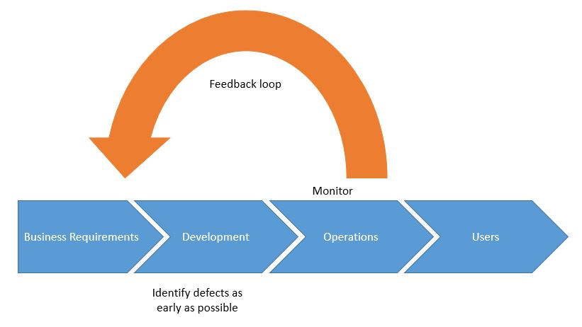

## 移动应用安全 测试

在以下章节中, 我们会简单的概述安全测试原则 和 关键技术术语. 在这里介绍的大部分定义和其他对渗透测试的解读是相似的, 如果你是经验丰富的安全测试员, 很多内容也许你已经很熟悉了.

整个指南中, 我们用 "移动 应用 安全测试" 这个综合名词来代表移动应用安全的静态分析和动态分析. 类似于 "移动应用渗透测试" 和 "移动应用安全分析" 某种程度上常用在安全领域中, 但是这些定义基本上都是指的同一件事情. 移动应用安全测试 通常是大规模的安全评估 或者 渗透测试, 这些测试包含了客户端到服务器端的架构, 以及服务器端 API 被移动应用的调用.

在这个指南中, 我们包含移动应用安全测试的两种不同背景. 第一个种是 "经典/传统" 安全测试, 发生在开发生命周期快完成的时候. 在这种背景下, 测试人员访问几乎完成或者准备投入生产的应用程序版本, 识别安全问题, 并编写报告 (通常是具有破坏性的危害). 另外一种环境背景是, 软件需求的实现是从软件开发生命周期开始, 即安全自动化流程中开始. 在两种情况下, 基本需求和测试案例都适用, 只是高级方法和客户端交互的级别不同.

### 测试基本原理

#### 白盒测试 对比 黑盒测试

让我们来定义这些概念:

- **黑盒 测试** 指测试人员没有任何关于正在测试的应用程序的信息的情况下进行的. 这种测试有时候被称为 "零信息测试". 这个测试的主要目的是让测试人员模拟真正的攻击者的思维一样, 探索可用的和可发现的信息.
- **白盒 测试** (有时被称为 "了如指掌测试") 与黑箱测试完全相反，因为测试人员完全了解应用程序。这些知识可能包括源代码、文档和图表。这种方法允许比黑盒测试快得多的测试，因为它是透明的，并且利用获得的额外知识，测试人员可以构建更复杂和粒度更细的测试用例。
- **灰盒 测试** 是介于上述两种测试类型之间的测试: 一些信息提供给测试人员(通常仅提供凭证)，而其他信息则被用来发现。这种类型的测试在测试用例的数量、成本、速度和测试范围方面是一种有趣的折衷。灰箱测试是安全行业中最常见的一种测试。

我们强烈建议您使用源代码，以便尽可能有效地使用测试时间。测试人员获取代码访问显然不会模拟外部攻击，但是它简化了漏洞的识别，允许测试人员在代码级别验证每个识别出的异常或可疑行为。如果应用程序之前没有测试过，那么可以使用白盒测试。

尽管在Android上进行反编译非常简单，但是源代码可能会被混淆，而消除混淆将非常耗时。因此，消除时间限制是测试人员访问源代码的另一个原因。

#### 漏洞 分析

漏洞分析通常是在应用程序中寻找漏洞的过程。虽然这可能是手工完成的，但通常使用自动扫描来识别主要的漏洞。静态分析和动态分析是脆弱性分析的常见两种类型。

#### 静态 对比 动态 分析

静态应用程序安全性测试(SAST)即通过手动或自动分析源代码，在不执行组件的情况下检查应用程序的组件。
OWASP 提供了关于 [静态代码分析](https://www.owasp.org/index.php/Static_Code_Analysis "OWASP 静态代码分析") 这些信息可以帮助您了解技术、优势、弱点和限制。

动态应用程序安全性测试(DAST)涉及在运行时检查应用程序。这种分析可以是手动的，也可以是自动的。它通常不提供静态分析提供的信息，但是从用户的角度来看，它是检测感兴趣组件(资产、功能、入口点等)的好方法。

交互式应用程序安全性测试(IAST)通过软件工具进行安全测试，或者使用工具在应用程序运行时监视它，并收集关于它的功能和执行方式的信息。

既然我们已经定义了静态和动态分析，让我们更深入地研究一下。

#### 静态 分析

在静态分析期间，对移动应用程序的源代码进行审查，以确保安全适当控制的实现。在大多数情况下，使用自动/手动的混合方法。自动扫描抓住了容易实现的问题，手动测试人员可以根据上下文的代码在头脑中搜索特定的问题。

##### 人工/手动 代码审核

测试人员通过手动代码审查, 手动分析移动应用程序的源代码, 从而检查安全漏洞。方法通过 'grep' 命令进行基本的关键字搜索到逐行检查源代码。ide(集成开发环境)通常提供基本的代码审查功能，可以使用各种工具进行扩展。

人工代码分析的一种常见方法是识别关键安全漏洞标识, 通常就是搜索特定 API 和 关键字, 例如 数据库相关的方法调用 "executeStatement" 或者 "executeQuery". 代码含有这些字符串是开始人工分析良好起点.

相对于自动化代码分析, 手动代码审核对于识别业务逻辑中的漏洞, 违反标准, 和设计弱点, 特别是代码从技术上是安全的, 但是逻辑上存在弱点的等情况有很好的帮助.

手动代码审查需要一个代码审核专家, 而且需要对编译语音的熟悉和移动应用框架的熟悉. 完整的代码审核是漫长的, 乏味的, 耗时的, 特别是对于大型代码应用存在多种其他软件依赖. 

##### 自动 源代码分析

自动分析工具能够提高审核静态应用安全测试的速度(SAST). 它们通过已经定义好的规则或者业界最佳实践来检查源代码, 然后显示一系列检查结果和警告,并且标识所有被检测的违规软件行为. 某些静态分析工具只支持能够编译的应用, 某些必须关联源代码一起, 还有些运行实时分析插件在集成开发环境中(IDE).

虽然某些静态代码分析工具包含了很多关于规则信息和编译语音要求来分析移动应用, 但是仍然会产生很多误报, 特别是如果他们和目标环境配置不一样的时候. 一位安全专家必须介入来分析这些结果.

附录“测试工具”包括一个静态分析工具列表，可以在本书的最后部分找到

#### 动态 分析

DAST 的重点是通过应用程序的实时执行对其进行测试和评估。动态分析的主要目标是发现程序运行时的安全漏洞或弱点。在移动平台层和后端服务和api之间进行动态分析，可以分析移动应用程序的请求和响应模式。

动态分析通常用于检查安全机制，以提供足够的保护来抵御最常见的攻击类型，如传输中的数据公开、身份验证和授权问题以及服务器配置错误。

#### 过滤 误报

##### 自动 扫描工具

自动测试工具的挑战, 是缺乏对应用内容的准确度. 换句话来说,这些工具能够识别潜在的不相关的问题. 这种结果我们通常称之为 "误报". 

举例, 安全测试常报告的发生在网页浏览器中的漏洞不一定和移动应用相关联. 误报发生的原因是因为自动工具基于一般浏览器为主的网页应用,来扫描后端服务. 比如说 CSRF (跨站请求伪造) 和 跨站脚本 (XSS) .

让我们拿 CSRF 来举例. 一个成功的 CSRF 攻击需要以下条件:

- 诱骗已经登录的用户通过网页浏览器打开可疑的链接, 从而访问有漏洞的站点. 
- 客户端浏览器必须将会话 cookie 或者其他认证令牌自动添加到请求中.

然而移动应用无法满足这些要求: 及时WebView 和 基于令牌的会话管理被使用, 任何可以链接被用户通过默认浏览器打开的行为, cookie 实际都是额外存放. 

如果应用存在了 WebView 的功能, 存在跨站脚本的可能是一个问题, 因为只有在应用程序导出JavaScript接口时, 才有可能执行命令. 然而, 由于上面提到的原因, 跨站脚本很少成为可利用的攻击点(是否应该存在就是有争议的 — 输出转义是最佳实践).

> 在任何情况下, 当你进行风险评估的时候,应该考虑到渗透场景; 不要盲目的相信你的扫描工具的结果.

##### 剪切板

当你输入数据到输入栏, 剪切板可以用来拷贝数据. 剪切板可以通过系统整个系统来访问,所以与应用共享. 这种共享机制可以被可以应用程序利用来获取保存在剪切板中的敏感信息.

在 iOS 版本 9之前, 某种可疑的应用可以在后台背景监控复制板, 并且周期性的获取当中的数据.a `[UIPasteboard generalPasteboard].string`. 自从 iOS 9 之后, 剪贴板内容只能被前台的应用程序访问, 这样大大的减少了从剪贴板嗅探密码的攻击面.

对于 [Android 有一个 PoC 漏洞发布](https://arstechnica.com/information-technology/2014/11/using-a-password-manager-on-android-it-may-be-wide-open-to-sniffing-attacks/ "密码 嗅探") 为了掩饰如果密码被保存在剪贴板中的攻击方式. [屏蔽在输入框粘贴密码功能](https://github.com/OWASP/owasp-masvs/issues/106 "屏蔽在输入框粘贴密码功能") 是 MASVS 1.0 中的要求之一, 但是最终被移除了,因为以下原因:

- 屏蔽粘贴数据到应用的输入框,并不能防止用户拷贝任何敏感信息. 由于信息在用户发现无法使用粘贴功能之前就已经被复制率, 此时,一个恶意的应用程序已经嗅探到了剪切板中的内容.
- 如果密码输入框的粘贴功能被禁用, 用户为了容易技术密码,从而使用较弱的密码, 他们从此不会再使用密码管理器, 这样将与我们为了让应用更加安全的初衷相违背.

当你使用应用的时候, 你应该注意其他应用正在读取你剪切板内容, 比如说 [Facebook 应用](https://www.thedailybeast.com/facebook-is-spying-on-your-clipboard "Facebook 在监听你的剪切板"). 尽管如此, 复制黏贴密码是一个安全风险, 你应该意识到, 但也不能通过一个应用程序功能来解决.

#### 渗透测试 (a.k.a. Pentesting)

传统的方式是在应用程序的最终或接近最终构建的阶段进行安全测试, 例如.,在开发过程结束时可用的构建. 为了在开发过程的最后进行测试, 我们建议使用 [移动应用安全验证标准 (MASVS)](https://github.com/OWASP/owasp-masvs "OWASP MASVS") 和相关的检查清单作为测试的基线, 一个经典的安全测试结构如下:

- **准备(Preparation)** - 定义安全测试的范围, 包括确定使用的安全控制, 组织和测试目标和敏感数据. 更粗略的来说, 准备工作包括与客户端的所有同步, 以及在法律上保护测试人员 (通常是第三方).请记住在很多国家, 未经书面授权的攻击系统是非法的!
- **情报收集(Intelligence Gathering)** - 分析 **环境** 和 **架构** 应用的内容来获取对应用内容上的理解.
- **综合应用功能分析(Mapping the Application)** - 根据上个阶段获取的信息; 通过自动扫描和手动探索应用程序来补充更多信息. 信息映射提供了对应应用程序, 入口点, 所保存的数据内容, 以及主要的潜在漏洞. 然后可以根据这些漏洞可能造成的损害对它们进行排序, 以便于安全测试人员对它们进行优先级处理. 此阶段包含了测试执行期间, 可能使用的测试用例的创建.
- **利用(Exploitation)** - 在这个阶段, 安全测试人员试图利用上个阶段发现的漏洞来渗透应用程序. 这个阶段对于确定漏洞是否真实存在和正确报警的必要性.
- **汇报(Reporting)** - 在这个阶段, 对于客户来说也是关键,安全测试汇报发现的漏洞,以及他能够利用的漏洞, 并且记录下他能够实现的危害,包括危害范围. (举例, 测试员可以非法的访问数据).

##### 准备

被测试的应用安全级别必须在测试之前被确定. 安全要求需要在项目开始之前被确定. 不同的组织有不同的安全要求,以及能够调用资源来进行测试活动. 虽然 MASVS 级别 1 控制适用于所有的移动应用,与技术和业务人员一起审阅整个 L1 和 L2 MASVS 控制的列表是确定安全测试覆盖级别的最好方法. 

在某些领域中,不同企业组织有着不同的要求和法务责任. 尽管应用不处理敏感数据, 一些 L2 的要求也可能是相关联的 (因为行业法规或者当地法律). 例如, 双因素认证(2FA)可能是金融应用程序必须的,并由国家的中央银行和/或金融监管机构强制执行.

在开发流程的早期中,安全目标/管控可以与项目股东商量以及评审. 某些控制可能符合 MASVS 控制, 但是其他可以根据组织或者应用来特殊定义.

所有参与的团队必须就检查列表中的条目达成一致, 因为这定义了所有安全测试的基线.

###### 与 客户的协调

搭建一个工作的测试环境是一种挑战的任务. 举例, 企业无线访问点的限制和网络访问限制可能阻碍在客户地方进行动态分析测试. 公司策略也许会阻止使用越狱过的手机(硬件 和 软件) 或者在企业网络中使用测试工具. 使用了越狱监测和其他反逆向工程对策的应用会增加分析的工作量.

安全测试包括许多入侵任务, 包括监控和串改移动应用的网络流量, 监听应用数据文件, 以及插装 API 调用. 安全控制, 比如证书绑定 和 越狱监测机制 可能会妨碍这些任务, 并且极大的降低测试的速度.

为了克服这些障碍, 你可能需要向开发团队申请两个不同的应用程序. 一个应该是发布的版本, 这样你就可以确定现实的控制是否工作正常, 并且不能轻易的绕过他们. 第二种变体应该是某个安全控制以及被停用的调试版本. 测试2个不同的架构的应用是覆盖所有测试用例的最有效的方法.

根据约定的范围, 这种方法也许不行. 请求白盒测试生产和调试架构将帮助您完成所有的测试用例, 并清楚的说明了应用程序的安全成熟度. 客户可能更喜欢将黑盒测试集中在生产环境下的应用程序以及安全控制有效性的评估上.

两种不同测试的范应该在准备阶段讨论. 列如, 在测试之前, 安全控制是否需要调整. 更多的标题将会在下面讨论.

###### 识别 敏感数据

不同的行业和国家,对于敏感信息的分类不同. 此外, 组织可能对敏感数据采取限制性的观点, 并且他们可能有明确定义敏感信息好的数据,以及分类的策略.

数据可以从以下三种状态获得:

- **在保存的时候** - 数据存放在文件或者数据存储介质中
- **在使用的时候** - 应用数据将数据加载到其他介质中
- **在传输的时候** - 数据在移动应用和终端之间交换,或者在设备上消耗进程. 举例., 在 IPC 期间(Inter-Process Communication)

对每个地域的审查程度取决于数据的重要性和被访问的可能性. 列如, 应用程序内存中的数据可能比 Web 服务器上的数据更容易通过 core dump 的方式访问, 因为攻击者更有可能获取移动设备的物理访问权限, 而不是网页访问服务器.

如果没有可用的数据分类策略, 请使用以下通常被认为是敏感的信息列表:

- 用户认证信息 (认证凭证, PINs, etc.)
- 个人身份信息 (PII) 类似这些信息可能被滥用于身份盗窃: 社会安全号码, 信用卡号码, 银行账户, 健康信息
- 设备识别号可以识别个人
- 任何可以导致名誉损害或者财政损失的高敏感数据
- 任何受法律义务保护的数据
- 应用生成的任何技术数据用来保护其他数据或者系统本身数据

 必须在安全测试开始之前确定 "敏感数据" 等定义, 因为没有定义是不可能检测敏感数据的泄露.

###### 情报收集

情报收集包含应用的架构的信息收集, 应用服务器的业务使用场景, 以及应用运行的内容. 这些信息可以分为 "环境" 或者 "架构". 

###### 环境 信息

环境信息包括:

- 组织对应用程序的目标. 功能决定用户与应用程序的交互, 并有可能比其他更容易成为攻击的目标
- 相关的行业。不同的行业可能有不同的风险。
- 股东和投资者;了解谁对该应用程序感兴趣并负责。
- 内部流程、工作流程和组织结构。特定于组织的内部流程和工作流程可能为 [商业逻辑渗透](https://www.owasp.org/index.php/Testing_for_business_logic "测试商业逻辑").

###### 架构 信息

架构信息包括:

- **移动 应用:** 应用程序如何在访问数据和管理进程, 如何与其他资源通信和管理用户会话, 以及它是否检测到自己运行在越狱或者root过的手机, 并对这些情况作出反应.
- **操作系统:** 应用程序运行的操作系统和操作系统版本 (包括 Android 或者 iOS 版本的限制), 应用程序是否应该运行在有移动设备管理 (MDM) 控制的设备上, 以及操作系统的漏洞.
- **网络:** 使用安全传输协议 (e.g., TLS), 使用较强密钥 和加密算法 (e.g., SHA-2) 来保护加密网络流量, 使用证书来绑定认证的终端, 等等.
- **远程服务:** 应用程序所使用的远程服务以及是否会影响到客户端.

##### 匹配 应用功能 

安全测试人员一旦拥有了应用和内容的信息, 下一步就是匹配应用的架构和内容, 列如., 识别切入点, 功能, 和数据.

当白盒渗透测试实施当渗透测试在白盒或灰盒范例中执行时，项目内部的任何文档 (架构图, 功能图, 代码 等等)可以加大的促进这个过程. 如果存在源代码, 使用 SAST 工具可以揭示关于漏洞的有价值的信息.(e.g., SQL 注入).
DAST 工具只支持应用的黑盒测试和自动扫描: 测试人员可能需要几小时或几天的时间, 而扫描器可能在几分钟内就可以完成相同的任务. 然后, 需要记住的是, 自动工具存在局限性, 只能找到他们被编程要找到的东西. 因此, 可能需要人工分析来增强自动工具的最终结果. (直觉通常是安全测试的关键).

威胁建模是一种重要的方法: 通过讨论后的文档通常极大的给安全测试人员带来需要的信息 (入口点, 资产, 漏洞, 严重等级, 等等.). 强烈建议测试人员与客户讨论此类文档的可用性. 威胁建模是软件开发生命周期的关键部分. 它通常发生在项目的最早期阶段.

[OWASP 定义的 威胁建模指南](https://www.owasp.org/index.php/Application_Threat_Modeling "OWASP 应用 威胁模型") 是普遍适用于移动应用.

##### 漏洞利用

不幸的是, 由于时间或者财务上的限制, 许多渗透人员是通过自动扫描的方式来完成应用程序测试. (例如, 漏洞分析). 虽然在上一个阶段发现漏洞是件很有趣的事情, 但是他们的相关性必须有以下五个点来确认:

- **潜在威胁** - 漏洞利用可能造成的损害
- **重现性** - 攻击重现的难易程度
- **可利用性** - 执行攻击的容易程度
- **受影响的用户** - 受影响的用户数量
- **可发现性** - 漏洞被发现的容易程度

尽管存在种种困难, 但是有些漏洞可能无法利用, 并可能导致较小的威胁. 其他漏洞乍一看似乎是无害的, 但是在实际测试条件下却被确定为非常危险的. 测试人员通过描述漏洞及其影响来仔细的通过开发阶段来支持测试.

#### 报告

对于客户来说安全测试人员的发现只有被完整记录下来才有价值. 一份优质的渗透报告必须包括以下信息, 但不限于以下:

- 渗透内容摘要
- 范围和内容的描述 (e.g., 目标系统)
- 使用方法
- 信息来源 (包括客户提供的信息或者在渗透过程中所发行的信息)
- 优先级排序所有的发现 (e.g., 漏洞通过 DREAD 架构来分类)
- 详细的发现
- 每个缺陷的建议和修复方法

互联网上有很多渗透报告的模板: Google 是你最好的朋友!

### 安全测试 和 SDLC (软件开发生命周期)

虽然在最佳的历史中, 安全测试的远程并没有从根本上改变, 但是软件开发技术以及发生了巨大的变化. 虽然敏捷实践的广泛采用加速了软件开发, 但是安全测试人员必须变得更快, 更敏捷, 同事继续交付值得信任的软件.

下面章节将重点介绍这种演变和描叙当前的安全测试.

#### 在软件开发生命周期中的 安全测试

毕竟, 软件开发并不是很古老, 所以没有框架的开发是很容易观察到的. 许多开发人员都经历过, 他们需要最少一组规则来控制他们源代码的增长.

在过去, "瀑布流" 方法被广泛的采用: 开发按照预先定义的顺序进行. 但是仅仅局限于单个步骤, 这是瀑布方法的一个重要缺陷. 尽管他们有重要的优质功能 (比如: 提供结构, 帮助测试人员找到需要努力的痛点, 清晰和容易理解, 等.), 他们也有劣质的特性 (创建 silos, 非常缓慢, 需要专门团队, 等等.).

随着软件开发的成熟, 竞争加剧, 开发需要人员更快的对市场变化做出反应, 同时用更少的预算创建软件产品. 使用轻量级结构的想法越来越流行, 和更小的团队互相协作, 打破了整个组织的瓶颈. "敏捷" 概念衍生了其他 (Scrum, XP, 和 RAD 是敏捷实现的著名例子); 它让更多的自助团队能够更快的一起工作.

安全性最初并不是软件开发的一个组成部分. 而是一个事后的想法, 由网络运营团队执行, 他们必须弥补草稿的软件安全性! 虽然在网络边界内的软件有不集成安全的可能性, 但是随着网络, 移动和物联网技术的出现, 这种安全概念就变得过时了. 现在, 安全必须在 **内部** 软件开发中烘焙, 因为对漏洞进行弥补通常是非常困难的.

> "SDLC" 将会与下一章节中的 "安全 SDLC" 相互使用, 以帮助你理解安全是软件开发过程的一部分的概念. 本着同样的精神, 我们使用 DevSecOps 这个名称来强调安全性是 DevOps 的一部分的事实.

#### SDLC 概述

##### SDLC 的一般描述

SDLCs 总是有相同的步骤组成 (在瀑布流中, 整个过程是连续的, 而在敏捷中, 则是迭代的模式):

- 通过 **风险评估** 来识别应用和组件的风险状况. 这些风险概况通常取决于组织的风险偏好和监管要求. 风险评估基于一些因素, 包括应用程序是否可以访问互联网, 以及应用程式处理和存储数据的类型. 必须考虑的各种风险: 金融, 市场, 工厂等等. 数据分类策略指定那些数据是敏感的,以及需要被安全保护的. 
- **安全 要求** 在项目开始或者开发周期前被确定, 即收集应用功能需求的时候确定. **滥用案例** 在创建用例的时候被添加. 如果需要, 团队(包括开发团队) 可以接受安全培训 (安全代码编写). ????
你可以使用 [OWASP MASVS](https://mobile-security.gitbook.io/masvs/ "OWASP MASVS") 来确定移动应用程序在风险评估阶段的基础上的安全需求. 在添加特性和数据类时候迭代的检查需求是很正常的, 特别是在敏捷开发项目中.
- **威胁 建模**, 基本上只指 识别, 枚举, 优先级划分和对威胁的初始处理, 这些事必须作为体系结构开发和设计过程执行的基本构件.**安全 架构**, 在威胁建模之后, 可以对威胁模型模型的因素 (软件和硬件) 方面进行细化. **安全代码 规则** 有一系列的 **安全 工具** 组成, 并且被使用和被创建.这样 **安全测试** 的策略被就被明确阐明了.
- 所有的安全要求 和 设计考虑需要被保存在 应用生命周期管理系统中 (ALM),(有叫做事件跟踪平台) 这样开发/运维团队用于确保安全需求紧密的集成到开发工作流中. 安全需求应该包含相关的源代码片段, 以便开发人员可以快速的引用这些代码片段. 创建一个被版本控制的, 只包含代码片段的专用代码仓库是一种比传统方法(将指南以word 文档或者PDF 形式保存)更有效益的安全编码策略. 
- **安全的开发 软件**. 提升代码安全, 我们必须完成以下活动, 比如 **安全代码 评估**, **静态 应用安全测试(SAST)**, 和 **安全 单元测试**. 虽然这些安全任务在代码质量任务中存在, 但是同样的逻辑必须应用到安全, 例如.,审查, 分析和测试安全缺陷的代码 (缺陷代码举例, 缺少输入验证, 未能释放所有资源, 等等.).
- 接下来是期待已久的预发售测试: 手动 和 自动的 **渗透 测试** ("渗透测试"). **动态 应用安全测试(DAST)** 通常在此阶段进行..
- 当软件被所有的参与者 **认证** 和 **验收** , 就可以安全的转移到 **运营** 团队 和 投入生产.
- 最后一个阶段, 也是容易被忽略的 及当应用使用完后, 应用的 **停运(Decommissioning)** 流程.

下图展示了所有的阶段和组件:

根据项目的一般风险特征, 你可以简化一些组件, 你也可以添加其他的 (正式的批准，以及某些方面的正式文件，等等.). **永远记住两件事: SDLC 是为了减低软件开发中的风险, 并且框架可以帮助我们从头到尾的控制.** 这就是对于 SDLC 的通用描述; 可以根据项目时常修剪这个框架.

##### 测试方法的确认

指定测试策略可以提升整个 SDLC 测试的评率. 测试策略的目的是为了确保最终软件产品符合安全要求, 这种要求一般是有客户, 市场/企业团队/以及立法团队决定.

测试的策略一般在 安全设计阶段 被创建, 当威胁被分类后 (在启动期间)) 和代码开发 (及安全实施阶段)之前. 这种类型的 策略 需要不同活动的输出内容, 比如: 风险管理, 威胁建模,和安全工程.

测试策略不需要正式的文本: 它有可能通过事件的模式来描述 (i在敏捷开发项目中), 快速的枚举检查列表, 或者由特定的工具来指定测试案例. 然而, 策略必须被共享因为它会被团队或者其他定义的团队实施. 更多的, 所有的技术团队必须确认不会给任何一个团队的人带来任何负担.

测试策略 涉及以下主题:

- 风险描述 和 目标
- 完成目标的计划, 风险减低, 那种测试需要强制, 谁来执行, 如何执行, 以及怎样验收.
- 验收标准

为了跟踪测试策略的流程 和 有效性, 标准应该被定义, 在项目期间不断的更新, 并定期沟通. 可以写一整本书来选择相关的度量标准; 我们这里最多只能说, 他们依赖于风险概况, 项目和组织. 度量标准的示例一般包含以下内容:

- 和安全控制相关的故事已经成功的执行/实施
- 安全控制和敏感功能的单元测试代码覆盖率
- 通过静态分析工具所找到的每个版本的安全 bug 的数量
- 安全缺陷积压的趋势 (根据紧急程度排序)

这些仅仅只是建议; 其他指标也许和你的项目更有关联. 指标是非常强大的工具, 因为它们为项目经理提供了正在发生的事情和需要改进的地方和清晰和中和的视角.

测试有内部团队 和 测被独立第三方执行的区别是重要的. 对于提高日常操作来说,内部测试非常重要, 然而第三方测试对整个组织更加有利. 内部测试可以经常进行, 但是第三方测试每年最多只进行一次到两次;而且前者比后者便宜. 

两者都是必要的, 而且许多法规要求从独立的第三方进行测试, 因为这样的测试更加值得信任.

#### 瀑布流 安全测试

##### 什么是 瀑布流 和 怎样安排测试任务

Basically, SDLC doesn't mandate the use of any development life cycle: it is safe to say that security can (and must!) be addressed in any situation.

Waterfall methodologies were popular before the 21st century. The most famous application is called the "V model", in which phases are performed in sequence and you can backtrack only a single step.
The testing activities of this model occur in sequence and are performed as a whole, mostly at the point in the life cycle when most of the app development is complete. This activity sequence means that changing the architecture and other factors that were set up at the beginning of the project is hardly possible even though code may be changed after defects have been identified.

#### Security Testing for Agile/DevOps and DevSecOps

DevOps refers to practices that focus on a close collaboration between all stakeholders involved in software development (generally called Devs) and operations (generally called Ops). DevOps is not about merging Devs and Ops.
Development and operations teams originally worked in silos, when pushing developed software to production could take a significant amount of time. When development teams made moving more deliveries to production necessary by working with Agile, operation teams had to speed up to match the pace. DevOps is the necessary evolution of the solution to that challenge in that it allows software to be released to users more quickly. This is largely accomplished via extensive build automation, the process of testing and releasing software, and infrastructure changes (in addition to the collaboration aspect of DevOps). This automation is embodied in the deployment pipeline with the concepts of Continuous Integration and Continuous Delivery (CI/CD).

People may assume that the term "DevOps" represents collaboration between development and operations teams only, however, as DevOps thought leader Gene Kim puts it: "At first blush, it seems as though the problems are just between Devs and Ops, but test is in there, and you have information security objectives, and the need to protect systems and data. These are top-level concerns of management, and they have become part of the DevOps picture."

In other words, DevOps collaboration includes quality teams, security teams, and many other teams related to the project. When you hear "DevOps" today, you should probably be thinking of something like [DevOpsQATestInfoSec](https://techbeacon.com/evolution-devops-new-thinking-gene-kim "The evolution of DevOps: Gene Kim on getting to continuous delivery"). Indeed, DevOps values pertain to increasing not only speed but also quality, security, reliability, stability, and resilience.

Security is just as critical to business success as the overall quality, performance, and usability of an application. As development cycles are shortened and delivery frequencies increased, making sure that quality and security are built in from the very beginning becomes essential. **DevSecOps** is all about adding security to DevOps processes. Most defects are identified during production. DevOps specifies best practices for identifying as many defects as possible early in the life cycle and for minimizing the number of defects in the released application.

However, DevSecOps is not just a linear process oriented towards delivering the best possible software to operations; it is also a mandate that operations closely monitor software that's in production to identify issues and fix them by forming a quick and efficient feedback loop with development. DevSecOps is a process through which Continuous Improvement is heavily emphasized.

The human aspect of this emphasis is reflected in the creation of cross-functional teams that work together to achieve business outcomes. This section is focused on necessary interactions and integrating security into the development life cycle (which starts with project inception and ends with the delivery of value to users).

##### What Agile and DevSecOps Are and How Testing Activities Are Arranged

###### Overview

Automation is a key DevSecOps practice: as stated earlier, the frequency of deliveries from development to operation increases when compared to the traditional approach, and activities that usually require time need to keep up, e.g. deliver the same added value while taking more time. Unproductive activities must consequently be abandoned, and essential tasks must be fastened. These changes impact infrastructure changes, deployment, and security:

- infrastructure is being implemented as **Infrastructure as Code**
- deployment is becoming more scripted, translated through the concepts of **Continuous Integration** and **Continuous Delivery**
- **security activities** are being automated as much as possible and taking place throughout the life cycle

The following sections provide more details about these three points.

###### Infrastructure as Code

Instead of manually provisioning computing resources (physical servers, virtual machines, etc.) and modifying configuration files, Infrastructure as Code is based on the use of tools and automation to fasten the provisioning process and make it more reliable and repeatable. Corresponding scripts are often stored under version control to facilitate sharing and issue resolution.

Infrastructure as Code practices facilitate collaboration between development and operations teams, with the following results:

- Devs better understand infrastructure from a familiar point of view and can prepare resources that the running application will require.
- Ops operate an environment that better suits the application, and they share a language with Devs.

Infrastructure as Code also facilitates the construction of the environments required by classical software creation projects, for **development** ("DEV"), **integration** ("INT"), **testing** ("PPR" for Pre-Production. Some tests are usually performed in earlier environments, and PPR tests mostly pertain to non-regression and performance with data that's similar to data used in production), and **production** ("PRD"). The value of infrastructure as code lies in the possible similarity between environments (they should be the same).

Infrastructure as Code is commonly used for projects that have Cloud-based resources because many vendors provide APIs that can be used for provisioning items (such as virtual machines, storage spaces, etc.) and working on configurations (e.g., modifying memory sizes or the number of CPUs used by virtual machines). These APIs provide alternatives to administrators' performing these activities from monitoring consoles.

The main tools in this domain are [Puppet](https://puppet.com/ "Puppet"), [Terraform](https://www.terraform.io/ "Terraform"), [Packer](https://www.packer.io/ "Packer"), [Chef](https://www.chef.io/chef/ "Chef") and [Ansible](https://www.ansible.com/ "Ansible").

###### Deployment

The deployment pipeline's sophistication depends on the maturity of the project organization or development team. In its simplest form, the deployment pipeline consists of a commit phase. The commit phase usually involves running simple compiler checks and the unit test suite as well as creating a deployable artifact of the application. A release candidate is the latest version that has been checked into the trunk of the version control system. Release candidates are evaluated by the deployment pipeline for conformity to standards they must fulfill for deployment to production.

The commit phase is designed to provide instant feedback to developers and is therefore run on every commit to the trunk. Time constraints exist because of this frequency. The commit phase should usually be complete within five minutes, and it shouldn't take longer than ten. Adhering to this time constraint is quite challenging when it comes to security because many security tools can't be run quickly enough (#paul, #mcgraw).

CI/CD means "Continuous Integration/Continuous Delivery" in some contexts and "Continuous Integration/Continuous Deployment" in others. Actually, the logic is:

- Continuous Integration build actions (either triggered by a commit or performed regularly) use all source code to build a candidate release. Tests can then be performed and the release's compliance with security, quality, etc., rules can be checked. If case compliance is confirmed, the process can continue; otherwise, the development team must remediate the issue(s) and propose changes.
- Continuous Delivery candidate releases can proceed to the pre-production environment. If the release can then be validated (either manually or automatically), deployment can continue. If not, the project team will be notified and proper action(s) must be taken.
- Continuous Deployment releases are directly transitioned from integration to production, e.g., they become accessible to the user. However, no release should go to production if significant defects have been identified during previous activities.

The delivery and deployment of applications with low or medium sensitivity may be merged into a single step, and validation may be performed after delivery. However, keeping these two actions separate and using strong validation are strongly advised for sensitive applications.

###### 安全

At this point, the big question is: now that other activities required for delivering code are completed significantly faster and more effectively, how can security keep up? How can we maintain an appropriate level of security? Delivering value to users more often with decreased security would definitely not be good!

Once again, the answer is automation and tooling: by implementing these two concepts throughout the project life cycle, you can maintain and improve security. The higher the expected level of security, the more controls, checkpoints, and emphasis will take place. The following are examples:

- Static Application Security Testing can take place during the development phase, and it can be integrated into the Continuous Integration process with more or less emphasis on scan results. You can establish more or less demanding Secure Coding Rules and use SAST tools to check the effectiveness of their implementation.
- Dynamic Application Security Testing may be automatically performed after the application has been built (e.g., after Continuous Integration has taken place) and before delivery, again, with more or less emphasis on results.
- You can add manual validation checkpoints between consecutive phases, for example, between delivery and deployment.

The security of an application developed with DevOps must be considered during operations. The following are examples:

- Scanning should take place regularly (at both the infrastructure and application level).
- Pentesting may take place regularly. (The version of the application used in production is the version that should be pentested, and the testing should take place in a dedicated environment and include data that's similar to the production version data. See the section on Penetration Testing for more details.)
- Active monitoring should be performed to identify issues and remediate them as soon as possible via the feedback loop.

### 参考资料

- [paul] - M. Paul. Official (ISC)2 Guide to the CSSLP CBK, Second Edition ((ISC)2 Press), 2014
- [mcgraw] - G McGraw. Software Security: Building Security In, 2006

#### OWASP MASVS

- V1.1: "All app components are identified and known to be needed."
- V1.3: "A high-level architecture for the mobile app and all connected remote services has been defined and security has been addressed in that architecture."
- V1.4: "Data considered sensitive in the context of the mobile app is clearly identified."
- V1.5: "All app components are defined in terms of the business functions and/or security functions they provide."
- V1.6: "A threat model for the mobile app and the associated remote services has been produced that identifies potential threats and countermeasures."
- V1.7: "All security controls have a centralized implementation."
- V1.10: "Security is addressed within all parts of the software development lifecycle."