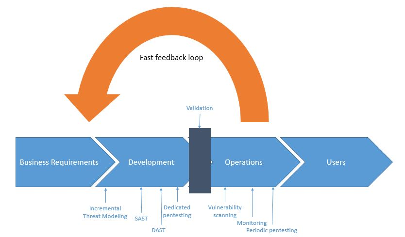

## 移动应用安全 测试

在以下章节中, 我们会简单的概述安全测试原则 和 关键技术术语. 在这里介绍的大部分定义和其他对渗透测试的解读是相似的, 如果你是经验丰富的安全测试员, 很多内容也许你已经很熟悉了.

整个指南中, 我们用 "移动 应用 安全测试" 这个综合名词来代表移动应用安全的静态分析和动态分析. 类似于 "移动应用渗透测试" 和 "移动应用安全分析" 某种程度上常用在安全领域中, 但是这些定义基本上都是指的同一件事情. 移动应用安全测试 通常是大规模的安全评估 或者 渗透测试, 这些测试包含了客户端到服务器端的架构, 以及服务器端 API 被移动应用的调用.

在这个指南中, 我们包含移动应用安全测试的两种不同背景. 第一个种是 "经典/传统" 安全测试, 发生在开发生命周期快完成的时候. 在这种背景下, 测试人员访问几乎完成或者准备投入生产的应用程序版本, 识别安全问题, 并编写报告 (通常是具有破坏性的危害). 另外一种环境背景是, 软件需求的实现是从软件开发生命周期开始, 即安全自动化流程中开始. 在两种情况下, 基本需求和测试案例都适用, 只是高级方法和客户端交互的级别不同.

### 测试基本原理

#### 白盒测试 对比 黑盒测试

让我们来定义这些概念:

- **黑盒 测试** 指测试人员没有任何关于正在测试的应用程序的信息的情况下进行的. 这种测试有时候被称为 "零信息测试". 这个测试的主要目的是让测试人员模拟真正的攻击者的思维一样, 探索可用的和可发现的信息.
- **白盒 测试** (有时被称为 "了如指掌测试") 与黑箱测试完全相反，因为测试人员完全了解应用程序。这些知识可能包括源代码、文档和图表。这种方法允许比黑盒测试快得多的测试，因为它是透明的，并且利用获得的额外知识，测试人员可以构建更复杂和粒度更细的测试用例。
- **灰盒 测试** 是介于上述两种测试类型之间的测试: 一些信息提供给测试人员(通常仅提供凭证)，而其他信息则被用来发现。这种类型的测试在测试用例的数量、成本、速度和测试范围方面是一种有趣的折衷。灰箱测试是安全行业中最常见的一种测试。

我们强烈建议您使用源代码，以便尽可能有效地使用测试时间。测试人员获取代码访问显然不会模拟外部攻击，但是它简化了漏洞的识别，允许测试人员在代码级别验证每个识别出的异常或可疑行为。如果应用程序之前没有测试过，那么可以使用白盒测试。

尽管在Android上进行反编译非常简单，但是源代码可能会被混淆，而消除混淆将非常耗时。因此，消除时间限制是测试人员访问源代码的另一个原因。

#### 漏洞 分析

漏洞分析通常是在应用程序中寻找漏洞的过程。虽然这可能是手工完成的，但通常使用自动扫描来识别主要的漏洞。静态分析和动态分析是脆弱性分析的常见两种类型。

#### 静态 对比 动态 分析

静态应用程序安全性测试(SAST)即通过手动或自动分析源代码，在不执行组件的情况下检查应用程序的组件。
OWASP 提供了关于 [静态代码分析](https://www.owasp.org/index.php/Static_Code_Analysis "OWASP 静态代码分析") 这些信息可以帮助您了解技术、优势、弱点和限制。

动态应用程序安全性测试(DAST)涉及在运行时检查应用程序。这种分析可以是手动的，也可以是自动的。它通常不提供静态分析提供的信息，但是从用户的角度来看，它是检测感兴趣组件(资产、功能、入口点等)的好方法。

交互式应用程序安全性测试(IAST)通过软件工具进行安全测试，或者使用工具在应用程序运行时监视它，并收集关于它的功能和执行方式的信息。

既然我们已经定义了静态和动态分析，让我们更深入地研究一下。

#### 静态 分析

在静态分析期间，对移动应用程序的源代码进行审查，以确保安全适当控制的实现。在大多数情况下，使用自动/手动的混合方法。自动扫描抓住了容易实现的问题，手动测试人员可以根据上下文的代码在头脑中搜索特定的问题。

##### 人工/手动 代码审核

测试人员通过手动代码审查, 手动分析移动应用程序的源代码, 从而检查安全漏洞。方法通过 'grep' 命令进行基本的关键字搜索到逐行检查源代码。ide(集成开发环境)通常提供基本的代码审查功能，可以使用各种工具进行扩展。

人工代码分析的一种常见方法是识别关键安全漏洞标识, 通常就是搜索特定 API 和 关键字, 例如 数据库相关的方法调用 "executeStatement" 或者 "executeQuery". 代码含有这些字符串是开始人工分析良好起点.

相对于自动化代码分析, 手动代码审核对于识别业务逻辑中的漏洞, 违反标准, 和设计弱点, 特别是代码从技术上是安全的, 但是逻辑上存在弱点的等情况有很好的帮助.

手动代码审查需要一个代码审核专家, 而且需要对编译语音的熟悉和移动应用框架的熟悉. 完整的代码审核是漫长的, 乏味的, 耗时的, 特别是对于大型代码应用存在多种其他软件依赖. 

##### 自动 源代码分析

自动分析工具能够提高审核静态应用安全测试的速度(SAST). 它们通过已经定义好的规则或者业界最佳实践来检查源代码, 然后显示一系列检查结果和警告,并且标识所有被检测的违规软件行为. 某些静态分析工具只支持能够编译的应用, 某些必须关联源代码一起, 还有些运行实时分析插件在集成开发环境中(IDE).

虽然某些静态代码分析工具包含了很多关于规则信息和编译语音要求来分析移动应用, 但是仍然会产生很多误报, 特别是如果他们和目标环境配置不一样的时候. 一位安全专家必须介入来分析这些结果.

附录“测试工具”包括一个静态分析工具列表，可以在本书的最后部分找到

#### 动态 分析

DAST 的重点是通过应用程序的实时执行对其进行测试和评估。动态分析的主要目标是发现程序运行时的安全漏洞或弱点。在移动平台层和后端服务和api之间进行动态分析，可以分析移动应用程序的请求和响应模式。

动态分析通常用于检查安全机制，以提供足够的保护来抵御最常见的攻击类型，如传输中的数据公开、身份验证和授权问题以及服务器配置错误。

#### 过滤 误报

##### 自动 扫描工具

自动测试工具的挑战, 是缺乏对应用内容的准确度. 换句话来说,这些工具能够识别潜在的不相关的问题. 这种结果我们通常称之为 "误报". 

举例, 安全测试常报告的发生在网页浏览器中的漏洞不一定和移动应用相关联. 误报发生的原因是因为自动工具基于一般浏览器为主的网页应用,来扫描后端服务. 比如说 CSRF (跨站请求伪造) 和 跨站脚本 (XSS) .

让我们拿 CSRF 来举例. 一个成功的 CSRF 攻击需要以下条件:

- 诱骗已经登录的用户通过网页浏览器打开可疑的链接, 从而访问有漏洞的站点. 
- 客户端浏览器必须将会话 cookie 或者其他认证令牌自动添加到请求中.

然而移动应用无法满足这些要求: 及时WebView 和 基于令牌的会话管理被使用, 任何可以链接被用户通过默认浏览器打开的行为, cookie 实际都是额外存放. 

如果应用存在了 WebView 的功能, 存在跨站脚本的可能是一个问题, 因为只有在应用程序导出JavaScript接口时, 才有可能执行命令. 然而, 由于上面提到的原因, 跨站脚本很少成为可利用的攻击点(是否应该存在就是有争议的 — 输出转义是最佳实践).

> 在任何情况下, 当你进行风险评估的时候,应该考虑到渗透场景; 不要盲目的相信你的扫描工具的结果.

##### 剪切板

当你输入数据到输入栏, 剪切板可以用来拷贝数据. 剪切板可以通过系统整个系统来访问,所以与应用共享. 这种共享机制可以被可以应用程序利用来获取保存在剪切板中的敏感信息.

在 iOS 版本 9之前, 某种可疑的应用可以在后台背景监控复制板, 并且周期性的获取当中的数据.a `[UIPasteboard generalPasteboard].string`. 自从 iOS 9 之后, 剪贴板内容只能被前台的应用程序访问, 这样大大的减少了从剪贴板嗅探密码的攻击面.

对于 [Android 有一个 PoC 漏洞发布](https://arstechnica.com/information-technology/2014/11/using-a-password-manager-on-android-it-may-be-wide-open-to-sniffing-attacks/ "密码 嗅探") 为了掩饰如果密码被保存在剪贴板中的攻击方式. [屏蔽在输入框粘贴密码功能](https://github.com/OWASP/owasp-masvs/issues/106 "屏蔽在输入框粘贴密码功能") 是 MASVS 1.0 中的要求之一, 但是最终被移除了,因为以下原因:

- 屏蔽粘贴数据到应用的输入框,并不能防止用户拷贝任何敏感信息. 由于信息在用户发现无法使用粘贴功能之前就已经被复制率, 此时,一个恶意的应用程序已经嗅探到了剪切板中的内容.
- 如果密码输入框的粘贴功能被禁用, 用户为了容易技术密码,从而使用较弱的密码, 他们从此不会再使用密码管理器, 这样将与我们为了让应用更加安全的初衷相违背.

当你使用应用的时候, 你应该注意其他应用正在读取你剪切板内容, 比如说 [Facebook 应用](https://www.thedailybeast.com/facebook-is-spying-on-your-clipboard "Facebook 在监听你的剪切板"). 尽管如此, 复制黏贴密码是一个安全风险, 你应该意识到, 但也不能通过一个应用程序功能来解决.

#### 渗透测试 (a.k.a. Pentesting)

传统的方式是在应用程序的最终或接近最终构建的阶段进行安全测试, 例如.,在开发过程结束时可用的构建. 为了在开发过程的最后进行测试, 我们建议使用 [移动应用安全验证标准 (MASVS)](https://github.com/OWASP/owasp-masvs "OWASP MASVS") 和相关的检查清单作为测试的基线, 一个经典的安全测试结构如下:

- **准备(Preparation)** - 定义安全测试的范围, 包括确定使用的安全控制, 组织和测试目标和敏感数据. 更粗略的来说, 准备工作包括与客户端的所有同步, 以及在法律上保护测试人员 (通常是第三方).请记住在很多国家, 未经书面授权的攻击系统是非法的!
- **情报收集(Intelligence Gathering)** - 分析 **环境** 和 **架构** 应用的内容来获取对应用内容上的理解.
- **综合应用功能分析(Mapping the Application)** - 根据上个阶段获取的信息; 通过自动扫描和手动探索应用程序来补充更多信息. 信息映射提供了对应应用程序, 入口点, 所保存的数据内容, 以及主要的潜在漏洞. 然后可以根据这些漏洞可能造成的损害对它们进行排序, 以便于安全测试人员对它们进行优先级处理. 此阶段包含了测试执行期间, 可能使用的测试用例的创建.
- **渗透(Exploitation)** - 在这个阶段, 安全测试人员试图利用上个阶段发现的漏洞来渗透应用程序. 这个阶段对于确定漏洞是否真实存在和正确报警的必要性.
- **汇报(Reporting)** - 在这个阶段, 对于客户来说也是关键,安全测试汇报发现的漏洞,以及他能够利用的漏洞, 并且记录下他能够实现的危害,包括危害范围. (举例, 测试员可以非法的访问数据).

##### 准备

被测试的应用安全级别必须在测试之前被确定. 安全要求需要在项目开始之前被确定. 不同的组织有不同的安全要求,以及能够调用资源来进行测试活动. 虽然 MASVS 级别 1 控制适用于所有的移动应用,与技术和业务人员一起审阅整个 L1 和 L2 MASVS 控制的列表是确定安全测试覆盖级别的最好方法. 

在某些领域中,不同企业组织有着不同的要求和法务责任. 尽管应用不处理敏感数据, 一些 L2 的要求也可能是相关联的 (因为行业法规或者当地法律). 例如, 双因素认证(2FA)可能是金融应用程序必须的,并由国家的中央银行和/或金融监管机构强制执行.

在开发流程的早期中,安全目标/管控可以与项目股东商量以及评审. 某些控制可能符合 MASVS 控制, 但是其他可以根据组织或者应用来特殊定义.

所有参与的团队必须就检查列表中的条目达成一致, 因为这定义了所有安全测试的基线.

###### 与 客户的协调

搭建一个工作的测试环境是一种挑战的任务. 举例, 企业无线访问点的限制和网络访问限制可能阻碍在客户地方进行动态分析测试. 公司策略也许会阻止使用越狱过的手机(硬件 和 软件) 或者在企业网络中使用测试工具. 使用了越狱监测和其他反逆向工程对策的应用会增加分析的工作量.

安全测试包括许多入侵任务, 包括监控和串改移动应用的网络流量, 监听应用数据文件, 以及插装 API 调用. 安全控制, 比如证书绑定 和 越狱监测机制 可能会妨碍这些任务, 并且极大的降低测试的速度.

为了克服这些障碍, 你可能需要向开发团队申请两个不同的应用程序. 一个应该是发布的版本, 这样你就可以确定现实的控制是否工作正常, 并且不能轻易的绕过他们. 第二种变体应该是某个安全控制以及被停用的调试版本. 测试2个不同的架构的应用是覆盖所有测试用例的最有效的方法.

根据约定的范围, 这种方法也许不行. 请求白盒测试生产和调试架构将帮助您完成所有的测试用例, 并清楚的说明了应用程序的安全成熟度. 客户可能更喜欢将黑盒测试集中在生产环境下的应用程序以及安全控制有效性的评估上.

两种不同测试的范应该在准备阶段讨论. 列如, 在测试之前, 安全控制是否需要调整. 更多的标题将会在下面讨论.

###### 识别 敏感数据

不同的行业和国家,对于敏感信息的分类不同. 此外, 组织可能对敏感数据采取限制性的观点, 并且他们可能有明确定义敏感信息好的数据,以及分类的策略.

数据可以从以下三种状态获得:

- **在保存的时候** - 数据存放在文件或者数据存储介质中
- **在使用的时候** - 应用数据将数据加载到其他介质中
- **在传输的时候** - 数据在移动应用和终端之间交换,或者在设备上消耗进程. 举例., 在 IPC 期间(Inter-Process Communication)

对每个地域的审查程度取决于数据的重要性和被访问的可能性. 列如, 应用程序内存中的数据可能比 Web 服务器上的数据更容易通过 core dump 的方式访问, 因为攻击者更有可能获取移动设备的物理访问权限, 而不是网页访问服务器.

如果没有可用的数据分类策略, 请使用以下通常被认为是敏感的信息列表:

- 用户认证信息 (认证凭证, PINs, etc.)
- 个人身份信息 (PII) 类似这些信息可能被滥用于身份盗窃: 社会安全号码, 信用卡号码, 银行账户, 健康信息
- 设备识别号可以识别个人
- 任何可以导致名誉损害或者财政损失的高敏感数据
- 任何受法律义务保护的数据
- 应用生成的任何技术数据用来保护其他数据或者系统本身数据

 必须在安全测试开始之前确定 "敏感数据" 等定义, 因为没有定义是不可能检测敏感数据的泄露.

###### 情报收集

情报收集包含应用的架构的信息收集, 应用服务器的业务使用场景, 以及应用运行的内容. 这些信息可以分为 "环境" 或者 "架构". 

###### 环境 信息

环境信息包括:

- 组织对应用程序的目标. 功能决定用户与应用程序的交互, 并有可能比其他更容易成为攻击的目标
- 相关的行业。不同的行业可能有不同的风险。
- 股东和投资者;了解谁对该应用程序感兴趣并负责。
- 内部流程、工作流程和组织结构。特定于组织的内部流程和工作流程可能为 [商业逻辑渗透](https://www.owasp.org/index.php/Testing_for_business_logic "测试商业逻辑").

###### 架构 信息

架构信息包括:

- **The mobile app:** How the app accesses data and manages it in-process, how it communicates with other resources and manages user sessions, and whether it detects itself running on jailbroken or rooted phones and reacts to these situations.
- **The Operating System:** The operating systems and OS versions the app runs on (including Android or iOS version restrictions), whether the app is expected to run on devices that have Mobile Device Management (MDM) controls, and relevant OS vulnerabilities.
- **Network:** Usage of secure transport protocols (e.g., TLS), usage of strong keys and cryptographic algorithms (e.g., SHA-2) to secure network traffic encryption, usage of certificate pinning to verify the endpoint, etc.
- **Remote Services:** The remote services the app consumes and whether their being compromised could compromise the client.

##### Mapping the Application

Once the security tester has information about the app and its context, the next step is mapping the app's structure and content, e.g., identifying its entry points, features, and data.

When penetration testing is performed in a white-box or grey-box paradigm, any documents from the interior of the project (architecture diagrams, functional specifications, code, etc.) may greatly facilitate the process. If source code is available, the use of SAST tools can reveal valuable information about vulnerabilities (e.g., SQL Injection).
DAST tools may support black-box testing and automatically scan the app: whereas a tester will need hours or days, a scanner may perform the same task in a few minutes. However, it's important to remember that automatic tools have limitations and will only find what they have been programmed to find. Therefore, human analysis may be necessary to augment results from automatic tools (intuition is often key to security testing).

Threat Modeling is an important artifact: documents from the workshop usually greatly support the identification of much of the information a security tester needs (entry points, assets, vulnerabilities, severity, etc.). Testers are strongly advised to discuss the availability of such documents with the client. Threat modeling should be a key part of the software development life cycle. It usually occurs in the early phases of a project.

The [threat modeling guidelines defined in OWASP](https://www.owasp.org/index.php/Application_Threat_Modeling "OWASP Application Threat Modeling") are generally applicable to mobile apps.

##### Exploitation

Unfortunately, time or financial constraints limit many pentests to application mapping via automated scanners (for vulnerability analysis, for example). Although vulnerabilities identified during the previous phase may be interesting, their relevance must be confirmed with respect to five axes:

- **Damage potential** - the damage that can result from exploiting the vulnerability
- **Reproducibility** - ease of reproducing the attack
- **Exploitability** - ease of executing the attack
- **Affected users** - the number of users affected by the attack
- **Discoverability** - ease of discovering the vulnerability

Against all odds, some vulnerabilities may not be exploitable and may lead to minor compromises, if any. Other vulnerabilities may seem harmless at first sight, yet be determined very dangerous under realistic test conditions. Testers who carefully go through the exploitation phase support pentesting by characterizing vulnerabilities and their effects.

#### Reporting

The security tester's findings will be valuable to the client only if they are clearly documented. A good pentest report should include information such as, but not limited to, the following:

- an executive summary
- a description of the scope and context (e.g., targeted systems)
- methods used
- sources of information (either provided by the client or discovered during the pentest)
- prioritized findings (e.g., vulnerabilities that have been structured by DREAD classification)
- detailed findings
- recommendations for fixing each defect

Many pentest report templates are available on the Internet: Google is your friend!

### Security Testing and the SDLC

Although the principles of security testing haven't fundamentally changed in recent history, software development techniques have changed dramatically. While the widespread adoption of Agile practices was speeding up software development, security testers had to become quicker and more agile while continuing to deliver trustworthy software.

The following section is focused on this evolution and describes contemporary security testing.

#### Security Testing during the Software Development Life Cycle

Software development is not very old, after all, so the end of developing without a framework is easy to observe. We have all experienced the need for a minimal set of rules to control work as the source code grows.

In the past, "Waterfall" methodologies were the most widely adopted: development proceeded by steps that had a predefined sequence. Limited to a single step, backtracking capability was a serious drawback of Waterfall methodologies. Although they have important positive features (providing structure, helping testers clarify where effort is needed, being clear and easy to understand, etc.), they also have negative ones (creating silos, being slow, specialized teams, etc.).

As software development matured, competition increased and developers needed to react to market changes more quickly while creating software products with smaller budgets. The idea of less structure became popular, and smaller teams collaborated, breaking silos throughout the organization. The "Agile" concept was born (Scrum, XP, and RAD are well-known examples of Agile implementations); it enabled more autonomous teams to work together more quickly.

Security wasn't originally an integral part of software development. It was an afterthought, performed at the network level by operation teams who had to compensate for poor software security! Although unintegrated security was possible when software programs were located inside a perimeter, the concept became obsolete as new kinds of software consumption emerged with web, mobile, and IoT technologies. Nowadays, security must be baked **inside** software because compensating for vulnerabilities is often very difficult.

> "SDLC" will be used interchangeably with "Secure SDLC" in the following section to help you internalize the idea that security is a part of software development processes. In the same spirit, we use the name DevSecOps to emphasize the fact that security is part of DevOps.

#### SDLC 概述

##### SDLC 的一般描述

SDLCs always consist of the same steps (the overall process is sequential in the Waterfall paradigm and iterative in the Agile paradigm):

- Perform a **risk assessment** for the application and its components to identify their risk profiles. These risk profiles typically depend on the organization's risk appetite and applicable regulatory requirements. The risk assessment is also based on factors, including whether the application is accessible via the Internet and the kind of data the application processes and stores. All kinds of risks must be taken into account: financial, marketing, industrial, etc. Data classification policies specify which data is sensitive and how it must be secured.
- **Security Requirements** are determined at the beginning of a project or development cycle, when functional requirements are being gathered. **Abuse Cases** are added as use cases are created. Teams (including development teams) may be given security training (such as Secure Coding) if they need it.
You can use the [OWASP MASVS](https://mobile-security.gitbook.io/masvs/ "OWASP MASVS") to determine the security requirements of mobile applications on the basis of the risk assessment phase. Iteratively reviewing requirements when features and data classes are added is common, especially with Agile projects.
- **Threat Modeling**, which is basically the identification, enumeration, prioritization, and initial handling of threats, is a foundational artifact that must be performed as architecture development and design progress. **Security Architecture**, a Threat Model factor, can be refined (for both software and hardware aspects) after the Threat Modeling phase. **Secure Coding rules** are established and the list of **Security tools** that will be used is created. The strategy for **Security testing** is clarified.
- All security requirements and design considerations should be stored in the Application Life Cycle Management (ALM) system (also known as the issue tracker) that the development/ops team uses to ensure tight integration of security requirements into the development workflow. The security requirements should contain relevant source code snippets so that developers can quickly reference the snippets. Creating a dedicated repository that's under version control and contains only these code snippets is a secure coding strategy that's more beneficial than the traditional approach (storing the guidelines in word documents or PDFs).
- **Securely develop the software**. To increase code security, you must complete activities such as **Security Code Reviews**, **Static Application Security Testing**, and **Security Unit Testing**. Although quality analogues of these security activities exist, the same logic must be applied to security, e.g., reviewing, analyzing, and testing code for security defects (for example, missing input validation, failing to free all resources, etc.).
- Next comes the long-awaited release candidate testing: both manual and automated **Penetration Testing** ("Pentests"). **Dynamic Application Security Testing** is usually performed during this phase as well.
- After the software has been **Accredited** during **Acceptance** by all stakeholders, it can be safely transitioned to **Operation** teams and put in Production.
- The last phase, too often neglected, is the safe **Decommissioning** of software after its end of use.

The picture below illustrates all the phases and artifacts:

Based on the project's general risk profile, you may simplify (or even skip) some artifacts, and you may add others (formal intermediary approvals, formal documentation of certain points, etc.). **Always remember two things: an SDLC is meant to reduce risks associated with software development, and it is a framework that helps you set up controls to that end.** This this is a generic description of SDLC; always tailor this framework to your projects.

##### 确定 测试 方法

Test strategies specify the tests that will be performed during the SDLC as well as testing frequency. Test strategies are used to make sure that the final software product meets security objectives, which are generally determined by clients' legal/marketing/corporate teams.
The test strategy is usually created during the Secure Design phase, after risks have been clarified (during the Initiation phase) and before code development (the Secure Implementation phase) begins. The strategy requires input from activities such as Risk Management, previous Threat Modeling, and Security Engineering.

A Test Strategy needn't be formally written: it may be described through Stories (in Agile projects), quickly enumerated in checklists, or specified as test cases for a given tool. However, the strategy must definitely be shared because it must be implemented by a team other than the team who defined it. Moreover, all technical teams must agree to it to ensure that it doesn't place unacceptable burdens on any of them.

Test Strategies address topics such as the following:

- objectives and risk descriptions
- plans for meeting objectives, risk reduction, which tests will be mandatory, who will perform them, how and when they will be performed
- acceptance criteria

To track the testing strategy's progress and effectiveness, metrics should be defined, continually updated during the project, and periodically communicated. An entire book could be written about choosing relevant metrics; the most we can say here is that they depend on risk profiles, projects, and organizations. Examples of metrics include the following:

- the number of stories related to security controls that have been successfully implemented
- code coverage for unit tests of security controls and sensitive features
- the number of security bugs found for each build via static analysis tools
- trends in security bug backlogs (which may be sorted by urgency)

These are only suggestions; other metrics may be more relevant to your project. Metrics are powerful tools for getting a project under control, provided they give project managers a clear and synthetic perspective on what is happening and what needs to be improved.

Distinguishing between tests performed by an internal team and tests performed by an independent third party is important. Internal tests are usually useful for improving daily operations, while third-party tests are more beneficial to the whole organization. Internal tests can be performed quite often, but third-party testing happens at most once or twice a year; also, the former are less expensive than the latter.
Both are necessary, and many regulations mandate tests from an independent third party because such tests can be more trustworthy.

#### 瀑布流 安全测试

##### What Waterfall Is and How Testing Activities Are Arranged

Basically, SDLC doesn't mandate the use of any development life cycle: it is safe to say that security can (and must!) be addressed in any situation.

Waterfall methodologies were popular before the 21st century. The most famous application is called the "V model", in which phases are performed in sequence and you can backtrack only a single step.
The testing activities of this model occur in sequence and are performed as a whole, mostly at the point in the life cycle when most of the app development is complete. This activity sequence means that changing the architecture and other factors that were set up at the beginning of the project is hardly possible even though code may be changed after defects have been identified.

#### Security Testing for Agile/DevOps and DevSecOps

DevOps refers to practices that focus on a close collaboration between all stakeholders involved in software development (generally called Devs) and operations (generally called Ops). DevOps is not about merging Devs and Ops.
Development and operations teams originally worked in silos, when pushing developed software to production could take a significant amount of time. When development teams made moving more deliveries to production necessary by working with Agile, operation teams had to speed up to match the pace. DevOps is the necessary evolution of the solution to that challenge in that it allows software to be released to users more quickly. This is largely accomplished via extensive build automation, the process of testing and releasing software, and infrastructure changes (in addition to the collaboration aspect of DevOps). This automation is embodied in the deployment pipeline with the concepts of Continuous Integration and Continuous Delivery (CI/CD).

People may assume that the term "DevOps" represents collaboration between development and operations teams only, however, as DevOps thought leader Gene Kim puts it: "At first blush, it seems as though the problems are just between Devs and Ops, but test is in there, and you have information security objectives, and the need to protect systems and data. These are top-level concerns of management, and they have become part of the DevOps picture."

In other words, DevOps collaboration includes quality teams, security teams, and many other teams related to the project. When you hear "DevOps" today, you should probably be thinking of something like [DevOpsQATestInfoSec](https://techbeacon.com/evolution-devops-new-thinking-gene-kim "The evolution of DevOps: Gene Kim on getting to continuous delivery"). Indeed, DevOps values pertain to increasing not only speed but also quality, security, reliability, stability, and resilience.

Security is just as critical to business success as the overall quality, performance, and usability of an application. As development cycles are shortened and delivery frequencies increased, making sure that quality and security are built in from the very beginning becomes essential. **DevSecOps** is all about adding security to DevOps processes. Most defects are identified during production. DevOps specifies best practices for identifying as many defects as possible early in the life cycle and for minimizing the number of defects in the released application.

However, DevSecOps is not just a linear process oriented towards delivering the best possible software to operations; it is also a mandate that operations closely monitor software that's in production to identify issues and fix them by forming a quick and efficient feedback loop with development. DevSecOps is a process through which Continuous Improvement is heavily emphasized.

The human aspect of this emphasis is reflected in the creation of cross-functional teams that work together to achieve business outcomes. This section is focused on necessary interactions and integrating security into the development life cycle (which starts with project inception and ends with the delivery of value to users).

##### What Agile and DevSecOps Are and How Testing Activities Are Arranged

###### Overview

Automation is a key DevSecOps practice: as stated earlier, the frequency of deliveries from development to operation increases when compared to the traditional approach, and activities that usually require time need to keep up, e.g. deliver the same added value while taking more time. Unproductive activities must consequently be abandoned, and essential tasks must be fastened. These changes impact infrastructure changes, deployment, and security:

- infrastructure is being implemented as **Infrastructure as Code**
- deployment is becoming more scripted, translated through the concepts of **Continuous Integration** and **Continuous Delivery**
- **security activities** are being automated as much as possible and taking place throughout the life cycle

The following sections provide more details about these three points.

###### Infrastructure as Code

Instead of manually provisioning computing resources (physical servers, virtual machines, etc.) and modifying configuration files, Infrastructure as Code is based on the use of tools and automation to fasten the provisioning process and make it more reliable and repeatable. Corresponding scripts are often stored under version control to facilitate sharing and issue resolution.

Infrastructure as Code practices facilitate collaboration between development and operations teams, with the following results:

- Devs better understand infrastructure from a familiar point of view and can prepare resources that the running application will require.
- Ops operate an environment that better suits the application, and they share a language with Devs.

Infrastructure as Code also facilitates the construction of the environments required by classical software creation projects, for **development** ("DEV"), **integration** ("INT"), **testing** ("PPR" for Pre-Production. Some tests are usually performed in earlier environments, and PPR tests mostly pertain to non-regression and performance with data that's similar to data used in production), and **production** ("PRD"). The value of infrastructure as code lies in the possible similarity between environments (they should be the same).

Infrastructure as Code is commonly used for projects that have Cloud-based resources because many vendors provide APIs that can be used for provisioning items (such as virtual machines, storage spaces, etc.) and working on configurations (e.g., modifying memory sizes or the number of CPUs used by virtual machines). These APIs provide alternatives to administrators' performing these activities from monitoring consoles.

The main tools in this domain are [Puppet](https://puppet.com/ "Puppet"), [Terraform](https://www.terraform.io/ "Terraform"), [Packer](https://www.packer.io/ "Packer"), [Chef](https://www.chef.io/chef/ "Chef") and [Ansible](https://www.ansible.com/ "Ansible").

###### Deployment

The deployment pipeline's sophistication depends on the maturity of the project organization or development team. In its simplest form, the deployment pipeline consists of a commit phase. The commit phase usually involves running simple compiler checks and the unit test suite as well as creating a deployable artifact of the application. A release candidate is the latest version that has been checked into the trunk of the version control system. Release candidates are evaluated by the deployment pipeline for conformity to standards they must fulfill for deployment to production.

The commit phase is designed to provide instant feedback to developers and is therefore run on every commit to the trunk. Time constraints exist because of this frequency. The commit phase should usually be complete within five minutes, and it shouldn't take longer than ten. Adhering to this time constraint is quite challenging when it comes to security because many security tools can't be run quickly enough (#paul, #mcgraw).

CI/CD means "Continuous Integration/Continuous Delivery" in some contexts and "Continuous Integration/Continuous Deployment" in others. Actually, the logic is:

- Continuous Integration build actions (either triggered by a commit or performed regularly) use all source code to build a candidate release. Tests can then be performed and the release's compliance with security, quality, etc., rules can be checked. If case compliance is confirmed, the process can continue; otherwise, the development team must remediate the issue(s) and propose changes.
- Continuous Delivery candidate releases can proceed to the pre-production environment. If the release can then be validated (either manually or automatically), deployment can continue. If not, the project team will be notified and proper action(s) must be taken.
- Continuous Deployment releases are directly transitioned from integration to production, e.g., they become accessible to the user. However, no release should go to production if significant defects have been identified during previous activities.

The delivery and deployment of applications with low or medium sensitivity may be merged into a single step, and validation may be performed after delivery. However, keeping these two actions separate and using strong validation are strongly advised for sensitive applications.

###### 安全

At this point, the big question is: now that other activities required for delivering code are completed significantly faster and more effectively, how can security keep up? How can we maintain an appropriate level of security? Delivering value to users more often with decreased security would definitely not be good!

Once again, the answer is automation and tooling: by implementing these two concepts throughout the project life cycle, you can maintain and improve security. The higher the expected level of security, the more controls, checkpoints, and emphasis will take place. The following are examples:

- Static Application Security Testing can take place during the development phase, and it can be integrated into the Continuous Integration process with more or less emphasis on scan results. You can establish more or less demanding Secure Coding Rules and use SAST tools to check the effectiveness of their implementation.
- Dynamic Application Security Testing may be automatically performed after the application has been built (e.g., after Continuous Integration has taken place) and before delivery, again, with more or less emphasis on results.
- You can add manual validation checkpoints between consecutive phases, for example, between delivery and deployment.

The security of an application developed with DevOps must be considered during operations. The following are examples:

- Scanning should take place regularly (at both the infrastructure and application level).
- Pentesting may take place regularly. (The version of the application used in production is the version that should be pentested, and the testing should take place in a dedicated environment and include data that's similar to the production version data. See the section on Penetration Testing for more details.)
- Active monitoring should be performed to identify issues and remediate them as soon as possible via the feedback loop.

### 参考资料

- [paul] - M. Paul. Official (ISC)2 Guide to the CSSLP CBK, Second Edition ((ISC)2 Press), 2014
- [mcgraw] - G McGraw. Software Security: Building Security In, 2006

#### OWASP MASVS

- V1.1: "All app components are identified and known to be needed."
- V1.3: "A high-level architecture for the mobile app and all connected remote services has been defined and security has been addressed in that architecture."
- V1.4: "Data considered sensitive in the context of the mobile app is clearly identified."
- V1.5: "All app components are defined in terms of the business functions and/or security functions they provide."
- V1.6: "A threat model for the mobile app and the associated remote services has been produced that identifies potential threats and countermeasures."
- V1.7: "All security controls have a centralized implementation."
- V1.10: "Security is addressed within all parts of the software development lifecycle."