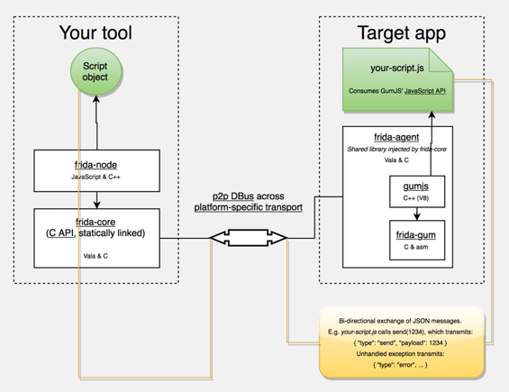
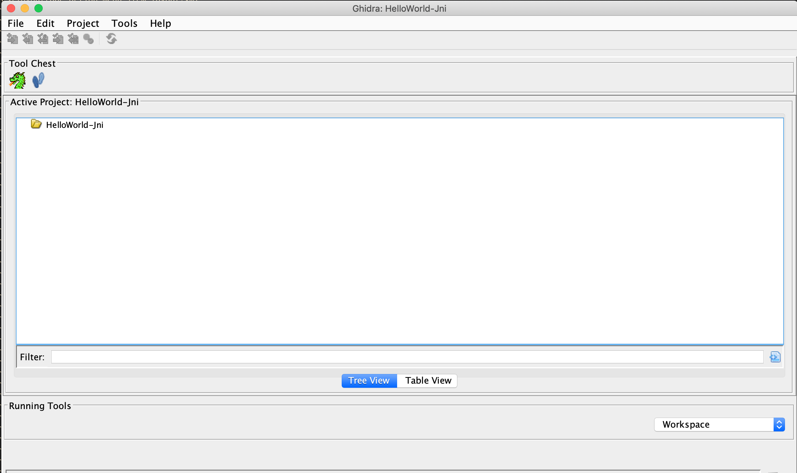
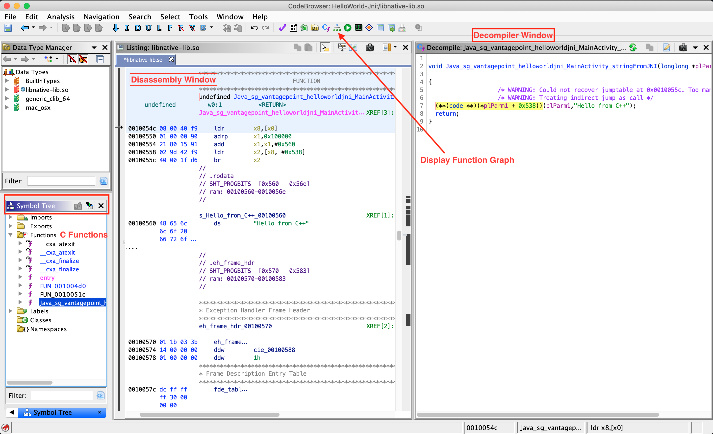

## 篡改和逆向工程

反向工程和篡改技术长期以来一直属于破解者，修改者，恶意软件分析人员等领域。对于“传统”安全测试人员和研究人员而言，反向工程已成为一种补充技能。但是趋势正在转变：移动应用程序的黑箱测试越来越需要拆卸已编译的应用程序，应用补丁以及篡改二进制代码甚至实时进程。许多移动应用都实施了防止不受欢迎的篡改的防御措施，这一事实并没有使安全测试人员更轻松。

对移动应用程序进行反向工程是分析已编译的应用程序以提取有关其源代码的信息的过程。逆向工程的目标是“理解”代码。

*篡改*是更改移动应用程序（已编译的应用程序或正在运行的进程）或其环境以影响其行为的过程。例如，一个应用程序可能拒绝在您的根测试设备上运行，从而使您无法运行某些测试。在这种情况下，您需要更改应用程序的行为。

通过了解基本的逆向工程概念，可以很好地为移动安全测试人员提供服务。他们还应该完全了解移动设备和操作系统：处理器体系结构，可执行格式，编程语言的复杂性等等。

逆向工程是一门艺术，描述它的每一个方面都会占据整个图书馆。种类繁多的技术和专长令人难以置信：人们可能需要花费数年的时间来研究非常具体且孤立的子问题，例如自动化恶意软件分析或开发新颖的去混淆方法。安全测试人员是通才。为了成为有效的反向工程师，他们必须过滤掉大量相关信息。

没有通用的逆向工程流程始终有效。也就是说，我们将在本指南的后面部分介绍常用的方法和工具，并提供解决最常见防御措施的示例。

### 为什么需要它

移动安全测试至少需要基本的逆向工程技能，原因有以下几个：

**1. 为了对移动应用程序进行黑盒测试。**现代应用程序通常包含会阻碍动态分析的控件。 SSL固定和端到端（E2E）加密有时会阻止您使用代理来拦截或操纵流量。根目录检测可能会阻止该应用程序在有根设备上运行，从而使您无法使用高级测试工具。您必须能够停用这些防御。

**2. 在黑盒安全测试中增强静态分析。**在黑盒测试中，对应用程序字节码或二进制代码的静态分析可帮助您了解应用程序的内部逻辑。它还允许您识别诸如硬编码凭据之类的缺陷。

**3. 评估针对逆向工程的弹性。**实施了《移动应用程序安全验证标准反逆向控件（MASVS-R）》中列出的软件保护措施的应用程序应在一定程度上承受逆向工程。为了验证此类控制的有效性，测试人员可以执行“复原力评估”，作为一般安全性测试的一部分。对于弹性评估，测试人员承担逆向工程师的角色，并尝试绕过防御。

在深入研究移动应用逆向世界之前，我们有一些好消息和一些坏消息。让我们从好消息开始：

**最终，逆向工程师总会获胜。**

在移动行业中尤其如此，逆向工程师具有自然的优势：移动应用程序的部署和沙盒方式在设计上比传统桌面应用程序的部署和沙盒方式更具限制性，因此通常包括类似于rootkit的防御机制在Windows软件（例如DRM系统）中找到它根本是不可行的。 Android make的开放性允许逆向工程人员对操作系统进行有利的更改，从而有助于逆向工程过程。 iOS为反向工程师提供了较少的控制权，但防御性选择也受到更大的限制。

坏消息是，处理微线程的反调试控件，加密的白盒，隐秘的防篡改功能以及高度复杂的控制流转换是不适合的。最有效的软件保护方案是专有的，不会被标准的调整和技巧所击败。击败他们需要繁琐的手工分析，编码，挫败感，并且（取决于您的性格）沉睡的夜晚和紧张的关系。

对于初学者来说，倒退的范围很容易使他们不知所措。最好的入门方法是设置一些基本工具（请参阅Android和iOS反转章节中的相关部分），并从简单的反转任务和破解开始。您将需要了解汇编器/字节码语言，操作系统，遇到的混淆等等。从简单的任务开始，逐步升级到更困难的任务。

在下一节中。我们将概述移动应用程序安全性测试中最常用的技术。在后面的章节中，我们将深入研究Android和iOS特定于操作系统的详细信息。

### 基本篡改技术

#### 二进制补丁

修补程序是更改已编译应用程序的过程，例如，更改二进制可执行文件中的代码，修改Java字节码或篡改资源。 这个过程在手机游戏黑客场景中被称为“改装”。 修补程序可以以多种方式应用，包括在十六进制编辑器中编辑二进制文件以及反编译，编辑和重新组装应用程序。 在后面的章节中，我们将提供有用补丁的详细示例。

请记住，现代移动操作系统严格执行代码签名，因此运行修改后的应用程序并不像在桌面环境中那样简单。 安全专家在90年代的生活要轻松得多！ 幸运的是，如果您在自己的设备上工作，打补丁并不是很困难-您只需重新签名应用程序或禁用默认代码签名验证工具即可运行修改后的代码。

#### 代码注入

代码注入是一种非常强大的技术，可让您在运行时探索和修改进程。注入可以通过多种方式实现，但由于免费提供了详细记录的可自动完成该过程的工具，因此您将不了解所有细节。这些工具使您可以直接访问进程内存和重要结构，例如由应用程序实例化的活动对象。它们带有许多实用程序功能，这些功能可用于解析已加载的库，挂钩方法和本机函数等。进程内存篡改比文件修补更难检测，因此在大多数情况下，它是首选方法。

Substrate，Frida和Xposed是移动行业中使用最广泛的挂钩和代码注入框架。这三个框架在设计理念和实现细节上有所不同：Substrate和Xposed专注于代码注入和/或挂钩，而Frida的目标是成为一个成熟的“动态工具框架”，其中包含代码注入，语言绑定和可注入JavaScript VM和控制台。

但是，您也可以通过使用Substrate注入Cycript（一种由Cydia声名卓著的Saurik编写的编程环境，即“ Cycript-to-JavaScript”编译器）来对应用程序进行检测。为了使事情更加复杂，Frida的作者还创建了一个Cycript的分支，名为[“ frida-cycript”](https://github.com/nowsecure/frida-cycript "Cycript fork powered by Frida"). 它用基于Frida的运行库Mjølner代替了Cycript的运行库。 这使Cycript可以在frida-core维护的所有平台和体系结构上运行（如果您对此感到困惑，请不要担心）。 发行frida-cycript的同时，Frida的开发人员Ole发表了一篇名为“ Cycript on Steroids”的博客文章，该标题[Saurik不太喜欢](https://www.reddit.com/r/ReverseEngineering/comments/50uweq/cycript_on_steroids_pumping_up_portability_and/ "Cycript on steroids: Pumping up portability and performance with Frida").

我们将包括所有三个框架的示例。 我们建议从Frida开始，因为它是这三种中功能最多的（因此，我们还将包括更多Frida详细信息和示例）。 值得注意的是，Frida可以在Android和iOS上将JavaScript VM注入到进程中，而带有Substrate的Cycript注入仅在iOS上有效。 但是，最终，您当然可以通过任何一个框架实现许多相同的目标。

##### Frida

[Frida](https://www.frida.re "Frida") 是由OleAndréVadlaRavnås在Vala中编写的免费开放源代码动态代码检测工具包，通过注入JavaScript引擎 [Duktape](https://duktape.org/ "Duktape JavaScript Engine") 和 [V8](https://v8.dev/docs "V8 JavaScript Engine") 进入仪器化过程。 Frida可让您在Android和iOS（以及[其他平台]）上将JavaScript代码段执行到本机应用中 (https://www.frida.re/docs/home/ "那么Frida到底是什么？")).

可以通过几种方式注入代码。 例如，Xposed永久修改了Android应用程序加载器，从而为每次启动新进程时运行自己的代码提供了钩子。
相反，Frida通过将代码直接写入进程内存来实现代码注入。 连接到正在运行的应用程序时：

- Frida使用ptrace劫持正在运行的进程的线程。 该线程用于分配内存块，并使用小型引导程序填充它。
- 引导程序启动一个新线程，连接到设备上运行的Frida调试服务器，并加载一个包含Frida代理（`frida-agent.so`）的共享库。
- 代理会建立返回到工具的双向通信渠道（例如Frida REPL或您的自定义Python脚本）。
- 被劫持的线程恢复到其原始状态后将恢复，并且进程将照常继续执行。



*Frida Architecture，来源: [https://www.frida.re/docs/hacking/](https://www.frida.re/docs/hacking "Frida - Hacking")*

Frida 提供三种操作模式：

1. 注入：当frida-server作为守护程序在iOS或Android设备中运行时，这是最常见的情况。 frida-core通过TCP公开，默认情况下在localhost：27042上侦听。 在没有生根或越狱的设备上，无法以这种模式运行。
2. 嵌入式：设备没有生根或越狱（不能使用ptrace作为非特权用户）时，这种情况由您负责[frida-gadget]的注入(https://www.frida.re/docs/gadget/ "Frida Gadget") 库嵌入到您的应用中来负责注入。
3. 预加载：类似于“ LD_PRELOAD”或“ DYLD_INSERT_LIBRARIES”。 您可以将frida-gadget配置为自主运行，并从文件系统加载脚本（例如，相对于Gadget二进制文件所在位置的路径）。

与所选模式无关，您可以使用 [Frida JavaScript APIs](https://www.frida.re/docs/javascript-api/ "Frida JavaScript APIs") 与正在运行的进程及其内存进行交互。 一些基本的API是：

- [Interceptor](https://www.frida.re/docs/javascript-api/#interceptor "Interceptor"): 当使用Interceptor API时，Frida会在函数的序言处插入一个蹦床（也称为内联钩子），从而导致重定向到我们的自定义代码，执行我们的代码，并返回到原始函数。 请注意，虽然这对于我们的目的非常有效，但会带来可观的开销（由于与蹦床有关的跳跃和上下文切换），并且由于它会覆盖原始代码并类似于调试器（放置断点），因此不能视为透明的，因此可以 以类似的方式检测到，例如 由定期校验和自己代码的应用程序组成。
- [Stalker](https://www.frida.re/docs/javascript-api/#stalker "Stalker"): 如果您的跟踪要求包括透明度，性能和高粒度，那么Stalker应该是您的API选择。 在使用Stalker API跟踪代码时，Frida利用即时动态重新编译（通过使用 [Capstone](http://www.capstone-engine.org/ "Capstone")): 当线程将要执行其下一条指令时，Stalker会分配一些内存，复制原始代码，并将该副本与您的自定义代码交错以进行检测。 最后，它执行复制操作（保留原始代码不变，因此避免了任何反调试检查）。 这种方法极大地提高了仪器性能，并且在跟踪时（例如，通过仅跟踪CALL或RET指令）允许非常高的粒度。 您可以在[Frida的创建者Ole的博客文章“代码跟踪器的解剖”中了解更多详细信息。](https://medium.com/@oleavr/anatomy-of-a-code-tracer-b081aadb0df8 "Anatomy of a code tracer") [#vadla]. 例如，Stalker的一些使用示例 [who-does-it-call](https://codeshare.frida.re/@oleavr/who-does-it-call/ "who-does-it-call") or [diff-calls](https://github.com/frida/frida-presentations/blob/master/R2Con2017/01-basics/02-diff-calls.js "diff-calls").
- [Java](https://www.frida.re/docs/javascript-api/#java "Java"): 在Android上工作时，您可以使用此API枚举已加载的类，枚举类加载器，创建和使用特定的类实例，通过扫描堆枚举类的实时实例等。
- [ObjC](https://www.frida.re/docs/javascript-api/#objc "ObjC"): 在iOS上工作时，您可以使用此API获取所有已注册类的映射，注册或使用特定的类或协议实例，通过扫描堆枚举类的实时实例等。

Frida 它还提供了一些基于Frida API构建的简单工具，可通过pip安装frida-tools之后从终端上直接使用。 例如：

- 您可以使用 [Frida CLI](https://www.frida.re/docs/frida-cli/ "Frida CLI") (`frida`) 用于快速脚本原型制作和尝试/错误方案。
- [`frida-ps`](https://www.frida.re/docs/frida-ps/ "frida-ps") 以获得设备上运行的所有应用程序（或进程）的列表，包括其名称和PDI。
- [`frida-ls-devices`](https://www.frida.re/docs/frida-ls-devices/ "frida-ls-devices") 列出您连接的设备；
- [`frida-trace`](https://www.frida.re/docs/frida-trace/ "frida-trace") 快速跟踪iOS应用程序一部分或在Android本机库中实现的方法。

此外，您还将找到几种基于Frida的开源工具，例如：

- [Passionfruit](https://github.com/chaitin/passionfruit "Passionfruit"): iOS应用黑盒评估工具。
- [Fridump](https://github.com/Nightbringer21/fridump "fridump"): 适用于Android和iOS的内存转储工具。
- [Objection](https://github.com/sensepost/objection "objection"): 运行时移动安全评估框架。
- [r2frida](https://github.com/nowsecure/r2frida "r2frida"): 该项目将radare2强大的逆向工程能力与Frida的动态仪表工具包合并在一起。

在本指南中，我们将使用所有这些工具。

您可以按原样使用这些工具，根据需要对其进行调整，也可以作为有关如何使用API的出色示例。 当您编写自己的挂钩脚本或构建自检工具以支持逆向工程工作流时，以它们为例非常有用。

还有一件事要提到的是Frida CodeShare项目 (<https://codeshare.frida.re>). 它包含了一系列现成的Frida脚本，它们既可以在Android上也可以在iOS上执行具体任务，极大地帮助您，也可以启发您构建自己的脚本。 两个代表性的例子是：

- 通用Frida Android SSL固定绕过功能 - <https://codeshare.frida.re/@pcipolloni/universal-android-ssl-pinning-bypass-with-frida/>
- ObjC method observer - <https://codeshare.frida.re/@mrmacete/objc-method-observer/>

使用它们就像使用Frida CLI时包括`--codeshare <handler>`标志和一个处理程序一样简单。 例如，要使用“ ObjC method observer”，请输入以下内容：

```shell
$ frida --codeshare mrmacete/objc-method-observer -f YOUR_BINARY
```

### 静态和动态二进制分析

逆向工程是重构已编译程序源代码语义的过程。 换句话说，您将程序拆开，运行，模拟它的一部分，并对它做其他难以言喻的事情，以了解它的作用和方式。

#### 使用反汇编器和反编译器

反汇编器和反编译器使您可以将应用程序的二进制代码或字节码转换回或多或少可以理解的格式。通过在本机二进制文件上使用这些工具，您可以获得与应用程序所针对的体系结构相匹配的汇编器代码。反汇编程序将机器代码转换为汇编代码，反汇编程序随后将其用于生成等效的高级语言代码。可以将Android Java应用程序反汇编为smali，这是Android Java VM Dalvik使用的DEX格式的汇编语言。 Smali汇编也可以很容易地反编译为等效的Java代码。

从理论上讲，汇编代码和机器代码之间的映射应该是一对一的，因此，它可能给人的印象是，反汇编是一项简单的任务。但实际上，存在多个陷阱，例如：

- 代码和数据之间的可靠区分。
- 可变的指令大小。
- 间接分支指令。
- 在可执行文件的代码段内没有显式CALL指令的函数。
- 位置无关代码（PIC）序列。
- 手工汇编代码。

同样，反编译是一个非常复杂的过程，涉及许多基于确定性和启发式的方法。结果，反编译通常并不是很准确，但是反而有助于快速了解要分析的功能。反编译的准确性取决于要反编译的代码中可用的信息量以及反编译器的复杂程度。另外，许多编译和后期编译工具为编译后的代码引入了额外的复杂性，以增加理解和/或什至反编译本身的难度。这样的代码称为“混淆代码”。

在过去的几十年中，许多工具完善了拆卸和反编译的过程，从而产生了高保真度的输出。任何可用工具的高级使用说明通常都可以轻松地自己编写。最好的入门方法是简单地选择适合您的需求和预算的工具，并获取经过全面审查的用户指南。在本节中，我们将对其中一些工具进行介绍，在随后的“逆向工程和篡改” Android和iOS章节中，我们将重点介绍这些技术本身，尤其是针对特定平台的技术。

##### Ghidra

Ghidra 是由美国国家安全局（NSA）研究局开发的一种开源软件逆向工程（SRE）工具套件。 Ghidra是一种多功能工具，由反汇编程序，反编译器和内置脚本引擎组成，以供高级使用。 请参考[安装指南](https://ghidra-sre.org/InstallationGuide.html "Ghidra Installation Guide") 有关如何安装它的内容，也请参阅[备忘单](https://ghidra-sre.org/CheatSheet.html "Cheat Sheet") 以获得可用命令和快捷方式的第一个概述。 在本节中，我们将逐步介绍如何创建项目，查看二进制文件的反汇编和反编译代码。

根据所使用的平台，使用`ghidraRun`（\ * nix）或`ghidraRun.bat`（Windows）启动Ghidra。 启动Ghidra后，通过指定项目目录来创建一个新项目。 窗口将显示您的问候，如下所示：



在新的“活动项目”中，您可以通过转到“文件”->“导入文件”并选择所需的文件来导入应用程序二进制文件。


如果可以正确处理该文件，则Ghidra将在开始分析之前显示有关二进制文件的元信息。


要获取上面选择的二进制文件的反汇编代码，请从*活动项目*窗口中双击导入的文件。 单击*是* 和 *分析*以在随后的窗口中进行自动分析。 自动分析将花费一些时间，具体取决于二进制文件的大小，可以在代码浏览器窗口的右下角跟踪进度。 自动分析完成后，您就可以开始探索二进制文件了。



在Ghidra中探索二进制文件最重要的窗口是 **Listing**（反汇编）窗口，**Symbol Tree** 窗口和 **Decompiler** 窗口，其中显示了选择用于反汇编的函数的反编译版本 。 **显示功能图** 选项显示了所选功能的控制流程图。


Ghidra中还有许多其他功能，可以通过打开 **窗口** 菜单来探索其中的大多数功能。 例如，如果要检查二进制文件中存在的字符串，请打开**定义的字符串** 选项。 在接下来的章节中，我们将在分析Android和iOS平台的各种二进制文件的同时讨论其他高级功能。


#### 调试和跟踪

从传统意义上讲，调试是在软件开发生命周期中识别和隔离程序中问题的过程。 即使确定错误不是主要目标，用于调试的相同工具对于逆向工程师也很有价值。 调试器可在运行时随时暂停程序，检查进程的内部状态，甚至进行寄存器和内存的修改。 这些功能简化了程序检查。

*调试*通常是指交互式调试会话，其中调试器附加到正在运行的进程中。 相反，“跟踪”是指被动记录有关应用程序执行的信息（例如API调用）。 跟踪可以通过多种方式完成，包括调试API，函数挂钩和内核跟踪工具。 同样，我们将在特定于操作系统的“逆向工程和篡改”一章中介绍许多这些技术。

### 高级技术

对于更复杂的任务，例如对高度模糊的二进制文件进行模糊处理，如果不对分析的某些部分进行自动化，您将无所适从。例如，基于反汇编器中的手动分析来理解和简化复杂的控制流程图将花费您数年的时间（并且很可能在完成之前使您发疯了很长时间）。相反，您可以使用定制工具来扩展工作流程。幸运的是，现代反汇编程序附带脚本和扩展API，许多流行的反汇编程序都可以使用许多有用的扩展。也有开源反汇编引擎和二进制分析框架。

一如既往，在黑客中，万事通规则适用：只需使用最有效的方法。每个二进制文件都是不同的，所有反向工程师都有自己的风格。通常，实现目标的最佳方法是将方法结合起来（例如基于仿真器的跟踪和符号执行）。首先，选择一个好的反汇编程序和/或逆向工程框架，然后熟悉其特定功能和扩展API。最终，变得更好的最好方法是获得动手经验。

#### 动态二进制仪器

对于本机二进制文件的另一种有用的方法是动态二进制工具（DBI）。 Valgrind和PIN之类的工具框架支持单个进程的细粒度指令级跟踪。 这是通过在运行时插入动态生成的代码来完成的。 Valgrind可以在Android上很好地编译，并且可以下载预构建的二进制文件。

[Valgrind README](http://valgrind.org/docs/manual/dist.readme-android.html "Valgrind README") 包含针对Android的特定编译说明。

#### 基于仿真的动态分析

在模拟器中运行应用程序可为您提供监视和操纵其环境的强大方法。 对于某些逆向工程任务，尤其是那些需要低级指令跟踪的任务，仿真是最佳（或唯一）选择。 不幸的是，这种类型的分析仅适用于Android，因为iOS不存在任何模拟器（iOS模拟器不是模拟器，并且为iOS设备编译的应用程序无法在其上运行）。 我们将在“ Android上的篡改和逆向工程”一章中概述流行的基于Android的基于仿真的分析框架。

<br/>
<br/>

#### 逆向工程框架的自定义工具

即使大多数基于GUI的专业反汇编程序都具有脚本编制功能和可扩展性，但它们根本不适合解决特定问题。 逆向工程框架允许您执行和自动执行任何类型的逆向任务，而无需依赖笨重的GUI。 值得注意的是，大多数可逆框架都是开源的和/或免费的。 支持移动体系结构的流行框架包括 [Radare2](https://github.com/radare/radare2 "radare2") 和 [Angr](https://github.com/angr/angr "Angr").

##### 示例：带有符号/共形执行的程序分析

在2000年代后期，基于符号执行的测试已成为识别安全漏洞的流行方法。符号“执行”实际上是指将程序中可能的路径表示为一阶逻辑中的公式的过程。可满足性模理论（SMT）求解器用于检查这些公式的可满足性并提供解决方案，包括在与所求解公式相对应的路径上达到特定执行点所需的变量的具体值。

简单来说，符号执行是对程序进行数学分析而不执行它。在分析期间，每个未知输入都表示为数学变量（符号值），因此对这些变量执行的所有操作都记录为操作树（根据编译器理论，又称为AST（抽象语法树）。可以将这些AST转换为所谓的_constraints_，它将由SMT求解器解释。在分析的最后，获得了最终的数学方程式，其中变量是其值未知的输入。 SMT求解器是特殊的程序，可以求解这些方程式，以给出最终状态下输入变量的可能值。

为了说明这一点，请想象一个函数，该函数接受一个输入（`x`）并将其乘以第二个输入（`y`）的值。最后，存在一个_if_条件，该条件检查所计算的值是否大于外部变量（`z`）的值，如果为true，则返回“成功”，否则返回“失败”。该操作的等式为`（x * y）> z`。

如果希望函数始终返回“成功”（最终状态），则可以告诉SMT求解器计算满足相应方程式的“x”和“ y”（输入变量）的值。与全局变量一样，可以从此函数外部更改它们的值，这在执行该函数时可能导致不同的输出。这增加了确定正确解决方案的额外复杂性。

内部SMT求解器使用各种方程式求​​解技术来生成此类方程式的解。其中一些技术非常先进，其讨论超出了本书的范围。

在现实世界中，功能比上面的示例复杂得多。 函数增加的复杂性可能给经典的符号执行带来重大挑战。 下面总结了一些挑战：

- 程序中的循环和递归可能会导致“无限执行树”。
- 多个条件分支或嵌套条件可能会导致“路径爆炸”。
- 由于符号执行的局限性，因此符号执行生成的复杂方程可能无法由SMT求解器求解。
- 程序正在使用无法通过符号执行处理的系统调用，库调用或网络事件。

为了克服这些挑战，通常将符号执行与其他技术（例如_dynamic execute_（也称为_concreteexecute_））结合使用，以减轻特定于经典符号执行的路径爆炸问题。 具体的（实际的）执行和符号执行的这种组合称为_concolic执行_（concolic名称源于**conc**rete和symb **olic**），有时也称为 *动态符号执行*。

为了实现这一点，在上面的示例中，我们可以通过执行进一步的逆向工程或动态执行程序并将此信息输入到我们的符号执行分析中来获取外部变量的值。 这些额外的信息将减少方程的复杂性，并可能产生更准确的分析结果。 结合改进的SMT求解器和当前的硬件速度，Conolically执行允许探索中型软件模块中的路径（即，大约10 KLOC）。

此外，符号执行对于支持去混淆任务（例如简化控制流程图）也非常有用。 例如，乔纳森·萨万（Jonathan Salwan）和罗曼·托马斯（Romain Thomas）[展示了如何使用动态符号执行来反向工程基于VM的软件保护](https://triton.quarkslab.com/files/csaw2016-sos-rthomas-jsalwan.pdf "Jonathan Salwan and Romain Thomas: How Triton can help to reverse virtual machine based software protections") [#JSalwan](i.e.,_using_a_mix_of_actual_execution_traces,_simulation,_and_symbolic_execution).

在Android部分中，您将找到一个使用符号执行来破解Android应用程序中的简单许可证检查的演练。

### 参考文献

- [#vadla] Ole André Vadla Ravnås, Anatomy of a code tracer - <https://medium.com/@oleavr/anatomy-of-a-code-tracer-b081aadb0df8>
- [#JSalwan] Jonathan Salwan and Romain Thomas - How Triton can help to reverse virtual machine based software protections - <https://triton.quarkslab.com/files/csaw2016-sos-rthomas-jsalwan.pdf>

#### OWASP Mobile Top 10 2016

- M9 - 逆向工程 - <https://www.owasp.org/index.php/Mobile_Top_10_2016-M9-Reverse_Engineering>

#### 工具类

- Angr - <https://github.com/angr/angr>
- Cycript - <http://www.cycript.org/>
- Frida - <https://www.frida.re/>
- Frida CLI - <https://www.frida.re/docs/frida-cli/>
- frida-ls-devices - <https://www.frida.re/docs/frida-ls-devices/>
- frida-ps - <https://www.frida.re/docs/frida-ps/>
- frida-trace - <https://www.frida.re/docs/frida-trace/>
- Fridump - <https://github.com/Nightbringer21/fridump>
- Objection - <https://github.com/sensepost/objection>
- Passionfruit - <https://github.com/chaitin/passionfruit>
- Ghidra - <https://github.com/NationalSecurityAgency/ghidra>
- Radare2 - <https://github.com/radare/radare2>
- r2frida - <https://github.com/nowsecure/r2frida>
- Substrate - <http://www.cydiasubstrate.com/>
- Xposed - <https://www.xda-developers.com/xposed-framework-hub/>
