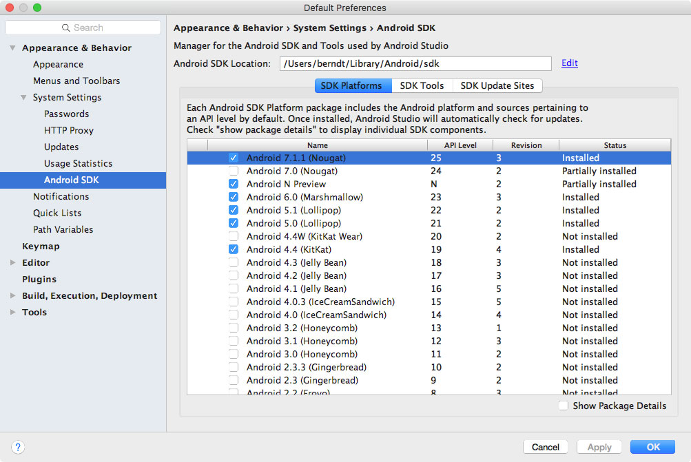
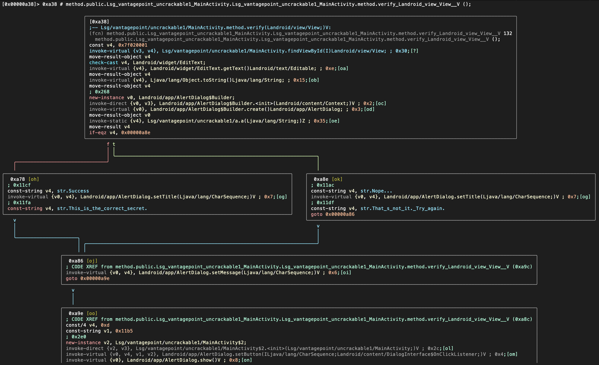
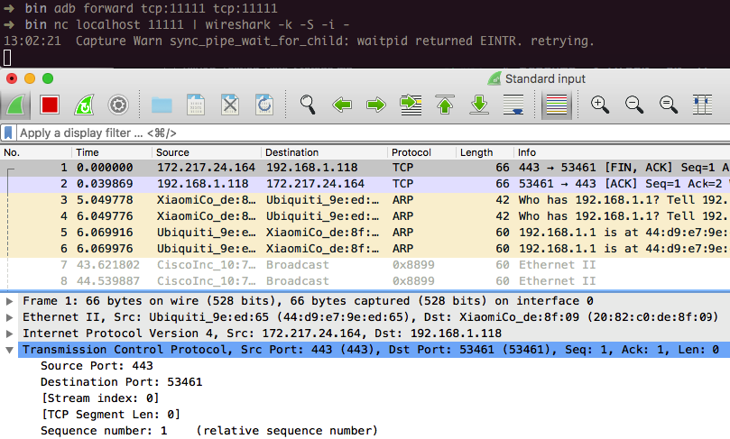
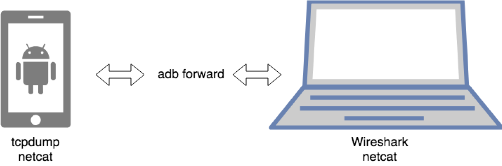

## Android 基本安全性测试

### 基本的 Android 测试设置

到目前为止，您应该对Android应用程序的结构和部署方式有基本的了解。 在本章中，我们将讨论设置安全测试环境并描述您将使用的基本测试过程。 本章是后面各章中讨论的更详细的测试方法的基础。

您几乎可以在运行Windows，Linux或Mac OS的任何计算机上设置功能全面的测试环境。

#### 主机设备

至少，您需要[Android Studio](https://developer.android.com/studio/index.html "Android Studio") （Android SDK随附）平台工具，仿真器和 应用来管理各种SDK版本和框架组件。 Android Studio还附带了用于创建模拟器映像的Android虚拟设备（AVD）管理器应用程序。 确保最新的[SDK工具](https://developer.android.com/studio/index.html#downloads) 和[平台工具](https://developer.android.com/studio/releases/platform-tools.html) 软件包已安装在您的系统上。

另外，如果您打算使用包含本机库的应用程序，它将通过安装[Android NDK](https://developer.android.com/ndk "Android NDK") 来完成主机设置。 也与“ Android上的篡改和逆向工程”一章相关。）

##### 设置 Android SDK

本地Android SDK安装通过Android Studio进行管理。 在Android Studio中创建一个空项目，然后选择 **Tools**-> **Android**-> **SDK Manager** 以打开SDK管理器GUI。 在 **SDK Platforms**标签中，可以安装用于多个API级别的SDK。 最近的API级别是：

- Android 9.0 (API level 28)
- Android 8.1 (API level 27)
- Android 8.0 (API level 26)
- Android 7.1 (API level 25)

有关所有Android代号，其版本号和API级别的概述，请参见[Android开发者文档](https://source.android.com/setup/start/build-numbers "Codenames, Tags, and Build Numbers").



已安装的SDK包含以下路径：

Windows:

```shell
C:\Users\<username>\AppData\Local\Android\sdk
```

MacOS:

```shell
/Users/<username>/Library/Android/sdk
```

注意：在Linux上，您需要选择一个SDK目录。 / opt，/ srv和/ usr / local是常见的选择。

##### 设置Android NDK

Android NDK包含本机编译器和工具链的预构建版本。 传统上都支持GCC和Clang编译器，但是对NCC的有效支持以NDK版本14结束。设备体系结构和主机OS确定适当的版本。 预先构建的工具链位于NDK的“工具链”目录中，其中每个体系结构都包含一个子目录。

|建筑 | 工具链名称|
|------------ | --------------|
|ARM-based|arm-linux-androideabi-&lt;gcc-version&gt;|
|x86-based|x86-&lt;gcc-version&gt;|
|MIPS-based|mipsel-linux-android-&lt;gcc-version&gt;|
|ARM64-based|aarch64-linux-android-&lt;gcc-version&gt;|
|X86-64-based|x86_64-&lt;gcc-version&gt;|
|MIPS64-based|mips64el-linux-android-&lt;gcc-version&gt;|

除了选择正确的体系结构之外，您还需要为要定位的本机API级别指定正确的sysroot。 sysroot是一个目录，其中包含目标的系统头和库。 原生API因Android API级别而异。 每个Android API级别的可能sysroot在$ NDK / platforms /中。 每个API级别目录都包含各种CPU和体系结构的子目录。

设置构建系统的一种可能性是将编译器路径和必要的标志导出为环境变量。 但是，为了使事情变得更容易，NDK允许您创建所谓的独立工具链，即包含所需设置的“临时”工具链。

要设置独立的工具链，请下载[NDK的最新稳定版本](https://developer.android.com/ndk/downloads/index.html#stable-downloads "Android NDK Downloads"). 解压缩ZIP文件，进入NDK根目录，然后运行以下命令：

```shell
$ ./build/tools/make_standalone_toolchain.py --arch arm --api 24 --install-dir /tmp/android-7-toolchain
```

这会在目录“ / tmp / android-7-toolchain”中为Android 7.0（API级别24）创建一个独立的工具链。 为了方便起见，您可以导出指向您的工具链目录的环境变量（我们将在示例中使用它）。 运行以下命令或将其添加到您的.bash_profile或其他启动脚本中：

```shell
$  export TOOLCHAIN=/tmp/android-7-toolchain
```

#### 测试装置

为了进行动态分析，您需要一个Android设备才能在其上运行目标应用程序。 原则上，您可以在没有真正的Android设备的情况下进行测试，而仅使用模拟器。 但是，应用程序在模拟器上的执行速度非常慢，并且模拟器可能无法提供真实的结果。 在真实设备上进行测试可以使过程更流畅，环境更真实。 另一方面，仿真器使您可以轻松更改SDK版本或创建多个设备。 下表列出了每种方法的优缺点的完整概述。

| 属性 | 物理 | 仿真器/仿真器 |
|---|---|---|
| 恢复能力| 软砖总是可能的，但是新固件通常仍可以刷新。 硬砖头非常罕见。 | 模拟器可能崩溃或损坏，但可以创建一个新模拟器或还原快照。 |
| 重设| 可以恢复为出厂设置或刷新。 | 可以删除并重新创建仿真器。|
| 快照| 不可能。 | 支持，非常适合恶意软件分析。 |
| 速度 比仿真器快得多。 | 通常速度较慢，但正在改进。 |
| 费用| 可用设备的起价通常为200美元。 您可能需要不同的设备，例如带有或不带有生物特征传感器的设备。 | 免费和商业解决方案都存在。|
|容易生根|高度依赖于设备。 |通常默认情况下为root。 |
|易于检测仿真器|它不是模拟器，因此模拟器检查不适用。 |将存在许多伪像，从而可以轻松检测到该应用程序正在模拟器中运行。 |
|易于根检测|隐藏根更容易，因为许多根检测算法都会检查模拟器属性。借助Magisk Systemless根，几乎无法检测到。 |仿真器几乎总是会触发根检测算法，这是因为仿真器是为测试许多可发现的伪像而构建的。 |
|硬件交互|通过蓝牙，NFC，4G，WiFi，生物识别，相机，GPS，陀螺仪，...轻松交互。通常相当有限，具有模拟的硬件输入（例如，随机GPS坐标）|
| API级支持|取决于设备和社区。活跃的社区将继续分发更新的版本（例如LineageOS），而不太受欢迎的设备可能只会收到一些更新。在不同版本之间切换需要刷新设备，这是一个乏味的过程。 |始终支持最新版本，包括beta版本。包含特定API级别的仿真器可以轻松下载并启动。 |
|本机库支持|本机库通常是为ARM设备构建的，因此它们将在物理设备上运行。 |某些仿真器在x86 CPU上运行，因此它们可能无法运行打包的本机库。 |
|恶意软件危险|恶意软件样本可能会感染设备，但是如果您可以清除设备存储并刷新干净的固件，从而将其恢复为出厂设置，则应该没有问题。请注意，有一些恶意软件样本试图利用USB桥接器。 |恶意软件样本可以感染模拟器，但是可以简单地将其删除并重新创建。还可以创建快照并比较不同的快照，以帮助进行恶意软件分析。请注意，有一些恶意软件概念证明会尝试攻击管理程序。 |

##### 在真实设备上测试

几乎所有物理设备都可以用于测试，但是要考虑一些注意事项。 首先，设备需要是可生根的。 通常通过漏洞利用或未锁定的引导加载程序来完成此操作。 漏洞利用并不总是可用的，并且引导加载程序可能会被永久锁定，或者只有在运营商合同终止后才能被解锁。

最佳候选人是为开发人员打造的旗舰Google像素设备。 这些设备通常带有可解锁的引导程序，开源固件，内核，在线可用的广播和官方OS源代码。 开发者社区更喜欢Google设备，因为该操作系统最接近android开源项目。 这些设备通常具有最长的支持窗口，并具有2年的OS更新和1年的安全更新。

另外，Google的 [Android One](https://www.android.com/one/ "Android One") 项目所包含的设备将获得相同的支持窗口（2年的操作系统更新，1年的安全更新）并具有接近库存的经验。该程序最初是针对低端设备的项目而启动的，但现在已经演变为包括中端和高端智能手机，其中许多产品受到改装社区的积极支持。

[LineageOS](https://lineageos.org/ "LineageOS") 项目支持的设备也非常适合测试设备。他们有一个活跃的社区，易于遵循的闪烁和生根说明，并且通常可以通过Lineage安装快速获得最新的Android版本。在OEM停止分发更新之后，LineageOS还继续支持新的Android版本。

使用Android物理设备时，您需要在设备上启用开发人员模式和USB调试，才能使用ADB调试界面。从Android 4.2（API级别16）开始，默认情况下，“设置”应用中的“开发人员选项”子菜单处于隐藏状态。要激活它，请点按**关于电话**视图的**内部版本号**部分七次。请注意，内部版本号字段的位置因设备而异，例如，在LG Phones上，它位于**关于手机**-> **软件信息**下。完成此操作后，“开发人员选项”将显示在“设置”菜单的底部。开发人员选项激活后，您可以使用“ USB调试”开关启用调试。

##### 在仿真器上测试

存在多个仿真器，它们又各有优缺点：

免费模拟器：

- [Android Virtual Device (AVD)](https://developer.android.com/studio/run/managing-avds.html "Create and Manage Virtual Devices") - 随Android Studio分发的官方android模拟器.
- [Android X86](https://www.android-x86.org/ "Android X86") - Android代码库的x86端口

商业仿真器：

- [Genymotion](https://www.genymotion.com/fun-zone/ "Genymotion") - 具有许多功能的成熟模拟器，既可以作为本地解决方案，也可以基于云解决方案。 免费版本可用于非商业用途。
- [Corellium](https://corellium.com/ "Corellium") - 通过基于云或本地解决方案提供自定义设备虚拟化。

尽管有多个免费的Android模拟器，但我们建议您使用AVD，因为与其他应用程序相比，它提供了适合测试您的应用程序的增强功能。 在本指南的其余部分，我们将使用官方的AVD进行测试。

AVD支持某些硬件仿真，例如 [GPS](https://developer.android.com/studio/run/emulator-commandline.html#geo "GPS Emulation"), [SMS](https://developer.android.com/studio/run/emulator-commandline.html#sms "SMS") 和[运动传感器](https://developer.android.com/guide/topics/sensors/sensors_overview#test-with-the-android-emulator "Testing motion sensors on emulators").

您可以通过使用Android Studio中的AVD管理器来启动Android虚拟设备（AVD），也可以使用Android SDK的tools目录中的`android`命令从命令行启动AVD管理器：

```shell
$ ./android avd
```

提供了几种可用于在模拟器环境中测试应用程序的工具和VM：

- [MobSF](https://github.com/MobSF/Mobile-Security-Framework-MobSF "MobSF")
- [Nathan](https://github.com/mseclab/nathan "Nathan") (not updated since 2016)

还请验证本书结尾处的 “[测试工具](0x08-Testing-Tools.md)"一章.

##### 获取特权访问

建议在实际设备上进行测试时，要**rooting**（即修改OS，以便您可以以root用户身份运行命令）。这使您可以完全控制操作系统，并可以绕过应用程序沙箱之类的限制。这些特权又使您可以更轻松地使用代码注入和函数挂钩之类的技术。

请注意，生根是有风险的，在继续操作之前，需要弄清三个主要后果。生根有以下负面影响：

-取消设备保修（在执行任何操作之前，请始终检查制造商的政策）
-“砖化”设备，即使其无法操作和无法使用
-造成额外的安全风险（因为通常会消除内置的漏洞利用缓解措施）

您不应将用于存储您的私人信息的个人设备植根。我们建议改为使用便宜的专用测试设备。许多较旧的设备（例如Google的Nexus系列）可以运行最新的Android版本，并且非常适合测试。

**您需要了解，植根设备最终是您的决定，并且OWASP对任何损坏不承担任何责任。如果不确定，请在开始生根过程之前寻求专家意见。**

###### 哪些手机可以 Rooted

几乎任何Android手机都可以 rooted。 Android OS的商业版本（在内核级别上是Linux OS的演进）针对移动世界进行了优化。这些版本已删除或禁用了某些功能，例如，非特权用户具有成为`root`用户（具有较高特权的权限）的能力。扎根电话意味着允许用户成为根用户，例如，添加名为`su`的标准Linux可执行文件，该可执行文件可用于更改为另一个用户帐户。

要启动移动设备，请首先解锁其引导加载程序。解锁步骤取决于设备制造商。但是，出于实际原因，扎根某些移动设备比扎根其他移动设备更为普遍，尤其是在安全测试方面：由Google创建并由三星，LG和摩托罗拉等公司生产的设备最受欢迎，尤其是因为它们许多开发人员使用的。解锁引导加载程序并且Google提供了许多工具来支持root本身时，设备保修不会失效。精选的所有主要品牌设备生根指南精选清单已发布在 [XDA forums](https://www.xda-developers.com/root/ "Guide to rooting mobile devices").

<br/>
<br/>

###### 用Magisk 实现 Rooting 

Magisk ("Magic Mask") 是root Android设备的一种方法。 它的特色在于对系统进行修改的方式。 尽管其他生根工具会更改系统分区上的实际数据，但Magisk不会（这称为“无系统”）。 这样可以隐藏对根敏感的应用程序（例如银行或游戏）的修改，并允许使用官方的Android OTA升级而无需事先取消设备的根目录。

您可以通过阅读官方的[GitHub上的文档](https://topjohnwu.github.io/Magisk/ "Magisk Documentation") 来熟悉Magisk。 如果尚未安装Magisk，则可以在[文档](https://topjohnwu.github.io/Magisk/install.html "Magisk Installation")中找到安装说明。 如果您使用官方Android版本并计划对其进行升级，则Magisk将提供[GitHub上的教程](https://topjohnwu.github.io/Magisk/tutorials.html#ota-installation "OTA Installation").

此外，开发人员可以使用Magisk的功能来创建自定义模块，然后将它们[提交](https://github.com/Magisk-Modules-Repo/submission "Submission") 到官方的[Magisk Modules存储库](https://github.com/Magisk-Modules-Repo "Magisk-Modules-Repo"). 然后可以将提交的模块安装在Magisk Manager应用程序中。 这些可安装模块之一是著名的[Xposed Framework](https://repo.xposed.info/module/de.robv.android.xposed.installer "Xposed Installer (framework)") 的无系统版本（适用于SDK） 版本不超过27）。

###### Root 检测

“在Android上测试防逆转防御”一章中提供了广泛的根检测方法列表。

对于典型的移动应用程序安全性构建，通常需要在禁用根检测的情况下测试调试构建。 如果没有这样的构建可用于测试，则可以通过多种方式禁用根检测，这将在本书的后面介绍。

#### 推荐工具-Android设备

本指南通篇使用了许多工具和框架来评估Android应用程序的安全性。 在下一部分中，您将了解有关某些命令和有趣用例的更多信息。 请查看官方文档，了解以下工具/ APK的安装说明：

- APK 提取器：提取无根APK的应用程序。
- Frida 服务器：Frida服务器，适用于开发人员，逆向工程人员和安全研究人员的动态工具套件。 有关更多信息，请参见下面的[Frida]（＃frida“ Frida部分”）部分。
- Drozer 代理：drozer的代理，该框架使您可以搜索应用程序和设备中的安全漏洞。 有关更多信息，请参见下面的[Drozer]（＃drozer“ Drozer部分”）部分。

##### Xposed

[Xposed](http://repo.xposed.info/module/de.robv.android.xposed.installer "Xposed Installer") 是“模块框架，可以在不触摸任何APK的情况下更改系统和应用程序的行为”。从技术上讲，它是Zygote的扩展版本，可在启动新进程时导出用于运行Java代码的API。在新实例化的应用程序上下文中运行Java代码可以解析，挂钩和覆盖属于该应用程序的Java方法。 Xposed使用[reflection](https://docs.oracle.com/javase/tutorial/reflect/ "Reflection Tutorial") 检查和修改正在运行的应用程序。因为未修改应用程序二进制文件，所以更改将应用​​到内存中，并且仅在进程的运行时持久保存。

要使用Xposed，您需要先按照[XDA-Developers Xposed framework hub](https://www.xda-developers.com/xposed-framework-hub/ "Xposed framework hub from XDA"). 可以通过Xposed Installer应用程序安装模块，也可以通过GUI启用和禁用这些模块。

注意：鉴于可以使用SafetyNet轻松检测到Xposed框架的简单安装，因此我们建议使用Magisk安装Xposed。这样，带有SafetyNet认证的应用程序应该具有更高的可通过Xposed模块进行测试的机会。

Xposed已与Frida进行了比较。在有根设备上运行Frida服务器时，最终将获得类似的有效设置。当您要进行动态检测时，这两个框架都可以带来很多价值。当Frida使该应用程序崩溃时，您可以尝试使用Xposed类似的方法。接下来，类似于丰富的Frida脚本，您可以轻松使用Xposed随附的众多模块之一，例如前面讨论的模块绕过SSL固定（[JustTrustMe](https://github.com/Fuzion24/JustTrustMe "JustTrustMe") 和 [SSLUnpinning](https://github.com/ac-pm/SSLUnpinning_Xposed "SSL Unpinning")). Xposed包括其他模块，例如[Inspeckage](https://github.com/ac-pm/Inspeckage "Inspeckage") 这些模块也使您可以进行更多的深度应用程序测试。最重要的是，您还可以创建自己的模块来修补Android应用程序的常用安全机制。

也可以通过以下脚本将Xposed安装在模拟器上：

```sh
#!/bin/sh
echo "Start your emulator with 'emulator -avd NAMEOFX86A8.0 -writable-system -selinux permissive -wipe-data'"
adb root && adb remount
adb install SuperSU\ v2.79.apk #binary can be downloaded from http://www.supersu.com/download
adb push root_avd-master/SuperSU/x86/su /system/xbin/su
adb shell chmod 0755 /system/xbin/su
adb shell setenforce 0
adb shell su --install
adb shell su --daemon&
adb push busybox /data/busybox #binary can be downloaded from https://busybox.net/
# adb shell "mount -o remount,rw /system && mv /data/busybox /system/bin/busybox && chmod 755 /system/bin/busybox && /system/bin/busybox --install /system/bin"
adb shell chmod 755 /data/busybox
adb shell 'sh -c "./data/busybox --install /data"'
adb shell 'sh -c "mkdir /data/xposed"'
adb push xposed8.zip /data/xposed/xposed.zip #can be downloaded from https://dl-xda.xposed.info/framework/
adb shell chmod 0755 /data/xposed
adb shell 'sh -c "./data/unzip /data/xposed/xposed.zip -d /data/xposed/"'
adb shell 'sh -c "cp /data/xposed/xposed/META-INF/com/google/android/*.* /data/xposed/xposed/"'
echo "Now adb shell and do 'su', next: go to ./data/xposed/xposed, make flash-script.sh executable and run it in that directory after running SUperSU"
echo "Next, restart emulator"
echo "Next, adb install XposedInstaller_3.1.5.apk"
echo "Next, run installer and then adb reboot"
echo "Want to use it again? Start your emulator with 'emulator -avd NAMEOFX86A8.0 -writable-system -selinux permissive'"
```

请注意，截至2019年初，Xposed尚不适用于Android 9（API级别28）。

#### 推荐工具 - 主机

为了分析Android应用，您应该在主机上安装以下工具。 请查看官方文档，了解以下工具/框架的安装说明。 在整个指南中，我们将参考它们。

##### Adb

[adb](https://developer.android.com/studio/command-line/adb "Android Debug Bridge") (Android Debug Bridge), Android SDK附带的[adb], 弥合了本地开发环境与已连接的开发环境之间的差距 Android设备。 通常，您将利用它来通过USB或WiFi在仿真器或连接的设备上测试应用程序。 使用“ adb devices”命令列出连接的设备，并使用 `-l` 参数执行它以获取有关它们的更多详细信息。

```shell
$ adb devices -l
List of devices attached
090c285c0b97f748 device usb:1-1 product:razor model:Nexus_7 device:flo
emulator-5554    device product:sdk_google_phone_x86 model:Android_SDK_built_for_x86 device:generic_x86 transport_id:1
```

adb 提供了其他有用的命令，例如 `adb shell` 以在目标上启动交互式shell，以及`adb forward` 以将特定主机端口上的流量转发到连接设备上的其他端口。

```shell
$ adb forward tcp:<host port> tcp:<device port>
```

```shell
$ adb -s emulator-5554 shell
root@generic_x86:/ # ls
acct
cache
charger
config
...
```

在本书后面的测试中，您将遇到不同的使用案例，以了解如何使用adb命令。 请注意，如果连接了多个设备，则必须使用-s参数定义目标设备的序列号（如前面的代码片段所示）。

##### Angr

Angr是一个用于分析二进制文件的Python框架。 它对于静态和动态符号（“共余”）分析都是有用的。 换句话说：给定一个二进制状态和一个请求状态，Angr将尝试使用形式化方法（一种用于静态代码分析的技术）来找到该状态以及蛮力。 使用angr进入请求的状态通常比采取手动步骤进行调试和搜索通往所需状态的路径要快得多。 Angr使用VEX中间语言进行操作，并带有ELF / ARM二进制文件的加载程序，因此非常适合处理本机代码，例如本机Android二进制文件。

Angr允许使用大量插件来进行反汇编，程序检测，符号执行，控制流分析，数据依赖分析，反编译等。

从版本8开始，Angr基于Python 3，并且可以通过pip安装在\ * nix操作系统，macOS和Windows上：

```shell
$ pip install angr
```

> Angr 的某些依赖项包含Python模块Z3和PyVEX的分支版本，这些版本会覆盖原始版本。如果将这些模块用于其他任何用途，则应使用 [Virtualenv](https://docs.python.org/3/tutorial/venv.html "Virtualenv documentation") 创建专用的虚拟环境。或者，您可以始终使用提供的docker容器。有关更多详细信息，请参见[安装指南](https://docs.angr.io/introductory-errata/install "angr Installation Guide").

可在[Angr's Gitbooks页面](https://docs.angr.io/ "angr")上获得包括安装指南，教程和用法示例在内的全面文档。也提供完整的[API参考](https://angr.io/api-doc/ "angr API").

您可以使用Python REPL（例如iPython）中的angr或编写方法脚本。尽管angr的学习曲线有些陡峭，但是当您要蛮力将可执行文件的状态设为特定状态时，我们还是建议您使用它。请参阅“反向工程和篡改”一章的“ [符号执行](0x05c-Reverse-Engineering-and-Tampering.md#symbolic-execution "Symbolic Execution")" 部分，以获取有关如何执行此操作的绝佳示例。

##### Apktool

[Apktool](https://github.com/iBotPeaches/Apktool) 用于解压缩Android应用程序包（APK）。 使用标准的“ unzip”实用工具简单地将APK解压缩会使一些文件不可读。 “ AndroidManifest.xml”已编码为二进制XML格式，文本编辑器无法读取。 此外，应用程序资源仍打包到单个存档文件中。

当使用默认命令行标志运行时，apktool会自动将Android Manifest文件解码为基于文本的XML格式并提取文件资源（还将.DEX文件反汇编为smali代码，这一功能我们将在本书后面部分进行介绍） 。

```shell
$ apktool d base.apk
I: Using Apktool 2.1.0 on base.apk
I: Loading resource table...
I: Decoding AndroidManifest.xml with resources...
I: Loading resource table from file: /Users/sven/Library/apktool/framework/1.apk
I: Regular manifest package...
I: Decoding file-resources...
I: Decoding values */* XMLs...
I: Baksmaling classes.dex...
I: Copying assets and libs...
I: Copying unknown files...
I: Copying original files...
$ cd base
$ ls -alh
total 32
drwxr-xr-x    9 sven  staff   306B Dec  5 16:29 .
drwxr-xr-x    5 sven  staff   170B Dec  5 16:29 ..
-rw-r--r--    1 sven  staff    10K Dec  5 16:29 AndroidManifest.xml
-rw-r--r--    1 sven  staff   401B Dec  5 16:29 apktool.yml
drwxr-xr-x    6 sven  staff   204B Dec  5 16:29 assets
drwxr-xr-x    3 sven  staff   102B Dec  5 16:29 lib
drwxr-xr-x    4 sven  staff   136B Dec  5 16:29 original
drwxr-xr-x  131 sven  staff   4.3K Dec  5 16:29 res
drwxr-xr-x    9 sven  staff   306B Dec  5 16:29 smali
```

解压缩的文件是：

-AndroidManifest.xml：已解码的Android Manifest文件，可以在文本编辑器中打开和编辑该文件。
-apktool.yml：包含有关apktool输出的信息的文件
-原始：包含MANIFEST.MF文件的文件夹，该文件包含有关JAR文件中包含的文件的信息
-res：包含应用程序资源的目录
-smali：包含反汇编的Dalvik字节码的目录。

您还可以使用apktool将解码后的资源重新打包回二进制APK / JAR。 请参阅本章后面的“ [探索应用程序包](#exploring-the-app-package "Exploring the App Package")" 部分和“ [重新包装](0x05c-Reverse-Engineering-and-Tampering.md#repackaging "Repackaging")" 请参阅“在Android上进行篡改和逆向工程”一章中的“重新包装” 有关更多信息和实际示例.
##### Apkx

`Apkx` 是流行的免费DEX转换器和Java反编译器的Python包装器。 它自动执行APK的提取，转换和反编译。 如下安装：

```shell
$ git clone https://github.com/b-mueller/apkx
$ cd apkx
$ sudo ./install.sh
```

这应该将 `apkx` 复制到 `/usr/local/bin`. 有关用法的更多信息，请参见 “逆向工程和篡改” 一章的“[反编译Java代码](0x05c-Reverse-Engineering-and-Tampering.md#decompiling-java-code "Decompiling Java Code")"

##### Burp Suite

Burp Suite是用于安全测试移动和Web应用程序的集成平台。 它的工具无缝协作，以支持整个测试过程，从最初的攻击面映射和分析到发现和利用安全漏洞。 Burp Proxy充当Burp Suite的Web代理服务器，该服务器位于浏览器和Web服务器之间的中间人位置。 Burp Suite允许您拦截，检查和修改传入和传出的原始HTTP通信。

设置Burp代理您的流量非常简单。 我们假设您有连接到Wi-Fi网络且允许客户端到客户端流量的iOS设备和工作站。

PortSwigger提供了很好的 [设置Android设备以与Burp配合使用的教程](https://support.portswigger.net/customer/portal/articles/1841101-configuring-an-android-device-to-work-with-burp "Configuring an Android Device to Work With Burp") 以及[将Burp的CA证书安装到Android设备上的教程](https://support.portswigger.net/customer/portal/articles/1841102-installing-burp-s-ca-certificate-in-an-android-device "Installing Burp's CA Certificate in an Android Device").

##### Drozer

[Drozer](https://github.com/mwrlabs/drozer "Drozer on GitHub") 是一个Android安全评估框架，允许您通过假设第三方应用交互的作用来搜索应用和设备中的安全漏洞。 与其他应用程序的IPC端点和基础操作系统。

使用Drozer的优势在于其能够自动执行多个任务的能力，并且可以通过模块进行扩展。 这些模块非常有用，涵盖了不同的类别，其中包括扫描程序类别，可让您使用简单的命令扫描已知缺陷，例如模块`scanner.provider.injection`，该模块可检测安装在所有应用程序中内容提供程序中的SQL注入 系统。 如果不使用drozer，则简单的任务（例如列出应用程序的权限）需要几个步骤，包括反编译APK和手动分析结果。

###### Installing Drozer

您可以参考[drozer GitHub页面](https://github.com/mwrlabs/drozer "Drozer on GitHub") (对于Linux和Windows，对于macOS，请参考此[blog post](https://blog.ropnop.com/installing-drozer-on-os-x-el-capitan/ "ropnop Blog - Installing Drozer on OS X El Capitan")) 和 [drozer website](https://labs.mwrinfosecurity.com/tools/drozer/ "Drozer Website") 以获取先决条件和安装说明。

在[drozer Github页面](https://github.com/mwrlabs/drozer "drozer GitHub page")中说明了Unix，Linux和Windows上drozer的安装说明。 对于[macOS，此博客文章](https://blog.ropnop.com/installing-drozer-on-os-x-el-capitan/ "Installing Drozer on OS X El Capitan") 将演示所有安装说明。

###### Using Drozer

在开始使用drozer之前，您还需要在Android设备本身上运行的drozer代理。 从发布页面下载[最新的drozer代理](https://github.com/mwrlabs/drozer/releases/ "drozer GitHub releases") 并使用`adb install drozer.apk`进行安装。

设置完成后，您可以通过运行“ adb forward tcp：31415 tcp：31415”和“ drozer console connect”来启动与仿真器或通过USB连接的设备的会话。 请参阅的完整说明[此处](https://mobiletools.mwrinfosecurity.com/Starting-a-session/ "开始会话").

现在您可以开始分析应用程序了。 一个好的第一步是枚举应用程序的受攻击面，可以使用以下命令轻松完成：

```shell
$ dz> run app.package.attacksurface <package>
```

同样，如果没有催干器，这将需要几个步骤。 “ app.package.attacksurface”模块列出了活动，广播接收者，内容提供者和导出的服务，因此，它们是公共的，可以通过其他应用程序进行访问。 一旦确定了攻击面，就可以通过drozer与IPC端点进行交互，而无需编写单独的独立应用程序，因为某些任务（例如与内容提供商进行通信）将需要它。

例如，如果应用程序的导出活动泄漏了敏感信息，我们可以使用Drozer模块app.activity.start来调用它：

```shell
$ dz> run app.activity.start --component <package> <component name>
```

先前的命令将启动活动，希望泄漏一些敏感信息。 Drozer具有适用于每种IPC机制的模块。 如果您想尝试使用一个故意易受攻击的应用程序来说明这些模块来说明与IPC端点相关的常见问题，请下载[InsecureBankv2](https://github.com/dineshshetty/Android-InsecureBankv2 "InsecureBankv2 APK") 请密切注意扫描仪类别中的模块，因为它们对于自动检测漏洞（甚至是系统软件包中的漏洞）也非常有帮助，尤其是在您使用手机公司提供的ROM的情况下。 甚至在过去也已经使用drozer识别了[Google所提供系统包中的SQL注入漏洞](https://issuetracker.google.com/u/0/issues/36965126 "SQL injection in Android").

###### 其他 Drozer 命令

以下是命令的详尽列表，可用于在Android上开始探索：

```shell
# List all the installed packages
$ dz> run app.package.list

# Find the package name of a specific app
$ dz> run app.package.list –f (string to be searched)

# See basic information
$ dz> run app.package.info –a (package name)

# Identify the exported application components
$ dz> run app.package.attacksurface (package name)

# Identify the list of exported Activities
$ dz> run app.activity.info -a (package name)

# Launch the exported Activities
$ dz> run app.activity.start --component (package name) (component name)

# Identify the list of exported Broadcast receivers
$ dz> run app.broadcast.info -a (package name)

# Send a message to a Broadcast receiver
$ dz> run app.broadcast.send --action (broadcast receiver name) -- extra (number of arguments)

# Detect SQL injections in content providers
$ dz> run scanner.provider.injection -a (package name)
```

###### 其他 Drozer 资源

您可能会找到有用信息的其他资源包括：

- [官方Drozer用户指南](https://labs.mwrinfosecurity.com/assets/BlogFiles/mwri-drozer-user-guide-2015-03-23.pdf "Drozer User Guide").
- [drozer GitHub 页面](https://github.com/mwrlabs/drozer "GitHub repo")
- [drozer Wiki](https://github.com/mwrlabs/drozer/wiki "drozer Wiki")
- [命令参考](https://mobiletools.mwrinfosecurity.com/Command-Reference/ "drozer's Command Reference")
- [使用drozer 进行应用程序安全评估](https://mobiletools.mwrinfosecurity.com/Using-Drozer-for-application-security-assessments/ "Using drozer for application security assessments")
- [Drozer 中的利用功能](https://mobiletools.mwrinfosecurity.com/Exploitation-features-in-drozer/ "Exploitation features in drozer")
- [使用模块](https://mobiletools.mwrinfosecurity.com/Installing-modules/)

##### Frida

[Frida](https://www.frida.re "Frida") 是一个免费的开源动态代码检测工具包，可让您在本地应用程序中执行JavaScript片段。它已在一般测试指南的“ [篡改和逆向工程](0x04c-Tampering-and-Reverse-Engineering.md#frida "Frida")" 一章中进行介绍。

Frida通过[Java API](https://www.frida.re/docs/javascript-api/#java "Frida - Java API")支持与Android Java运行时的交互。您将能够在流程及其本机库中挂钩并调用Java和本机函数。您的JavaScript代码段具有对内存的完全访问权限，例如读取和/或写入任何结构化数据。

以下是Frida API提供的一些任务，这些任务与Android相关或不相关：

- 实例化Java对象并调用静态和非静态类方法（[Java API](https://www.frida.re/docs/javascript-api/#java "Frida - Java API")).
- 替换Java方法的实现 ([Java API](https://www.frida.re/docs/javascript-api/#java "Frida - Java API")).
- 通过扫描Java堆来枚举特定类的实时实例 ([Java API](https://www.frida.re/docs/javascript-api/#java "Frida - Java API")).
- 扫描进程内存中是否出现字符串 ([Memory API](https://www.frida.re/docs/javascript-api/#memory "Frida - Memory API")).
- 拦截本机函数调用以在函数入口和出口运行您自己的代码 ([Interceptor API](https://www.frida.re/docs/javascript-api/#interceptor "Frida - Interceptor API")).

请记住，在Android上，您还可以从安装Frida时使用的内置工具中受益，其中包括Frida CLI（`frida`），`frida-ps`，`frida-ls-devices`和`frida-trace` ，以列举其中的一些。

Frida通常与Xposed相提并论，但是，由于两个框架在设计时都考虑了不同的目标，因此这种比较并不公平。作为应用程序安全测试人员，了解这一点很重要，这样您就可以知道在哪种情况下使用哪个框架：

- Frida是独立的，您所需要做的就是从目标Android设备中的已知位置运行frida-server二进制文件（请参阅下面的“安装Frida”）。这意味着，与Xposed相比，它没有在目标OS中“深安装”。
- 撤消应用程序是一个反复的过程。由于上一点，测试时您不需要（软）重新启动即可应用或简单地更新钩子，因此获得的反馈循环更短。因此，在实现更多永久性挂钩时，您可能更喜欢使用Xposed。
- 您可以在流程运行期间的任何时候动态注入和更新Frida JavaScript代码（类似于iOS上的Cycript）。这样，您可以通过让Frida生成您的应用程序来执行所谓的_early instrumentation_，或者您可能更喜欢将其附加到正在运行的应用程序中，而该应用程序可能已使其处于某种状态。
- Frida能够处理Java以及本机代码（JNI），使您能够修改它们。不幸的是，这是Xposed的局限性，缺乏本地代码支持。

>请注意，截至2019年初，Xposed尚不适用于Android 9（API级别28）。

###### 安装 Frida

要在本地安装Frida，只需运行：

```shell
$ pip install frida-tools
```

或参阅[安装页面](https://www.frida.re/docs/installation/ "Frida Installation") 了解更多详细信息。

下一步是在您的Android设备上设置Frida：

- 如果您的设备未植根，则也可以使用Frida，请参阅“ [非根植设备上的动态分析](0x05c-Reverse-Engineering-and-Tampering.md#dynamic-analysis-on-non-rooted-devices "Dynamic Analysis on Non-Rooted Devices")" 部分设备“逆向工程和篡改”一章中的“非根设备的动态分析”）。
- 如果您的设备已植根，只需按照[官方说明](https://www.frida.re/docs/android/ "Frida - Setting up your Android device") 或按照以下提示进行操作。

除非另有说明，否则我们在这里假设有根设备。从[Frida版本页面](https://github.com/frida/frida/releases). 下载frida-server二进制文件。确保为您的Android设备或仿真器的架构下载正确的frida服务器二进制文件：x86，x86_64，arm或arm64。确保服务器版本（至少是主版本号）与本地Frida安装的版本匹配。 PyPI通常会安装最新版本的Frida。如果不确定安装哪个版本，可以使用Frida命令行工具进行检查：

```shell
$ frida --version
```

或者，您可以运行以下命令来自动检测Frida版本并下载正确的frida-server二进制文件：

```shell
$ wget https://github.com/frida/frida/releases/download/$(frida --version)/frida-server-$(frida --version)-android-arm.xz
```

将frida-server复制到设备并运行它：

```shell
$ adb push frida-server /data/local/tmp/
$ adb shell "chmod 755 /data/local/tmp/frida-server"
$ adb shell "su -c /data/local/tmp/frida-server &"
```

###### 在Android上使用Frida

随着frida-server的运行，您现在应该可以使用以下命令获取正在运行的进程的列表（使用-U选项指示Frida使用已连接的USB设备或仿真器）：

```shell
$ frida-ps -U
  PID  Name
-----  --------------------------------------------------------------
  276  adbd
  956  android.process.media
  198  bridgemgrd
30692  com.android.chrome
30774  com.android.chrome:privileged_process0
30747  com.android.chrome:sandboxed
30834  com.android.chrome:sandboxed
 3059  com.android.nfc
 1526  com.android.phone
17104  com.android.settings
 1302  com.android.systemui
(...)
```

或使用-Uai标志组合限制列表，以获取连接的USB设备（-U）上当前安装的所有应用程序（-i）：

```bash
$ frida-ps -Uai
  PID  Name                                      Identifier
-----  ----------------------------------------  ---------------------------------------
  766  Android System                            android
30692  Chrome                                    com.android.chrome
 3520  Contacts Storage                          com.android.providers.contacts  
    -  Uncrackable1                              sg.vantagepoint.uncrackable1
    -  drozer Agent                              com.mwr.dz
```

这将显示所有应用程序的名称和标识符，如果它们当前正在运行，它还将显示其PID。 在列表中搜索您的应用，并记下PID或其名称/标识符。 从现在开始，您将使用其中之一来引用您的应用程序。 建议使用标识符，因为PID会在每次运行该应用程序时更改。 例如，以“ com.android.chrome”为例。 您现在可以在所有Frida工具上使用此字符串，例如 在Frida CLI，frida-trace或Python脚本上。

###### 使用 frida-trace 跟踪本地库

要跟踪特定的（低级）库调用，可以使用`frida-trace`命令行工具：

```shell
$ frida-trace -U com.android.chrome -i "open"
```

这将在 `__handlers__/libc.so/open.js`中生成一些JavaScript，Frida将其注入到该过程中。 该脚本将跟踪对`libc.so`中的`open`函数的所有调用。 您可以使用Frida 根据需要修改生成的脚本。[JavaScript API](https://www.frida.re/docs/javascript-api/).

不幸的是，尚不支持跟踪Java类的高级方法（但可能会[在将来](https://github.com/frida/frida-python/issues/70 "Support for tracing high-level methods of Java Classes via patterns")).

###### Frida CLI 和 Java API

使用Frida CLI工具（`frida`）与Frida交互工作。 它挂接到一个进程中，并为您提供Frida API的命令行界面。

```shell
$ frida -U com.android.chrome
```

使用`-l`选项，您还可以使用Frida CLI加载脚本，例如，加载 `myscript.js`：

```shell
$ frida -U -l myscript.js com.android.chrome
```

Frida 还提供了[Java API](https://www.frida.re/docs/javascript-api/#java "Frida - Java API"), 这对于处理Android应用程序特别有用。 它使您可以直接使用Java类和对象。 这是一个覆盖Activity类的onResume函数的脚本：

```java
Java.perform(function () {
    var Activity = Java.use("android.app.Activity");
    Activity.onResume.implementation = function () {
        console.log("[*] onResume() got called!");
        this.onResume();
    };
});
```

上面的脚本调用Java.perform来确保您的代码在Java VM的上下文中执行。 它通过Java.use实例化android.app.Activity类的包装器，并覆盖onResume函数。 新的onResume函数实现将通知打印到控制台，并在每次在应用中恢复活动时通过调用this.onResume调用原始onResume方法。

Frida还允许您搜索并使用堆上的实例化对象。 以下脚本搜索android.view.View对象的实例，并调用其toString方法。 结果打印到控制台：

```java
setImmediate(function() {
    console.log("[*] Starting script");
    Java.perform(function () {
        Java.choose("android.view.View", {
             "onMatch":function(instance){
                  console.log("[*] Instance found: " + instance.toString());
             },
             "onComplete":function() {
                  console.log("[*] Finished heap search")
             }
        });
    });
});
```

输出如下所示：

```shell
[*] Starting script
[*] Instance found: android.view.View{7ccea78 G.ED..... ......ID 0,0-0,0 #7f0c01fc app:id/action_bar_black_background}
[*] Instance found: android.view.View{2809551 V.ED..... ........ 0,1731-0,1731 #7f0c01ff app:id/menu_anchor_stub}
[*] Instance found: android.view.View{be471b6 G.ED..... ......I. 0,0-0,0 #7f0c01f5 app:id/location_bar_verbose_status_separator}
[*] Instance found: android.view.View{3ae0eb7 V.ED..... ........ 0,0-1080,63 #102002f android:id/statusBarBackground}
[*] Finished heap search
```

您还可以使用Java的反射功能。 要列出`android.view.View`类的公共方法，您可以在`Frida`中为该类创建一个包装器，并从包装器的`class`属性调用`getMethods`：

```java
Java.perform(function () {
    var view = Java.use("android.view.View");
    var methods = view.class.getMethods();
    for(var i = 0; i < methods.length; i++) {
        console.log(methods[i].toString());
    }
});
```

这将向终端打印很长的方法列表：

```java
public boolean android.view.View.canResolveLayoutDirection()
public boolean android.view.View.canResolveTextAlignment()
public boolean android.view.View.canResolveTextDirection()
public boolean android.view.View.canScrollHorizontally(int)
public boolean android.view.View.canScrollVertically(int)
public final void android.view.View.cancelDragAndDrop()
public void android.view.View.cancelLongPress()
public final void android.view.View.cancelPendingInputEvents()
...
```

###### Frida Bindings

为了扩展脚本编写经验，Frida提供了与Python，C，NodeJS和Swift等编程语言的绑定。

以Python为例，首先要注意的是不需要进一步的安装步骤。 从“ import frida”开始您的Python脚本，您就可以开始了。 请参阅下面的脚本，该脚本仅运行先前的JavaScript代码段：

```python
# frida_python.py
import frida

session = frida.get_usb_device().attach('com.android.chrome')

source = """
Java.perform(function () {
    var view = Java.use("android.view.View");
    var methods = view.class.getMethods();
    for(var i = 0; i < methods.length; i++) {
        console.log(methods[i].toString());
    }
});
"""

script = session.create_script(source)
script.load()

session.detach()
```

在这种情况下，运行Python脚本（`python3 frida_python.py`）与上一个示例具有相同的结果：它将把`android.view.View`类的所有方法输出到终端。 但是，您可能希望使用Python中的数据。 使用`send`而不是`console.log`会将JSON格式的数据从JavaScript发送到Python。 请阅读以下示例中的注释：

```python
# python3 frida_python_send.py
import frida

session = frida.get_usb_device().attach('com.android.chrome')

# 1. we want to store method names inside a list
android_view_methods = []

source = """
Java.perform(function () {
    var view = Java.use("android.view.View");
    var methods = view.class.getMethods();
    for(var i = 0; i < methods.length; i++) {
        send(methods[i].toString());
    }
});
"""

script = session.create_script(source)

# 2. this is a callback function, only method names containing "Text" will be appended to the list
def on_message(message, data):
    if "Text" in message['payload']:
        android_view_methods.append(message['payload'])

# 3. we tell the script to run our callback each time a message is received
script.on('message', on_message)

script.load()

# 4. we do something with the collected data, in this case we just print it
for method in android_view_methods:
    print(method)

session.detach()
```

这样可以有效地过滤方法，并仅打印包含字符串 “Text”的方法：

```java
$ python3 frida_python_send.py
public boolean android.view.View.canResolveTextAlignment()
public boolean android.view.View.canResolveTextDirection()
public void android.view.View.setTextAlignment(int)
public void android.view.View.setTextDirection(int)
public void android.view.View.setTooltipText(java.lang.CharSequence)
...
```

最后，由您决定要在哪里使用数据。 有时，使用JavaScript进行操作会更加方便，而在其他情况下，Python将是最佳选择。 当然，您也可以使用`script.post`将消息从Python发送到JavaScript。 有关[发送](https://www.frida.re/docs/messages/#sending-messages-from-a-target-process "Sending messages from a target process") 和 [接收](https://www.frida.re/docs/messages/#receiving-messages-in-a-target-process "Receiving messages in a target process") 消息。

##### Magisk

`Magisk` ("Magic Mask") 是根植Android设备的一种方法。它的特色在于对系统进行修改的方式。尽管其他生根工具会更改系统分区上的实际数据，但Magisk不会（这称为“无系统”）。这样可以隐藏对根敏感的应用程序（例如银行或游戏）的修改，并允许使用官方的Android OTA升级而无需事先取消设备的根目录。

您可以通过阅读官方的[GitHub上的文档](https://topjohnwu.github.io/Magisk/ "Magisk Documentation")来熟悉Magisk。如果尚未安装Magisk，则可以在[文档](https://topjohnwu.github.io/Magisk/install.html "Magisk Installation")中找到安装说明。如果您使用官方Android版本并计划对其进行升级，则Magisk将提供[GitHub上的教程](https://topjohnwu.github.io/Magisk/tutorials.html#ota-installation "OTA Installation").

L了解更多有关[使用Magisk Rooting 设备](#rooting-with-magisk "Rooting with Magisk").

##### MobSF

[MobSF](https://github.com/MobSF/Mobile-Security-Framework-MobSF "MobSF") 是一个自动化的多合一移动应用程序渗透测试框架，还支持Android APK文件。 启动MobSF的最简单方法是通过Docker。

```shell
$ docker pull opensecurity/mobile-security-framework-mobsf
$ docker run -it -p 8000:8000 opensecurity/mobile-security-framework-mobsf:latest
```

或通过运行以下命令在主机上本地安装并启动它：

```shell
# Setup
git clone https://github.com/MobSF/Mobile-Security-Framework-MobSF.git
cd Mobile-Security-Framework-MobSF
./setup.sh # For Linux and Mac
setup.bat # For Windows

# Installation process
./run.sh # For Linux and Mac
run.bat # For Windows
```

MobSF启动并运行后，可以通过导航到<http://127.0.0.1:8000>在浏览器中打开它。 只需将您要分析的APK拖到上传区域，MobSF将开始工作。

在完成MobSF的分析之后，您将获得一页一页的所有已执行测试的概述。 该页面分为多个部分，在应用程序的受攻击面上提供了一些初步提示。


显示以下内容：

-有关该应用及其二进制文件的基本信息。
-一些选项：
   -查看“ AndroidManifest.xml”文件。
   -查看应用程序的IPC组件。
-签名者证书。
- 应用权限。
-显示已知缺陷的安全分析，例如 如果启用了应用程序备份。
-应用程序二进制文件使用的库列表以及未压缩的APK内的所有文件的列表。
-检查恶意URL的恶意软件分析。

有关更多详细信息，请参见[MobSF文档]（https://github.com/MobSF/Mobile-Security-Framework-MobSF/wiki/1.-文档“ MobSF文档”）。

##### Objection

[Objection](https://github.com/sensepost/objection "Objection on GitHub") 是“由Frida提供支持的运行时移动探索工具包”。 其主要目标是允许通过直观界面在非根设备上进行安全测试。

Objection通过为您提供通过重新打包将Frida小工具轻松地注入到应用程序中的工具来实现此目标。这样，您可以通过旁加载将重新打包的应用程序部署到非root用户的设备，并按照上一节中的说明与该应用程序进行交互。

但是，Objection还提供了REPL，它允许您与应用程序进行交互，从而使您能够执行应用程序可以执行的任何操作。可以在项目的主页上找到Objection功能的完整列表，但是这里有一些有趣的功能：

- 重新打包应用程序以包括Frida小工具
- 为流行方法禁用SSL固定
- 访问应用程序存储以下载或上传文件
- 执行自定义Frida脚本
- 列出活动，服务和广播接收者
- 开始活动

在无根设备上执行高级动态分析的能力是使Objection异常有用的功能之一。应用程序可能包含高级RASP控件，这些控件可以检测您的生根方法，而注入frida-gadget可能是绕过这些控件的最简单方法。此外，随附的Frida脚本使快速分析应用程序或解决基本安全控制变得非常容易。

最后，如果您确实有权访问已植根的设备，则Objection可以直接连接到正在运行的Frida服务器，以提供其所有功能，而无需重新打包应用程序。

###### 安装 Objection

可以按照[Objection Wiki](https://github.com/sensepost/objection/wiki/Installation "Objection Wiki - Installation")所述通过pip安装。

```shell

$ pip3 install objection

```

如果您的设备已越狱，则现在可以与该设备上运行的任何应用程序进行交互，并且可以跳到下面的“使用异议”部分。

但是，如果要在无根设备上进行测试，则首先需要在应用程序中包括Frida小工具。 [Objection Wiki](https://github.com/sensepost/objection/wiki/Patching-Android-Applications "Patching Android Applications") 详细描述了所需的步骤，但是在进行了正确的准备后，您将能够 通过调用异议命令来修补APK：

```shell
$ objection patchapk --source app-release.apk
```

然后，需要使用adb安装修补的应用程序，如“基本测试操作-安装应用程序”中所述。

###### 使用 Objection

启动异议取决于您是否已修补APK或使用的是运行Frida服务器的植根设备。 要运行已打补丁的APK，异议会自动找到所有连接的设备并搜索正在收听的Frida小工具。 但是，在使用frida-server时，您需要明确告诉frida-server您要分析哪个应用程序。

```shell
# Connecting to a patched APK
objection explore

# Find the correct name using frida-ps
$ frida-ps -Ua | grep -i telegram
30268  Telegram                               org.telegram.messenger

# Connecting to the Telegram app through Frida-server
$ objection --gadget="org.telegram.messenger" explore
```

进入Objection REPL后，您可以执行任何可用的命令。 以下是一些最有用的概述：

```shell
# Show the different storage locations belonging to the app
$ env

# Disable popular ssl pinning methods
$ android sslpinning disable

# List items in the keystore
$ android keystore list

# Try to circumvent root detection
$ android root disable

```

有关使用Objection REPL的更多信息，请参见[Objection Wiki]。(https://github.com/sensepost/objection/wiki/Using-objection "Using Objection")

##### radare2

[radare2](https://rada.re/r/ "Radare2 official website") 是一种流行的开源逆向工程框架，用于反汇编，调试，修补和分析二进制文件，该脚本可编写脚本并支持[许多体系结构和文件格式](https://rada.re/r/cmp "radare2 Comparison Table") 包括Android / iOS应用。对于Android，支持Dalvik DEX（odex，multidex），ELF（可执行文件，.so，ART）和Java（JNI和Java类）。它还包含一些有用的脚本，这些脚本可以在移动应用程序分析期间为您提供帮助，因为它提供了低级别的分解和安全的静态分析，在传统工具出现故障时会派上用场。

radare2 实现了丰富的命令行界面（CLI），您可以在其中执行上述任务。但是，如果您不习惯使用CLI进行逆向工程，则可以考虑使用Web UI（通过-H标志）或更方便的Qt和C ++ GUI版本[Cutter](https://github.com/radareorg/cutter "Cutter"). 请记住，CLI，更具体地说是其可视模式及其脚本功能（[r2pipe](https://github.com/radare/radare2-r2pipe "r2pipe")), 是radare2功能的核心，它是绝对值得学习如何使用它。

###### 安装 radare2

请参考[radare2的官方安装说明](https://github.com/radare/radare2/blob/master/README.md "radare2 installation instructions"). 我们强烈建议始终从GitHub版本安装radare2，而不要通过常见的软件包管理器（如APT）进行安装。 Radare2的开发非常活跃，这意味着第三方存储库通常已过时。

###### 使用 radare2

radare2 框架包含一组小型实用程序，可以从r2 shell或单独用作CLI工具来使用。这些实用程序包括`rabin2`，`rasm2`，`rahash2`，`radiff2`，`rafind2`，`ragg2`，`rarun2`，`rax2`，当然还有主要的`r2`。

例如，您可以使用`rafind2`直接从已编码的Android Manifest（AndroidManifest.xml）中读取字符串：

```shell
# Permissions
$ rafind2 -ZS permission AndroidManifest.xml
# Activities
$ rafind2 -ZS activity AndroidManifest.xml
# Content Providers
$ rafind2 -ZS provider AndroidManifest.xml
# Services
$ rafind2 -ZS service AndroidManifest.xml
# Receivers
$ rafind2 -ZS receiver AndroidManifest.xml
```

或者使用 `rabin2` 获取有关二进制文件的信息：

```shell
$ rabin2 -I UnCrackable-Level1/classes.dex
arch     dalvik
baddr    0x0
binsz    5528
bintype  class
bits     32
canary   false
retguard false
class    035
crypto   false
endian   little
havecode true
laddr    0x0
lang     dalvik
linenum  false
lsyms    false
machine  Dalvik VM
maxopsz  16
minopsz  1
nx       false
os       linux
pcalign  0
pic      false
relocs   false
sanitiz  false
static   true
stripped false
subsys   java
va       true
sha1  12-5508c  b7fafe72cb521450c4470043caa332da61d1bec7
adler32  12-5528c  00000000
```

输入`rabin2 -h`以查看所有选项：

```bash
$ rabin2 -h
Usage: rabin2 [-AcdeEghHiIjlLMqrRsSUvVxzZ] [-@ at] [-a arch] [-b bits] [-B addr]
              [-C F:C:D] [-f str] [-m addr] [-n str] [-N m:M] [-P[-P] pdb]
              [-o str] [-O str] [-k query] [-D lang symname] file
 -@ [addr]       show section, symbol or import at addr
 -A              list sub-binaries and their arch-bits pairs
 -a [arch]       set arch (x86, arm, .. or <arch>_<bits>)
 -b [bits]       set bits (32, 64 ...)
 -B [addr]       override base address (pie bins)
 -c              list classes
 -cc             list classes in header format
 -H              header fields
 -i              imports (symbols imported from libraries)
 -I              binary info
 -j              output in json
 ...
```

使用主要的 `r2` 实用程序访问 **r2 shell**。 您可以像其他任何二进制文件一样加载DEX二进制文件：

```shell
$ r2 classes.dex
```

输入`r2 -h`以查看所有可用选项。 一个非常常用的标志是-A，它在加载目标二进制文件后触发分析。 但是，应谨慎使用此文件，并且二进制文件要小，因为这非常耗时和资源。 您可以在“ [Android上的篡改和反向工程](0x05c-Reverse-Engineering-and-Tampering.md)"一章中了解有关此内容的更多信息。

进入r2 shell后，您还可以访问其他rade2实用程序提供的功能。 例如，运行`i`将打印二进制文件的信息，就像`rabin2 -I`一样。

要打印所有字符串，请使用r2 shell中的`rabin2 -Z`或命令`iz`（或更不复杂的`izq`）。


```shell
[0x000009c8]> izq
0xc50 39 39 /dev/com.koushikdutta.superuser.daemon/
0xc79 25 25 /system/app/Superuser.apk
...
0xd23 44 44 5UJiFctbmgbDoLXmpL12mkno8HT4Lv8dlat8FxR2GOc=
0xd51 32 32 8d127684cbc37c17616d806cf50473cc
0xd76 6 6 <init>
0xd83 10 10 AES error:
0xd8f 20 20 AES/ECB/PKCS7Padding
0xda5 18 18 App is debuggable!
0xdc0 9 9 CodeCheck
0x11ac 7 7 Nope...
0x11bf 14 14 Root detected!
```

在大多数情况下，您可以在命令中附加特殊选项，例如使用`q`来使命令变得不太冗长（quiet），或者使用`j`来以JSON格式提供输出（use `~{}`来修饰JSON字符串）。

```shell
[0x000009c8]> izj~{}
[
  {
    "vaddr": 3152,
    "paddr": 3152,
    "ordinal": 1,
    "size": 39,
    "length": 39,
    "section": "file",
    "type": "ascii",
    "string": "L2Rldi9jb20ua291c2hpa2R1dHRhLnN1cGVydXNlci5kYWVtb24v"
  },
  {
    "vaddr": 3193,
    "paddr": 3193,
    "ordinal": 2,
    "size": 25,
    "length": 25,
    "section": "file",
    "type": "ascii",
    "string": "L3N5c3RlbS9hcHAvU3VwZXJ1c2VyLmFwaw=="
  },
```

您可以使用r2命令打印类名称及其方法 `ic` (_information classes_).

```shell
[0x000009c8]> ic
...
0x0000073c [0x00000958 - 0x00000abc]    356 class 5 Lsg/vantagepoint/uncrackable1/MainActivity
                                                                            :: Landroid/app/Activity;
0x00000958 method 0 pC   Lsg/vantagepoint/uncrackable1/MainActivity.method.<init>()V
0x00000970 method 1 P    Lsg/vantagepoint/uncrackable1/MainActivity.method.a(Ljava/lang/String;)V
0x000009c8 method 2 r    Lsg/vantagepoint/uncrackable1/MainActivity.method.onCreate(Landroid/os/Bundle;)V
0x00000a38 method 3 p    Lsg/vantagepoint/uncrackable1/MainActivity.method.verify(Landroid/view/View;)V
0x0000075c [0x00000acc - 0x00000bb2]    230 class 6 Lsg/vantagepoint/uncrackable1/a :: Ljava/lang/Object;
0x00000acc method 0 sp   Lsg/vantagepoint/uncrackable1/a.method.a(Ljava/lang/String;)Z
0x00000b5c method 1 sp   Lsg/vantagepoint/uncrackable1/a.method.b(Ljava/lang/String;)[B
```

您可以使用r2命令打印导入的方法 `ii` (_information imports_).

```shell
[0x000009c8]> ii
[Imports]
Num  Vaddr       Bind      Type Name
...
  29 0x000005cc    NONE    FUNC Ljava/lang/StringBuilder.method.append(Ljava/lang/String;)Ljava/lang/StringBuilder;
  30 0x000005d4    NONE    FUNC Ljava/lang/StringBuilder.method.toString()Ljava/lang/String;
  31 0x000005dc    NONE    FUNC Ljava/lang/System.method.exit(I)V
  32 0x000005e4    NONE    FUNC Ljava/lang/System.method.getenv(Ljava/lang/String;)Ljava/lang/String;
  33 0x000005ec    NONE    FUNC Ljavax/crypto/Cipher.method.doFinal([B)[B
  34 0x000005f4    NONE    FUNC Ljavax/crypto/Cipher.method.getInstance(Ljava/lang/String;)Ljavax/crypto/Cipher;
  35 0x000005fc    NONE    FUNC Ljavax/crypto/Cipher.method.init(ILjava/security/Key;)V
  36 0x00000604    NONE    FUNC Ljavax/crypto/spec/SecretKeySpec.method.<init>([BLjava/lang/String;)V
```

检查二进制文件时，一种常见的方法是搜索某些内容，导航到该内容并对其进行可视化以解释代码。 使用radee2查找内容的方法之一是过滤特定命令的输出，即使用`〜`加关键字（不区分大小写的`〜+`）对它们进行grep。 例如，我们可能知道该应用正在验证某些东西，我们可以检查所有radare2标志并查看在哪里找到与“验证”相关的东西。

>加载文件时，radare2会标记它可以找到的所有内容。 这些标记的名称或引用称为标志。 您可以通过命令`f`访问它们。

在这种情况下，我们将使用关键字“ verify”对标志进行grep：

```shell
[0x000009c8]> f~+verify
0x00000a38 132 sym.Lsg_vantagepoint_uncrackable1_MainActivity.method.verify_Landroid_view_View__V
0x00000a38 132 method.public.Lsg_vantagepoint_uncrackable1_MainActivity.Lsg_vantagepoint_uncrackable1
                                                        _MainActivity.method.verify_Landroid_view_View__V
0x00001400 6 str.verify
```

似乎我们在0x00000a38中找到了一个方法（被标记了两次），在0x00001400中找到了一个字符串。 让我们使用其标志导航（搜索）该方法：

```shell
[0x000009c8]> s sym.Lsg_vantagepoint_uncrackable1_MainActivity.method.verify_Landroid_view_View__V
```

当然，您也可以使用r2的反汇编程序功能，并使用命令“ pd”（或“ pdf”（如果您知道您已经位于函数中）打印反汇编）。

```shell
[0x00000a38]> pd
```

r2 命令通常接受选项（请参阅`pd？`），例如 您可以通过在命令“ pd N”后附加数字（“ N”）来限制显示的操作码。


不仅仅是将反汇编输出到控制台，您可能还想通过输入`V`进入所谓的 **Visual Mode**。


默认情况下，您将看到十六进制视图。 通过输入`p`，您可以切换到不同的视图，例如反汇编视图：


Radare2提供了一种**图形模式**，对于遵循代码流非常有用。 您可以通过在视觉模式下输入`V`来访问它：



这只是一些radare2命令的选择，可以开始从Android二进制文件中获取一些基本信息。 Radare2非常强大，可以在[radare2命令文档](https://radare.gitbooks.io/radare2book/basic_commands/intro.html "radare2 command documentation")中找到许多命令。 在本指南中，将Radare2用于不同目的，例如反转代码，调试或执行二进制分析。 我们还将其与其他框架（尤其是Frida）结合使用（有关更多信息，请参见r2frida部分）。

请参阅“ Android上的篡改和逆向工程”一章，以获取Android上radar2的更多详细用法，尤其是在分析本机库时。

##### r2frida

[r2frida](https://github.com/nowsecure/r2frida "r2frida on Github") 是一个项目，它允许radare2连接到Frida，有效地将radare2的强大逆向工程能力与Frida的动态仪表工具包合并。 R2frida允许您：

- 通过USB或TCP将radare2附加到任何本地进程或远程frida服务器。
- 从目标进程读取/写入内存。
- 将Frida信息（例如地图，符号，导入，类和方法）加载到radare2中。
- 从Frida调用r2命令，因为它将r2pipe接口公开到Frida Javascript API中。

###### 安装 r2frida

请参考[r2frida的官方安装说明](https://github.com/nowsecure/r2frida/blob/master/README.md#installation "r2frida installation instructions").

###### 使用 r2frida

随着frida-server的运行，您现在应该可以使用pid，生成路径，主机和端口或设备ID附加到它。 例如，要附加到PID 1234：

```shell
$ r2 frida://1234
```

有关如何连接到frida-server的更多示例，请参阅[r2frida的README页面中的用法部分](https://github.com/nowsecure/r2frida/blob/master/README.md#usage "r2frida usage").

连接后，您应该会看到带有设备ID的r2提示符。 r2frida命令必须以`\`或`=！`开头。 例如，您可以使用命令\ i检索目标信息：

```shell
[0x00000000]> \i
arch                x86
bits                64
os                  linux
pid                 2218
uid                 1000
objc                false
runtime             V8
java                false
cylang              false
pageSize            4096
pointerSize         8
codeSigningPolicy   optional
isDebuggerAttached  false
```

要在内存中搜索特定的关键字，可以使用search命令 `\/`:

```shell
[0x00000000]> \/ unacceptable
Searching 12 bytes: 75 6e 61 63 63 65 70 74 61 62 6c 65
Searching 12 bytes in [0x0000561f05ebf000-0x0000561f05eca000]
...
Searching 12 bytes in [0xffffffffff600000-0xffffffffff601000]
hits: 23
0x561f072d89ee hit12_0 unacceptable policyunsupported md algorithmvar bad valuec
0x561f0732a91a hit12_1 unacceptableSearching 12 bytes: 75 6e 61 63 63 65 70 74 61
```

要以JSON格式输出搜索结果，我们只需在先前的搜索命令中添加“ j”即可（就像在r2 shell中一样）。 这可以在大多数命令中使用：

```shell
[0x00000000]> \/j unacceptable
Searching 12 bytes: 75 6e 61 63 63 65 70 74 61 62 6c 65
Searching 12 bytes in [0x0000561f05ebf000-0x0000561f05eca000]
...
Searching 12 bytes in [0xffffffffff600000-0xffffffffff601000]
hits: 23
{"address":"0x561f072c4223","size":12,"flag":"hit14_1","content":"unacceptable policyunsupported md algorithmvar bad valuec0"},{"address":"0x561f072c4275","size":12,"flag":"hit14_2","content":"unacceptableSearching 12 bytes: 75 6e 61 63 63 65 70 74 61"},{"address":"0x561f072c42c8","size":12,"flag":"hit14_3","content":"unacceptableSearching 12 bytes: 75 6e 61 63 63 65 70 74 61 "},
...
```

要列出加载的库，请使用命令`\ il`，并使用radar2的内部grep和命令 `〜` 过滤结果。 例如，以下命令将列出与关键字 `keystore`，`ssl` 和 `crypto` 匹配的已加载库：

```shell
[0x00000000]> \il~keystore,ssl,crypto
0x00007f3357b8e000 libssl.so.1.1
0x00007f3357716000 libcrypto.so.1.1
```

同样，要列出导出并通过特定关键字过滤结果：

```shell
[0x00000000]> \iE libssl.so.1.1~CIPHER
0x7f3357bb7ef0 f SSL_CIPHER_get_bits
0x7f3357bb8260 f SSL_CIPHER_find
0x7f3357bb82c0 f SSL_CIPHER_get_digest_nid
0x7f3357bb8380 f SSL_CIPHER_is_aead
0x7f3357bb8270 f SSL_CIPHER_get_cipher_nid
0x7f3357bb7ed0 f SSL_CIPHER_get_name
0x7f3357bb8340 f SSL_CIPHER_get_auth_nid
0x7f3357bb7930 f SSL_CIPHER_description
0x7f3357bb8300 f SSL_CIPHER_get_kx_nid
0x7f3357bb7ea0 f SSL_CIPHER_get_version
0x7f3357bb7f10 f SSL_CIPHER_get_id
```

要列出或设置断点，请使用命令db。 这在分析/修改内存时很有用：

```shell
[0x00000000]> \db
```

最后，请记住，您还可以使用带有 `\` 加上脚本名称的Frida JavaScript代码来运行：

```shell
[0x00000000]> \. agent.js
```

You can find more examples on [how to use r2frida](https://github.com/enovella/r2frida-wiki "Using r2frida") on their Wiki project.

### 基本测试操作

#### 访问设备 Shell

测试应用程序时，您要做的最常见的事情之一就是访问设备外壳。 在本节中，我们将介绍如何通过USB电缆（不带USB电缆）从主机远程访问Android Shell，以及从设备本身本地访问Android Shell。

##### Remote Shell

为了从您的主机连接到Android设备的外壳，通常选择[adb](https://developer.android.com/studio/command-line/adb "Android Debug Bridge") 除非您更喜欢使用远程SSH访问，例如[通过Termux](https://wiki.termux.com/wiki/Remote_Access#Using_the_SSH_server "Using the SSH server")).

对于本节，我们假设您已按照“在真实设备上测试”中所述正确启用了开发人员模式和USB调试。 通过USB连接Android设备后，您可以通过运行以下命令访问远程设备的外壳程序：

```shell
$ adb shell
```

>按 Control + D 或输入 `exit` 退出

如果您的设备已植根或正在使用仿真器，则可以通过在远程Shell中运行一次 `su` 来获得root访问权限：

```shell
$ adb shell
bullhead:/ $ su
bullhead:/ # id
uid=0(root) gid=0(root) groups=0(root) context=u:r:su:s0
```

> 仅当您使用仿真器时，才可以使用命令 `adb root` 以root权限重新启动adb，因此，下次输入 `adb shell` 时，您将已经具有root用户访问权限。 这也允许在工作站和Android文件系统之间双向传输数据，即使可以访问只有root用户才可以访问的位置（通过 `adb push / pull`）。 在部分中详细了解数据传输 "[主机设备数据传输](#host-device-data-transfer "Host-Device Data Transfer")".

###### 连接到多个设备

如果您有多个设备，请记住在所有“ adb”命令中都包含“ -s”标志和设备序列号（例如，“ adb -s emulator-5554 shell”或“ adb -s 00b604081540b7c6 shell”） 。 您可以使用以下命令获取所有已连接设备及其序列号的列表：

```shell
$ adb devices
List of devices attached
00c907098530a82c    device
emulator-5554    device
```

###### 通过Wi-Fi连接到设备

您也可以在不使用USB电缆的情况下访问Android设备。 为此，您必须将主机和Android设备都连接到同一Wi-Fi网络，然后执行以下步骤：

- 使用USB电缆将设备连接到主机，并将目标设备设置为侦听端口5555上的TCP / IP连接：`adb tcpip 5555`。
- 从目标设备上断开USB电缆的连接，然后运行 `adb connect <device_ip_address>`。 通过运行 `adb devices` 来检查设备是否可用。
- 用`adb shell`打开外壳。

但是，请注意，这样做会使您的设备向处于同一网络且知道设备IP地址的任何人开放。 您可能更喜欢使用USB连接。

> 例如，在Nexus设备上，您可以在 **Settings** -> **System** -> **About phone** -> **Status** -> **IP Address** 中找到IP地址或转到 **Wi-Fi** 菜单，然后在您所连接的网络上点击一次。

请参阅中的完整说明和注意事项 [Android开发者文档](https://developer.android.com/studio/command-line/adb#wireless "Connect to a device over Wi-Fi").

###### 通过SSH连接到设备

如果愿意，还可以启用SSH访问。 一个方便的选择是使用Termux，您可以轻松地[配置为提供SSH访问权限](https://wiki.termux.com/wiki/Remote_Access#Using_the_SSH_server "Using the SSH server") （具有密码或公钥身份验证） 并使用命令“ sshd”启动它（默认在端口8022上启动）。 为了通过SSH连接到Termux，您只需运行命令ssh -p 8022 <ip_address>（其中ip_address是实际的远程设备IP）。 此选项还有一些其他好处，因为它允许通过端口8022上的SFTP访问文件系统。

##### 设备上的Shell应用程序

尽管与远程外壳程序相比，通常使用设备上外壳程序（终端仿真器）可能很繁琐，但在例如网络问题或检查某些配置的情况下，调试调试起来很方便。

Termux是适用于Android的终端仿真器，它提供Linux环境，该环境可以在有或没有root的情况下直接工作，而无需任何设置。 多亏了它自己的APT软件包管理器（与其他终端仿真器应用程序相比有所不同），附加软件包的安装是一项繁琐的任务。 您可以使用命令 `pkg search <pkg_name>` 来搜索特定的软件包，并使用 `pkg install <pkg_name>` 来安装软件包。 您可以直接从[Google Play](https://play.google.com/store/apps/details?id=com.termux "Install Termux").

#### 主机设备数据传输

##### 使用 adb

您可以使用命令`adb pull <remote> <local>`和`adb push <local> <remote>`[命令](https://developer.android.com/studio/command-line/adb#copyfiles "Copy files to/from a device"). 它们的用法非常简单。 例如，下面的代码会将foo.txt从当前目录（本地）复制到sdcard文件夹（远程）：

```shell
$ adb push foo.txt /sdcard/foo.txt
```

当您确切地知道要复制的内容以及从/复制到何处并且还支持批量文件传输时，通常使用此方法。 您可以将整个目录从Android设备拉（复制）到工作站。

```shell
$ adb pull /sdcard
/sdcard/: 1190 files pulled. 14.1 MB/s (304526427 bytes in 20.566s)
```

##### 使用Android Studio设备文件资源管理器

Android Studio有一个[内置设备文件资源管理器](https://developer.android.com/studio/debug/device-file-explorer "Device File Explorer") 您可以通过转到 **View** 打开 -> **Tool Windows** -> **Device file Explorer**。


如果您使用的是有ROOT设备，则现在可以开始浏览整个文件系统。 但是，如果使用非root用户的设备访问应用程序沙箱，则除非该应用程序是可调试的，否则您将被 “囚禁” 在应用程序沙箱中，否则将无法正常工作。

##### 使用 objection

当您在特定应用程序上工作并希望复制其沙箱中可能会遇到的文件时，此选项很有用（请注意，您只能访问目标应用程序有权访问的文件）。 这种方法无需将应用程序设置为可调试即可使用，否则在使用Android Studio的设备文件资源管理器时需要这样做。

首先，按照 "推荐工具 - Objection". 然后，像平常在终端上那样使用 `ls` 和 `cd` 来浏览可用文件：

```shell
$ frida-ps -U | grep -i owasp
21228  sg.vp.owasp_mobile.omtg_android

$ objection -g sg.vp.owasp_mobile.omtg_android explore

...g.vp.owasp_mobile.omtg_android on (google: 8.1.0) [usb] # cd ..
/data/user/0/sg.vp.owasp_mobile.omtg_android

...g.vp.owasp_mobile.omtg_android on (google: 8.1.0)  [usb] # ls
Type       ...  Name
---------  ...  -------------------
Directory  ...  cache
Directory  ...  code_cache
Directory  ...  lib
Directory  ...  shared_prefs
Directory  ...  files
Directory  ...  app_ACRA-approved
Directory  ...  app_ACRA-unapproved
Directory  ...  databases

Readable: True  Writable: True
```

如果您有要下载的文件，则可以运行 `file download <some_file>`。 这会将文件下载到您的工作目录。 您可以使用 `file upload`来上传文件。

```shell
...[usb] # ls
Type    ...  Name
------  ...  -----------------------------------------------
File    ...  sg.vp.owasp_mobile.omtg_android_preferences.xml

Readable: True  Writable: True
...[usb] # file download sg.vp.owasp_mobile.omtg_android_preferences.xml
Downloading ...
Streaming file from device...
Writing bytes to destination...
Successfully downloaded ... to sg.vp.owasp_mobile.omtg_android_preferences.xml

```

不利之处在于，在撰写本文时，异议尚不支持批量文件传输，因此只能复制单个文件。 不过，在某些情况下，这已经很方便了，在这些情况下，您已经无论如何都使用反对来探索应用程序并找到一些有趣的文件。 而不是例如 记下该文件的完整路径，并在单独的终端上使用 `adb pull <path_to_some_file>`，您可能只想直接执行 `file download <some_file>`.

##### 使用 Termux

如果您拥有root用户的设备并安装了[Termux](https://play.google.com/store/apps/details?id=com.termux "Termux on Google Play") 并具有[正确配置的SSH访问权限](https://wiki.termux.com/wiki/Remote_Access#Using_the_SSH_server "Using the SSH server") 您应该已经在端口8022上运行了SFTP（SSH文件传输协议）服务器。您可以从终端访问它 ：

```shell
$ sftp -P 8022 root@localhost
...
sftp> cd /data/data
sftp> ls -1
...
sg.vantagepoint.helloworldjni
sg.vantagepoint.uncrackable1
sg.vp.owasp_mobile.omtg_android
```

或者简单地通过使用具有SFTP功能的客户端 [FileZilla](https://filezilla-project.org/download.php "Download FileZilla"):


检查 [Termux Wiki](https://wiki.termux.com/wiki/Remote_Access "Termux Remote Access") 以了解有关远程文件访问方法的更多信息。

#### 获取和提取应用程序

有几种从设备中提取APK文件的方法。 您需要根据应用程序是公开的还是私有的来决定哪一种是最简单的方法。

##### 替代应用商店

最简单的选择之一是从镜像Google Play商店中公共应用程序的网站下载APK。 但是，请记住，这些站点不是官方站点，并且不能保证该应用程序没有重新包装或包含恶意软件。 一些举世闻名的网站，它们托管APK，并且不知道其用于修改应用，甚至列出应用的SHA-1和SHA-256校验和。

- [APKMirror](https://apkmirror.com "APKMirror")
- [APKPure](https://apkpure.com "APKPure")

请注意，您无法控制这些站点，并且不能保证它们将来会做什么。 仅在剩下的唯一选择时使用它们。

##### 使用 gplaycli

[gplaycli](https://github.com/matlink/gplaycli "gplaycli") 是基于Python的CLI工具，用于从Google Play商店搜索，安装和更新Android应用程序。 遵循[安装步骤](https://github.com/matlink/gplaycli#installation "gplaycli Installation") 您就可以运行它了。 gplaycli提供了多个选项，请参阅其帮助（`-h`）以获取更多信息。

如果不确定应用程序的软件包名称（或AppID），则可以对APK（`-s`）进行基于关键字的搜索：

```bash
$ gplaycli -s "google keep"

Title                          Creator     Size      Last Update  AppID                                    Version

Google Keep - notes and lists  Google LLC  15.78MB   4 Sep 2019   com.google.android.keep                  193510330
Maps - Navigate & Explore      Google LLC  35.25MB   16 May 2019  com.google.android.apps.maps             1016200134
Google                         Google LLC  82.57MB   30 Aug 2019  com.google.android.googlequicksearchbox  301008048
```

> 请注意，使用gplaycli时会受到区域（Google Play）限制。 为了访问您所在国家/地区限制的应用，您可以使用其他应用商店，例如“ [替代应用商店](#alternative-app-stores "Alternative App Stores")".

接下来，您可以通过指定所选APK的AppID来下载（`-d`）（添加 `-p` 以显示进度条，并添加 `-v` 以表示详细程度）：

```bash
$ gplaycli -p -v -d com.google.android.keep
[INFO] GPlayCli version 3.26 [Python3.7.4]
[INFO] Configuration file is ~/.config/gplaycli/gplaycli.conf
[INFO] Device is bacon
[INFO] Using cached token.
[INFO] Using auto retrieved token to connect to API
[INFO] 1 / 1 com.google.android.keep
[################################] 15.78MB/15.78MB - 00:00:02 6.57MB/s/s
[INFO] Download complete
```

`com.google.android.keep.apk` 文件将位于您当前的目录中。 您可能会想到，这种方法是下载APK的非常方便的方法，尤其是在自动化方面。

>您可以使用自己的Google Play凭据或令牌。 默认情况下，gplaycli将使用[内部提供的令牌](https://github.com/matlink/gplaycli/blob/3.26/gplaycli/gplaycli.py#L106 "gplaycli Fallback Token").  

##### 从设备中提取应用程序包

从设备获取应用程序包是推荐的方法，因为我们可以保证该应用程序未被第三方修改。 要从有根或无根设备获取应用程序，可以使用以下方法：

使用 `adb pull` 检索APK。 如果您不知道软件包名称，则第一步是列出设备上安装的所有应用程序：

```shell
$ adb shell pm list packages
```

找到应用程序的程序包名称后，您需要将其存储在系统上的完整路径才能下载它。

```shell
$ adb shell pm path <package name>
```

有了APK的完整路径，您现在可以简单地使用 `adb pull` 来提取它。

```shell
$ adb pull <apk path>
```

APK将下载到您的工作目录中。

另外，也有[APK提取器](https://play.google.com/store/apps/details?id=com.ext.ui "APK Extractor") 之类的应用程序，它们不需要root甚至可以共享 通过您的首选方法提取了APK。 如果您不想通过网络连接设备或设置adb来传输文件，这将很有用。

#### 安装应用程序

使用 `adb install` 在模拟器或连接的设备上安装APK。

```bash
adb install path_to_apk
```

请注意，如果您拥有原始源代码并使用Android Studio，则无需执行此操作，因为Android Studio会为您处理应用程序的打包和安装。

#### 信息收集

分析应用程序时的基本步骤之一是信息收集。 这可以通过检查工作站上的应用程序包来完成，也可以通过访问设备上的应用程序数据来远程完成。 在随后的章节中，您将找到更高级的技术，但是，现在，我们将重点关注基础知识：获取所有已安装应用程序的列表，浏览应用程序包以及访问设备本身上的应用程序数据目录。 这应该为您提供有关应用程序的全部内容的上下文，而无需进行反向工程或执行更高级的分析。 我们将回答以下问题：

- 包中包含哪些文件？
- 该应用程序使用哪些本机库？
- 该应用定义了哪些应用组件？ 任何服务或内容提供商？
- 该应用程序可调试吗？
- 该应用程序是否包含网络安全政策？
- 该应用在安装时会创建任何新文件吗？

##### 列出已安装的应用

针对安装在设备上的应用程序时，首先必须找出要分析的应用程序的正确软件包名称。 您可以使用 `pm`（Android软件包管理器）或 `frida-ps` 来检索已安装的应用程序：

```bash
$ adb shell pm list packages
package:sg.vantagepoint.helloworldjni
package:eu.chainfire.supersu
package:org.teamsik.apps.hackingchallenge.easy
package:org.teamsik.apps.hackingchallenge.hard
package:sg.vp.owasp_mobile.omtg_android
```

您可以包含仅显示第三方应用程序（`-3`）及其APK文件（`-f`）位置的标志，然后可以通过 `adb pull` 下载这些文件：

```bash
$ adb shell pm list packages -3 -f
package:/data/app/sg.vantagepoint.helloworldjni-1/base.apk=sg.vantagepoint.helloworldjni
package:/data/app/eu.chainfire.supersu-1/base.apk=eu.chainfire.supersu
package:/data/app/org.teamsik.apps.hackingchallenge.easy-1/base.apk=org.teamsik.apps.hackingchallenge.easy
package:/data/app/org.teamsik.apps.hackingchallenge.hard-1/base.apk=org.teamsik.apps.hackingchallenge.hard
package:/data/app/sg.vp.owasp_mobile.omtg_android-kR0ovWl9eoU_yh0jPJ9caQ==/base.apk=sg.vp.owasp_mobile.omtg_android
```

这与在应用程序包ID上运行 `adb shell pm path <app_package_id>` 相同：

```bash
$ adb shell pm path sg.vp.owasp_mobile.omtg_android
package:/data/app/sg.vp.owasp_mobile.omtg_android-kR0ovWl9eoU_yh0jPJ9caQ==/base.apk
```

使用 `frida-ps -Uai` 来获取连接的USB设备（`-U`）上当前安装的所有应用程序（`-i`）：

```bash
$ frida-ps -Uai
  PID  Name                                      Identifier
-----  ----------------------------------------  ---------------------------------------
  766  Android System                            android
21228  Attack me if u can                        sg.vp.owasp_mobile.omtg_android
 4281  Termux                                    com.termux
    -  Uncrackable1                              sg.vantagepoint.uncrackable1
    -  drozer Agent                              com.mwr.dz
```

请注意，这还显示了当前正在运行的应用程序的PID。 记下 `Identifier` 和PID（如果有），因为以后需要它们。

##### Exploring the App Package

Once you have collected the package name of the application you want to target, you'll want to start gathering information about it. First, retrieve the APK as explained in "Basic Testing Operations - Obtaining and Extracting Apps".

APK files are actually ZIP files that can be unpacked using a standard unarchiver:

```shell
$ unzip base.apk
$ ls -lah
-rw-r--r--   1 sven  staff    11K Dec  5 14:45 AndroidManifest.xml
drwxr-xr-x   5 sven  staff   170B Dec  5 16:18 META-INF
drwxr-xr-x   6 sven  staff   204B Dec  5 16:17 assets
-rw-r--r--   1 sven  staff   3.5M Dec  5 14:41 classes.dex
drwxr-xr-x   3 sven  staff   102B Dec  5 16:18 lib
drwxr-xr-x  27 sven  staff   918B Dec  5 16:17 res
-rw-r--r--   1 sven  staff   241K Dec  5 14:45 resources.arsc
```

The following files are unpacked:

- AndroidManifest.xml: contains the definition of the app's package name, target and minimum [API level](https://developer.android.com/guide/topics/manifest/uses-sdk-element#ApiLevels "API Levels"), app configuration, app components, permissions, etc.
- META-INF: contains the app's metadata
  - MANIFEST.MF: stores hashes of the app resources
  - CERT.RSA: the app's certificate(s)
  - CERT.SF: list of resources and the SHA-1 digest of the corresponding lines in the MANIFEST.MF file
- assets: directory containing app assets (files used within the Android app, such as XML files, JavaScript files, and pictures), which the [AssetManager](https://developer.android.com/reference/android/content/res/AssetManager "AssetMaanger") can retrieve
- classes.dex: classes compiled in the DEX file format, the Dalvik virtual machine/Android Runtime can process. DEX is Java bytecode for the Dalvik Virtual Machine. It is optimized for small devices
- lib: directory containing 3rd party libraries that are part of the APK.
- res: directory containing resources that haven't been compiled into resources.arsc
- resources.arsc: file containing precompiled resources, such as XML files for the layout

As unzipping with the standard `unzip` utility leaves some files such as the `AndroidManifest.xml` unreadable, you better unpack the APK using apktool as described in "Recommended Tools - apktool". The unpacking results into:

```shell
$ ls -alh
total 32
drwxr-xr-x    9 sven  staff   306B Dec  5 16:29 .
drwxr-xr-x    5 sven  staff   170B Dec  5 16:29 ..
-rw-r--r--    1 sven  staff    10K Dec  5 16:29 AndroidManifest.xml
-rw-r--r--    1 sven  staff   401B Dec  5 16:29 apktool.yml
drwxr-xr-x    6 sven  staff   204B Dec  5 16:29 assets
drwxr-xr-x    3 sven  staff   102B Dec  5 16:29 lib
drwxr-xr-x    4 sven  staff   136B Dec  5 16:29 original
drwxr-xr-x  131 sven  staff   4.3K Dec  5 16:29 res
drwxr-xr-x    9 sven  staff   306B Dec  5 16:29 smali
```

###### The Android Manifest

The Android Manifest is the main source of information, it includes a lot of interesting information such as the package name, the permissions, app components, etc.

Here's a non-exhaustive list of some info and the corresponding keywords that you can easily search for in the Android Manifest by just inspecting the file or by using `grep -i <keyword> AndroidManifest.xml`:

- App permissions: `permission` (see "Android Platform APIs")
- Backup allowance: `android:allowBackup` (see "Data Storage on Android")
- App components: `activity`, `service`, `provider`, `receiver` (see "Android Platform APIs" and "Data Storage on Android")
- Debuggable flag: `debuggable` (see "Code Quality and Build Settings of Android Apps")

Please refer to the mentioned chapters to learn more about how to test each of these points.

###### App Binary

As seen above in "[Exploring the App Package](#exploring-the-app-package "Exploring the App Package")", the app binary (`classes.dex`) can be found in the root directory of the app package. It is a so-called DEX (Dalvik Executable) file that contains compiled Java code. Due to its nature, after applying some conversions you'll be able to use a decompiler to produce Java code. We've also seen the folder `smali` that was obtained after we run apktool. This contains the disassembled Dalvik bytecode in an intermediate language called smali, which is a human-readable representation of the Dalvik executable.

Refer to the section "[Reviewing Decompiled Java Code](0x05c-Reverse-Engineering-and-Tampering.md#reviewing-decompiled-java-code "Reviewing Decompiled Java Code")" in the chapter "Tampering and Reverse Engineering on Android" for more information about how to reverse engineer DEX files.

###### Native Libraries

You can inspect the `lib` folder in the APK:

```shell
$ ls -1 lib/armeabi/
libdatabase_sqlcipher.so
libnative.so
libsqlcipher_android.so
libstlport_shared.so
```

or from the device with objection:

```shell
...g.vp.owasp_mobile.omtg_android on (google: 8.1.0) [usb] # ls lib
Type    ...  Name
------  ...  ------------------------
File    ...  libnative.so
File    ...  libdatabase_sqlcipher.so
File    ...  libstlport_shared.so
File    ...  libsqlcipher_android.so
```

For now this is all information you can get about the native libraries unless you start reverse engineering them, which is done using a different approach than the one used to reverse the app binary as this code cannot be decompiled but only disassembled. Refer to the section "[Reviewing Disassemble Native Code](0x05c-Reverse-Engineering-and-Tampering.md#reviewing-disassembled-native-code "Reviewing Disassemble Native Code")" in the chapter "Tampering and Reverse Engineering on Android" for more information about how to reverse engineer these libraries.

###### Other App Resources

It is normally worth taking a look at the rest of the resources and files that you may find in the root folder of the APK as some times they contain additional goodies like key stores, encrypted databases, certificates, etc.

##### Accessing App Data Directories

Once you have installed the app, there is further information to explore, where tools like objection come in handy.

When using objection you can retrieve different kinds of information, where `env` will show you all the directory information of the app.

```shell
$ objection -g sg.vp.owasp_mobile.omtg_android explore

...g.vp.owasp_mobile.omtg_android on (google: 8.1.0) [usb] # env

Name                    Path
----------------------  ---------------------------------------------------------------------------
cacheDirectory          /data/user/0/sg.vp.owasp_mobile.omtg_android/cache
codeCacheDirectory      /data/user/0/sg.vp.owasp_mobile.omtg_android/code_cache
externalCacheDirectory  /storage/emulated/0/Android/data/sg.vp.owasp_mobile.omtg_android/cache
filesDirectory          /data/user/0/sg.vp.owasp_mobile.omtg_android/files
obbDir                  /storage/emulated/0/Android/obb/sg.vp.owasp_mobile.omtg_android
packageCodePath         /data/app/sg.vp.owasp_mobile.omtg_android-kR0ovWl9eoU_yh0jPJ9caQ==/base.apk
```

Among this information we find:

- The internal data directory (aka. sandbox directory) which is at `/data/data/[package-name]` or `/data/user/0/[package-name]`
- The external data directory at `/storage/emulated/0/Android/data/[package-name]` or `/sdcard/Android/data/[package-name]`
- The path to the app package in `/data/app/`

The internal data directory is used by the app to store data created during runtime and has the following basic structure:

```shell
...g.vp.owasp_mobile.omtg_android on (google: 8.1.0)  [usb] # ls
Type       ...  Name
---------  ...  -------------------
Directory  ...  cache
Directory  ...  code_cache
Directory  ...  lib
Directory  ...  shared_prefs
Directory  ...  files
Directory  ...  databases

Readable: True  Writable: True
```

Each folder has its own purpose:

- **cache**: This location is used for data caching. For example, the WebView cache is found in this directory.
- **code_cache**: This is the location of the file system's application-specific cache directory designed for storing cached code. On devices running Android 5.0 (API level 21) or later, the system will delete any files stored in this location when the app or the entire platform is upgraded.
- **lib**: This folder stores native libraries written in C/C++. These libraries can have one of several file extensions, including .so and .dll (x86 support). This folder contains subdirectories for the platforms the app has native libraries for, including
  - armeabi: compiled code for all ARM-based processors
  - armeabi-v7a: compiled code for all ARM-based processors, version 7 and above only
  - arm64-v8a: compiled code for all 64-bit ARM-based processors, version 8 and above based only
  - x86: compiled code for x86 processors only
  - x86_64: compiled code for x86_64 processors only
  - mips: compiled code for MIPS processors
- **shared_prefs**: This folder contains an XML file that stores values saved via the [SharedPreferences APIs](https://developer.android.com/training/basics/data-storage/shared-preferences.html "SharedPreferences APIs").
- **files**: This folder stores regular files created by the app.
- **databases**: This folder stores SQLite database files generated by the app at runtime, e.g., user data files.

However, the app might store more data not only inside these folders but also in the parent folder (`/data/data/[package-name]`).

Refer to the "Testing Data Storage" chapter for more information and best practices on securely storing sensitive data.

##### Monitoring System Logs

On Android you can easily inspect the log of system messages by using [`Logcat`](https://developer.android.com/tools/debugging/debugging-log.html "Debugging with Logcat"). There are two ways to execute Logcat:

- Logcat is part of _Dalvik Debug Monitor Server_ (DDMS) in Android Studio. If the app is running in debug mode, the log output will be shown in the Android Monitor on the Logcat tab. You can filter the app's log output by defining patterns in Logcat.


- You can execute Logcat with adb to store the log output permanently:

```shell
$ adb logcat > logcat.log
```

With the following command you can specifically grep for the log output of the app in scope, just insert the package name. Of course your app needs to be running for ```ps``` to be able to get its PID.

```shell
$ adb logcat | grep "$(adb shell ps | grep <package-name> | awk '{print $2}')"
```

### Setting up a Network Testing Environment

#### Basic Network Monitoring/Sniffing

[Remotely sniffing all Android traffic in real-time is possible with tcpdump, netcat (nc), and Wireshark](https://blog.dornea.nu/2015/02/20/android-remote-sniffing-using-tcpdump-nc-and-wireshark/ "Android remote sniffing using Tcpdump, nc and Wireshark"). First, make sure that you have the latest version of [Android tcpdump](https://www.androidtcpdump.com/) on your phone. Here are the [installation steps](https://wladimir-tm4pda.github.io/porting/tcpdump.html "Installing tcpdump"):

```shell
$ adb root
$ adb remount
$ adb push /wherever/you/put/tcpdump /system/xbin/tcpdump
```

If execution of `adb root` returns the error `adbd cannot run as root in production builds`, install tcpdump as follows:

```shell
$ adb push /wherever/you/put/tcpdump /data/local/tmp/tcpdump
$ adb shell
$ su
$ mount -o rw,remount /system;
$ cp /data/local/tmp/tcpdump /system/xbin/
$ cd /system/xbin
$ chmod 755 tcpdump
```

> Remember: To use tcpdump, you need root privileges on the phone!

Execute `tcpdump` once to see if it works. Once a few packets have come in, you can stop tcpdump by pressing CTRL+c.

```shell
$ tcpdump
tcpdump: verbose output suppressed, use -v or -vv for full protocol decode
listening on wlan0, link-type EN10MB (Ethernet), capture size 262144 bytes
04:54:06.590751 00:9e:1e:10:7f:69 (oui Unknown) > Broadcast, RRCP-0x23 reply
04:54:09.659658 00:9e:1e:10:7f:69 (oui Unknown) > Broadcast, RRCP-0x23 reply
04:54:10.579795 00:9e:1e:10:7f:69 (oui Unknown) > Broadcast, RRCP-0x23 reply
^C
3 packets captured
3 packets received by filter
0 packets dropped by kernel
```

To remotely sniff the Android phone's network traffic, first execute `tcpdump` and pipe its output to `netcat` (nc):

```shell
$ tcpdump -i wlan0 -s0 -w - | nc -l -p 11111
```

The tcpdump command above involves

- listening on the wlan0 interface,
- defining the size (snapshot length) of the capture in bytes to get everything (-s0), and
- writing to a file (-w). Instead of a filename, we pass `-`, which will make tcpdump write to stdout.

By using the pipe (`|`), we sent all output from tcpdump to netcat, which opens a listener on port 11111. You'll usually want to monitor the wlan0 interface. If you need another interface, list the available options with the command `$ ip addr`.

To access port 11111, you need to forward the port to your machine via adb.

```shell
$ adb forward tcp:11111 tcp:11111
```

The following command connects you to the forwarded port via netcat and piping to Wireshark.

```shell
$ nc localhost 11111 | wireshark -k -S -i -
```

Wireshark should start immediately (-k). It gets all data from stdin (-i -) via netcat, which is connected to the forwarded port. You should see all the phone's traffic from the wlan0 interface.



You can display the captured traffic in a human-readable format with Wireshark. Figure out which protocols are used and whether they are unencrypted. Capturing all traffic (TCP and UDP) is important, so you should execute all functions of the tested application and analyze it.



This neat little trick allows you now to identify what kind of protocols are used and to which endpoints the app is talking to. The questions is now, how can I test the endpoints if Burp is not capable of showing the traffic? There is no easy answer for this, but a few Burp plugins that can get you started.

##### Firebase/Google Cloud Messaging (FCM/GCM)

Firebase Cloud Messaging (FCM), the successor to Google Cloud Messaging (GCM), is a free service offered by Google that allows you to send messages between an application server and client apps. The server and client app communicate via the FCM/GCM connection server, which handles downstream and upstream messages.


Downstream messages (push notifications) are sent from the application server to the client app; upstream messages are sent from the client app to the server.

FCM is available for Android, iOS, and Chrome. FCM currently provides two connection server protocols: HTTP and XMPP. As described in the [official documentation](https://firebase.google.com/docs/cloud-messaging/server#choose "Differences of HTTP and XMPP in FCM"), these protocols are implemented differently. The following example demonstrates how to intercept both protocols.

###### Preparation of Test Setup

You need to either configure iptables on your phone or use bettercap to be able to intercept traffic.

FCM can use either XMPP or HTTP to communicate with the Google backend.

###### HTTP

FCM uses the ports 5228, 5229, and 5230 for HTTP communication. Usually, only port 5228 is used.

- Configure local port forwarding for the ports used by FCM. The following example applies to macOS:

```shell
$ echo "
rdr pass inet proto tcp from any to any port 5228-> 127.0.0.1 port 8080
rdr pass inet proto tcp from any to any port 5229 -> 127.0.0.1 port 8080
rdr pass inet proto tcp from any to any port 5230 -> 127.0.0.1 port 8080
" | sudo pfctl -ef -
```

- The interception proxy must listen to the port specified in the port forwarding rule above (port 8080).

###### XMPP

For XMPP communication, [FCM uses ports](https://firebase.google.com/docs/cloud-messaging/xmpp-server-ref "Firebase via XMPP") 5235 (Production) and 5236 (Testing).

- Configure local port forwarding for the ports used by FCM. The following example applies to macOS:

```shell
$ echo "
rdr pass inet proto tcp from any to any port 5235-> 127.0.0.1 port 8080
rdr pass inet proto tcp from any to any port 5236 -> 127.0.0.1 port 8080
" | sudo pfctl -ef -
```

###### Intercepting the Requests

The interception proxy must listen to the port specified in the port forwarding rule above (port 8080).

Start the app and trigger a function that uses FCM. You should see HTTP messages in your interception proxy.


###### End-to-End Encryption for Push Notifications

As an additional layer of security, push notifications can be encrypted by using [Capillary](https://github.com/google/capillary "Capillary"). Capillary is a library to simplify the sending of end-to-end (E2E) encrypted push messages from Java-based application servers to Android clients.

#### Setting Up an Interception Proxy

Several tools support the network analysis of applications that rely on the HTTP(S) protocol. The most important tools are the so-called interception proxies; OWASP ZAP and Burp Suite Professional are the most famous. An interception proxy gives the tester a man-in-the-middle position. This position is useful for reading and/or modifying all app requests and endpoint responses, which are used for testing Authorization, Session, Management, etc.

##### Interception Proxy for a Virtual Device

###### Setting Up a Web Proxy on an Android Virtual Device (AVD)

The following procedure, which works on the Android emulator that ships with Android Studio 3.x, is for setting up an HTTP proxy on the emulator:

1. Set up your proxy to listen on localhost and for example port 8080.
2. Configure the HTTP proxy in the emulator settings:

    - Click on the three dots in the emulator menu bar
    - Open the **Settings** Menu
    - Click on the **Proxy** tab
    - Select **Manual proxy configuration**
    - Enter "127.0.0.1" in the **Host Name** field and your proxy port in the **Port number** field (e.g., "8080")
    - Tap **Apply**


HTTP and HTTPS requests should now be routed over the proxy on the host machine. If not, try toggling airplane mode off and on.

A proxy for an AVD can also be configured on the command line by using the [emulator command](https://developer.android.com/studio/run/emulator-commandline "Emulator Command") when starting an AVD. The following example starts the AVD Nexus_5X_API_23 and setting a proxy to 127.0.0.1 and port 8080.

```shell
$ emulator @Nexus_5X_API_23 -http-proxy 127.0.0.1:8080
```

###### Installing a CA Certificate on the Virtual Device

An easy way to install a CA certificate is to push the certificate to the device and add it to the certificate store via Security Settings. For example, you can install the PortSwigger (Burp) CA certificate as follows:

1. Start Burp and use a web browser on the host to navigate to burp/, then download `cacert.der` by clicking the "CA Certificate" button.
2. Change the file extension from `.der` to `.cer`.
3. Push the file to the emulator:

    ```shell
    $ adb push cacert.cer /sdcard/
    ```

4. Navigate to **Settings** -> **Security** -> **Install from SD Card**.
5. Scroll down and tap `cacert.cer`.

You should then be prompted to confirm installation of the certificate (you'll also be asked to set a device PIN if you haven't already).

For Android 7.0 (API level 24) and above follow the same procedure described in the "[Bypassing the Network Security Configuration](#bypassing-the-network-security-configuration "Bypassing the Network Security Configuration")" section.

##### Interception Proxy for a Physical Device

The available network setup options must be evaluated first. The mobile device used for testing and the machine running the interception proxy must be connected to the same Wi-Fi network. Use either an (existing) access point or create [an ad-hoc wireless network](https://support.portswigger.net/customer/portal/articles/1841150-Mobile%20Set-up_Ad-hoc%20network_OSX.html "Creating an Ad-hoc Wireless Network in OS X").

Once you've configured the network and established a connection between the testing machine and the mobile device, several steps remain.

- The proxy must be [configured to point to the interception proxy](https://support.portswigger.net/customer/portal/articles/1841101-Mobile%20Set-up_Android%20Device.html "Configuring an Android Device to Work With Burp").
- The [interception proxy's CA certificate must be added to the trusted certificates in the Android device's certificate storage](https://support.portswigger.net/customer/portal/articles/1841102-installing-burp-s-ca-certificate-in-an-android-device "Installing Burp's CA Certificate in an Android Device"). The location of the menu used to store CA certificates may depend on the Android version and Android OEM modifications of the settings menu.
- Some application (e.g. the [Chrome browser](https://bugs.chromium.org/p/chromium/issues/detail?id=475745 "Chromium Issue 475745")) may show `NET::ERR_CERT_VALIDITY_TOO_LONG` errors, if the leaf certificate happens to have a validity extending a certain time (39 months in case of Chrome). This happens if the default Burp CA certificate is used, since the Burp Suite issues leaf certificates with the same validity as its CA certificate. You can circumvent this by creating your own CA certificate and import it to the Burp Suite, as explained in a [blog post on nviso.be](https://blog.nviso.be/2018/01/31/using-a-custom-root-ca-with-burp-for-inspecting-android-n-traffic/ "Using a custom root CA with Burp for inspecting Android N traffic").

After completing these steps and starting the app, the requests should show up in the interception proxy.

> A video of setting up OWASP ZAP with an Android device can be found on [secure.force.com](https://security.secure.force.com/security/tools/webapp/zapandroidsetup "Setting up ZAP for Android").

A few other differences: from Android 8.0 (API level 26) onward, the network behavior of the app changes when HTTPS traffic is tunneled through another connection. And from Android 9 (API level 28) onward, the SSLSocket and SSLEngine will behave a little bit different in terms of error handling when something goes wrong during the handshakes.

As mentioned before, starting with Android 7.0 (API level 24), the Android OS will no longer trust user CA certificates by default, unless specified in the application. In the following section, we explain two methods to bypass this Android security control.

###### Bypassing the Network Security Configuration

From Android 7.0 (API level 24) onwards, the network security configuration allows apps to customize their network security settings, by defining which CA certificates the app will be trusting.

In order to implement the network security configuration for an app, you would need to create a new xml resource file with the name `network_security_config.xml`. This is explained in detail in one of the [Google Android Codelabs](https://codelabs.developers.google.com/codelabs/android-network-security-config/#3 "Basic Network Security Configuration").

After the creation, the apps must also include an entry in the manifest file to point to the new network security configuration file.

```xml
<?xml version="1.0" encoding="utf-8"?>
<manifest ... >
    <application android:networkSecurityConfig="@xml/network_security_config"
                    ... >
        ...
    </application>
</manifest>
```

The network security configuration uses an XML file where the app specifies which CA certificates will be trusted. There are various ways to bypass the Network Security Configuration, which will be described below. Please also see the [Security Analyst’s Guide to Network Security Configuration in Android P](https://www.nowsecure.com/blog/2018/08/15/a-security-analysts-guide-to-network-security-configuration-in-android-p/ "Security Analyst’s Guide to Network Security Configuration in Android P") for further information.

####### Adding the User Certificates to the Network Security Configuration

There are different configurations available for the Network Security Configuration to [add non-system Certificate Authorities](https://developer.android.com/training/articles/security-config#CustomTrust "Custom Trust") via the src attribute:

```xml
<certificates src=["system" | "user" | "raw resource"]
              overridePins=["true" | "false"] />


Each certificate can be one of the following:
- a "raw resource" ID pointing to a file containing X.509 certificates
- "system" for the pre-installed system CA certificates
- "user" for user-added CA certificates


The CA certificates trusted by the app can be a system trusted CA as well as a user CA. Usually you will have added the certificate of your interception proxy already as additional CA in Android. Therefore we will focus on the "user" setting, which allows you to force the Android app to trust this certificate with the following Network Security Configuration configuration below:

```xml
<network-security-config>
   <base-config>
      <trust-anchors>
          <certificates src="system" />
          <certificates src="user" />
      </trust-anchors>
   </base-config>
</network-security-config>
```

To implement this new setting you must follow the steps below:

- Decompile the app using a decompilation tool like apktool:

    ```bash
    $ apktool d <filename>.apk
    ```

- Make the application trust user certificates by creating a network security configuration that includes `<certificates src="user" />` as explained above
- Go into the directory created by apktool when decompiling the app and rebuild the app using apktool. The new apk will be in the `dist` directory.

    ```bash
    $ apktool b
    ```

- You need to repackage the app, as explained in the "[Repackaging](0x05c-Reverse-Engineering-and-Tampering.md#repackaging "Repackaging")" section of the "Reverse Engineering and Tampering" chapter. For more details on the repackaging process you can also consult the [Android developer documentation](https://developer.android.com/studio/publish/app-signing#signing-manually), that explains the process as a whole.

Note that even if this method is quite simple its major drawback is that you have to apply this operation for each application you want to evaluate which is additional overhead for testing.

> Bear in mind that if the app you are testing has additional hardening measures, like verification of the app signature you might not be able to start the app anymore. As part of the repackaging you will sign the app with your own key and therefore the signature changes will result in triggering such checks that might lead to immediate termination of the app. You would need to identify and disable such checks either by patching them during repackaging of the app or dynamic instrumentation through Frida.

There is a python script available that automates the steps described above called [Android-CertKiller](https://github.com/51j0/Android-CertKiller "Android-CertKiller"). This Python script can extract the APK from an installed Android app, decompile it, make it debuggable, add a new network security config that allows user certificates, builds and signs the new APK and installs the new APK with the SSL Bypass. The last step, [installing the app might fail](https://github.com/51j0/Android-CertKiller/issues "APK not installing"), due to a bug at the moment.

```bash
python main.py -w

***************************************
Android CertKiller (v0.1)
***************************************

CertKiller Wizard Mode
---------------------------------
List of devices attached
4200dc72f27bc44d    device

---------------------------------

Enter Application Package Name: nsc.android.mstg.owasp.org.android_nsc

Package: /data/app/nsc.android.mstg.owasp.org.android_nsc-1/base.apk

I. Initiating APK extraction from device
   complete
------------------------------
I. Decompiling
   complete
------------------------------
I. Applying SSL bypass
   complete
------------------------------
I. Building New APK
   complete
------------------------------
I. Signing APK
   complete
------------------------------

Would you like to install the APK on your device(y/N): y
------------------------------------
 Installing Unpinned APK
------------------------------
Finished
```

####### Adding the Proxy's certificate among system trusted CAs using Magisk

In order to avoid the obligation of configuring the Network Security Configuration for each application, we must force the device to accept the proxy's certificate as one of the systems trusted certificates.

There is a [Magisk module](https://github.com/NVISO-BE/MagiskTrustUserCerts "Magisk Trust User Certs") that will automatically add all user-installed CA certificates to the list of system trusted CAs.

Download the latest version of the module [here](https://github.com/NVISO-BE/MagiskTrustUserCerts/releases "Magisk Trust User Certs - Releases"), push the downloaded file over to the device and import it in the Magisk Manager's "Module" view by clicking on the `+` button. Finally, a restart is required by Magisk Manager to let changes take effect.

From now on, any CA certificate that is installed by the user via "Settings", "Security & location", "Encryption & credentials", "Install from storage" (location may differ) is automatically pushed into the system's trust store by this Magisk module. Reboot and verify that the CA certificate is listed in "Settings", "Security & location", "Encryption & credentials", "Trusted credentials" (location may differ).

####### Manually adding the Proxy's certificate among system trusted CAs

Alternatively, you can follow the following steps manually in order to achieve the same result:

- Make the /system partition writable, which is only possible on a rooted device. Run the 'mount' command to make sure the /system is writable: `mount -o rw,remount /system`. If this command fails, try running the following command 'mount -o rw,remount -t ext4 /system'
- Prepare the proxy's CA certificates to match system certificates format. Export the proxy's certificates in `der` format (this is the default format in Burp Suite) then run the following commands:

    ```shell
    $ openssl x509 -inform DER -in cacert.der -out cacert.pem  
    $ openssl x509 -inform PEM -subject_hash_old -in cacert.pem | head -1  
    mv cacert.pem <hash>.0
    ```

- Finally, copy the `<hash>.0` file into the directory /system/etc/security/cacerts and then run the following command:

    ```shell
    chmod 644 <hash>.0
    ```

By following the steps described above you allow any application to trust the proxy's certificate, which allows you to intercept its traffic, unless of course the application uses SSL pinning.

#### Potential Obstacles

Applications often implement security controls that make it more difficult to perform a security review of the application, such as root detection and certificate pinning. Ideally, you would acquire both a version of the application that has these controls enabled, and one where the controls are disabled. This allows you to analyze the proper implementation of the controls, after which you can continue with the less-secure version for further tests.

Of course, this is not always possible, and you may need to perform a black-box assessment on an application where all security controls are enabled. The section below shows you how you can circumvent certificate pinning for different applications.

##### Client Isolation in Wireless Networks

Once you have setup an interception proxy and have a MITM position you might still not be able to see anything. This might be due to restrictions in the app (see next section) but can also be due to so called client isolation in the Wi-Fi that you are connected to.

[Wireless Client Isolation](https://documentation.meraki.com/MR/Firewall_and_Traffic_Shaping/Wireless_Client_Isolation "Wireless Client Isolation") is a security feature that prevents wireless clients from communicating with one another. This feature is useful for guest and BYOD SSIDs adding a level of security to limit attacks and threats between devices connected to the wireless networks.

What to do if the Wi-Fi we need for testing has client isolation?

You can configure the proxy on your Android device to point to 127.0.0.1:8080, connect your phone via USB to your laptop and use adb to make a reverse port forwarding:

```shell
$ adb reverse tcp:8080 tcp:8080
```

Once you have done this all proxy traffic on your Android phone will be going to port 8080 on 127.0.0.1 and it will be redirected via adb to 127.0.0.1:8080 on your laptop and you will see now the traffic in your Burp. With this trick you are able to test and intercept traffic also in Wi-Fis that have client isolation.

##### Non-Proxy Aware Apps

Once you have setup an interception proxy and have a MITM position you might still not be able to see anything. This is mainly due to the following reasons:

- The app is using a framework like Xamarin that simply is not using the proxy settings of the Android OS or
- The app you are testing is verifying if a proxy is set and is not allowing now any communication.

In both scenarios you would need additional steps to finally being able to see the traffic. In the sections below we are describing two different solutions, bettercap and iptables.

You could also use an access point that is under your control to redirect the traffic, but this would require additional hardware and we focus for now on software solutions.

> For both solutions you need to activate "Support invisible proxying" in Burp, in Proxy Tab/Options/Edit Interface.

###### iptables

You can use iptables on the Android device to redirect all traffic to your interception proxy. The following command would redirect port 80 to your proxy running on port 8080

```shell
$ iptables -t nat -A OUTPUT -p tcp --dport 80 -j DNAT --to-destination <Your-Proxy-IP>:8080
```

Verify the iptables settings and check the IP and port.

```shell
$ iptables -t nat -L
Chain PREROUTING (policy ACCEPT)
target     prot opt source               destination

Chain INPUT (policy ACCEPT)
target     prot opt source               destination

Chain OUTPUT (policy ACCEPT)
target     prot opt source               destination
DNAT       tcp  --  anywhere             anywhere             tcp dpt:5288 to:<Your-Proxy-IP>:8080

Chain POSTROUTING (policy ACCEPT)
target     prot opt source               destination

Chain natctrl_nat_POSTROUTING (0 references)
target     prot opt source               destination

Chain oem_nat_pre (0 references)
target     prot opt source               destination
```

In case you want to reset the iptables configuration you can flush the rules:

```shell
$ iptables -t nat -F
```

###### bettercap

Read the chapter "Testing Network Communication" and the test case "Simulating a Man-in-the-Middle Attack" for further preparation and instructions for running bettercap.

The machine where you run your proxy and the Android device must be connected to the same wireless network. Start bettercap with the following command, replacing the IP address below (X.X.X.X) with the IP address of your Android device.

```shell
$ sudo bettercap -eval "set arp.spoof.targets X.X.X.X; arp.spoof on; set arp.spoof.internal true; set arp.spoof.fullduplex true;"
bettercap v2.22 (built for darwin amd64 with go1.12.1) [type 'help' for a list of commands]

[19:21:39] [sys.log] [inf] arp.spoof enabling forwarding
[19:21:39] [sys.log] [inf] arp.spoof arp spoofer started, probing 1 targets.
```

##### Proxy Detection

Some mobile apps are trying to detect if a proxy is set. If that's the case they will assume that this is malicious and will not work properly.

In order to bypass such a protection mechanism you could either setup bettercap or configure iptables that don't need a proxy setup on your Android phone. A third option we didn't mention before and that is applicable in this scenario is using Frida. It is possible on Android to detect if a system proxy is set by querying the [`ProxyInfo`](https://developer.android.com/reference/android/net/ProxyInfo "ProxyInfo") class and check the getHost() and getPort() methods. There might be various other methods to achieve the same task and you would need to decompile the APK in order to identify the actual class and method name.

Below you can find boiler plate source code for a Frida script that will help you to overload the method (in this case called isProxySet) that is verifying if a proxy is set and will always return false. Even if a proxy is now configured the app will now think that none is set as the function returns false.

```javascript
setTimeout(function(){
    Java.perform(function (){
        console.log("[*] Script loaded")

        var Proxy = Java.use("<package-name>.<class-name>")

        Proxy.isProxySet.overload().implementation = function() {
            console.log("[*] isProxySet function invoked")
            return false
        }
    });
});
```

##### Certificate Pinning

Some applications will implement SSL Pinning, which prevents the application from accepting your intercepting certificate as a valid certificate. This means that you will not be able to monitor the traffic between the application and the server.

For information on disabling SSL Pinning both statically and dynamically, refer to "Bypassing SSL Pinning" in the "Testing Network Communication" chapter.

### References

- Signing Manually (Android developer documentation) - <https://developer.android.com/studio/publish/app-signing#signing-manually>
- Custom Trust - <https://developer.android.com/training/articles/security-config#CustomTrust>
- Basic Network Security Configuration - <https://codelabs.developers.google.com/codelabs/android-network-security-config/#3>
- Security Analyst’s Guide to Network Security Configuration in Android P - <https://www.nowsecure.com/blog/2018/08/15/a-security-analysts-guide-to-network-security-configuration-in-android-p/>
- Android developer documentation - <https://developer.android.com/studio/publish/app-signing#signing-manually>
- Android 8.0 Behavior Changes - <https://developer.android.com/about/versions/oreo/android-8.0-changes>
- Android 9.0 Behavior Changes - <https://developer.android.com/about/versions/pie/android-9.0-changes-all#device-security-changes>
- Codenames, Tags and Build Numbers - <https://source.android.com/setup/start/build-numbers>
- Create and Manage Virtual Devices - <https://developer.android.com/studio/run/managing-avds.html>
- Guide to rooting mobile devices - <https://www.xda-developers.com/root/>
- API Levels - <https://developer.android.com/guide/topics/manifest/uses-sdk-element#ApiLevels>
- AssetManager - <https://developer.android.com/reference/android/content/res/AssetManager>
- SharedPreferences APIs - <https://developer.android.com/training/basics/data-storage/shared-preferences.html>
- Debugging with Logcat - <https://developer.android.com/tools/debugging/debugging-log.html>
- Android's APK format - <https://en.wikipedia.org/wiki/Android_application_package>
- Android remote sniffing using Tcpdump, nc and Wireshark - <https://blog.dornea.nu/2015/02/20/android-remote-sniffing-using-tcpdump-nc-and-wireshark/>
- Wireless Client Isolation - <https://documentation.meraki.com/MR/Firewall_and_Traffic_Shaping/Wireless_Client_Isolation>

#### Tools

- adb - <https://developer.android.com/studio/command-line/adb>
- Androbugs - <https://github.com/AndroBugs/AndroBugs_Framework>
- Android NDK Downloads - <https://developer.android.com/ndk/downloads/index.html#stable-downloads>
- Android Platform Tools - <https://developer.android.com/studio/releases/platform-tools.html>
- Android Studio - <https://developer.android.com/studio/index.html>
- Android tcpdump - <https://www.androidtcpdump.com/>
- Android-CertKiller - <https://github.com/51j0/Android-CertKiller>
- Android-SSL-TrustKiller - <https://github.com/iSECPartners/Android-SSL-TrustKiller>
- angr - <https://github.com/angr/angr>
- APK Extractor - <https://play.google.com/store/apps/details?id=com.ext.ui>
- APKMirror - <https://apkmirror.com>
- APKPure - <https://apkpure.com>
- apktool - <https://github.com/iBotPeaches/Apktool>
- apkx - <https://github.com/b-mueller/apkx>
- Burp Suite Professional - <https://portswigger.net/burp/>
- Burp-non-HTTP-Extension - <https://github.com/summitt/Burp-Non-HTTP-Extension>
- Capillary - <https://github.com/google/capillary>
- Device File Explorer - <https://developer.android.com/studio/debug/device-file-explorer>
- Drozer - <https://labs.mwrinfosecurity.com/tools/drozer/>
- FileZilla - <https://filezilla-project.org/download.php>
- Frida - <https://www.frida.re/docs/android/>
- Frida CLI - <https://www.frida.re/docs/frida-cli/>
- frida-ls-devices - <https://www.frida.re/docs/frida-ls-devices/>
- frida-ps - <https://www.frida.re/docs/frida-ps/>
- frida-trace - <https://www.frida.re/docs/frida-trace/>
- gplaycli - <https://github.com/matlink/gplaycli>
- InsecureBankv2 - <https://github.com/dineshshetty/Android-InsecureBankv2>
- Inspeckage - <https://github.com/ac-pm/Inspeckage>
- JAADAS - <https://github.com/flankerhqd/JAADAS>
- JustTrustMe - <https://github.com/Fuzion24/JustTrustMe>
- Magisk Modules repository - <https://github.com/Magisk-Modules-Repo>
- Magisk Trust User Certs module - <https://github.com/NVISO-BE/MagiskTrustUserCerts/releases>
- Mitm-relay - <https://github.com/jrmdev/mitm_relay>
- MobSF - <https://github.com/MobSF/Mobile-Security-Framework-MobSF>
- Nathan - <https://github.com/mseclab/nathan>
- Objection - <https://github.com/sensepost/objection>
- OWASP ZAP - <https://www.owasp.org/index.php/OWASP_Zed_Attack_Proxy_Project>
- QARK - <https://github.com/linkedin/qark/>
- R2frida - <https://github.com/nowsecure/r2frida/>
- Radare2 - <https://rada.re/r/>
- SDK tools - <https://developer.android.com/studio/index.html#downloads>
- SSLUnpinning - <https://github.com/ac-pm/SSLUnpinning_Xposed>
- Termux - <https://play.google.com/store/apps/details?id=com.termux>
- Wireshark - <https://www.wireshark.org/>
- Xposed - <https://www.xda-developers.com/xposed-framework-hub/>
