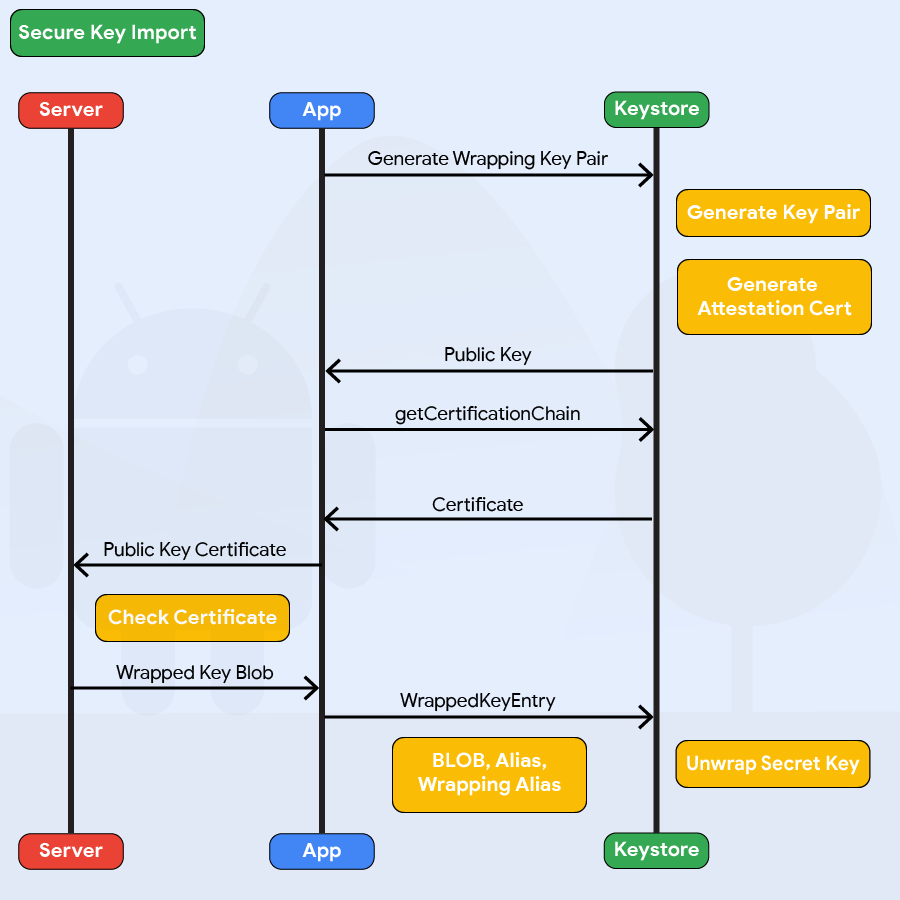

## Android 加密 APIs 接口

在本章节中 "[Cryptography for Mobile Apps](0x04g-Testing-Cryptography.md)", 我们将介绍`普通密码学的最佳实践`和`常见的移动软件缺陷`（缺陷是因为通过使用不正确的加密方式导致的）. 在本章节当中, 我们将更加详细的介绍 Android's 加密 APIs 接口功能. 我们将展示如何在源代码中识别这些 API 的使用，以及如何解释配置信息。在进行代码检查的时候，确保与本指南中提到的加密参数最佳实践进行对比.

### 测试 密码标准算法的配置 (MSTG-CRYPTO-2, MSTG-CRYPTO-3 and MSTG-CRYPTO-4)

#### 概述

Android 加密 APIs 接口是基于 Java 加密机构 及(JCA). JCA 将接口和执行分开,这样可以使用多个可执行的加密算法 [security providers](https://developer.android.com/reference/java/security/Provider.html "Android Security Providers"). 大多数的 JCA 接口 和 Java类 都定义在以下两个包中. `java.security.*` 和 `javax.crypto.*` . 此外, 还有特定于 Android 软件包的 `android.security.*` 和 `android.security.keystore.*`.

不同的Android 版本和 OEM 厂商所提供的加密算法列表不同. 某些供应商执行了老版本的已经被定义为容易受到攻击的算法. 所以, Android 应用不仅仅是选择正确的算法和提供适当的配置,在某种情况下也应该注意执行加密机制的强度.

你可以列出现有的加密提供选如下:

```Java 案例
StringBuilder builder = new StringBuilder();
for (Provider provider : Security.getProviders()) {
    builder.append("provider: ")
            .append(provider.getName())
            .append(" ")
            .append(provider.getVersion())
            .append("(")
            .append(provider.getInfo())
            .append(")\n");
}
String providers = builder.toString();
//现在将字符串显示在屏幕上或日志中以供调试。
```

下面你可以参考一个基于Android 4.4 (API 版本 19) 在Google 模拟器中运行的输出结果, 此结果已经修复过安全加密补丁包:

```text
provider: GmsCore_OpenSSL1.0 (Android's OpenSSL-backed security provider)
provider: AndroidOpenSSL1.0 (Android's OpenSSL-backed security provider)
provider: DRLCertFactory1.0 (ASN.1, DER, PkiPath, PKCS7)
provider: BC1.49 (BouncyCastle Security Provider v1.49)
provider: Crypto1.0 (HARMONY (SHA1 digest; SecureRandom; SHA1withDSA signature))
provider: HarmonyJSSE1.0 (Harmony JSSE Provider)
provider: AndroidKeyStore1.0 (Android AndroidKeyStore security provider)
```

对于某些只支持老版本的 Android 的应用, (e.g.: 只使用低于 Android 7.0 (API 版本 24)), 绑定一个最新的库可能是唯一的选择. Spongy Castle (重新包装版本的 Bouncy Castle) 是这些情况下最常见的选择. 重新封包是必要的,因为 Bouncy Castle 被包含在 Android SDK. 最新版本的 [Spongy Castle](https://rtyley.github.io/spongycastle/ "Spongy Castle") 修复了早期版本中可能遇到的问题 [Bouncy Castle](https://www.cvedetails.com/vulnerability-list/vendor_id-7637/Bouncycastle.html "CVE Details Bouncy Castle") 并且包含在 Android 系统中. 注意, 绑定了Android 的 Bouncy Castle 库通常不来自于 [legion of the Bouncy Castle](https://www.bouncycastle.org/java.html "Bouncy Castle in Java"). 最后:请记住，打包像 Spongy Castle 这样的大型库通常会导致一个多目录的Android应用程序。

针对于现代 API 版本的应用,经历了以下变化:

- 从 Android 7.0 (API 版本 24) 或者更高版本 [the Android Developer blog shows that](https://android-developers.googleblog.com/2016/06/security-crypto-provider-deprecated-in.html "Security provider Crypto deprecated in Andorid N"):
  - 建议停止使用特定的安全供应方式, 相反, 总是使用一个已经打了补丁的安全供应方式.
  - 对 `Crypto` 的支持已经被取消,并且强烈不建议使用.
  - 不在支持通过 `SHA1PRNG` 实现随机数字, 而是提供了一个实时的 `OpenSSLRandom` 实例.
- 从 Android 8.1 (API 版本 27) 或者更高 [Developer Documentation](https://developer.android.com/about/versions/oreo/android-8.1 "Cryptography updates") 显示:
  - Conscrypt, 被称为 `AndroidOpenSSL`, 是首选使用 Bouncy Castle 和新的实现方式 : `AlgorithmParameters:GCM` , `KeyGenerator:AES`, `KeyGenerator:DESEDE`, `KeyGenerator:HMACMD5`, `KeyGenerator:HMACSHA1`, `KeyGenerator:HMACSHA224`, `KeyGenerator:HMACSHA256`, `KeyGenerator:HMACSHA384`, `KeyGenerator:HMACSHA512`, `SecretKeyFactory:DESEDE`, 和 `Signature:NONEWITHECDSA`.
  - 你应该不在对 GCM 继续使用 `IvParameterSpec.class` , 而是使用 `GCMParameterSpec.class` 来替代.
  - Sockets 已经由 `OpenSSLSocketImpl` 衍生到 `ConscryptFileDescriptorSocket`, 和 `ConscryptEngineSocket`.
  - `SSLSession` 使用 null 参数给出一个 NullPointerException。
  - 您需要有足够大的数组作为输入字节来生成密钥，否则将抛出 InvalidKeySpecException 错误。
  - 如果一个 Socket 读取被中断, 你会得到一个 `SocketException`.
- 基于 Android 9 (API level 28) 并且更高的版本 [Android Developer Blog](https://android-developers.googleblog.com/2018/03/cryptography-changes-in-android-p.html "Cryptography Changes in Android P") 显示出更激进的变化:
  - 如果你仍然使用 `getInstance` 方法来 并且你的 API 版本低于 28, 你讲得到一个警告消息. 如果你的 Android 9 (API 版本 28) 或者更高, 你将得到一个错误消息.
  - `Crypto` 提供方式已经被移除. 调用会最终出现 `NoSuchProviderException` 的结果.

Android SDK 提供了指定安全密钥生成 和使用的机制. Android 6.0 (API 版本 23) 引入 `KeyGenParameterSpec` 类, 此类可以确保应用程序中正确的使用密钥.

以下是一个基于API版本 23+ 使用 AES/CBC/PKCS7Padding 的实例:

```Java 实例
String keyAlias = "MySecretKey";

KeyGenParameterSpec keyGenParameterSpec = new KeyGenParameterSpec.Builder(keyAlias,
        KeyProperties.PURPOSE_ENCRYPT | KeyProperties.PURPOSE_DECRYPT)
        .setBlockModes(KeyProperties.BLOCK_MODE_CBC)
        .setEncryptionPaddings(KeyProperties.ENCRYPTION_PADDING_PKCS7)
        .setRandomizedEncryptionRequired(true)
        .build();

KeyGenerator keyGenerator = KeyGenerator.getInstance(KeyProperties.KEY_ALGORITHM_AES,
        "AndroidKeyStore");
keyGenerator.init(keyGenParameterSpec);

SecretKey secretKey = keyGenerator.generateKey();
```

`KeyGenParameterSpec` 功能指定密钥可以用来加密 和 解密, 但是不能用作其他用途, 比如说签名 或者 校正. 而且更近一步的指定了block 模式 (CBC), padding (PKCS #7), 并明确指定随机加密的必要性. (机制是默认的). `"AndroidKeyStore"` 是加密服务提供者的名称. 这将自动确保密钥存储在 `AndroidKeyStore` 中,以利于密钥的保护.

GCM 是另一种 AES block 模式 与其他老的模式相比, 它提供了额外的安全优势. 除了加密方面更加安全意外, 它还提供了身份验证. 当使用CBC (和其他模式)的时候, 认证需要额外执行,通过使用 HMACs (具体参考 "[Tampering and Reverse Engineering on Android](0x05c-Reverse-Engineering-and-Tampering.md)" 章节). 注意 GCM 是唯一的AES 模式 [does not support paddings](https://developer.android.com/training/articles/keystore.html#SupportedCiphers "Supported Ciphers in AndroidKeyStore").

试图违反上述规范使用或生成的密钥,将导致安全异常错误。

下面是一个使用该密钥加密的例子:

```Java 实例
String AES_MODE = KeyProperties.KEY_ALGORITHM_AES
        + "/" + KeyProperties.BLOCK_MODE_CBC
        + "/" + KeyProperties.ENCRYPTION_PADDING_PKCS7;
KeyStore AndroidKeyStore = AndroidKeyStore.getInstance("AndroidKeyStore");

// byte[] input
Key key = AndroidKeyStore.getKey(keyAlias, null);

Cipher cipher = Cipher.getInstance(AES_MODE);
cipher.init(Cipher.ENCRYPT_MODE, key);

byte[] encryptedBytes = cipher.doFinal(input);
byte[] iv = cipher.getIV();
// save both the IV and the encryptedBytes
```

 IV (initialization vector) 和加密字节两者都需要保存; 否则无法解密. 

下面演示密码文件如何被解密. `input` 是加密后的字节数组 和 `iv` 初始化矢量, 加密步骤如下:

```Java
// byte[] input
// byte[] iv
Key key = AndroidKeyStore.getKey(AES_KEY_ALIAS, null);

Cipher cipher = Cipher.getInstance(AES_MODE);
IvParameterSpec params = new IvParameterSpec(iv);
cipher.init(Cipher.DECRYPT_MODE, key, params);

byte[] result = cipher.doFinal(input);
```

由于 IV 每次都是随机生成, 所以应该将其与密码文本 (`encryptedBytes`) 一起保存,以便以后对其进行解密操作. 

在 Android 6.0 (API 版本 23)之前, AES 密钥生成不被支持. 因此, 通过 `KeyPairGeneratorSpec` 许多执行方式通过使用 RSA 和 生成一个 公钥-私钥 密钥对用来做不对称加密 或者使用 `SecureRandom` 来生成 AES 密钥.

下面是一个利用 `KeyPairGenerator` 和 `KeyPairGeneratorSpec` 来创建 RSA 密钥对的实例:

```Java 实例
Date startDate = Calendar.getInstance().getTime();
Calendar endCalendar = Calendar.getInstance();
endCalendar.add(Calendar.YEAR, 1);
Date endDate = endCalendar.getTime();
KeyPairGeneratorSpec keyPairGeneratorSpec = new KeyPairGeneratorSpec.Builder(context)
        .setAlias(RSA_KEY_ALIAS)
        .setKeySize(4096)
        .setSubject(new X500Principal("CN=" + RSA_KEY_ALIAS))
        .setSerialNumber(BigInteger.ONE)
        .setStartDate(startDate)
        .setEndDate(endDate)
        .build();

KeyPairGenerator keyPairGenerator = KeyPairGenerator.getInstance("RSA",
        "AndroidKeyStore");
keyPairGenerator.initialize(keyPairGeneratorSpec);

KeyPair keyPair = keyPairGenerator.generateKeyPair();
```

此案例创建密钥大小为 4096比特 的RSA 密钥对.(i.e. 模数大小).

注意: 人们普遍错误的相信 NDK 应该用来隐藏加密操作和硬编码密钥生成. 然而, 使用这种机制并不有效. 攻击者仍然可以使用工具来查找所使用的机制, 并在内存当中转存密钥. 接下来, 控制流可以通过类似分析工具来分析: e.g. radare2 通过 Frida 的帮助来提取密钥, 详细请参考: r2frida (看章节 "[Disassembling Native Code](0x05c-Reverse-Engineering-and-Tampering.md#disassembling-native-code "Disassembling Native Code")", "[Memory Dump](0x05c-Reverse-Engineering-and-Tampering.md#memory-dump "Memory Dump")" 和 "[In-Memory Search](0x05c-Reverse-Engineering-and-Tampering.md#in-memory-search "In-Memory Search")" 在章节 "篡改 与 Android 逆向工程" 获取更多的细节). 从 Android 7.0 (API 版本 24) 更早, 私有 APIs 是不被准许使用的, 相反: 公用 APIs 被调用, 影响了隐藏它的有效性,相关描述参考 [Android Developers Blog](https://android-developers.googleblog.com/2016/06/android-changes-for-ndk-developers.html "Android changes for NDK developers")

#### 静态 分析

查找代码中密码参数的使用. 一些最常见使用的 类 和 接口 如下:

- `Cipher`
- `Mac`
- `MessageDigest`
- `Signature`
- `Key`, `PrivateKey`, `PublicKey`, `SecretKey`
- 还有另外一些存在于 `java.security.*` 和 `javax.crypto.*` 包中.

确保遵循了 "移动应用程序密码学" 章节中的最佳实践. 验证所有使用的密码算法的配置是否与以下最佳实践一致 [NIST](https://www.keylength.com/en/4/ "NIST recommendations - 2016") 和 [BSI](https://www.keylength.com/en/8/ "BSI recommendations - 2017"). 确保 `SHA1PRNG` 的算法不在使用, 因为它在密码上是不安全的.
最后, 确保密钥不是在本地代码中硬编码中, 并且在这个级别上没有使用不安全的机制.

### 测试 随机数生成 方法 (MSTG-CRYPTO-6)

#### 概述

密码学-加密需要安全的生成任意数字(PRNG). 标准 Java 类无法提供足够强度的任意数, 事实上,攻击者有猜到下一个任意数字的可能性, 最终使用此猜测结果来模拟其他用户或者访问铭感信息.

一般情况下, `SecureRandom` 应该被使用. 然而, 如果Android 版本低于 4.4 (API 版本 19), 额外的加固需要执行,为了绕过 Android 4.1-4.3 (API 版本 16-18) 中的故障, 细节参考: [failed to properly initialize the PRNG](https://android-developers.googleblog.com/2013/08/some-securerandom-thoughts.html "Some SecureRandom Thoughts").

大多数开发人员应该使用不带有任何参数的,默认的构造器来实例化 `SecureRandom` . 而其他的构造器用于更高级用途, 如果使用不当, 可能导致随机性和安全性的下降. PRNG 提供了默认 `SecureRandom` 使用 `/dev/urandom` 设备文件作为随机性数字的来源 [#nelenkov].

#### 静态 分析

识别所有关于随机生成数字的所有实例, 并且插在自定义或者已知不安全的 `java.util.Random` 类. 这个类生成相同的序列数字; 最终,导致数字的顺序可以被推测出来.

下面的样本源代码演示了一个弱的随机数字生成方式:

```Java 实例
import java.util.Random;
// ...

Random number = new Random(123L);
//...
for (int i = 0; i < 20; i++) {
  // 在 [0, 20] 中生成其他任意整数值
  int n = number.nextInt(21);
  System.out.println(n);
}
```

相反, 一种经过严格审核的算法应该被本领域中的专家考虑, 并且通过足够长度的种子,选择良好测试的实施方式.

识别所有 `SecureRandom` 中没有通过默认构造器创建的实例. 特定函数种子值会减少随机性. 推荐 [no-argument constructor of `SecureRandom`](https://www.securecoding.cert.org/confluence/display/java/MSC02-J.+Generate+strong+random+numbers "Generation of Strong Random Numbers") 使用系统特定的函数种子值来生成一个 128-byte-long 任意数字.

一般来说, 如果 PRNG 没有被宣传成为加密安全性 (e.g. `java.util.Random`), 则有可能是统计 PRNG 并且不应该在敏感内容中使用.
Pseudo-任意数字生成器 [can produce predictable numbers](https://www.securecoding.cert.org/confluence/display/java/MSC63-J.+Ensure+that+SecureRandom+is+properly+seeded "Proper seeding of SecureRandom") 如果生成器被知道,那么函数种子就能够被猜出. 对于生成 "足够安全的随机数字" , 128字节大小的函数种子是一个很好的起点.

以下源代码演示了一个安全的任意数字生成方式: 

```Java 实例
import java.security.SecureRandom;
import java.security.NoSuchAlgorithmException;
// ...

public static void main (String args[]) {
  SecureRandom number = new SecureRandom();
  // 生成 20 以内的任意整数 0..20
  for (int i = 0; i < 20; i++) {
    System.out.println(number.nextInt(21));
  }
}
```

#### 动态分析方式 (Dynamic Analysis)

一定攻击者知道应用使用了哪种 pseudo-任意数字生成器(PRNG), 它可以很轻易通过概念验证的方式来生成下一个随机数字.参考 [done for Java Random](https://franklinta.com/2014/08/31/predicting-the-next-math-random-in-java/ "Predicting the next Math.random() in Java"). 在非常弱的自定义随机生成器的情况下, 在使用非常弱的自定义任意数字方法的情况下,利用统计学可以观察到数字. 尽管推荐方法是远离反编译APK 文件和检查算法. (see Static Analysis).

如果你想测试你的任意数强度, 你可以尝试抓取大量的数字,通过 Burp's 工具 [sequencer](https://portswigger.net/burp/documentation/desktop/tools/sequencer "Burp's Sequencer") 来查看任意数字的强度性.

### 测试密钥管理 (MSTG-STORAGE-1, MSTG-CRYPTO-1 and MSTG-CRYPTO-5)

#### 概览

在本章节中，我们将会讨论加密密钥存储的不同方式，以及如何测试它们的安全性。我们将从最安全的方法来讨论，衍生到不太安全的，生成和存储密钥的方法。

最安全的处理密钥的方式是'永远不要将它们存储在设备上'。这意味着用户每次都要通过输入密码提示的方式来实现加密操作。虽然从用户体验角度来说，这不是一种理想的实现方式，但是它是处理关键密钥的最安全的方法。其原因是密钥的信息在使用的时候，只会在内存中的数组中找到。一旦密钥不再被需要的情况下， 内存数组将归零。这样尽可能的降低了攻击窗口. 没有密钥关键资料接触文件系统，也不会存储任何密码。但是，值得注意的是，不是所有的密码算法正确的清理它们的字节组数。例如，在 BouncyCastle 中的AES 密码并不总是清理最新的工作密钥。接下来，以 BigInteger 为基础的密钥 (e.g. 私有密钥) 无法从堆（heap）或者清零来移除密钥。最后, 小心处理清理密钥的情况。请参考章节 "[Data Storage on Android](0x05d-Testing-Data-Storage.md)" 如何确保密钥相关内容被清零.

对称加密密钥可以通过使用基于密码的密钥衍生函数来实现(PBKDF2). 这种加密协议的目的是生成安全的，不可篡改的密钥。下面的代码案例演示了“如何根据密码生成更强的加密密钥。” 

```JAVA 语言
public static SecretKey generateStrongAESKey(char[] password, int keyLength)
{
    //对象 和 变量的初始化 提供后续的调用
    int iterationCount = 10000;
    int saltLength     = keyLength / 8;
    SecureRandom random = new SecureRandom();

    //生成 盐 对象
    byte[] salt = new byte[saltLength];
    random.nextBytes(salt);

    KeySpec keySpec = new PBEKeySpec(password.toCharArray(), salt, iterationCount, keyLength);
    SecretKeyFactory keyFactory = SecretKeyFactory.getInstance("PBKDF2WithHmacSHA1");
    byte[] keyBytes = keyFactory.generateSecret(keySpec).getEncoded();
    return new SecretKeySpec(keyBytes, "AES");
}
```

上面的方法需要一组字符数组(byte[])，数组中包含了密码和所需要的密钥长度（以 ‘二进制’ 为长度）。例如，128 或者 256 位的AES密钥。我们通过PBKDF2算法，定义 10000 次的重复计数. 这个大大增加了暴力破解的攻击难度。我们定义了盐的大小长度，并且除以8来处理二进制到字节的转换。我们使用 `SecureRandom` 类来任意生成‘盐’对象。显然, 盐对象 将保持不变，以确保在每次密码替代的时候生成同样的加密密钥。值得注意是你可以通过 `SharedPreferences` 文件私密的存储‘盐’对象. 根据安全建议，盐对象应该被排出在Android备份机制中，来防止同步高风险的数据。获取更多的信息 "[Data Storage on Android](0x05d-Testing-Data-Storage.md)".
值得注意，如果你包括越狱设备，或者微打布丁的设备，或者补丁过的 (e.g. 重新打包) 应用视为堆数据的威胁, 那么最好使用 `AndroidKeystore` 中的密钥堆 盐对象进行加密. 然后，使用推荐的方法生成 以密码-为基础的加密密钥 (PBE) `PBKDF2WithHmacSHA1` 算法，支持版本从 Android 8.0 (API 等级 26). 在这个基础上, 最好使用 `PBKDF2withHmacSHA256`, 它将生成不同的密钥大小.

至此, 很明显的，经常提示用户输入密码并不适用于每个应用程序. 在这种情况下，请务必使用 [Android KeyStore API](https://developer.android.com/reference/java/security/KeyStore.html "Android AndroidKeyStore API"). 此 API 是专门为密钥素材提供安全存储而开发的。只有你的应用程序恶意访问自身的密钥。从 Android 6.0 (API 等级23)开始，AndroidKeyStore 被强制提供硬件支持，以防止指纹传感器的出现。 这意味着一个专属的加密芯片 或者 守信平台模块(TPM)将会用来保护密钥素材。

但是, 值得注意的是 `AndroidKeyStore` 的API在不同Android版本中发生来很大的变化。在早期的版本中, `AndroidKeyStore` API 只支持存储公共密钥/私有密钥/密钥对(e.g., RSA). 对称密钥从Android 6.0(API level 23)开始添加来支持. 因此，开发人员需要额外注意，通过不同Android API版本来实现对称密钥的安全存储。

为了在 Android 5.1 (API 版本 22) 或者更低的版本上实现安全存储 对称密钥，我们需要生成一个公密钥/私钥的密钥对. 我们使用公钥来加密对称密钥并且把私钥存储在文件 `AndroidKeyStore`中. 已经加密的对称密钥安全的存储在 `SharedPreferences`. 当我们需要对称密钥的时候，应用程序通过 `AndroidKeyStore` 中的私钥来解密对称密钥。

当密钥生成并且使用在 `AndroidKeyStore` 和 `KeyInfo.isinsideSecureHardware` 中，我们可以通过返回值 `true` 来确认, 由此我们可以判断，我们不能通过密钥dump的方式，或者监控加密操作过程来获取。 最终什么方式更加安全还具有争议: 使用 `PBKDF2withHmacSHA256` 生成密钥仍然可以通过可以访问内存中获取，或者使用 `AndroidKeyStore` 密钥可能永远不会进入内存。在 Android 9 (API 版本 28) 中，我们看到了而外的安全增强功能被实现，为了更好的把 TEE 从 `AndroidKeyStore` 区分， 这使得使用 `PBKDF2withHmacSHA256` 更加有利. 然而, 对于这个问题将来会进行更多的测试和调查。

#### 安全密钥导入到 Keystore

Android 9 (API 版本 28) 添加了导入安全密钥的能力，通过功能 `AndroidKeystore`. 首先 `AndroidKeystore` 通过 `PURPOSE_WRAP_KEY` 生成一对密钥，这对密钥的目的是为了保护导入到 `AndroidKeystore` 的密钥，并且通过认证证书被保护. 加密的密钥通过 `SecureKeyWrapper` 格式生成asn.1 编码消息，该格式还包含通过导入密钥的方式的描述。密钥在 特定设备的 `AndroidKeystore` 硬件中被解密，这样它们就不会以明文的形式出现在设备的主机内存当中。 



```JAVA 案例
KeyDescription ::= SEQUENCE {
    keyFormat INTEGER,
    authorizationList AuthorizationList
}

SecureKeyWrapper ::= SEQUENCE {
    wrapperFormatVersion INTEGER,
    encryptedTransportKey OCTET_STRING,
    initializationVector OCTET_STRING,
    keyDescription KeyDescription,
    secureKey OCTET_STRING,
    tag OCTET_STRING
}
```

上面的代码给出了在以 SecureKeyWrapper 格式生成加密密钥时需要设置的不同参数。查看 Android 文档 [`WrappedKeyEntry`](https://developer.android.com/reference/android/security/keystore/WrappedKeyEntry "WrappedKeyEntry") 获取更多的消息.

定义密钥描述授权列表时，以下参数将影响加密密钥的安全性:

- `algorithm` 该参数指使用密钥的加密算法。
- `keySize` 该参数指密钥大小，并以bit为单位，通过常规的方式来侧拉密钥算法。
- `digest` 该参数特指完整性算法 - 及通过使用密钥来进行签名和验证操作。

#### 密钥认证 (Key Attestation)

对于依赖于 Android Keystore 来实现重要业务运作的应用, 比如说 通过加密原语的多因素认证, 安全存储在客户端的敏感数据, 等等. Android 提供一个功能 [Key Attestation](https://developer.android.com/training/articles/security-key-attestation "Key Attestation") 有助于分析通过Android Keystore 管理的加密材料的安全性. 从 Android 8.0 (API 版本 26), 密钥认证机制在所有新设备中被强制执行 (Android 7.0 或者更高), 这些设备通过使用由 [Google hardware attestation root certificate](https://developer.android.com/training/articles/security-key-attestation#root_certificate "Google Hardware Attestation Root Certificate") 密钥认证签名和密钥认证过程进行验证.

在 密钥认证过程中, 我们可以指定密钥对的别名, 作为回应,获得一个证书链, 我们可以使用他来验证密钥对的属性. 如果 根 证书链是 [Google Hardware Attestation Root certificate](https://developer.android.com/training/articles/security-key-attestation#root_certificate "Google Hardware Attestation Root certificate") 和检查在硬件中相关密钥存储机制,确保设备支持硬件级别的密钥认证,密钥在Google认为安全的密钥库中. 或者, 如果认证链有任何其他根证书, 那么谷歌不会对硬件安全性做出任何声明. 

虽然密钥认证过程可以通过应用程序直接实现,但是出于安全的考虑,建议在服务器端实现它. 以下是安全实施密钥证明的高级指南:

- 服务器必须触发密钥认证流程 - 通过创建任意数字安全的使用 CSPRNG(Cryptographically Secure Random Number Generator) 并且应将其作为质问发送给用户.
- 客户端应该调用 `setAttestationChallenge` 来自服务器端的质问 API 并且, 使用 `KeyStore.getCertificateChain` 方法来检索认证证书链.
- 认证响应应该发送到服务器进行验证,并应执行以下检查来验证密钥认证响应:
  - 验证证书链, 直到根证书的完整性检查,列如有效性,完整性,和可信赖性.
  - 检查是否是否使用Google 认证根密钥对证书进行签名,这样使得认证过程称为受信的. 
  - 提取认证证书的扩展数据, 一般显示在证书链的第一个元素中,并执行以下检查: 
    - 验证认证质问拥有与服务器初始化认证流程相同的值.
    - 验证密钥认证响应中的签名.
    - Now check the security level of the Keymaster to determine if the device has secure key storage mechanism. Keymaster is a piece of software that runs in the security context and provides all the secure keystore operations. The security level will be one of `Software`, `TrustedEnvironment` or `StrongBox`.
    - Additionally, you can check the attestation security level which will be one of Software, TrustedEnvironment or StrongBox to check how the attestation certificate was generated. Also, some other checks pertaining to keys can be made such as purpose, access time, authentication requirement, etc. to verify the key attributes.

The typical example of Android Keystore attestation response looks like this:

```json
{
    "fmt": "android-key",
    "authData": "9569088f1ecee3232954035dbd10d7cae391305a2751b559bb8fd7cbb229bd...",
    "attStmt": {
        "alg": -7,
        "sig": "304402202ca7a8cfb6299c4a073e7e022c57082a46c657e9e53...",
        "x5c": [
            "308202ca30820270a003020102020101300a06082a8648ce3d040302308188310b30090603550406130...",
            "308202783082021ea00302010202021001300a06082a8648ce3d040302308198310b300906035504061...",
            "3082028b30820232a003020102020900a2059ed10e435b57300a06082a8648ce3d040302308198310b3..."
        ]
    }
}
```

In the above JSON snippet, the keys have the following meaning:
        `fmt`: Attestation statement format identifier
        `authData`: It denotes the authenticator data for the attestation
        `alg`: The algorithm that is used for the Signature
        `sig`: Signature
        `x5c`: Attestation certificate chain

Note: The `sig` is generated by concatenating `authData` and `clientDataHash` (challenge sent by the server) and signing through the credential private key using the `alg` signing algorithm and the same is verified at the server-side by using the public key in the first certificate.

For more understanding on the implementation guidelines, [Google Sample Code](https://github.com/googlesamples/android-key-attestation/blob/master/server/src/main/java/com/android/example/KeyAttestationExample.java "Google Sample Code For Android Key Attestation") can be referred.

For the security analysis perspective the analysts may perform the following checks for the secure implementation of Key Attestation:

- Check if the key attestation is totally implemented at the client-side. In such scenario, the same can be easily bypassed by tampering the application, method hooking, etc.
- Check if the server uses random challenge while initiating the key attestation. As failing to do that would lead to insecure implementation thus making it vulnerable to replay attacks. Also, checks pertaining to the randomness of the challenge should be performed.
- Check if the server verifies the integrity of key attestation response.
- Check if the server performs basic checks such as integrity verification, trust verification, validity, etc. on the certificates in the chain.

#### Decryption only on Unlocked Devices

For more security Android 9 (API level 28) introduces the `unlockedDeviceRequied` flag. By passing `true` to the `setUnlockedDeviceRequired` method the app prevents its keys stored in `AndroidKeystore` from being decrypted when the device is locked, and it requires the screen to be unlocked before allowing decryption.

#### StrongBox Hardware Security Module

Devices running Android 9 (API level 28) and higher can have a `StrongBox Keymaster`, an implementation of the Keymaster HAL that resides in a hardware security module which has its own CPU, Secure storage, a true random number generator and a mechanism to resist package tampering. To use this feature, `true` must be passed to the `setIsStrongBoxBacked` method in either the `KeyGenParameterSpec.Builder` class or the `KeyProtection.Builder` class when generating or importing keys using `AndroidKeystore`. To make sure that StrongBox is used during runtime check that `isInsideSecureHardware` returns `true` and that the system does not throw `StrongBoxUnavailableException` which get thrown if the StrongBox Keymaster isn't available for the given algorithm and key size associated with a key.

#### Key Use Authorizations

To mitigate unauthorized use of keys on the Android device, Android KeyStore lets apps specify authorized uses of their keys when generating or importing the keys. Once made, authorizations cannot be changed.

Another API offered by Android is the `KeyChain`, which provides access to private keys and their corresponding certificate chains in credential storage, which is often not used due to the interaction necessary and the shared nature of the Keychain. See the [Developer Documentation](https://developer.android.com/reference/android/security/KeyChain "Keychain") for more details.

A slightly less secure way of storing encryption keys, is in the SharedPreferences of Android. When [SharedPreferences](https://developer.android.com/reference/android/content/SharedPreferences.html "Android SharedPreference API") are initialized in [MODE_PRIVATE](https://developer.android.com/reference/android/content/Context.html#MODE_PRIVATE "MODE_PRIVATE"), the file is only readable by the application that created it. However, on rooted devices any other application with root access can simply read the SharedPreference file of other apps, it does not matter whether `MODE_PRIVATE` has been used or not. This is not the case for the AndroidKeyStore. Since AndroidKeyStore access is managed on kernel level, which needs considerably more work and skill to bypass without the AndroidKeyStore clearing or destroying the keys.

The last three options are to use hardcoded encryption keys in the source code, having a predictable key derivation function based on stable attributes, and storing generated keys in public places like `/sdcard/`. Obviously, hardcoded encryption keys are not the way to go. This means every instance of the application uses the same encryption key. An attacker needs only to do the work once, to extract the key from the source code - whether stored natively or in Java/Kotlin. Consequently, he can decrypt any other data that he can obtain which was encrypted by the application.
Next, when you have a predictable key derivation function based on identifiers which are accessible to other applications, the attacker only needs to find the KDF and apply it to the device in order to find the key. Lastly, storing encryption keys publicly also is highly discouraged as other applications can have permission to read the public partition and steal the keys.

#### Static Analysis

Locate uses of the cryptographic primitives in the code. Some of the most frequently used classes and interfaces:

- `Cipher`
- `Mac`
- `MessageDigest`
- `Signature`
- `AndroidKeyStore`
- `Key`, `PrivateKey`, `PublicKey`, `SecretKeySpec`, `KeyInfo`
- And a few others in the `java.security.*` and `javax.crypto.*` packages.

As an example we illustrate how to locate the use of a hardcoded encryption key. First disassemble the DEX bytecode to a collection of Smali bytecode files using ```Baksmali```.

```shell
$ baksmali d file.apk -o smali_output/
```

Now that we have a collection of Smali bytecode files, we can search the files for the usage of the ```SecretKeySpec``` class. We do this by simply recursively grepping on the Smali source code we just obtained. Please note that class descriptors in Smali start with `L` and end with `;`:

```shell
$ grep -r "Ljavax\crypto\spec\SecretKeySpec;"
```

This will highlight all the classes that use the `SecretKeySpec` class, we now examine all the highlighted files and trace which bytes are used to pass the key material. The figure below shows the result of performing this assessment on a production ready application. For sake of readability we have reverse engineered the DEX bytecode to Java code. We can clearly locate the use of a static encryption key that is hardcoded and initialized in the static byte array `Encrypt.keyBytes`.

.

When you have access to the source code, check at least for the following:

- Check which mechanism is used to store a key: prefer the `AndroidKeyStore` over all other solutions.
- Check if defense in depth mechanisms are used to ensure usage of a TEE. For instance: is temporal validity enforced? Is hardware security usage evaluated by the code? See the [KeyInfo documentation](https://developer.android.com/reference/android/security/keystore/KeyInfo "KeyInfo") for more details.
- In case of whitebox cryptography solutions: study their effectiveness or consult a specialist in that area.
- Take special care on verifying the purposes of the keys, for instance:
  - make sure that for asymmetric keys, the private key is exclusively used for signing and the public key is only used for encryption.
  - make sure that symmetric keys are not reused for multiple purposes. A new symmetric key should be generated if it's used in a different context.

#### Dynamic Analysis

Hook cryptographic methods and analyze the keys that are being used. Monitor file system access while cryptographic operations are being performed to assess where key material is written to or read from.

### References

- [#nelenkov] - N. Elenkov, Android Security Internals, No Starch Press, 2014, Chapter 5.

#### Cryptography references

- Android Developer blog: Changes for NDK Developers - <https://android-developers.googleblog.com/2016/06/android-changes-for-ndk-developers.html>
- Android Developer blog: Crypto Provider Deprecated - <https://android-developers.googleblog.com/2016/06/security-crypto-provider-deprecated-in.html>
- Android Developer blog: Cryptography Changes in Android P - <https://android-developers.googleblog.com/2018/03/cryptography-changes-in-android-p.html>
- Android Developer documentation - <https://developer.android.com/guide>
- BSI Recommendations - 2017 - <https://www.keylength.com/en/8/>
- Ida Pro - <https://www.hex-rays.com/products/ida/>
- Legion of the Bouncy Castle - <https://www.bouncycastle.org/java.html>
- NIST Key Length Recommendations - <https://www.keylength.com/en/4/>
- Security Providers -  <https://developer.android.com/reference/java/security/Provider.html>
- Spongy Castle  - <https://rtyley.github.io/spongycastle/>

#### SecureRandom references

- Burpproxy its Sequencer - <https://portswigger.net/burp/documentation/desktop/tools/sequencer>
- Proper Seeding of SecureRandom - <https://www.securecoding.cert.org/confluence/display/java/MSC63-J.+Ensure+that+SecureRandom+is+properly+seeded>

#### Testing Key Management references

- Android Keychain API - <https://developer.android.com/reference/android/security/KeyChain>
- Android KeyStore API - <https://developer.android.com/reference/java/security/KeyStore.html>
- Android Keystore system - <https://developer.android.com/training/articles/keystore#java>
- Android Pie features and APIs - <https://developer.android.com/about/versions/pie/android-9.0#secure-key-import>
- KeyInfo Documentation - <https://developer.android.com/reference/android/security/keystore/KeyInfo>
- SharedPreferences - <https://developer.android.com/reference/android/content/SharedPreferences.html>

#### Key Attestation References

- Android Key Attestation - <https://developer.android.com/training/articles/security-key-attestation>
- Attestation and Assertion - <https://developer.mozilla.org/en-US/docs/Web/API/Web_Authentication_API/Attestation_and_Assertion>
- FIDO Alliance TechNotes - <https://fidoalliance.org/fido-technotes-the-truth-about-attestation/>
- FIDO Alliance Whitepaper - <https://fidoalliance.org/wp-content/uploads/Hardware-backed_Keystore_White_Paper_June2018.pdf>
- Google Sample Codes - <https://github.com/googlesamples/android-key-attestation/tree/master/server>
- Verifying Android Key Attestation - <https://medium.com/@herrjemand/webauthn-fido2-verifying-android-keystore-attestation-4a8835b33e9d>
- W3C Android Key Attestation - <https://www.w3.org/TR/webauthn/#android-key-attestation>

##### OWASP Mobile Top 10 2016

- M5 - Insufficient Cryptography - <https://www.owasp.org/index.php/Mobile_Top_10_2016-M5-Insufficient_Cryptography>

##### OWASP MASVS

- MSTG-STORAGE-1: "System credential storage facilities are used appropriately to store sensitive data, such as user credentials or cryptographic keys."
- MSTG-CRYPTO-1: "The app does not rely on symmetric cryptography with hardcoded keys as a sole method of encryption."
- MSTG-CRYPTO-2: "The app uses proven implementations of cryptographic primitives."
- MSTG-CRYPTO-3: "The app uses cryptographic primitives that are appropriate for the particular use-case, configured with parameters that adhere to industry best practices."
- MSTG-CRYPTO-4: "The app does not use cryptographic protocols or algorithms that are widely considered depreciated for security purposes."
- MSTG-CRYPTO-5: "The app doesn't reuse the same cryptographic key for multiple purposes."
- MSTG-CRYPTO-6: "All random values are generated using a sufficiently secure random number generator."

##### CWE

- CWE-321 - Use of Hard-coded Cryptographic Key
- CWE-326 - Inadequate Encryption Strength
- CWE-330 - Use of Insufficiently Random Values
