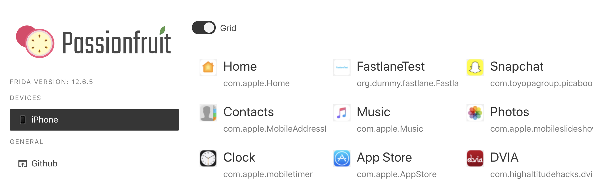
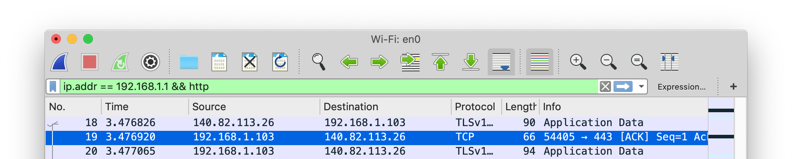

## iOS 基本安全性测试

在上一章中，我们提供了iOS平台的概述，并描述了iOS应用程序的结构。 在本章中，我们将介绍可用于测试iOS应用程序的安全漏洞的基本过程和技术。 这些基本过程是以下各章概述的测试用例的基础。

### iOS 测试设置

#### 主机设备

尽管您可以使用Linux或Windows机器进行测试，但是您会发现在这些平台上很多任务是困难的或不可能的。 此外，Xcode开发环境和iOS SDK仅适用于macOS。 这意味着您肯定要在macOS上进行源代码分析和调试（这也使黑盒测试更加容易）。

以下是最基本的iOS应用测试设置：

- 理想情况下，具有管理员权限的macOS计算机。
- 允许客户端到客户端流量的Wi-Fi网络。
- 至少一台越狱的iOS设备（所需的iOS版本）。
- Burp Suite或其他拦截代理工具。

##### 设置Xcode和命令行工具

Xcode是用于macOS的集成开发环境（IDE），其中包含用于开发用于macOS，iOS，watchOS和tvOS的软件的一组工具。您可以[从Apple官方网站免费下载Xcode](https://developer.apple.com/xcode/ide/ "Apple Xcode IDE"). Xcode将为您提供与iOS设备进行交互的不同工具和功能，这在渗透测试（例如分析日志或应用的侧载）期间可能会有所帮助。

所有开发工具已经包含在Xcode中，但是您的终端中不可用。为了使它们在系统范围内可用，建议安装命令行工具包。在测试iOS应用程序时，这将非常方便，因为您稍后将使用的某些工具（例如，异议）也依赖于此软件包的可用性。您可以[从Apple官方网站下载](https://developer.apple.com/download/more/ "Apple iOS SDK") 或直接从终端安装它：

```shell
$ xcode-select --install
```

#### 测试装置

##### 获取iOS设备的UDID

The UDID is a 40-digit unique sequence of letters and numbers to identify an iOS device. You can find the [UDID of your iOS device via iTunes](http://www.iclarified.com/52179/how-to-find-your-iphones-udid "How to Find Your iPhone's UDID"), by selecting your device and clicking on "Serial Number" in the summary tab. When clicking on this you will iterate through different meta-data of the iOS device including its UDID.

It is also possible to get the UDID via various command line tools while the device is attached via USB:

- By using the [I/O Registry Explorer](https://developer.apple.com/library/archive/documentation/DeviceDrivers/Conceptual/IOKitFundamentals/TheRegistry/TheRegistry.html "I/O Registry Explorer") tool `ioreg` (macOS only):

    ```sh
    $ ioreg -p IOUSB -l | grep "USB Serial"
    |         "USB Serial Number" = "9e8ada44246cee813e2f8c1407520bf2f84849ec"
    ```

- By using [ideviceinstaller](https://github.com/libimobiledevice/ideviceinstaller) (macOS / Linux):

    ```sh
    $ brew install ideviceinstaller
    $ idevice_id -l
    316f01bd160932d2bf2f95f1f142bc29b1c62dbc
    ```

- By using the system_profiler (macOS only):

    ```sh
    $ system_profiler SPUSBDataType | sed -n -e '/iPad/,/Serial/p;/iPhone/,/Serial/p;/iPod/,/Serial/p' | grep "Serial Number:"
    2019-09-08 10:18:03.920 system_profiler[13251:1050356] SPUSBDevice: IOCreatePlugInInterfaceForService failed 0xe00002be
                Serial Number: 64655621de6ef5e56a874d63f1e1bdd14f7103b1
    ```

- By using instruments (macOS only):

    ```sh
    $ instruments -s devices
    ```

##### 在真实设备上测试（越狱）

您应该拥有一部越狱的 iPhone 或 iPad 才能运行测试。 这些设备允许root访问和工具安装，从而使安全测试过程更加简单。 如果您无权使用越狱设备，则可以应用本章后面介绍的解决方法，但要准备好接受更艰难的体验。

##### 在 iOS 模拟器上测试

与完全模拟实际Android设备的硬件的Android仿真器不同，iOS SDK仿真器提供了iOS设备的更高级别的 *仿真*。 最重要的是，仿真器二进制文件被编译为x86代码而不是ARM代码。 为真实设备编译的应用程序无法运行，从而使模拟器无法用于黑匣子分析和逆向工程。

##### 获取特权访问

通常将iOS越狱与Android扎根相比，但过程实际上是完全不同的。 为了解释差异，我们将首先回顾Android上“roting”和“flashing”的概念。

- **Rooting**: 这通常涉及在系统上安装`su`二进制文件，或用有根的自定义ROM替换整个系统。只要引导加载程序是可访问的，就不需要利用漏洞来获得root访问权限。
- **Flashing custom ROMs**: 解锁引导加载程序后，这可让您替换设备上正在运行的操作系统。引导加载程序可能需要利用漏洞才能解锁。

在iOS设备上，无法刷新自定义ROM，因为iOS引导加载程序仅允许引导和刷新Apple签名的图像。这就是为什么即使未通过Apple签署也无法安装正式的iOS映像的原因，并且这使得iOS降级仅在以前的iOS版本仍被签署的情况下才可能进行。

越狱的目的是禁用iOS保护（尤其是Apple的代码签名机制），以便可以在设备上运行任意未签名的代码。 “越狱”一词是通俗地说是自动禁用过程的多合一工具。

Cydia是由Jay Freeman（又名“ saurik”）为越狱设备开发的替代应用程序商店。它提供了图形用户界面和高级打包工具（APT）的版本。您可以通过Cydia轻松访问许多“未经批准”的应用程序包。大多数越狱都会自动安装Cydia。

由于iOS 11越狱引入了[Sileo](https://cydia-app.com/sileo/ "Sileo"), 这是针对iOS设备的新越狱应用程序商店。 iOS 12的越狱[Chimera](https://chimera.sh/ "Chimera") 也依靠Sileo作为程序包管理器。

为给定版本的iOS开发越狱并不容易。作为安全测试人员，您很可能希望使用公开可用的越狱工具。尽管如此，我们还是建议您研究用于越狱各种版本的iOS的技术-您将遇到许多有趣的漏洞，并了解许多有关OS内部的知识。例如，适用于iOS 9.x的Pangu9 [至少利用了五个漏洞](https://www.theiphonewiki.com/wiki/Jailbreak_Exploits "Jailbreak Exploits"), 其中包括免后使用内核错误（CVE-2015- 6794）和“照片”应用中的任意文件系统访问漏洞（CVE-2015-7037）。

某些应用尝试检测运行它们的iOS设备是否已越狱。这是因为越狱会停用某些iOS的默认安全机制。但是，有几种方法可以解决这些检测问题，我们将在 “iOS上的逆向工程和篡改” 和 “在iOS上测试反反向防御” 一章中介绍它们。

###### 越狱的好处

最终用户经常越狱设备以调整iOS系统的外观，添加新功能以及从非官方应用程序商店安装第三方应用程序。但是，对于安全测试人员来说，越狱iOS设备会带来更多好处。它们包括但不限于以下内容：

- 根访问文件系统。
- 可以执行未经Apple签名的应用程序（包括许多安全工具）。
- 无限制的调试和动态分析。
- 访问运行时 Objective-C 或 Swift。

###### 越狱类型

有 *系留*，*半系留*，*半系留* 和 *未系留*越狱。

- 捆绑越狱不会在重新启动后持续存在，因此要重新应用越狱，需要在每次重新启动期间将设备连接（捆绑）到计算机上。如果未连接计算机，则设备可能根本不会重启。

- 除非重新启动期间将设备连接到计算机，否则无法重新应用半栓式越狱。该设备还可以自行启动进入非越狱模式。

- 半捆绑式越狱允许设备自行启动，但是用于禁用代码签名的内核补丁（或用户域修改）不会自动应用。用户必须通过启动应用程序或访问网站来重新越狱设备（不需要连接到计算机，因此不受限制）。

- 不受限制的越狱是最终用户的最普遍选择，因为仅需应用一次，此后设备将被永久越狱。

###### 注意事项 和 注意事项

越狱越狱的iOS设备变得越来越复杂，因为Apple不断强化系统并修补已利用的漏洞。越狱已成为一个非常时间敏感的过程，因为苹果公司在发布修复程序后相对较快地停止对这些易受攻击的版本进行签名（除非越狱得益于基于硬件的漏洞，例如[limera1n漏洞利用](https://www.theiphonewiki.com/wiki/Limera1n "limera1n exploit") 的BootROM。这意味着一旦Apple停止对固件进行签名，便无法降级到特定的iOS版本。

如果您拥有用于安全测试的越狱设备，请保持其原样，除非您100％确信在升级到最新的iOS版本后可以将其重新越狱。考虑获得一个（或多个）备用设备（将在每个主要的iOS版本中更新），并等待越狱公开发布。公开发布越狱文件后，Apple通常会很快发布补丁程序，因此您只有几天的时间（如果它仍由Apple签署）降级到受影响的iOS版本并应用越狱程序。

iOS升级基于质询-响应过程（因此产生了命名为SHSH的斑点）。仅当对挑战的响应由Apple签署时，设备才允许安装操作系统。这就是研究人员所说的“签名窗口”，这就是为什么您不能简单地存储通过iTunes下载的OTA固件包并在需要时将其加载到设备上的原因。在进行较小的iOS升级期间，Apple可能会同时签署两个版本（最新版本和先前的iOS版本）。这是唯一可以降级iOS设备的情况。您可以检查当前的签名窗口并从[IPSW下载网站](https://ipsw.me "IPSW Downloads")下载OTA固件。.

###### 使用哪个越狱工具

不同的iOS版本需要不同的越狱技术。 [确定您的iOS版本是否可以使用公共越狱](https://canijailbreak.com/ "Can I Jailbreak"). 提防假冒工具和间谍软件，它们通常藏在与越狱组/作者的名称相似的域名后面。

越狱的Pangu 1.3.0适用于运行iOS 9.0的64位设备。如果您的设备运行的iOS版本没有越狱功能，那么如果您降级或升级到目标_jailbreakable_ iOS版本（通过IPSW下载和iTunes），仍然可以越狱该设备。但是，如果所需的iOS版本不再由Apple签名，则可能无法实现。

iOS越狱场景发展如此之快，以至于很难提供最新的说明。但是，我们可以为您指出一些目前可靠的资源。

- [我可以越狱吗？](https://canijailbreak.com/ "Can I Jailbreak?")
- [The iPhone Wiki](https://www.theiphonewiki.com/ "The iPhone Wiki")
- [Redmond Pie](https://www.redmondpie.com/ "Redmone Pie")
- [Reddit 越狱](https://www.reddit.com/r/jailbreak/ "Reddit Jailbreak")

> 请注意，您对设备进行的任何修改均需自担风险。通常情况下，越狱是安全的，但事情可能会出错，并且最终可能会使设备变砖。除您以外的任何一方均不承担任何责任。

#### 推荐工具 - iOS设备

可以使用Cydia安装越狱设备上的许多工具，该设备是iOS设备的非官方AppStore，可让您管理存储库。在Cydia中，您应该通过导航到 **Sources** -> **Edit**，然后单击左上方的 **Add**，添加（如果默认情况下尚未完成）以下存储库：

- <http://apt.thebigboss.org/repofiles/cydia/>: 最受欢迎的存储库之一是BigBoss，其中包含各种软件包，例如BigBoss推荐工具软件包。
- <http://repo.hackyouriphone.org>: 添加HackYouriPhone存储库以获取AppSync包。
- <https://build.frida.re>: 通过将存储库添加到Cydia来安装Frida。
- <http://mobiletools.mwrinfosecurity.com/cydia/>: Needle代理也有自己的存储库，应添加。
- <https://repo.chariz.io>: 在iOS 11上管理越狱时很有用。
- <https://apt.bingner.com/>: Elucubratus是另一个存储库，它具有一些不错的安静工具，当您使用Unc0ver在iOS 12上安装Cydia时，将安装该存储库。
- <https://coolstar.org/publicrepo/>: 对于Needle，您应该考虑添加Coolstar存储库以安装Darwin CC Tools。

> 如果您使用的是Sileo App Store，请记住，Seoo兼容层在Cydia和Sileo之间共享您的源，但是，Cydia无法删除在Sileo中添加的源，并且[Sileo无法删除在Sileo中添加的源。 Cydia](https://www.idownloadblog.com/2019/01/11/install-sileo-package-manager-on-unc0ver-jailbreak/ "You can now install the Sileo package manager on the unc0ver jailbreak"). 当您尝试删除来源时，请记住这一点。

After adding all the suggested repositories above you can install the following useful packages from Cydia to get started:

在添加完上面所有建议的存储库后，您可以从Cydia安装以下有用的软件包以开始使用：

- adv-cmds：高级命令行，其中包括诸如finger，fingerd，last，lsvfs，md和ps之类的工具。
- AppList：允许开发人员查询已安装应用程序的列表，并基于该列表提供首选项窗格。
- Apt：高级软件包工具，您可以使用它来管理已安装的软件包，类似于DPKG，但以更友好的方式。这使您可以从Cydia存储库安装，卸载，升级和降级软件包。来自Elucubratus。
- AppSync Unified：允许您同步和安装未签名的iOS应用程序。
- BigBoss推荐工具：安装了许多用于安全测试的有用命令行工具，包括iOS缺少的标准Unix实用程序，包括wget，unrar，less和sqlite3客户端。
- Class-dump：一种命令行工具，用于检查存储在Mach-O文件中的Objective-C运行时信息，并使用类接口生成头文件。
- Class-dump-Z：一种命令行工具，用于检查存储在Mach-O文件中的Swift运行时信息，并使用类接口生成头文件。 Cydia无法提供此功能，因此请参考[安装步骤](https://iosgods.com/topic/6706-how-to-install-class-dump-z-on-any-64bit-idevices-how-to-use-it/ "Class-dump-Z installation steps") 以使class-dump-z在您的iOS设备上运行。
- Clutch: 用于解密应用程序可执行文件。
- Cycript: 是一种内联的，优化的，Cycript-to-JavaScript编译器和即时模式控制台环境，可以将其注入正在运行的进程中（与Substrate相关）。
- Cydia Substrate：通过动态应用程序操纵或自省使开发第三方iOS附加组件更加容易的平台。
- cURL：是众所周知的http客户端，可用于将软件包更快地下载到设备。例如，当您需要在设备上安装不同版本的Frida-server时，这可能是一个很大的帮助。
- Darwin CC Tools：从Coolstar存储库中安装Darwin CC Tools，作为对Needle的依赖。
- IPA安装程序控制台：用于从命令行安装IPA应用程序包的工具。安装完两个命令后，`installipa`和`ipainstaller`将是相同的。
- Frida：可用于动态检测的应用程序。请注意，Frida随着时间的推移更改了其API的实现，这意味着某些脚本可能仅适用于Frida-server的特定版本（这也迫使您在macOS上更新/降级该版本）。建议运行通过APT或Cydia安装的Frida Server。之后，可以按照[此Github问题](https://github.com/AloneMonkey/frida-ios-dump/issues/65#issuecomment-490790602 "Resolving Frida version").
- Grep：方便的工具来过滤线。
- Gzip：一种著名的ZIP实用程序。
- Needle-Agent：此代理是Needle框架的一部分，需要安装在iOS设备上。
- Open for iOS 11：启用Needle Agent功能所需的工具。
- PreferenceLoader：一种基于底物的实用程序，允许开发人员将条目添加到“设置”应用程序，类似于App Store应用程序使用的SettingsBundles。
- SOcket CAT：可用于连接套接字以读取和写入消息的实用程序。 如果您想在iOS 12设备上跟踪系统日志，这可能会派上用场。

除了Cydia之外，还有其他几种可用的开源工具，应该安装它们，例如[Introspy](https://github.com/iSECPartners/Introspy-iOS "Introspy-iOS").

除了Cydia之外，您还可以使用ssh进入iOS设备，并且可以直接通过apt-get安装软件包，例如adv-cmds。

```shell
$ apt-get update
$ apt-get install adv-cmds
```

##### iDevice USB上的小提示

在iOS设备上，处于锁定状态1小时后，您无法再进行数据连接，除非由于iOS 11.4.1引入的USB受限模式而再次将其解锁

#### 推荐工具 - 主机

为了分析iOS应用，您应该在主机上安装以下工具。 在整个指南中，我们将参考它们。 请注意，其中很多将需要macOS才能运行，因此在处理iOS应用程序时，通常建议使用macOS计算机。

##### Burp Suite

[Burp Suite](https://portswigger.net/burp "Burp Suite") 是一个拦截代理，可用于分析应用程序和与其交谈的API之间的流量。 有关如何在iOS环境中进行设置的详细说明，请参阅下面的“ [设置拦截代理](#setting-up-an-interception-proxy "Setting up an Interception Proxy")" 一节。

##### Frida

[Frida](https://www.frida.re "Frida") 是一个免费的开源动态代码检测工具包，可让您在本地应用程序中执行JavaScript片段。它已在一般测试指南的“ [篡改和逆向工程](0x04c-Tampering-and-Reverse-Engineering.md#frida "Frida")" 一章中进行介绍。 Frida在以下几个部分和章节中使用。

Frida通过支持与Objective-C运行时进行交互[ObjC API](https://www.frida.re/docs/javascript-api/#objc "Frida - ObjC API"). 您将能够在流程及其本机库中挂钩并调用Objective-C和本机函数。您的JavaScript代码段具有对内存的完全访问权限，例如读取和/或写入任何结构化数据。

以下是Frida API提供的一些任务，这些任务在iOS上是相关的或专有的：

- 实例化Objective-C对象并调用静态和非静态类方法（[ObjC API](https://www.frida.re/docs/javascript-api/#objc "Frida - ObjC API")).
- 跟踪Objective-C方法调用和/或替换其实现 ([Interceptor API](https://www.frida.re/docs/javascript-api/#interceptor "Frida - Interceptor API")).
- 通过扫描堆来枚举特定类的实时实例 ([ObjC API](https://www.frida.re/docs/javascript-api/#objc "Frida - ObjC API")).
- 扫描进程内存中是否出现字符串 ([Memory API](https://www.frida.re/docs/javascript-api/#memory "Frida - Memory API")).
- 拦截本机函数调用以在函数入口和出口运行您自己的代码 ([Interceptor API](https://www.frida.re/docs/javascript-api/#interceptor "Frida - Interceptor API")).

请记住，在iOS上，您还可以从安装Frida时使用的内置工具中受益，其中包括Frida CLI（`frida`），`frida-ps`，`frida-ls-devices`和`frida-trace` ，仅举几例。

iOS上有一个值得强调的`frida-trace`功能：使用`-m`标志和通配符来跟踪Objective-C API。例如，跟踪名称中包括“ HTTP”并且属于名称以“ NSURL”开头的任何类的所有方法都非常容易运行：

```bash
$ frida-trace -U YourApp -m "*[NSURL* *HTTP*]"
```

为了快速入门，您可以阅读[iOS示例](https://www.frida.re/docs/examples/ios/ "Frida iOS examples").

##### Frida-ios-dump

[Frida-ios-dump](https://github.com/AloneMonkey/frida-ios-dump "frida-ios-dump") 允许您从iOS设备提取解密的IPA。有关如何使用它的详细说明，请参考[“使用Frida-ios-dump”](#frida-ios-dump "Using Frida-ios-dump") 

##### IDB

[IDB](https://www.idbtool.com "IDBTool") 是一个开源工具，可简化iOS应用安全评估和研究的一些常见任务。文档中提供了[IDB的安装说明](https://www.idbtool.com/installation/ "IDB Installation").

单击IDB中的 **连接到USB / SSH设备**按钮，然后在启动IDB的终端中键入SSH密码。现在，您可以单击**选择应用程序...**，选择要分析的应用程序并获取该应用程序的初始元信息。现在，您可以进行二进制分析，查看本地存储并调查IPC。

请记住，选择应用程序后，IDB可能会不稳定并崩溃。

##### ios-deploy

使用 [ios-deploy](https://github.com/ios-control/ios-deploy "ios-deploy") 您可以从命令行安装和调试iOS应用，而无需使用Xcode。可以通过brew在macOS上安装它：

```shell
$ brew install ios-deploy
```

有关用法，请参阅下面的 "ios部署" 部分，该部分是"[安装应用程序](#installing-apps "Installing Apps")"的一部分.

##### iFunBox

[iFunBox](http://www.i-funbox.com/ "iFunBox") 是支持iOS的文件和应用程序管理工具。您可以[在Windows和macOS上下载它](http://www.i-funbox.com/en_download.html "iFunBox").

它具有多种功能，例如应用程序安装，无需越狱即可访问应用程序沙箱等。

##### Keychain-Dumper

[Keychain-dumper](https://github.com/mechanico/Keychain-Dumper "keychain-dumper") 是一种iOS工具，用于在iOS设备越狱后检查哪些密钥链项目可供攻击者使用。请参阅“ [Keychain-dumper（Jailbroken）](#keychain-dumper-jailbroken "Keychain-dumper (Jailbroken)")" 部分以获取有关如何使用它的详细说明。

##### 移动安全框架 - MobSF

[MobSF](https://github.com/MobSF/Mobile-Security-Framework-MobSF "MobSF") 是一种自动化的多合一移动应用程序渗透测试框架，还支持iOS IPA文件。 启动MobSF的最简单方法是通过Docker。

```shell
$ docker pull opensecurity/mobile-security-framework-mobsf
$ docker run -it -p 8000:8000 opensecurity/mobile-security-framework-mobsf:latest
```

或通过运行以下命令在主机上本地安装并启动它：

```shell
# Setup
git clone https://github.com/MobSF/Mobile-Security-Framework-MobSF.git
cd Mobile-Security-Framework-MobSF
./setup.sh # For Linux and Mac
setup.bat # For Windows

# Installation process
./run.sh # For Linux and Mac
run.bat # For Windows
```

> 通过在MacOS主机上本地运行它，您将受益于稍微更好的类转储输出。

MobSF启动并运行后，可以通过导航到<http://127.0.0.1:8000>在浏览器中打开它。只需将要分析的IPA拖到上载区域，MobSF将开始工作。

在完成MobSF的分析之后，您将获得一页一页的所有已执行测试的概述。该页面分为多个部分，在应用程序的受攻击面上提供了一些初步提示。


显示以下内容：

- 有关该应用及其二进制文件的基本信息。
- 一些选项：
  - 查看“ Info.plist”文件。
  - 查看应用程序二进制文件中包含的字符串。
  - 如果应用是用Objective-C编写的，请下载类转储；如果使用Swift编写，则无法创建类转储。
- 列出从“ Info.plist”中提取的所有用途字符串，这些字符串会提示应用程序的权限。
- 将列出App Transport Security（ATS）配置中的例外情况。
- 简要的二进制分析，显示是否激活了免费的二进制安全功能，例如如果二进制文件使用了禁止的API。
- 应用程序二进制文件使用的库列表，以及未压缩IPA中所有文件的列表。

> 与Android用例相反，MobSF不为iOS应用程序提供任何动态分析功能。

有关更多详细信息，请参见[MobSF文档](https://github.com/MobSF/Mobile-Security-Framework-MobSF/wiki/1.-Documentation "MobSF documentation") for more details.

##### Needle

[Needle](https://github.com/mwrlabs/needle "Needle") 是一个多合一的iOS安全评估框架，您可以将其作为iOS的“ Metasploit”进行比较。 Github Wiki中的[安装指南](https://github.com/mwrlabs/needle/wiki/Installation-Guide "Needle Installation Guide") 包含有关如何准备Kali Linux或macOS以及如何进行安装的所有信息以及在您的iOS设备上安装Needle Agent。

还请确保您从Coolstar存储库安装了Darwin CC Tools，以使Needle在iOS 12上运行。

为了配置Needle，请阅读[快速入门指南](https://github.com/mwrlabs/needle/wiki/Quick-Start-Guide "Quick Start Guide") 并阅读[Needle命令参考](https://github.com/mwrlabs/needle/wiki/Command-Reference "Command Reference of Needle") 来熟悉它。

> 在的iOS设备上运行时，Needle存在已知问题[与Chimera越狱](https://github.com/mwrlabs/needle/issues/273 "Many modules dont work with chimera jail break"). 相反，应该使用unc0ver越狱。

##### Objection

[Objection](https://github.com/sensepost/objection "Objection on GitHub") 是“由Frida提供支持的运行时移动探索工具包”。它的主要目标是通过直观的界面允许对非root用户或越狱设备进行安全测试。

Objection通过为您提供通过重新打包将Frida小工具轻松地注入到应用程序中的工具来实现此目标。这样，您可以通过侧面加载重新打包的应用程序将其部署到非越狱设备，并按照上一节中的说明与应用程序进行交互。

但是，Objection还提供了REPL，它允许您与应用程序进行交互，从而使您能够执行应用程序可以执行的任何操作。可以在项目的主页上找到Objection功能的完整列表，但是这里有一些有趣的功能：

- 重新打包应用程序以包括Frida小工具
- 为流行方法禁用SSL固定
- 访问应用程序存储以下载或上传文件
- 执行自定义Frida脚本
- 转存KeyChain数据
- 读取plist文件

通过使用异议的REPL中的命令，可以轻松完成所有这些任务以及更多任务。例如，您可以通过运行以下命令获取应用程序中使用的类，类的功能或有关应用程序包的信息：

```shell
OWASP.iGoat-Swift on (iPhone: 12.0) [usb] # ios hooking list classes
OWASP.iGoat-Swift on (iPhone: 12.0) [usb] # ios hooking list class_methods <ClassName>
OWASP.iGoat-Swift on (iPhone: 12.0) [usb] # ios bundles list_bundles
```

在非越狱设备上执行高级动态分析的能力是使异议变得异常有用的功能之一。 始终无法越狱最新版本的iOS，或者您的应用程序可能具有先进的越狱检测机制。 此外，随附的Frida脚本使快速分析应用程序或解决基本安全控制变得非常容易。

最后，如果您确实可以使用越狱设备，则Objection可以直接连接到正在运行的Frida服务器，以提供其所有功能，而无需重新包装应用程序。

###### 安装 Objection

可以按照所述通过pip安装Objection [Objection's Wiki](https://github.com/sensepost/objection/wiki/Installation "Objection Wiki - Installation").

```shell

$ pip3 install objection

```

如果您的设备已越狱，则现在可以与该设备上运行的任何应用程序进行交互，并且可以跳到下面的“使用异议”部分。

但是，如果要在非越狱设备上进行测试，则首先需要在应用程序中包括Frida小工具。 [Objection Wiki](https://github.com/sensepost/objection/wiki/Patching-iOS-Applications "Patching iOS Applications") 详细描述了所需的步骤，但是在进行了正确的准备后，您将能够 通过调用异议命令来修补IPA：

```shell
$ objection patchipa --source my-app.ipa --codesign-signature 0C2E8200Dxxxx
```

最后，该应用程序需要加载并在启用调试通信的情况下运行。 可以在[Objection Wiki](https://github.com/sensepost/objection/wiki/Running-Patched-iOS-Applications "Running Patched iOS Applications"), 上找到详细步骤，但是对于macOS用户，可以轻松完成此操作 通过使用ios-deploy：

```shell
$ ios-deploy --bundle Payload/my-app.app -W -d
```

###### 使用 Objection

启动Objection取决于您是否已修补IPA或使用的是运行Frida服务器的越狱设备。 为了运行修补的IPA，Objection将自动找到所有连接的设备并搜索可收听的frida小工具。 但是，在使用frida-server时，您需要明确告诉frida-server您要分析哪个应用程序。

```shell
# Connecting to a patched IPA
$ objection explore

# Using frida-ps to get the correct application name
$ frida-ps -Ua | grep -i Telegram
983  Telegram

# Connecting to the Telegram app through Frida-server
$ objection --gadget="Telegram" explore
```

进入Objection REPL后，您可以执行任何可用的命令。 以下是一些最有用的概述：

```shell
# Show the different storage locations belonging to the app
$ env

# Disable popular ssl pinning methods
$ ios sslpinning disable

# Dump the Keychain
$ ios keychain dump

# Dump the Keychain, including access modifiers. The result will be written to the host in myfile.json
$ ios keychain dump --json <myfile.json>

# Show the content of a plist file
$ ios plist cat <myfile.plist>

```

有关使用Objection REPL的更多信息，请参见[Objection Wiki](https://github.com/sensepost/objection/wiki/Using-objection "Using Objection")

##### Passionfruit

[Passionfruit](https://github.com/chaitin/passionfruit/ "Passionfruit") 是一个iOS应用程序黑箱评估工具，它使用iOS设备上的Frida服务器，并通过基于Vue.js的GUI可视化许多标准应用程序数据。 可以使用npm安装。

```shell
$ npm install -g passionfruit
$ passionfruit
listening on http://localhost:31337
```

当您执行命令`passionfruit`时，将在端口31337上启动本地服务器。将已越狱的设备与正在运行的Frida服务器连接，或将已重新打包应用程序（包括Frida）的未越狱的设备通过USB连接到macOS设备。 单击`iPhone`图标后，您将获得所有已安装应用程序的概述：



借助Passionfruit，可以探索有关iOS应用程序的各种信息。 选择iOS应用后，您可以执行许多任务，例如：

- 获取有关二进制文件的信息
- 查看应用程序使用的文件夹和文件并下载
- 检查Info.plist
- 获取iOS设备上显示的应用程序屏幕的UI Dump
- 列出应用程序加载的模块
- 转储类名称
- 转储钥匙串物品
- 访问NSLog跟踪

##### Radare2

[Radare2](https://github.com/radare/radare2 "Radare2") 是用于反向工程和分析二进制文件的完整框架。可以在GitHub存储库中找到安装说明。要了解有关radare2的更多信息，您可能需要阅读[官方radare2书](https://radare.gitbooks.io/radare2book/content/ "Radare2 book").

##### TablePlus

[TablePlus](https://tableplus.io/ "TablePlus") 是Windows和macOS检查Sqlite等数据库文件的工具。在从iOS设备转储数据库文件并使用GUI工具分析它们的内容时，这在iOS参与期间非常有用。

### 基本测试操作

#### 访问设备 Shell

测试应用程序时，您要做的最常见的事情之一就是访问设备Shell。在本节中，我们将介绍如何通过USB电缆 或者（不带USB电缆）从主机远程访问iOS Shell，以及如何从设备本身本地访问iOS Shell。

##### 远程 Shell

与Android相比，您可以使用adb工具轻松访问设备外壳，而在iOS上，您只能选择通过SSH访问远程外壳。这也意味着您的iOS设备必须越狱才能从主机连接到其外壳。对于本节，我们假设您已正确越狱了设备，并按照“获取特权访问”中的说明安装了Cydia（请参见上面的屏幕截图）或Sileo。在本指南的其余部分中，我们将引用Cydia，但Sileo中应提供相同的软件包。


为了启用SSH访问iOS设备，您可以安装OpenSSH软件包。 安装完成后，请确保将两个设备都连接到同一个Wi-Fi网络，并记下设备IP地址，您可以在“设置”->“ Wi-Fi”菜单中找到该IP地址，然后在您网络的信息图标上点击一次 连接到。

现在，您可以通过运行`ssh root @ <device_ip_address>`来访问远程设备的外壳，它将以root用户身份登录：

```shell
$ ssh root@192.168.197.234
root@192.168.197.234's password:
iPhone:~ root#
```

按Control + D或键入`exit`退出。

通过SSH访问iOS设备时，请注意以下事项：

- 默认用户为 `root`和`mobile`。
- 两者的默认密码均为`alpine`。

> 请记住，要同时更改root用户和mobile用户的默认密码，因为同一网络上的任何人都可以找到您设备的IP地址并通过众所周知的默认密码进行连接，这将使他们可以root用户访问您的设备 。

如果您忘记了密码并想将其重置为默认的`alpine`:

1. 在越狱的iOS设备上编辑文件`/ private / etc / master.password`（使用设备上的外壳程序，如下所示）
2. 找到以下行：

   ```shell
    root:xxxxxxxxx:0:0::0:0:System Administrator:/var/root:/bin/sh
    mobile:xxxxxxxxx:501:501::0:0:Mobile User:/var/mobile:/bin/sh
   ```

3. 将 `xxxxxxxxx` 更改为 `/smx7MYTQIi2M` (这是哈希密码 `alpine`)
4. 保存并退出

###### 通过SSH穿越USB连接到设备

在真正的黑匣子测试期间，可能无法使用可靠的Wi-Fi连接。 在这种情况下，您可以使用[usbmuxd](https://github.com/libimobiledevice/usbmuxd "usbmuxd") 通过USB连接到设备的SSH服务器。

是一个套接字守护程序，用于监视USB iPhone连接。 您可以使用它将移动设备的localhost侦听套接字映射到主机上的TCP端口。 这使您可以方便地通过SSH进入您的iOS设备，而无需设置实际的网络连接。 当usbmuxd检测到以正常模式运行的iPhone时，它会连接到手机并开始中继通过 `/var/run/usbmuxd`接收到的请求。

通过安装和启动iproxy将macOS连接到iOS设备：

```shell
$ brew install libimobiledevice
$ iproxy 2222 22
waiting for connection
```

上面的命令将iOS设备上的端口`22`映射到本地主机上的端口2222。 在新的终端窗口中使用以下命令，您可以连接到设备：

```shell
$ ssh -p 2222 root@localhost
root@localhost's password:
iPhone:~ root#
```

您还可以通过[Needle](https://labs.mwrinfosecurity.com/blog/needle-how-to/ "Needle")连接到iPhone的USB。

##### 设备上的 Shell 应用程序

尽管与远程外壳程序相比，通常使用设备上外壳程序（终端仿真器）可能很繁琐，但在例如网络问题或检查某些配置的情况下，调试起来很方便。例如，您可以为此通过Cydia安装[NewTerm 2](https://repo.chariz.io/package/ws.hbang.newterm2/ "NewTerm 2") （它在以下位置支持iOS 6.0至12.1.2）：撰写本文时）

此外，*出于安全原因*，有一些越狱措施明确禁止传入的SSH。在这些情况下，拥有设备上的外壳应用程序非常方便，您可以使用该应用程序先使用反向外壳将SSH从设备中抽出，然后再从您的主机连接到它。

通过运行命令`ssh -R <remote_port>：localhost：22 <username> @ <host_computer_ip>`，可以通过SSH打开反向Shell。

在设备上的Shell应用程序上，运行以下命令，并在系统询问时输入主机的`mstg`用户的密码：

```shell
ssh -R 2222:localhost:22 mstg@192.168.197.235
```

在您的主机上运行以下命令，并在询问时输入iOS设备的 `root` 用户的密码：

```shell
$ ssh -p 2222 root@localhost
```

#### 主机设备数据传输

在各种情况下，您可能需要将数据从iOS设备或应用程序数据沙箱传输到工作站，反之亦然。下一节将向您展示如何实现这一目标的不同方法。

##### 通过SSH和SCP复制应用程序数据文件

众所周知，应用程序中的文件存储在Data目录中。现在，您只需使用`tar`归档数据目录，然后使用`scp`将其从设备中拉出：

```shell
iPhone:~ root# tar czvf /tmp/data.tgz /private/var/mobile/Containers/Data/Application/8C8E7EB0-BC9B-435B-8EF8-8F5560EB0693
iPhone:~ root# exit
$ scp -P 2222 root@localhost:/tmp/data.tgz .
```

##### Passionfruit

启动Passionfruit后，您可以选择要进行测试的应用程序。有多种功能可用，其中一种称为`文件`。选择它时，您将获得应用程序沙箱目录的列表。


在目录中导航并选择文件时，将显示一个弹出窗口，并以十六进制或文本形式显示数据。关闭此弹出窗口时，您可以使用该文件的各种选项，包括：

- 文字检视器
- SQLite查看器
- 图像浏览器
- Plist查看器
- 下载


##### Objection

当您开始运行Objection时，您会在Bundle目录中找到提示。

```shell
org.owasp.MSTG on (iPhone: 10.3.3) [usb] # pwd print
Current directory: /var/containers/Bundle/Application/DABF849D-493E-464C-B66B-B8B6C53A4E76/org.owasp.MSTG.app
```

使用`env`命令来获取应用程序的目录并导航到Documents目录。

```shell
org.owasp.MSTG on (iPhone: 10.3.3) [usb] # cd /var/mobile/Containers/Data/Application/72C7AAFB-1D75-4FBA-9D83-D8B4A2D44133/Documents
/var/mobile/Containers/Data/Application/72C7AAFB-1D75-4FBA-9D83-D8B4A2D44133/Documents
```

使用命令`文件下载<文件名>`，您可以将文件从iOS设备下载到工作站，然后可以对其进行分析。

```shell
org.owasp.MSTG on (iPhone: 10.3.3) [usb] # file download .com.apple.mobile_container_manager.metadata.plist
Downloading /var/mobile/Containers/Data/Application/72C7AAFB-1D75-4FBA-9D83-D8B4A2D44133/.com.apple.mobile_container_manager.metadata.plist to .com.apple.mobile_container_manager.metadata.plist
Streaming file from device...
Writing bytes to destination...
Successfully downloaded /var/mobile/Containers/Data/Application/72C7AAFB-1D75-4FBA-9D83-D8B4A2D44133/.com.apple.mobile_container_manager.metadata.plist to .com.apple.mobile_container_manager.metadata.plist
```

您也可以使用`file upload <local_file_path>`将文件上传到iOS设备

#### 获取和提取应用程序

##### 从OTA分发链接获取IPA文件

在开发过程中，有时会通过无线（OTA）分发将应用程序提供给测试人员。在这种情况下，您将收到一个itms-services链接，例如：

```http
itms-services://?action=download-manifest&url=https://s3-ap-southeast-1.amazonaws.com/test-uat/manifest.plist
```

您可以使用[ITMS服务资产下载器](https://www.npmjs.com/package/itms-services "ITMS services asset downloader") 工具从OTA分发URL下载IPA。 通过npm安装：

```shell
$ npm install -g itms-services
```

使用以下命令在本地保存IPA文件：

```shell
# itms-services -u "itms-services://?action=download-manifest&url=https://s3-ap-southeast-1.amazonaws.com/test-uat/manifest.plist" -o - > out.ipa
```

##### 获取应用程序二进制文件

1. 从IPA:

   如果您拥有IPA（可能包括已解密的应用程序二进制文件），请将其解压缩，即可开始使用。应用程序二进制文件位于主捆绑目录（.app）中，例如有效负载/电报X.app/电报X。有关提取属性列表的详细信息，请参见以下小节。

    > 在macOS的Finder上，通过右键单击.app目录并选择“显示软件包内容”来打开它们。在终端上，您可以将它们`cd`到其中。

2. 从越狱设备中：

    如果您没有原始IPA，则需要一个越狱设备（例如通过App Store安装该应用程序）。安装完成后，您需要从内存中提取应用程序二进制文件并重建IPA文件。由于DRM，文件存储在iOS设备上时会被加密，因此简单地从捆绑软件中提取二进制文件（通过SSH或Objection）将不会成功。下面显示了Telegram应用程序上正在运行的class-dump的输出，该输出直接从iPhone的安装目录中提取：

```shell
$ class-dump Telegram
//
//     Generated by class-dump 3.5 (64 bit) (Debug version compiled Jun  9 2015 22:53:21).
//
//     class-dump is Copyright (C) 1997-1998, 2000-2001, 2004-2014 by Steve Nygard.
//

#pragma mark -

//
// File: Telegram
// UUID: EAF90234-1538-38CF-85B2-91A84068E904
//
//                           Arch: arm64
//                 Source version: 0.0.0.0.0
//            Minimum iOS version: 8.0.0
//                    SDK version: 12.1.0
//
// Objective-C Garbage Collection: Unsupported
//
//                       Run path: @executable_path/Frameworks
//                               = /Frameworks
//         This file is encrypted:
//                                   cryptid: 0x00000001
//                                  cryptoff: 0x00004000
//                                 cryptsize: 0x000fc000
//
```

为了检索未加密的版本，我们可以使用[frida-ios-dump](https://github.com/AloneMonkey/frida-ios-dump "frida-ios-dump") 或 [Clutch](https://github.com/KJCracks/Clutch "Clutch"). 当应用程序在设备上运行时，两者都会从内存中提取未加密的版本。 根据您的iOS版本和越狱方法的不同，Clutch和Frida的稳定性可能会有所不同，因此有多种提取二进制文件的方法很有用。 通常，所有低于12的iOS版本均应与Clutch一起使用，而iOS 12+应与frida-ios-dump或Clutch的修改版一起使用，如稍后所述。

###### Using Clutch

按照 Clutch GitHub页面上的说明构建Clutch之后，将其通过SCP推送到iOS设备。使用-i标志运行Clutch以列出所有已安装的应用程序：

```shell
root# ./Clutch -i
2019-06-04 20:16:57.807 Clutch[2449:440427] command: Prints installed applications
Installed apps:
...
5:   Telegram Messenger <ph.telegra.Telegraph>
...
```

获得捆绑包标识符后，可以使用Clutch创建IPA：

```shell
root# ./Clutch -d ph.telegra.Telegraph
2019-06-04 20:19:28.460 Clutch[2450:440574] command: Dump specified bundleID into .ipa file
ph.telegra.Telegraph contains watchOS 2 compatible application. It's not possible to dump watchOS 2 apps with Clutch (null) at this moment.
Zipping Telegram.app
2019-06-04 20:19:29.825 clutch[2465:440618] command: Only dump binary files from specified bundleID
...
Successfully dumped framework TelegramUI!
Zipping WebP.framework
Zipping NotificationContent.appex
Zipping NotificationService.appex
Zipping Share.appex
Zipping SiriIntents.appex
Zipping Widget.appex
DONE: /private/var/mobile/Documents/Dumped/ph.telegra.Telegraph-iOS9.0-(Clutch-(null)).ipa
Finished dumping ph.telegra.Telegraph in 20.5 seconds
```

将IPA文件复制到主机系统并将其解压缩后，您可以看到现在可以通过class-dump解析Telegram应用程序，表明不再加密：

```shell

$ class-dump Telegram
...
//
//     Generated by class-dump 3.5 (64 bit) (Debug version compiled Jun  9 2015 22:53:21).
//
//     class-dump is Copyright (C) 1997-1998, 2000-2001, 2004-2014 by Steve Nygard.
//

#pragma mark Blocks

typedef void (^CDUnknownBlockType)(void); // return type and parameters are unknown

#pragma mark Named Structures

struct CGPoint {
    double _field1;
    double _field2;
};
...

```

注意：在iOS 12上使用Clutch时，请检查[Clutch Github第228期](https://github.com/KJCracks/Clutch/issues/228 "Getting Clutch to run on iOS 12")

###### 使用 Frida-ios-dump

[Frida-ios-dump](https://github.com/AloneMonkey/frida-ios-dump "Frida-ios-dump") 是一个Python脚本，可帮助您从iOS设备中检索iOS应用程序的解密版本 。 它同时支持Python 2和Python 3，并且要求Frida在iOS设备上运行（无论是否已破解）。 该工具使用Frida的 [Memory API](https://www.frida.re/docs/javascript-api/#memory "Frida Memory API") 转储正在运行的应用程序的内存并重新创建IPA文件。 由于代码是从内存中提取的，因此会自动解密。

首先，请确保在使用iProxy时，将`dump.py`中的配置设置为端口2222的localhost或要从中转储二进制文件的设备的实际IP地址和端口。 接下来，将`dump.py`中的默认用户名（`User ='root'`）和密码（`Password ='alpine`）更改为您使用的用户名。

现在，您可以安全地使用该工具来枚举已安装的应用程序：

```shell
$ python dump.py -l
 PID  Name             Identifier
----  ---------------  -------------------------------------
 860  Cydia            com.saurik.Cydia
1130  Settings         com.apple.Preferences
 685  Mail             com.apple.mobilemail
 834  Telegram         ph.telegra.Telegraph
   -  Stocks           com.apple.stocks
   ...
```

您可以转储列出的二进制文件之一：

```shell
$ python dump.py ph.telegra.Telegraph

Start the target app ph.telegra.Telegraph
Dumping Telegram to /var/folders/qw/gz47_8_n6xx1c_lwq7pq5k040000gn/T
[frida-ios-dump]: HockeySDK.framework has been loaded.
[frida-ios-dump]: Load Postbox.framework success.
[frida-ios-dump]: libswiftContacts.dylib has been dlopen.
...
start dump /private/var/containers/Bundle/Application/14002D30-B113-4FDF-BD25-1BF740383149/Telegram.app/Frameworks/libswiftsimd.dylib
libswiftsimd.dylib.fid: 100%|██████████| 343k/343k [00:00<00:00, 1.54MB/s]
start dump /private/var/containers/Bundle/Application/14002D30-B113-4FDF-BD25-1BF740383149/Telegram.app/Frameworks/libswiftCoreData.dylib
libswiftCoreData.dylib.fid: 100%|██████████| 82.5k/82.5k [00:00<00:00, 477kB/s]
5.m4a: 80.9MB [00:14, 5.85MB/s]
0.00B [00:00, ?B/s]Generating "Telegram.ipa"
```

此后，将在当前目录中创建`Telegram.ipa`文件。 您可以通过删除应用并重新安装来验证转储是否成功（例如，使用`ios-deploy -b Telegram.ipa`）。 请注意，这仅适用于越狱设备，否则签名将无效。

#### 安装应用程序

在不使用Apple的App Store的情况下安装应用程序时，这称为侧载。有多种侧面加载方式，如下所述。然后，在iOS设备上，实际的安装过程由installd守护进程处理，该守护进程将解压缩并安装该应用程序。要集成应用程序服务或将其安装在iOS设备上，必须使用Apple发行的证书对所有应用程序进行签名。这意味着仅在成功进行代码签名验证之后才能安装该应用程序。但是，在越狱的手机上，您可以使用Cydia商店中提供的软件包 [AppSync](http://repo.hackyouriphone.org/appsyncunified "AppSync"), 规避此安全功能。它包含许多有用的应用程序，这些应用程序利用越狱提供的root特权执行高级功能。 AppSync是一项已安装补丁的调整，允许安装假签名的IPA软件包。

存在将IPA软件包安装到iOS设备上的不同方法，下面将详细介绍。

> 请注意，自iTunes 12.7起，无法再使用iTunes安装应用程序。

##### Cydia Impactor

可用于Windows，macOS和Linux的一种工具是 [Cydia Impactor](http://www.cydiaimpactor.com/ "Cydia Impactor"). 该工具最初是为越狱iPhone而创建的，但已被重写以通过侧面加载将IPA软件包签名并安装到iOS设备。该工具甚至可以用于将APK文件安装到Android设备。 [可在此处找到分步指南和故障排除步骤](https://yalujailbreak.net/how-to-use-cydia-impactor/ "How to use Cydia Impactor").

##### libimobiledevice

在Linux以及macOS上，您也可以使用[libimobiledevice](https://www.libimobiledevice.org/ "libimobiledevice"), 跨平台软件协议库以及用于与iOS设备进行本机通信的一组工具。 这使您可以通过执行ideviceinstaller通过USB连接安装应用程序。 该连接是通过USB多路复用守护程序[usbmuxd](https://www.theiphonewiki.com/wiki/Usbmux "Usbmux"), 现的，该守护程序通过USB提供了TCP隧道。

libimobiledevice的软件包将在您的Linux软件包管理器中提供。 在macOS上，您可以通过brew安装libimobiledevice：

```shell
$ brew install libimobiledevice
```

安装后，您会使用几个新的命令行工具，例如“ ideviceinfo”，“ ideviceinstaller”或“ idevicedebug”。

```shell
# The following command will show detailed information about the iOS device connected via USB.
$ ideviceinfo
# The following command will install the IPA to your iOS device.
$ ideviceinstaller -i iGoat-Swift_v1.0-frida-codesigned.ipa
WARNING: could not locate iTunesMetadata.plist in archive!
WARNING: could not locate Payload/iGoat-Swift.app/SC_Info/iGoat-Swift.sinf in archive!
Copying 'iGoat-Swift_v1.0-frida-codesigned.ipa' to device... DONE.
Installing 'OWASP.iGoat-Swift'
Install: CreatingStagingDirectory (5%)
Install: ExtractingPackage (15%)
Install: InspectingPackage (20%)
Install: TakingInstallLock (20%)
Install: PreflightingApplication (30%)
Install: InstallingEmbeddedProfile (30%)
Install: VerifyingApplication (40%)
Install: CreatingContainer (50%)
Install: InstallingApplication (60%)
Install: PostflightingApplication (70%)
Install: SandboxingApplication (80%)
Install: GeneratingApplicationMap (90%)
Install: Complete
# The following command will start the app in debug mode, by providing the bundle name. The bundle name can be found in the previous command after "Installing".
$ idevicedebug -d run OWASP.iGoat-Swift
```

##### ipainstaller

也可以通过命令行使用 [ipainstaller](https://github.com/autopear/ipainstaller "IPA Installer")将IPA直接安装在iOS设备上。 将文件复制到设备上（例如通过scp）后，可以使用IPA的文件名执行ipainstaller：

```shell
$ ipainstaller App_name.ipa
```

##### ios-deploy

在macOS上，可以在命令行上使用一个名为 [ios-deploy](https://github.com/ios-control/ios-deploy "ios-deploy"), 的工具，以允许从以下位置安装和调试iOS应用 命令行。 可以通过brew安装：

```shell
$ brew install ios-deploy
```

安装后，进入要安装的IPA的目录并解压缩，因为ios-deploy使用捆绑包安装了应用程序。

```shell
$ unzip Name.ipa
$ ios-deploy --bundle 'Payload/Name.app' -W -d -v
```

在将应用程序安装到iOS设备上之后，您只需添加-m标志即可直接启动它，而无需重新安装应用程序即可直接开始调试。

```shell
$ ios-deploy --bundle 'Payload/Name.app' -W -d -v -m
```

##### Xcode

通过执行以下步骤，也可以使用Xcode IDE安装iOS应用程序：

1. 启动Xcode
2. 选择**窗口/设备和模拟器**
3. 选择已连接的iOS设备，然后单击**已安装的应用程序** 中的 **+** 标志。

##### Allow Application Installation on a Non-iPad Device

Sometimes an application can require to be used on an iPad device. If you only have iPhone or iPod touch devices then you can force the application to accept to be installed and used on these kinds of devices. You can do this by changing the value of the property **UIDeviceFamily** to the value **1** in the **Info.plist** file.

```xml
<?xml version="1.0" encoding="UTF-8"?>
<!DOCTYPE plist PUBLIC "-//Apple//DTD PLIST 1.0//EN" "http://www.apple.com/DTDs/PropertyList-1.0.dtd">
<plist version="1.0">
<dict>

  <key>UIDeviceFamily</key>
  <array>
    <integer>1</integer>
  </array>

</dict>
</plist>  
```

重要的是要注意，更改此值将破坏IPA文件的原始签名，因此在更新之后，您需要重新签名IPA，以便将其安装在尚未禁用签名验证的设备上。

如果您的iPhone或iPod较旧，而该应用程序需要特定于现代iPad的功能，则此绕过可能不起作用。

属性 [UIDeviceFamily](https://developer.apple.com/library/archive/documentation/General/Reference/InfoPlistKeyReference/Articles/iPhoneOSKeys.html#//apple_ref/doc/uid/TP40009252-SW11 "UIDeviceFamily property") 可以在Apple Developer文档中找到。

#### 信息收集

分析应用程序时的基本步骤之一是信息收集。这可以通过检查工作站上的应用程序包来完成，也可以通过访问设备上的应用程序数据来远程完成。在随后的章节中，您会发现更多高级技术，但现在，我们将重点介绍以下基础知识：获取所有已安装应用程序的列表，浏览应用程序包以及访问设备本身上的应用程序数据目录。这应该为您提供有关应用程序的全部内容的上下文，而无需进行反向工程或执行更高级的分析。我们将回答以下问题：

- 包中包含哪些文件？
- 该应用程序使用哪些框架？
- 该应用程序需要哪些功能？
- 该应用向用户请求哪些权限？出于什么原因？
- 该应用程序允许任何不安全的连接吗？
- 该应用在安装时会创建任何新文件吗？

##### 列出已安装的应用程序

定位到设备上安装的应用程序时，首先必须找出要分析的应用程序的正确捆绑标识符。您可以使用`frida-ps -Uai`来获取已连接的USB设备（`-U`）当前安装的所有应用程序（`-i`）：

```bash
$ frida-ps -Uai
 PID  Name                 Identifier
----  -------------------  -----------------------------------------
6847  Calendar             com.apple.mobilecal
6815  Mail                 com.apple.mobilemail
   -  App Store            com.apple.AppStore
   -  Apple Store          com.apple.store.Jolly
   -  Calculator           com.apple.calculator
   -  Camera               com.apple.camera
   -  iGoat-Swift          OWASP.iGoat-Swift
```

它还显示了其中哪些正在运行。 记下`Identifier`(捆绑标识符) 和PID（如果有），因为以后需要它们。

您还可以直接打开 passionfruit，选择iOS设备后，您将获得已安装应用程序的列表。


##### 探索应用程序包

收集了要定位的应用程序的程序包名称后，就需要开始收集有关它的信息。 首先，按照“基本测试操作-获取和提取应用程序”中的说明检索IPA。

您可以使用标准的`unzip`或任何其他ZIP实用程序将IPA解压缩。 在内部，您会找到一个`Payload`文件夹，其中包含所谓的应用程序捆绑包（.app）。 以下是以下输出中的示例，请注意，为了更好的可读性和概述性，将其截断了：

```shell
$ ls -1 Payload/iGoat-Swift.app
rutger.html
mansi.html
splash.html
about.html

LICENSE.txt
Sentinel.txt
README.txt

URLSchemeAttackExerciseVC.nib
CutAndPasteExerciseVC.nib
RandomKeyGenerationExerciseVC.nib
KeychainExerciseVC.nib
CoreData.momd
archived-expanded-entitlements.xcent
SVProgressHUD.bundle

Base.lproj
Assets.car
PkgInfo
_CodeSignature
AppIcon60x60@3x.png

Frameworks

embedded.mobileprovision

Credentials.plist
Assets.plist
Info.plist

iGoat-Swift
```

最相关的项目是：

- `Info.plist`包含应用程序的配置信息，例如其捆绑软件ID，版本号和显示名称。
- `_CodeSignature /`包含一个plist文件，该文件具有对捆绑软件中所有文件的签名。
- `Frameworks /`包含应用程序本机库，如.dylib或.framework文件。
- `PlugIns /`可能包含作为.appex文件的应用程序扩展名（示例中不存在）。
- `iGoat-Swift`是包含应用程序代码的应用程序二进制文件。 其名称与捆绑包的名称减去.app扩展名相同。
- 各种资源，例如图像/图标，`*。nib文件`（存储iOS应用程序的用户界面），本地化内容（<language> .lproj），文本文件，音频文件等。

###### Info.plist文件

信息属性列表或“ Info.plist”（按惯例命名）是iOS应用程序的主要信息来源。 它由一个结构化文件组成，该文件包含键值对，这些键值对描述了有关应用程序的基本配置信息。 实际上，所有捆绑的可执行文件（应用程序扩展，框架和应用程序）都应具有“ Info.plist”文件。 您可以在[Apple Developer文档](https://developer.apple.com/documentation/bundleresources/information_property_list?language=objc "Information Property List")中找到所有可能的键。

该文件可能采用XML或二进制（bplist）格式。 您可以使用一个简单的命令将其转换为XML格式：

- 在具有`plutil`的macOS上，这是macOS 10.2及更高版本的本地提供的工具（当前尚无官方在线文档）：

  ```bash
  $ plutil -convert xml1 Info.plist
  ```

- 在 Linux:

  ```bash
  $ apt install libplist-utils
  $ plistutil -i Info.plist -o Info_xml.plist
  ```

这是一些信息和相应关键字的非详尽列表，您可以通过仅检查文件或使用`grep -i <keyword> Info.plist`轻松在“ Info.plist”文件中进行搜索：

- 应用权限用途字符串：`UsageDescription`（请参阅“ iOS平台API”）
- 自定义URL方案：CFBundleURLTypes（请参阅“ iOS平台API”）
- 导出/导入的*自定义文档类型*：`UTExportedTypeDeclarations` /`UTImportedTypeDeclarations`（请参阅“ iOS平台API”）
- 应用传输安全性（ATS）配置：`NSAppTransportSecurity`（请参阅“ iOS网络API”）

请参考上述章节，以了解有关如何测试这些要点的更多信息。

###### App Binary

iOS应用二进制文件是胖二进制文件（它们可以部署在所有32位和64位设备上）。 与Android（实际上可以将应用程序二进制文件反编译为Java代码）相比，iOS应用程序二进制文件只能反汇编。

有关更多详细信息，请参阅“在iOS上进行逆向工程和篡改”一章。

###### 原生库

iOS原生库称为框架。

您可以通过单击“模块”轻松地从Passionfruit中可视化它们：


并获得更详细的视图，包括它们的导入/导出


它们位于IPA的`Frameworks`文件夹中，您也可以从终端检查它们：

```shell
$ ls -1 Frameworks/
Realm.framework
libswiftCore.dylib
libswiftCoreData.dylib
libswiftCoreFoundation.dylib
```

或有objection 的设备（当然还有SSH）：

```shell
OWASP.iGoat-Swift on (iPhone: 11.1.2) [usb] # ls
NSFileType      Perms  NSFileProtection    ...  Name
------------  -------  ------------------  ...  ----------------------------
Directory         493  None                ...  Realm.framework
Regular           420  None                ...  libswiftCore.dylib
Regular           420  None                ...  libswiftCoreData.dylib
Regular           420  None                ...  libswiftCoreFoundation.dylib
...
```

请注意，这可能不是应用程序正在使用的本机代码元素的完整列表，因为其中一些可能是源代码的一部分，这意味着它们将在应用程序二进制文件中进行编译，因此无法作为独立的库或框架找到 在`框架`文件夹中。

目前，除非您开始对它们进行反向工程，否则您将获得有关框架的所有信息。 请参阅“ iOS上的篡改和反向工程”一章，以获取有关如何反向工程框架的更多信息。

###### 其他应用程序资源

通常值得一看的是，您可能会在IPA内的应用程序捆绑包（.app）中找到其余资源和文件，因为有时它们包含加密数据库，证书等其他信息。


##### 访问应用程序数据目录

安装该应用程序后，将有更多信息可供探索。让我们简要介绍一下iOS应用程序上的应用程序文件夹结构，以了解哪些数据存储在何处。下图显示了应用程序文件夹的结构：


在iOS上，系统应用程序位于/应用程序目录中，而用户安装的应用程序位于/ private / var / containers /下。但是，仅通过导航文件系统来找到正确的文件夹并不是一件容易的事，因为每个应用程序都会为其目录名称分配一个随机的128位UUID（通用唯一标识符）。

为了轻松获取用户安装的应用程序的安装目录信息，您可以按照以下方法进行操作：

连接到设备上的终端并运行命令 `ipainstaller` ([IPA Installer Console](https://cydia.saurik.com/package/com.autopear.installipa "IPA Installer Console")) 如下所示：

```shell
iPhone:~ root# ipainstaller -l
...
OWASP.iGoat-Swift

iPhone:~ root# ipainstaller -i OWASP.iGoat-Swift
...
Bundle: /private/var/containers/Bundle/Application/3ADAF47D-A734-49FA-B274-FBCA66589E67
Application: /private/var/containers/Bundle/Application/3ADAF47D-A734-49FA-B274-FBCA66589E67/iGoat-Swift.app
Data: /private/var/mobile/Containers/Data/Application/8C8E7EB0-BC9B-435B-8EF8-8F5560EB0693
```

使用objection的命令 `env` 还将向您显示该应用程序的所有目录信息。 通过Objection连接到应用程序的描述 "[推荐工具 - Objection](#using-objection "Recommended Tools - Objection")".

```shell
OWASP.iGoat-Swift on (iPhone: 11.1.2) [usb] # env

Name               Path
-----------------  -------------------------------------------------------------------------------------------
BundlePath         /var/containers/Bundle/Application/3ADAF47D-A734-49FA-B274-FBCA66589E67/iGoat-Swift.app
CachesDirectory    /var/mobile/Containers/Data/Application/8C8E7EB0-BC9B-435B-8EF8-8F5560EB0693/Library/Caches
DocumentDirectory  /var/mobile/Containers/Data/Application/8C8E7EB0-BC9B-435B-8EF8-8F5560EB0693/Documents
LibraryDirectory   /var/mobile/Containers/Data/Application/8C8E7EB0-BC9B-435B-8EF8-8F5560EB0693/Library
```

如您所见，应用程序有两个主要位置：

- The Bundle directory (`/var/containers/Bundle/Application/3ADAF47D-A734-49FA-B274-FBCA66589E67/`).
- The Data directory (`/var/mobile/Containers/Data/Application/8C8E7EB0-BC9B-435B-8EF8-8F5560EB0693/`).

这些文件夹包含必须在应用程序安全评估期间（例如，在分析存储的数据中查找敏感数据时）仔细检查的信息。

捆绑目录：

- **AppName.app**
  - 这是之前在IPA中看到的Application Bundle，它包含必要的应用程序数据，静态内容以及应用程序的已编译二进制文件。
   - 该目录对用户可见，但用户无法对其进行写入。
   - 此目录中的内容未备份。
   - 此文件夹的内容用于验证代码签名。

数据目录：

- **Documents/**
   - 包含所有用户生成的数据。 应用程序最终用户启动此数据的创建。
   - 对用户可见，用户可以对其进行写入。
   - 此目录中的内容已备份。
   - 该应用可以通过设置 `NSURLIsExcludedFromBackupKey`禁用路径。
- **Library/**
   - 包含非特定于用户的所有文件，例如缓存，首选项，cookie和属性列表（plist）配置文件。
   - iOS应用程序通常使用“应用程序支持”和“缓存”子目录，但该应用程序可以创建自定义子目录。
- **Library/Caches/**
   - 包含半永久性缓存文件。
   - 对用户不可见，用户无法写入。
   - 此目录中的内容未备份。
   - 当应用未运行且存储空间不足时，操作系统可能会自动删除此目录的文件。
- **Library/Application Support/**
   - 包含运行该应用程序所需的永久文件。
   - 对用户不可见，用户无法写入。
   - 此目录中的内容已备份。
   - 该应用可以通过设置`NSURLIsExcludedFromBackupKey`禁用路径。
- **Library/Preferences/**
   - 用于存储即使在重新启动应用程序后仍然可以保留的属性。
   - 信息以未加密的形式保存在应用程序沙箱中的plist文件中，该文件名为[BUNDLE_ID] .plist。
   - 使用“ NSUserDefaults”存储的所有键/值对都可以在此文件中找到。
- **tmp/**
   - 使用此目录写入在应用程序启动之间不需要保留的临时文件。
   - 包含非永久性缓存的文件。
   - 对用户不可见。
   - 此目录中的内容未备份。
   - 当应用未运行且存储空间不足时，操作系统可能会自动删除此目录的文件。

让我们仔细看一下Bundle目录中的iGoat-Swift的Application Bundle（.app）目录 (`/var/containers/Bundle/Application/3ADAF47D-A734-49FA-B274-FBCA66589E67/iGoat-Swift.app`):

```shell
OWASP.iGoat-Swift on (iPhone: 11.1.2) [usb] # ls
NSFileType      Perms  NSFileProtection    ...  Name
------------  -------  ------------------  ...  --------------------------------------
Regular           420  None                ...  rutger.html
Regular           420  None                ...  mansi.html
Regular           420  None                ...  splash.html
Regular           420  None                ...  about.html

Regular           420  None                ...  LICENSE.txt
Regular           420  None                ...  Sentinel.txt
Regular           420  None                ...  README.txt

Directory         493  None                ...  URLSchemeAttackExerciseVC.nib
Directory         493  None                ...  CutAndPasteExerciseVC.nib
Directory         493  None                ...  RandomKeyGenerationExerciseVC.nib
Directory         493  None                ...  KeychainExerciseVC.nib
Directory         493  None                ...  CoreData.momd
Regular           420  None                ...  archived-expanded-entitlements.xcent
Directory         493  None                ...  SVProgressHUD.bundle

Directory         493  None                ...  Base.lproj
Regular           420  None                ...  Assets.car
Regular           420  None                ...  PkgInfo
Directory         493  None                ...  _CodeSignature
Regular           420  None                ...  AppIcon60x60@3x.png

Directory         493  None                ...  Frameworks

Regular           420  None                ...  embedded.mobileprovision

Regular           420  None                ...  Credentials.plist
Regular           420  None                ...  Assets.plist
Regular           420  None                ...  Info.plist

Regular           493  None                ...  iGoat-Swift
```

您还可以通过单击**Files** -> **App Bundle**来可视化Passionfruit的Bundle目录：


包含`Info.plist`文件：


以及 **Files** -> **Data** 中的Data目录：


有关安全存储敏感数据的更多信息和最佳做法，请参阅“测试数据存储”一章。

##### 监视系统日志

许多应用程序在控制台日志中记录信息丰富（且可能敏感）的消息。 该日志还包含崩溃报告和其他有用信息。 您可以通过Xcode“设备”窗口收集控制台日志，如下所示：

1. 启动Xcode。
2. 将设备连接到主机。
3. 选择**窗口** -> **设备和模拟器**。
4. 单击“设备”窗口左侧的已连接iOS设备。
5. 重现问题。
6. 单击“设备”窗口右上方区域中的“打开控制台”按钮，以在单独的窗口中查看控制台日志。


要将控制台输出保存到文本文件，请转到“控制台”窗口的右上角，然后单击 **保存** 按钮。


您还可以按照“访问设备外壳”中的说明连接到设备外壳，通过apt-get安装socat并运行以下命令：

```shell
iPhone:~ root# socat - UNIX-CONNECT:/var/run/lockdown/syslog.sock

========================
ASL is here to serve you
> watch
OK

Jun  7 13:42:14 iPhone chmod[9705] <Notice>: MS:Notice: Injecting: (null) [chmod] (1556.00)
Jun  7 13:42:14 iPhone readlink[9706] <Notice>: MS:Notice: Injecting: (null) [readlink] (1556.00)
Jun  7 13:42:14 iPhone rm[9707] <Notice>: MS:Notice: Injecting: (null) [rm] (1556.00)
Jun  7 13:42:14 iPhone touch[9708] <Notice>: MS:Notice: Injecting: (null) [touch] (1556.00)
...
```

此外，Passionfruit还提供了所有基于NSLog的应用程序日志的视图。 只需单击 **控制台** -> **输出**标签：


Needle还具有捕获iOS应用程序日志的选项，您可以通过打开Needle并运行以下命令来启动监视：

```shell
[needle] > use dynamic/monitor/syslog
[needle][syslog] > run
```

##### 导出 KeyChain 数据

可以使用多种工具来完成KeyChain数据的转储，但并不是所有工具都可以在任何iOS版本上使用。 通常，尝试使用不同的工具或查找其文档以获取有关最新支持版本的信息。

###### Objection（越狱/未越狱）

可以使用Objection轻松查看KeyChain数据。 首先，按照“推荐工具-异议”中所述将异议连接到应用程序。 然后，使用`ios keychain dump`命令来获得钥匙串的概述：

```shell
$ objection --gadget="iGoat-Swift" explore
... [usb] # ios keychain dump
...
Note: You may be asked to authenticate using the devices passcode or TouchID
Save the output by adding `--json keychain.json` to this command
Dumping the iOS keychain...
Created                    Accessible                      ACL    Type      Account              Service                     Data
-------------------------  ------------------------------  -----  --------  -------------------  --------------------------  ----------------------------------------------------------------------
2019-06-06 10:53:09 +0000  WhenUnlocked                    None   Password  keychainValue        com.highaltitudehacks.dvia  mypassword123
2019-06-06 10:53:30 +0000  WhenUnlockedThisDeviceOnly      None   Password  SCAPILazyVector      com.toyopagroup.picaboo     (failed to decode)
2019-06-06 10:53:30 +0000  AfterFirstUnlockThisDeviceOnly  None   Password  fideliusDeviceGraph  com.toyopagroup.picaboo     (failed to decode)
2019-06-06 10:53:30 +0000  AfterFirstUnlockThisDeviceOnly  None   Password  SCDeviceTokenKey2    com.toyopagroup.picaboo     00001:FKsDMgVISiavdm70v9Fhv5z+pZfBTTN7xkwSwNvVr2IhVBqLsC7QBhsEjKMxrEjh
2019-06-06 10:53:30 +0000  AfterFirstUnlockThisDeviceOnly  None   Password  SCDeviceTokenValue2  com.toyopagroup.picaboo     CJ8Y8K2oE3rhOFUhnxJxDS1Zp8Z25XzgY2EtFyMbW3U=
OWASP.iGoat-Swift on (iPhone: 12.0) [usb] # quit  
```

请注意，当前，最新版本的frida-server和objection无法正确解码所有钥匙串数据。 可以尝试使用不同的组合来增加兼容性。 例如，使用“ frida-tools == 1.3.0”，“ frida == 12.4.8”和“ objection == 1.5.0”创建了先前的打印输出。

最后，由于钥匙串转储程序是从应用程序上下文中执行的，因此它只会打印出应用程序可以访问的钥匙串项目，而不会打印出iOS设备的整个钥匙串。

###### Needle (Jailbroken)

Needle可以通过`storage / data / keychain_dump_frida`模块列出钥匙串的内容。 但是，启动和运行Needle可能很困难。 首先，请确保已安装“ open”和“ darwin cc tools”。 在“推荐工具-iOS设备”中介绍了这些工具的安装过程。

在转储钥匙串之前，请打开Needle并使用`device / dependency_installer`插件来安装所有其他缺少的依赖项。 该模块应该返回而没有任何错误。 如果确实弹出错误，请确保在继续操作之前解决此错误。

最后，选择`storage / data / keychain_dump_frida`模块并运行它：

```shell
[needle][keychain_dump_frida] > use storage/data/keychain_dump_frida
[needle][keychain_dump_frida] > run
[*] Checking connection with device...
[+] Already connected to: 192.168.43.91
[+] Target app: OWASP.iGoat-Swift
[*] Retrieving app's metadata...
[*] Pulling: /private/var/containers/Bundle/Application/92E7C59C-2F0B-47C5-94B7-DCF506DBEB34/iGoat-Swift.app/Info.plist -> /Users/razr/.needle/tmp/plist
[*] Setting up local port forwarding to enable communications with the Frida server...
[*] Launching the app...
[*] Attaching to process: 4448
[*] Parsing payload
[*] Keychain Items:
[+] {
    "AccessControls": "",
    "Account": "keychainValue",
    "CreationTime": "2019-06-06 10:53:09 +0000",
    "Data": " (UTF8 String: 'mypassword123')",
    "EntitlementGroup": "C9MEM643RA.org.dummy.fastlane.FastlaneTest",
    "ModifiedTime": "2019-06-06 16:53:38 +0000",
    "Protection": "kSecAttrAccessibleWhenUnlocked",
    "Service": "com.highaltitudehacks.dvia",
    "kSecClass": "kSecClassGenericPassword"
}
...
[+] {
    "AccessControls": "",
    "Account": "<53434465 76696365 546f6b65 6e56616c 756532>",
    "CreationTime": "2019-06-06 10:53:30 +0000",
    "Data": " (UTF8 String: 'CJ8Y8K2oE3rhOFUhnxJxDS1Zp8Z25XzgY2EtFyMbW3U=')",
    "EntitlementGroup": "C9MEM643RA.org.dummy.fastlane.FastlaneTest",
    "ModifiedTime": "2019-06-06 10:53:30 +0000",
    "Protection": "kSecAttrAccessibleAfterFirstUnlockThisDeviceOnly",
    "Service": "com.toyopagroup.picaboo",
    "kSecClass": "kSecClassGenericPassword"
}
[*] Saving output to file: /Users/razr/.needle/output/frida_script_dump_keychain.txt
```

请注意，目前只有`keychain_dump_frida`模块可以在iOS 12上使用，而不能使用`keychain_dump`模块。

###### Passionfruit（越狱/非越狱）

使用Passionfruit，可以访问您选择的应用程序的钥匙串数据。 单击**存储**-> **钥匙串**，您可以看到存储的钥匙串信息的列表。


###### Keychain-dumper (Jailbroken)

[Keychain-dumper](https://github.com/ptoomey3/Keychain-Dumper/ "Keychain-dumper") 可让您转储越狱设备的KeyChain内容。 获取该工具的最简单方法是从其GitHub存储库下载二进制文件：

```shell
$ git clone https://github.com/ptoomey3/Keychain-Dumper
$ scp -P 2222 Keychain-Dumper/keychain_dumper root@localhost:/tmp/
$ ssh -p 2222 root@localhost
iPhone:~ root# chmod +x /tmp/keychain_dumper
iPhone:~ root# /tmp/keychain_dumper

(...)

Generic Password
----------------
Service: myApp
Account: key3
Entitlement Group: RUD9L355Y.sg.vantagepoint.example
Label: (null)
Generic Field: (null)
Keychain Data: SmJSWxEs

Generic Password
----------------
Service: myApp
Account: key7
Entitlement Group: RUD9L355Y.sg.vantagepoint.example
Label: (null)
Generic Field: (null)
Keychain Data: WOg1DfuH
```

在较新版本的iOS（iOS 11及更高版本）中，需要执行其他步骤。 有关更多详细信息，请参见README.md。
请注意，此二进制文件使用具有“通配符”权利的自签名证书进行了签名。 该权利授予对钥匙串中*所有*项目的访问权限。 如果您偏执狂或在测试设备上拥有非常敏感的私人数据，则可能要从源代码构建工具并手动将适当的权利签名到构建中； GitHub存储库中提供了执行此操作的说明。

### 设置网络测试环境

#### 基本网络 监视/嗅探

您可以远程嗅探iOS所有实时流量，通过[创建远程虚拟接口](https://stackoverflow.com/questions/9555403/capturing-mobile-phone-traffic-on-wireshark/33175819#33175819 "Wireshark + OSX + iOS") 首先，请确保您在macOS机器上安装了Wireshark。

1. 通过USB将iOS设备连接到macOS计算机。
2. 在开始嗅探之前，您需要知道iOS设备的UDID。 请参阅“获取iOS设备的UDID”部分，以了解如何获取它。 在macOS上打开终端，然后输入以下命令，并填写iOS设备的UDID。

```shell
$ rvictl -s <UDID>
Starting device <UDID> [SUCCEEDED] with interface rvi0
```

1. 启动Wireshark并选择“ rvi0”作为捕获接口。
1. 使用Wireshark中的“捕获过滤器”过滤流量，以显示要监视的内容（例如，通过IP地址192.168.1.1发送/接收的所有HTTP流量）。

```text
ip.addr == 192.168.1.1 && http
```



Wireshark的文档提供了许多相关的例子 [Capture Filters](https://wiki.wireshark.org/CaptureFilters "Capture Filters") 这些示例应有助于您过滤流量以获取所需的信息。

#### 设置拦截代理

是用于安全测试移动和Web应用程序的集成平台。它的工具无缝协作以支持整个测试过程，从最初的攻击面映射和分析到发现和利用安全漏洞。 Burp Proxy充当Burp Suite的Web代理服务器，该服务器位于浏览器和Web服务器之间的中间人位置。 Burp Suite允许您拦截，检查和修改传入和传出的原始HTTP通信。

设置Burp代理您的流量非常简单。我们假设您有一个连接到Wi-Fi网络且允许客户端到客户端流量的iOS设备和工作站。如果不允许客户端到客户端通信，则可以使用usbmuxd通过USB连接到Burp。

PortSwigger提供了很好的[设置iOS设备以与Burp配合使用的教程](https://support.portswigger.net/customer/portal/articles/1841108-configuring-an-ios-device-to-work-with-burp "Configuring an iOS Device to Work With Burp") 和[将Burp的CA证书安装到iOS设备的教程](https://support.portswigger.net/customer/portal/articles/1841109-installing-burp-s-ca-certificate-in-an-ios-device "Installing Burp's CA Certificate in an iOS Device").

##### 在越狱设备上通过USB使用Burp

在“访问设备外壳”部分中，我们已经学习了如何使用iproxy通过USB使用SSH。在进行动态分析时，使用SSH连接将我们的流量路由到计算机上运行的Burp很有意思。让我们开始吧：

首先，我们需要使用iproxy使iOS上的SSH在localhost上可用。

```shell
$ iproxy 2222 22
waiting for connection
```

下一步是将iOS设备上的端口8080远程转发到计算机上的localhost接口到端口8080。

```shell
ssh -R 8080:localhost:8080 root@localhost -p 2222
```

您现在应该可以在iOS设备上访问Burp。在iOS上打开Safari并转到127.0.0.1:8080，您应该会看到Burp Suite页面。这也是的好时机[安装CA证书](https://support.portswigger.net/customer/portal/articles/1841109-installing-burp-s-ca-certificate-in-an-ios-device "Installing Burp's CA Certificate in an iOS Device") 在iOS设备上安装Burp的CA证书”。

最后一步是在iOS设备上全局设置代理：

1. 转到 **设置** -> **Wi-Fi**
2. 连接到 *any* Wi-Fi（您可以直接连接到任何Wi-Fi，因为端口80和443的流量将通过USB路由，因为我们仅使用Wi-Fi的代理设置，因此我们可以设置全局代理）
3. 连接后，单击连接Wi-Fi右侧的蓝色小图标。
4. 通过选择**手动**配置您的代理
5. 输入127.0.0.1作为 **服务器**
6. 输入8080作为 **端口**

打开Safari并转到任何网页，您现在应该看到Burp的访问量。感谢@hweisheimer提出的[初步构想](https://twitter.com/hweisheimer/status/1095383526885724161 "Port Forwarding via USB on iOS")!

#### 证书固定

某些应用程序将实现SSL固定，这将阻止应用程序将您的拦截证书作为有效证书接受。 这意味着您将无法监视应用程序和服务器之间的流量。

有关静态和动态禁用SSL固定的信息，请参阅“测试网络通信”一章中的“绕过SSL固定”。

### 参考文献

- Jailbreak Exploits - <https://www.theiphonewiki.com/wiki/Jailbreak_Exploits>
- limera1n exploit - <https://www.theiphonewiki.com/wiki/Limera1n>
- IPSW Downloads website - <https://ipsw.me>
- Can I Jailbreak? - <https://canijailbreak.com/>
- The iPhone Wiki - <https://www.theiphonewiki.com/>
- Redmond Pie - <https://www.redmondpie.com/>
- Reddit Jailbreak - <https://www.reddit.com/r/jailbreak/>
- Information Property List - <https://developer.apple.com/documentation/bundleresources/information_property_list?language=objc>
- UIDeviceFamily - <https://developer.apple.com/library/archive/documentation/General/Reference/InfoPlistKeyReference/Articles/iPhoneOSKeys.html#//apple_ref/doc/uid/TP40009252-SW11>

#### 工具列表

- Apple iOS SDK - <https://developer.apple.com/download/more/>
- AppSync - <http://repo.hackyouriphone.org/appsyncunified>
- Burp Suite - <https://portswigger.net/burp/communitydownload>
- Chimera - <https://chimera.sh/>
- Class-dump - <https://github.com/interference-security/ios-pentest-tools/blob/master/class-dump>
- Class-dump-z - <https://github.com/interference-security/ios-pentest-tools/blob/master/class-dump-z>
- Clutch - <https://github.com/KJCracks/Clutch>
- Cydia Impactor - <http://www.cydiaimpactor.com/>
- Frida - <https://www.frida.re>
- Frida-ios-dump - <https://github.com/AloneMonkey/frida-ios-dump>
- IDB - <https://www.idbtool.com>
- iFunBox - <http://www.i-funbox.com/>
- Introspy - <https://github.com/iSECPartners/Introspy-iOS>
- ios-deploy - <https://github.com/ios-control/ios-deploy>
- IPA Installer Console - <https://cydia.saurik.com/package/com.autopear.installipa>
- ipainstaller - <https://github.com/autopear/ipainstaller>
- iProxy - <https://iphonedevwiki.net/index.php/SSH_Over_USB>
- ITMS services asset downloader - <https://www.npmjs.com/package/itms-services>
- Keychain-dumper - <https://github.com/ptoomey3/Keychain-Dumper/>
- libimobiledevice - <https://www.libimobiledevice.org/>
- MobSF - <https://github.com/MobSF/Mobile-Security-Framework-MobSF>
- Needle - <https://github.com/mwrlabs/needle>
- Objection - <https://github.com/sensepost/objection>
- Passionfruit - <https://github.com/chaitin/passionfruit/>
- Radare2 - <https://github.com/radare/radare2>
- Sileo - <https://cydia-app.com/sileo/>
- SSL Kill Switch 2 - <https://github.com/nabla-c0d3/ssl-kill-switch2>
- TablePlus - <https://tableplus.io/>
- Usbmuxd - <https://github.com/libimobiledevice/usbmuxd>
- Wireshark - <https://www.wireshark.org/download.html>
- Xcode - <https://developer.apple.com/xcode/>
