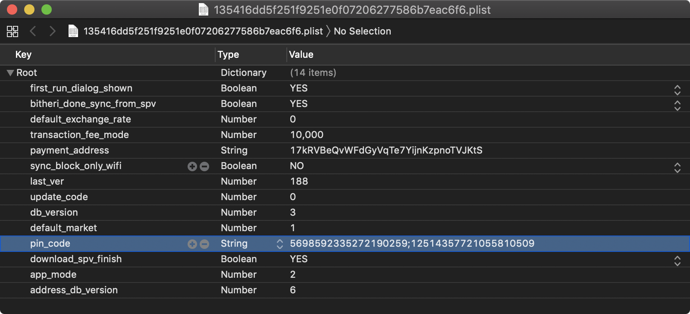

## iOS上的数据存储

保护敏感数据（例如身份验证令牌和私人信息）是移动安全的关键。 在本章中，您将学习用于本地数据存储的iOS API，以及使用它们的最佳实践。

### 测试本地数据存储 (MSTG-STORAGE-1 and MSTG-STORAGE-2)

应将尽可能少的敏感数据保存在永久本地存储中。但是，在大多数实际情况下，必须至少存储一些用户数据。幸运的是，iOS提供了安全的存储API，使开发人员可以使用每个iOS设备上可用的加密硬件。如果正确使用这些API，则可以通过硬件支持的256位AES加密来保护敏感数据和文件。


#### 数据保护 API

应用开发人员可以利用iOS *Data Protection* API对存储在闪存中的用户数据实施细粒度的访问控制。这些API建立在iPhone 5S随附的安全飞地处理器（SEP）之上。 SEP是协处理器，可提供用于数据保护和密钥管理的加密操作。设备专用的硬件密钥-设备UID（唯一ID）-嵌入在安全区域中，即使在操作系统内核受到威胁时，也可以确保数据保护的完整性。

数据保护体系结构基于密钥的层次结构。 UID和用户密码密钥（通过PBKDF2算法从用户密码短语派生）位于此层次结构的顶部。它们可以一起用于“解锁”与不同设备状态（例如，设备锁定/解锁）关联的所谓的类密钥。

iOS文件系统上存储的每个文件都使用其自己的按文件密钥加密，该密钥包含在文件元数据中。使用文件系统密钥对元数据进行加密，并使用与创建文件时选择的应用程序的保护类别相对应的类别密钥进行包装。

下图显示了[iOS数据保护密钥层次结构](https://www.apple.com/business/docs/iOS_Security_Guide.pdf "iOS Security Guide").


可以将文件分配给四种不同的保护类别之一，[iOS安全指南](https://www.apple.com/business/docs/iOS_Security_Guide.pdf "iOS Security Guide"):

-**完全保护（NSFileProtectionComplete）**：从用户密码和设备UID派生的密钥可保护该类密钥。锁定设备后不久，就会从内存中擦除派生密钥，从而使数据不可访问，直到用户解锁设备为止。

-**除非打开，否则受保护（NSFileProtectionCompleteUnlessOpen）**：此保护类类似于“完全保护”，但是，如果在解锁时打开文件，则即使用户锁定了设备，应用程序也可以继续访问该文件。例如，在后台下载邮件附件时，将使用此保护类。

-**受保护，直到首次用户身份验证（NSFileProtectionCompleteUntilFirstUserAuthentication）**：启动后，用户首次解锁设备后，便可以访问该文件。即使用户随后锁定了该设备并且未从内存中删除类密钥，也可以对其进行访问。

-**无保护（NSFileProtectionNone）**：此保护类的密钥仅受UID保护。类密钥存储在“ Effaceable Storage”中，这是iOS设备上的闪存区域，允许存储少量数据。该保护类用于快速远程擦除（立即删除类密钥，这使得数据不可访问）。

除“ NSFileProtectionNone”之外的所有类密钥均使用从设备UID和用户密码派生的密钥进行加密。结果，解密只能在设备本身上发生，并且需要正确的密码。

从iOS 7开始，默认的数据保护类为“直到首次用户身份验证之前都受保护”。

##### The Keychain

iOS钥匙串可用于安全地存储短而敏感的数据位，例如加密密钥和会话令牌。它被实现为SQLite数据库，只能通过钥匙串API进行访问。

在macOS上，每个用户应用程序都可以创建所需数量的钥匙串，并且每个登录帐户都有自己的钥匙串。 [iOS上的钥匙串结构](https://developer.apple.com/library/content/documentation/Security/Conceptual/keychainServConcepts/02concepts/concepts.html "https://developer.apple.com/library/content/documentation/Security/Conceptual/keychainServConcepts/02concepts/concepts.html") 不同：只有一个Keychain可供所有应用程序使用。可以通过[访问组功能](https://developer.apple.com/library/content/documentation/IDEs/Conceptual/AppDistributionGuide/AddingCapabilities/AddingCapabilities.html "Adding capabilities") 属性 [`kSecAttrAccessGroup`](https://developer.apple.com/documentation/security/ksecattraccessgroup "Attribute kSecAttrAccessGroup"). 对“钥匙串”的访问由`securityd`守护程序管理，该守护程序根据应用程序的`钥匙串访问组`，`应用程序标识符`和`应用程序组`权利来授予访问权限。

[Keychain API](https://developer.apple.com/library/content/documentation/Security/Conceptual/keychainServConcepts/02concepts/concepts.html "Keychain concepts") 包括以下主要操作:

- `SecItemAdd`
- `SecItemUpdate`
- `SecItemCopyMatching`
- `SecItemDelete`

钥匙串中存储的数据通过类似于用于文件加密的类结构的类结构进行保护。添加到钥匙串中的项目被编码为二进制plist，并在Galois / Counter模式（GCM）中使用128位AES每项密钥进行加密。请注意，较大的数据块并不意味着直接保存在钥匙串中，这就是Data Protection API的目的。您可以通过将调用中的“ kSecAttrAccessible”键设置为“ SecItemAdd”或“ SecItemUpdate”来为钥匙串项目配置数据保护。以下是可配置的[kSecAttrAccessible的可访问性值](https://developer.apple.com/documentation/security/keychain_services/keychain_items/item_attribute_keys_and_values#1679100 "Accessibility Values for kSecAttrAccessible") 是钥匙串数据保护类：

- `kSecAttrAccessibleAlways`：“钥匙串”项中的数据始终可以访问，无论设备是否被锁定。
- `kSecAttrAccessibleAlwaysThisDeviceOnly`：钥匙链项中的数据始终可以访问，无论设备是否被锁定。数据不会包含在iCloud或iTunes备份中。
- `kSecAttrAccessibleAfterFirstUnlock`：重启后，直到用户将设备解锁一次，才能访问“钥匙串”项中的数据。
- `kSecAttrAccessibleAfterFirstUnlockThisDeviceOnly`：重启后，直到用户将设备解锁一次，才能访问“钥匙串”项中的数据。具有此属性的项目不会迁移到新设备。因此，从其他设备的备份还原后，这些项目将不存在。
- `kSecAttrAccessibleWhenUnlocked`：钥匙串项中的数据只能在用户将设备解锁后才能访问。
- `kSecAttrAccessibleWhenUnlockedThisDeviceOnly`：钥匙串项中的数据只能在用户将设备解锁后才能访问。数据不会包含在iCloud或iTunes备份中。
- `kSecAttrAccessibleWhenPasscodeSetThisDeviceOnly`：仅当设备解锁时才能访问钥匙串中的数据。仅当在设备上设置了密码时，此保护级别才可用。数据不会包含在iCloud或iTunes备份中。

`AccessControlFlags`定义了用户用来认证密钥的机制（SecAccessControlCreateFlags）：

- `kSecAccessControlDevicePasscode`：通过密码访问项目。
- `kSecAccessControlBiometryAny`：通过注册到Touch ID的指纹之一访问该项目。 添加或删除指纹不会使该项目无效。
- `kSecAccessControlBiometryCurrentSet`：通过注册到Touch ID的指纹之一访问该项目。 添加或删除指纹将使该项目无效。
- `kSecAccessControlUserPresence`：通过注册的指纹之一（使用Touch ID）或默认密码来访问项目。

请注意，通过Touch ID（通过`kSecAccessControlBiometryAny`或` kSecAccessControlBiometryCurrentSet`保护）的密钥受安全区域保护：密钥链仅持有令牌，而不是实际密钥。密钥位于安全区域中。

从iOS 9开始，您可以在Secure Enclave中执行基于ECC的签名操作。在这种情况下，私钥和加密操作位于Secure Enclave中。有关创建ECC密钥的更多信息，请参见静态分析部分。
iOS 9仅支持256位ECC。此外，您需要将公钥存储在钥匙串中，因为它不能存储在Secure Enclave中。创建密钥后，您可以使用`kSecAttrKeyType`来指示您要使用密钥的算法类型。

如果要使用这些机制，建议测试是否已设置密码。在iOS 8中，您需要检查是否可以从受`kSecAttrAccessibleWhenPasscodeSetThisDeviceOnly`属性保护的钥匙串中的项目进行读取/写入。从iOS 9开始，您可以使用`LAContext`检查是否设置了锁定屏幕：

Swift:

```swift
public func devicePasscodeEnabled() -> Bool {
    return LAContext().canEvaluatePolicy(.deviceOwnerAuthentication, error: nil)
}
```

Objective-C:

```objc
-(BOOL)devicePasscodeEnabled:(LAContex)context{
  if ([context canEvaluatePolicy:LAPolicyDeviceOwnerAuthentication error:nil]) {
        return true;
    } else {
        creturn false;
    }
}
```

###### Keychain 数据持久性

在iOS上，当卸载应用程序时，设备保留应用程序使用的钥匙串数据，这与擦除的应用程序沙箱存储的数据不同。 如果用户在不执行出厂重置的情况下出售其设备，则设备的购买者可以通过重新安装先前用户使用的相同应用程序来访问先前用户的应用程序帐户和数据。 这将不需要技术能力来执行。

在评估iOS应用程序时，您应该寻找钥匙串数据持久性。 通常，通过使用应用程序生成可能存储在钥匙串中的示例数据，卸载应用程序，然后重新安装应用程序以查看在两次应用程序安装之间是否保留了数据，来完成此操作。 您还可以使用iOS安全评估框架Needle来读取钥匙串，以验证持久性。 以下Needle命令演示了此过程：

```shell
$ python needle.py
[needle] > use storage/data/keychain_dump
[needle] > run
  {
   "Creation Time" : "Jan 15, 2018, 10:20:02 GMT",
   "Account" : "username",
   "Service" : "",
   "Access Group" : "ABCD.com.test.passwordmngr-test",
   "Protection" : "kSecAttrAccessibleWhenUnlocked",
   "Modification Time" : "Jan 15, 2018, 10:28:02 GMT",
   "Data" : "testUser",
   "AccessControl" : "Not Applicable"
 },
 {
   "Creation Time" : "Jan 15, 2018, 10:20:02 GMT",
   "Account" : "password",
   "Service" : "",
   "Access Group" : "ABCD.com.test.passwordmngr-test,
   "Protection" : "kSecAttrAccessibleWhenUnlocked",
   "Modification Time" : "Jan 15, 2018, 10:28:02 GMT",
   "Data" : "rosebud",
   "AccessControl" : "Not Applicable"
 }
```

卸载应用程序后，开发人员无法使用iOS API强制擦除数据。 相反，开发人员应采取以下步骤来防止钥匙串数据在应用程序安装之间持久存在：

- 安装后首次启动应用程序时，请擦除与该应用程序关联的所有钥匙串数据。 这将防止设备的第二个用户意外访问前一个用户的帐户。 以下Swift示例是此擦除过程的基本演示：

```swift
let userDefaults = UserDefaults.standard

if userDefaults.bool(forKey: "hasRunBefore") == false {
    // Remove Keychain items here

    // Update the flag indicator
    userDefaults.set(true, forKey: "hasRunBefore")
    userDefaults.synchronize() // Forces the app to update UserDefaults
}
```

- 开发iOS应用程序的注销功能时，请确保在注销帐户时擦除了钥匙串数据。 这将允许用户在卸载应用程序之前清除其帐户。

#### 静态分析

当您有权访问iOS应用程序的源代码时，请尝试找出在整个应用程序中保存和处理的敏感数据。这包括密码，秘密密钥和个人身份信息（PII），但也可能包括由行业法规，法律和公司政策确定为敏感的其他数据。查找是否通过下面列出的任何本地存储API保存了此数据。确保没有适当的保护就永远不会存储敏感数据。例如，如果没有其他加密，则不应将身份验证令牌保存在“ NSUserDefaults”中。

必须实施加密，以便秘密密钥以安全设置（理想情况下为`kSecAttrAccessibleWhenPasscodeSetThisDeviceOnly`）存储在钥匙串中。这样可以确保使用硬件支持的存储机制。确保根据KeyChain中密钥的安全策略设置了“ AccessControlFlags”。

[使用KeyChain的通用示例](https://developer.apple.com/library/content/samplecode/GenericKeychain/Introduction/Intro.html#//apple_ref/doc/uid/DTS40007797-Intro-DontLinkElementID_2 "GenericKeyChain") Apple的官方文档中提供了用于存储，更新和删除数据的信息。 Apple的官方文档还包括使用[Touch ID和受密码保护的键]的示例(https://developer.apple.com/documentation/localauthentication/accessing_keychain_items_with_face_id_or_touch_id "访问带有Face ID或Touch ID的钥匙串项目”）。

这是可以用来创建密钥的示例Swift代码（请注意`kSecAttrTokenID`为字符串：`kSecAttrTokenIDSecureEnclave`：这表明我们要直接使用安全区域）：

```swift
// private key parameters
let privateKeyParams = [
    kSecAttrLabel as String: "privateLabel",
    kSecAttrIsPermanent as String: true,
    kSecAttrApplicationTag as String: "applicationTag",
] as CFDictionary

// public key parameters
let publicKeyParams = [
    kSecAttrLabel as String: "publicLabel",
    kSecAttrIsPermanent as String: false,
    kSecAttrApplicationTag as String: "applicationTag",
] as CFDictionary

// global parameters
let parameters = [
    kSecAttrKeyType as String: kSecAttrKeyTypeEC,
    kSecAttrKeySizeInBits as String: 256,
    kSecAttrTokenID as String: kSecAttrTokenIDSecureEnclave,
    kSecPublicKeyAttrs as String: publicKeyParams,
    kSecPrivateKeyAttrs as String: privateKeyParams,
] as CFDictionary

var pubKey, privKey: SecKey?
let status = SecKeyGeneratePair(parameters, &pubKey, &privKey)

if status != errSecSuccess {
    // Keys created successfully
}
```

检查iOS应用程序的数据存储不安全时，请考虑以下存储数据的方法，因为默认情况下，它们都不对数据进行加密：

##### `NSUserDefaults`

[`NSUserDefaults`](https://developer.apple.com/documentation/foundation/nsuserdefaults "NSUserDefaults Class") 类提供了用于与默认系统进行交互的编程接口。 默认系统允许应用程序根据用户首选项自定义其行为。 由NSUserDefaults保存的数据可以在应用程序捆绑中查看。 此类将数据存储在plist文件中，但它应与少量数据一起使用。

##### 文件系统

- `NSData`: 创建静态数据对象，而`NSMutableData`创建动态数据对象。 NSData和NSMutableData通常用于数据存储，但对于分布式对象应用程序也很有用，在分布式对象应用程序中，数据对象中包含的数据可以在应用程序之间复制或移动。 以下是用于写入NSData对象的方法：
  - `NSDataWritingWithoutOverwriting`
  - `NSDataWritingFileProtectionNone`
  - `NSDataWritingFileProtectionComplete`
  - `NSDataWritingFileProtectionCompleteUnlessOpen`
  - `NSDataWritingFileProtectionCompleteUntilFirstUserAuthentication`
- `writeToFile`: 将数据存储为 `NSData` 类的一部分
- `NSSearchPathForDirectoriesInDomains, NSTemporaryDirectory`: 用于管理文件路径
- `NSFileManager`: 可让您检查和更改文件系统的内容。 您可以使用 `createFileAtPath` 创建文件并写入文件.

以下示例说明如何使用 `createFileAtPath` 方法创建安全加密的文件:

```objc
[[NSFileManager defaultManager] createFileAtPath:[self filePath]
  contents:[@"secret text" dataUsingEncoding:NSUTF8StringEncoding]
  attributes:[NSDictionary dictionaryWithObject:NSFileProtectionComplete
  forKey:NSFileProtectionKey]];
```

##### CoreData

[`Core Data`](https://developer.apple.com/library/content/documentation/Cocoa/Conceptual/CoreData/nsfetchedresultscontroller.html#//apple_ref/doc/uid/TP40001075-CH8-SW1 "Core Data iOS") 是用于管理应用程序中对象模型层的框架。 它为与对象生命周期和对象图管理（包括持久性）相关的常见任务提供了通用的自动化解决方案。 [核心数据可以使用SQLite作为其持久性存储](https://cocoacasts.com/what-is-the-difference-between-core-data-and-sqlite/ "What Is the Difference Between Core Data and SQLite"), 但是框架本身不是数据库。

默认情况下，CoreData不会加密其数据。 作为MITER Corporation的研究项目（iMAS）的一部分，该项目专注于开源iOS安全控件，可以向CoreData添加一个附加的加密层。 有关更多详细信息，请参见[GitHub Repo](https://github.com/project-imas/encrypted-core-data "Encrypted Core Data SQLite Store").

##### SQLite 数据库

如果应用程序要使用SQLite，则必须将SQLite 3库添加到该应用程序。 该库是一个C ++包装器，为SQLite命令提供了API。

##### Firebase 实时数据库

Firebase是具有15多种产品的开发平台，其中之一是Firebase实时数据库。 应用程序开发人员可以利用它来存储数据并与NoSQL云托管数据库同步。 数据存储为JSON，并实时同步到每个连接的客户端，即使应用程序脱机也保持可用。

###### 识别配置错误的 Firebase实例

在2018年1月 [Appthority Mobile Threat Team (MTT)](https://cdn2.hubspot.net/hubfs/436053/Appthority%20Q2-2018%20MTR%20Unsecured%20Firebase%20Databases.pdf "Unsecured Firebase Databases: Exposing Sensitive Data via Thousands of Mobile Apps") 不安全的Firebase数据库：公开敏感信息 通过数以千计的移动应用程序进行的数据”）对连接到移动应用程序的不安全后端服务进行了安全性研究。 他们发现Firebase中的配置错误，这是最受欢迎的十大数据存储之一，攻击者可以利用它来检索云服务器上托管的所有不受保护的数据。 该团队对200万多个移动应用程序进行了研究，发现连接到Firebase数据库的大约9％的Android应用程序和近一半（47％）的iOS应用程序容易受到攻击。

可以通过以下网络调用来识别配置错误的Firebase实例：

`https://\<firebaseProjectName\>.firebaseio.com/.json`

此 _firebaseProjectName_ 可以从属性list(.plist) file 获取. 例如, _PROJECT_ID_ 密钥相应的Firebase项目名称存储在 _GoogleService-Info.plist_ file.

或者，分析人员可以使用 [Firebase Scanner](https://github.com/shivsahni/FireBaseScanner "Firebase Scanner"), 这是一个Python脚本，可自动执行上述任务，如下所示：

```shell
python FirebaseScanner.py -f <commaSeperatedFirebaseProjectNames>
```

##### 领域数据库(Realm databases)

[Realm Objective-C](https://realm.io/docs/objc/latest/ "Realm Objective-C") 和 [Realm Swift](https://realm.io/docs/swift/latest/ "Realm Swift") 但仍然值得注意。 它们存储所有未加密的内容，除非配置启用了加密。

以下示例演示了如何对Realm数据库使用加密：

```swift
// Open the encrypted Realm file where getKey() is a method to obtain a key from the Keychain or a server
let config = Realm.Configuration(encryptionKey: getKey())
do {
  let realm = try Realm(configuration: config)
  // Use the Realm as normal
} catch let error as NSError {
  // If the encryption key is wrong, `error` will say that it's an invalid database
  fatalError("Error opening realm: \(error)")
}
```

##### Couchbase Lite 数据库

[Couchbase Lite](https://github.com/couchbase/couchbase-lite-ios "Couchbase Lite") 是一个轻量级，嵌入式，面向文档（NoSQL）的数据库引擎，可以同步。 它针对iOS和macOS进行本地编译。

##### YapDatabase

[YapDatabase](https://github.com/yapstudios/YapDatabase "YapDatabase") 是建立在SQLite之上的键/值存储。

#### 动态分析

在不利用本机iOS功能的情况下确定敏感信息（如凭据和密钥）是否被不安全存储的一种方法是分析应用程序的数据目录。在分析数据之前触发所有应用程序功能非常重要，因为只有在触发特定功能后，应用程序才能存储敏感数据。然后，您可以根据通用关键字和特定于应用程序的数据对数据转储执行静态分析。

以下步骤可用于确定应用程序如何在越狱的iOS设备上本地存储数据：

1. 触发存储潜在敏感数据的功能。
2. 连接到iOS设备并导航到其Bundle目录（适用于8.0和更高版本的iOS版本）: `/var/mobile/Containers/Data/Application/$APP_ID/`
3. 使用您存储的数据执行grep，例如: `grep -iRn "USERID"`.
4. 如果敏感数据以明文形式存储，则该应用无法通过此测试.

您可以使用其他，等第三方应用程序在未越狱的iOS设备上分析该应用程序的数据目录。比如[iMazing](https://imazing.com "iMazing").

1. 触发存储潜在敏感数据的功能。
2. 将iOS设备连接到您的工作站，然后启动iMazing。
3. 选择“应用程序”，右键单击所需的iOS应用程序，然后选择“提取应用程序”。
4. 导航到输出目录，然后找到 $APP_NAME.imazing。将其重命名为 $APP_NAME.zip。
5. 解压缩ZIP文件。然后，您可以分析应用程序数据。

> 请注意，iMazing之类的工具不会直接从设备复制数据。 他们尝试从创建的备份中提取数据。 因此，不可能获取存储在iOS设备上的所有应用程序数据：并非所有文件夹都包含在备份中。 使用越狱设备或将应用程序与Frida重新打包，然后使用异议之类的工具访问所有数据和文件。

如果您将Frida库添加到应用中，并按照“非越狱设备上的动态分析”（来自“ iOS上的篡改和反向工程”一章）中的说明进行了重新打包，则可以使用[objection](https://github.com/sensepost/objection "objection") 以直接从应用程序的数据目录传输文件或[读取objection文件](https://github.com/sensepost/objection/wiki/Using-objection#getting-started-ios-edition "Getting started iOS edition") 如“ iOS上的基本安全性测试”一章中的“ [主机设备数据传输](0x06b-Basic-Security-Testing.md#host-device-data-transfer "Host-Device Data Transfer")".

可以在动态分析期间转储钥匙串内容。 在越狱的设备上，可以按照“ iOS的基本安全性测试”一章中的说明使用[Keychain dumper](https://github.com/ptoomey3/Keychain-Dumper/ "Keychain Dumper").

钥匙串文件的路径是

```shell
/private/var/Keychains/keychain-2.db
```

在非越狱设备上，您可以使用objection来 [转储钥匙串物品](https://github.com/sensepost/objection/wiki/Notes-About-The-Keychain-Dumper "Notes About The Keychain Dumper") 由应用创建和存储。

##### 使用Xcode和iOS模拟器进行动态分析

> 此测试仅在macOS上可用，因为需要Xcode和iOS模拟器。

为了测试本地存储并验证其中存储了哪些数据，并不一定要拥有iOS设备。 通过访问源代码和Xcode，可以在iOS模拟器中构建和部署该应用程序。 iOS模拟器当前设备的文件系统位于`~/Library/Developer/CoreSimulator/Devices`中。

一旦应用程序在iOS模拟器中运行，您就可以导航到以下命令开头的最新模拟器的目录：

```shell
$ cd ~/Library/Developer/CoreSimulator/Devices/$(
ls -alht ~/Library/Developer/CoreSimulator/Devices | head -n 2 |
awk '{print $9}' | sed -n '1!p')/data/Containers/Data/Application
```

上面的命令将自动查找启动的最新模拟器的UUID。 现在，您仍然需要grep输入应用名称或应用中的关键字。 这将向您显示该应用程序的UUID。

```shell
$ grep -iRn keyword .
```

然后，您可以监视和验证应用程序文件系统中的更改，并在使用应用程序时调查文件中是否存储了任何敏感信息。

##### 动态分析：通过 Needle

在越狱设备上，您可以使用iOS安全评估框架Needle来查找由应用程序的数据存储机制引起的漏洞

###### 阅读钥匙串(Keychain)

要使用Needle读取钥匙串，请执行以下命令：

```shell
[needle] > use storage/data/keychain_dump
[needle][keychain_dump] > run
```  

###### 搜索 二进制Cookie

iOS应用程序通常将二进制Cookie文件存储在应用程序沙箱中。 Cookie是包含应用程序WebView的Cookie数据的二进制文件。 您可以使用Needle将这些文件转换为可读格式并检查数据。 使用以下Needle模块，该模块搜索存储在应用程序容器中的二进制cookie文件，列出其数据保护值，并为用户提供检查或下载文件的选项：

```shell
[needle] > use storage/data/files_binarycookies
[needle][files_binarycookies] > run
```

###### 搜索属性列表文件

OS应用程序通常将数据存储在存储在应用程序沙箱和IPA包中的属性列表（plist）文件中。有时，这些文件包含敏感信息，例如用户名和密码。因此，应在iOS评估期间检查这些文件的内容。使用以下Needle模块，该模块搜索存储在应用程序容器中的plist文件，列出其数据保护值，并为用户提供检查或下载文件的选项：

```shell
[needle] > use storage/data/files_plist
[needle][files_plist] > run
```

###### 搜索缓存数据库

iOS应用程序可以将数据存储在缓存数据库中。这些数据库包含Web请求和响应之类的数据。有时数据是敏感的。使用以下Needle模块，该模块搜索存储在应用程序容器中的缓存文件，列出其数据保护值，并为用户提供检查或下载文件的选项：

```shell
[needle] > use storage/data/files_cachedb
[needle][files_cachedb] > run
```

###### 搜索SQLite数据库

iOS应用程序通常使用SQLite数据库来存储应用程序所需的数据。测试人员应检查这些文件的数据保护值及其内容是否包含敏感数据。使用以下Needle模块，该模块搜索存储在应用程序容器中的SQLite数据库，列出其数据保护值，并为用户提供检查或下载文件的选项：

```shell
[needle] > use storage/data/files_sql
[needle][files_sql] >
```

### 检查日志中的敏感数据 (MSTG-STORAGE-3)

在移动设备上创建日志文件有很多合理的原因，包括跟踪当设备离线时存储在本地的崩溃或错误（以便可以将它们联机后发送给应用程序的开发人员），以及存储使用情况统计信息。但是，记录敏感数据（例如信用卡号和会话信息）可能会将数据暴露给攻击者或恶意应用程序。
日志文件可以通过多种方式创建。以下列表显示了iOS上可用的方法：

- NSLog方法
- 类似printf的功能
- 类似于NSAssert的功能
- 宏

#### 静态分析

使用以下关键字检查应用程序的源代码中是否存在预定义和自定义的日志记录语句：

- 对于预定义和内置功能：
  - NSLog
  - NSAssert
  - NSCAssert
  - fprintf
- 对于自定义功能：
  - 记录
  - 日志文件

解决此问题的通用方法是使用定义来启用NSLog语句进行开发和调试，然后在发布软件之前禁用它们。您可以通过将以下代码添加到适当的PREFIX_HEADER（\*.pch）文件中来做到这一点：

```C#
#ifdef DEBUG
#   define NSLog (...) NSLog(__VA_ARGS__)
#else
#   define NSLog (...)
#endif
```

#### 动态分析

在“ iOS基本安全性测试”一章的“监视系统日志”部分中，介绍了用于检查设备日志的各种方法。导航到一个显示包含敏感用户信息的输入字段的屏幕。

启动其中一种方法后，填写输入字段。如果输出中显示敏感数据，则该应用程序未通过此测试。

### 确定是否将敏感数据发送给第三方 (MSTG-STORAGE-4)

各种第三方服务可以嵌入到应用程序中。这些服务提供的功能可能涉及跟踪服务，以在使用应用程序，出售横幅广告或改善用户体验时监视用户的行为。
第三方服务的缺点是开发人员不知道通过第三方库执行的代码的详细信息。因此，不应将不必要的信息发送给服务，并且不应公开任何敏感信息。

不利之处在于，开发人员无法详细了解通过第三方库执行的代码，因此无法获得可视性。因此，应确保向服务发送的信息不超过所需的信息，并且不会泄露敏感信息。

大多数第三方服务以两种方式实现：

- 具有独立库
- 使用完整的SDK

#### 静态分析

要确定是否根据最佳实践使用了第三方库提供的API调用和功能，请查看其源代码。

发送给第三方服务的所有数据都应匿名，以防止暴露PII（个人身份信息），该信息将使第三方能够识别用户帐户。不应将其他数据（例如可以映射到用户帐户或会话的ID）发送给第三方。

#### 动态分析

应该分析对外部服务的所有请求以获取嵌入的敏感信息。通过使用拦截代理，您可以调查应用程序与第三方端点之间的流量。使用该应用程序时，应检查所有未直接发送到承载主要功能的服务器的请求，以查找发送给第三方的敏感信息。该信息可以是对跟踪或广告服务的请求中的PII。

### 在键盘缓存中查找敏感数据 (MSTG-STORAGE-5)

用户可以使用几种简化键盘输入的选项。这些选项包括自动更正和拼写检查。默认情况下，大多数键盘输入都会缓存在 `/private/var/mobile/Library/Keyboard/dynamic-text.dat`.

[UITextInputTraits protocol](https://developer.apple.com/reference/uikit/uitextinputtraits "UITextInputTraits protocol") 用于键盘缓存。 UITextField，UITextView和UISearchBar类自动支持此协议，并且提供以下属性：

- `var autocorrectionType: UITextAutocorrectionType` 确定在键入过程中是否启用了自动校正。启用自动更正后，文本对象将跟踪未知单词并建议合适的替换，除非用户覆盖替换，否则自动替换键入的文本。此属性的默认值为`UITextAutocorrectionTypeDefault`, 对于大多数输入法而言，它启用自动更正。
- `var secureTextEntry: BOOL` 确定是否禁用了文本复制和文本缓存，并隐藏了为`UITextField`输入的文本。该属性的默认值为 `NO`.

#### 静态分析

- 在源代码中搜索类似的实现，例如

```objc
  textObject.autocorrectionType = UITextAutocorrectionTypeNo;
  textObject.secureTextEntry = YES;
```

- Open xib and storyboard files in the `Interface Builder` of Xcode and verify the states of `Secure Text Entry` and `Correction` in the `Attributes Inspector` for the appropriate object.

应用程序必须防止缓存输入到文本字段中的敏感信息. 应用程序必须防止缓存输入到文本字段中的敏感信息。 您可以通过在所需的`UITextFields`，`UITextViews`和`UISearchBars`中使用`textObject.autocorrectionType = UITextAutocorrectionTypeNo`指令以编程方式将其禁用来防止缓存. 对于应屏蔽的数据, 例如PIN和密码, 请将 `textObject.secureTextEntry` 设置为 `YES`.

```objc
UITextField *textField = [ [ UITextField alloc ] initWithFrame: frame ];
textField.autocorrectionType = UITextAutocorrectionTypeNo;
```

#### 动态分析

如果可以使用越狱的iPhone，请执行以下步骤：

1. 通过导航至 `设置`>`常规`>`重置`>`重置键盘字典` 重置iOS设备键盘缓存。
2. 使用该应用程序并确定允许用户输入敏感数据的功能。
3. 将键盘缓存文件`dynamic-text.dat`转储到以下目录（对于8.0之前的iOS版本可能有所不同）：
`/private/var/mobile/Library/Keyboard/`
4. 查找敏感数据，例如用户名，密码，电子邮件地址和信用卡号。 如果可以通过键盘缓存文件获取敏感数据，则该应用无法通过此测试。

With Needle:

```shell
[needle] > use storage/caching/keyboard_autocomplete
[needle] > run

[*] Checking connection with device...
[+] Already connected to: 142.16.24.31
[*] Running strings over keyboard autocomplete databases...
[+] The following content has been found:
    DynamicDictionary-5
    check
    darw
    Frida
    frid
    gawk
    iasdasdt11
    installdeopbear
    Minh
    mter
    needle
    openssl
    openss
    produce
    python
    truchq
    wallpaper
    DynamicDictionary-5
[*] Saving output to file: /home/phanvanloc/.needle/output/keyboard_autocomplete.txt

```

```objc
UITextField *textField = [ [ UITextField alloc ] initWithFrame: frame ];
textField.autocorrectionType = UITextAutocorrectionTypeNo;
```

如果必须使用未越狱的iPhone：

1. 重置键盘缓存。
2. 键入所有敏感数据。
3. 再次使用该应用程序，并确定自动更正是否建议以前输入的敏感信息。

### 确定是否通过 IPC机制 公开敏感数据 (MSTG-STORAGE-6)

#### 概述

[Inter Process Communication (IPC)](https://nshipster.com/inter-process-communication/ "IPC on iOS") allows processes to send each other messages and data. For processes that need to communicate with each other, there are different ways to implement IPC on iOS:

- **[XPC Services](https://developer.apple.com/library/content/documentation/MacOSX/Conceptual/BPSystemStartup/Chapters/CreatingXPCServices.html "XPC Services")**: XPC is a structured, asynchronous library that provides basic interprocess communication. It is managed by `launchd`. It is the most secure and flexible implementation of IPC on iOS and should be the preferred method. It runs in the most restricted environment possible: sandboxed with no root privilege escalation and minimal file system access and network access. Two different APIs are used with XPC Services:
  - NSXPCConnection API
  - XPC Services API
- **[Mach Ports](https://developer.apple.com/documentation/foundation/nsmachport "NSMachPort")**: All IPC communication ultimately relies on the Mach Kernel API. Mach Ports allow local communication (intra-device communication) only. They can be implemented either natively or via Core Foundation (CFMachPort) and Foundation (NSMachPort) wrappers.
- **NSFileCoordinator**: The class `NSFileCoordinator` can be used to manage and send data to and from apps via files that are available on the local file system to various processes. [NSFileCoordinator](https://www.atomicbird.com/blog/sharing-with-app-extensions "NSFileCoordinator") methods run synchronously, so your code will be blocked until they stop executing. That's convenient because you don't have to wait for an asynchronous block callback, but it also means that the methods block the running thread.

#### Static Analysis

The following section summarizes keywords that you should look for to identify IPC implementations within iOS source code.

##### XPC Services

Several classes may be used to implement the NSXPCConnection API:

- NSXPCConnection
- NSXPCInterface
- NSXPCListener
- NSXPCListenerEndpoint

You can set [security attributes](https://www.objc.io/issues/14-mac/xpc/#security-attributes-of-the-connection "Security Attributes of NSXPCConnection") for the connection. The attributes should be verified.

Check for the following two files in the Xcode project for the XPC Services API (which is C-based):

- [`xpc.h`](https://developer.apple.com/documentation/xpc/xpc_services_xpc.h "xpc.h")
- `connection.h`

##### Mach Ports

Keywords to look for in low-level implementations:

- mach\_port\_t
- mach\_msg\_*

Keywords to look for in high-level implementations (Core Foundation and Foundation wrappers):

- CFMachPort
- CFMessagePort
- NSMachPort
- NSMessagePort

##### NSFileCoordinator

Keywords to look for:

- NSFileCoordinator

#### Dynamic Analysis

Verify IPC mechanisms with static analysis of the iOS source code. No iOS tool is currently available to verify IPC usage.

### Checking for Sensitive Data Disclosed Through the User Interface (MSTG-STORAGE-7)

#### Overview

Entering sensitive information when, for example, registering an account or making payments, is an essential part of using many apps. This data may be financial information such as credit card data or user account passwords. The data may be exposed if the app doesn't properly mask it while it is being typed.

Masking sensitive data (by showing asterisks or dots instead of clear text) should be enforced.

#### Static Analysis

A text field that masks its input can be configured in two ways:

**Storyboard**
In the iOS project's storyboard, navigate to the configuration options for the text field that takes sensitive data. Make sure that the option "Secure Text Entry" is selected. If this option is activated, dots are shown in the text field in place of the text input.

**Source Code**
If the text field is defined in the source code, make sure that the option [isSecureTextEntry](https://developer.apple.com/documentation/uikit/uitextinputtraits/1624427-issecuretextentry "isSecureTextEntry in Text Field") is set to "true". This option obscures the text input by showing dots.

```Swift
sensitiveTextField.isSecureTextEntry = true
```

#### Dynamic Analysis

To determine whether the application leaks any sensitive information to the user interface, run the application and identify components that either show such information or take it as input.

If the information is masked by, for example, asterisks or dots, the app isn't leaking data to the user interface.

### Testing Backups for Sensitive Data (MSTG-STORAGE-8)

#### Overview

iOS includes auto-backup features that create copies of the data stored on the device. On iOS, backups can be made through iTunes or the cloud (via the iCloud backup feature). In both cases, the backup includes nearly all data stored on the device except highly sensitive data such as Apple Pay information and Touch ID settings.

Since iOS backs up installed apps and their data, an obvious concern is whether sensitive user data stored by the app might unintentionally leak through the backup. Another concern, though less obvious, is whether sensitive configuration settings used to protect data or restrict app functionality could be tampered to change app behavior after restoring a modified backup. Both concerns are valid and these vulnerabilities have proven to exist in a vast number of apps today.

##### How the Keychain Is Backed Up

When users back up their iOS device, the Keychain data is backed up as well, but the secrets in the Keychain remain encrypted. The class keys necessary to decrypt the Keychain data aren't included in the backup. Restoring the Keychain data requires restoring the backup to a device and unlocking the device with the users passcode.

Keychain items for which the `kSecAttrAccessibleWhenPasscodeSetThisDeviceOnly` attribute is set can be decrypted only if the backup is restored to the backed up device. Someone trying to extract this Keychain data from the backup couldn't decrypt it without access to the crypto hardware inside the originating device.

One caveat to using the Keychain, however, is that it was only designed to store small bits of user data or short notes (according to Apple's documenation on [Keychain Services](https://developer.apple.com/documentation/security/keychain_services "Keychain Services")). This means that apps with larger local secure storage needs (e.g., messaging apps, etc.) should encrypt the data within the app container, but use the Keychain to store key material. In cases where sensitive configuration settings (e.g., data loss prevention policies, password policies, compliance policies, etc) must remain unencrypted within the app container, you can consider storing a hash of the policies in the keychain for integrity checking. Without an integrity check, these settings could be modified within a backup and then restored back to the device to modify app behavior (e.g., change configured remote endpoints) or security settings (e.g., jailbreak detection, certificate pinning, maximum UI login attempts, etc.).

The takeaway: If sensitive data is handled as recommended earlier in this chapter (e.g., stored in the Keychain, with Keychain backed integrity checks, or encrypted with a key that's locked inside the Keychain), backups shouldn't be security issue.

##### Static Analysis

An iTunes backup of a device on which a mobile application has been installed will include all subdirectories (except for `Library/Caches/`) and files in the [app's private directory](https://developer.apple.com/library/content/documentation/FileManagement/Conceptual/FileSystemProgrammingGuide/FileSystemOverview/FileSystemOverview.html#//apple_ref/doc/uid/TP40010672-CH2-SW12 "Directories of an iOS App").

Therefore, avoid storing sensitive data in plaintext within any of the files or folders that are in the app's private directory or subdirectories.

Although all the files in `Documents/` and `Library/Application Support/` are always backed up by default, you can [exclude files from the backup](https://developer.apple.com/library/content/documentation/FileManagement/Conceptual/FileSystemProgrammingGuide/FileSystemOverview/FileSystemOverview.html#//apple_ref/doc/uid/TP40010672-CH2-SW28 "Where You Should Put Your App's Files") by calling `NSURL setResourceValue:forKey:error:` with the `NSURLIsExcludedFromBackupKey` key.

You can use the [NSURLIsExcludedFromBackupKey](https://developer.apple.com/reference/foundation/nsurl#//apple_ref/c/data/NSURLIsExcludedFromBackupKey "NSURLIsExcludedFromBackupKey") and [CFURLIsExcludedFromBackupKey](https://developer.apple.com/reference/corefoundation/cfurl-rd7#//apple_ref/c/data/kCFURLIsExcludedFromBackupKey "kCFURLIsExcludedFromBackupKey") file system properties to exclude files and directories from backups. An app that needs to exclude many files can do so by creating its own subdirectory and marking that directory excluded. Apps should create their own directories for exclusion instead of excluding system-defined directories.

Both file system properties are preferable to the deprecated approach of directly setting an extended attribute. All apps running on iOS version 5.1 and later should use these properties to exclude data from backups.

The following is [sample Objective-C code for excluding a file from a backup](https://developer.apple.com/library/content/qa/qa1719/index.html "How do I prevent files from being backed up to iCloud and iTunes?") on iOS 5.1 and later:

```ObjC
- (BOOL)addSkipBackupAttributeToItemAtPath:(NSString *) filePathString
{
    NSURL* URL= [NSURL fileURLWithPath: filePathString];
    assert([[NSFileManager defaultManager] fileExistsAtPath: [URL path]]);

    NSError *error = nil;
    BOOL success = [URL setResourceValue: [NSNumber numberWithBool: YES]
                                  forKey: NSURLIsExcludedFromBackupKey error: &error];
    if(!success){
        NSLog(@"Error excluding %@ from backup %@", [URL lastPathComponent], error);
    }
    return success;
}
```

The following is sample Swift code for excluding a file from a backup on iOS 5.1 and later, see [Swift excluding files from iCloud backup](https://bencoding.com/2017/02/20/swift-excluding-files-from-icloud-backup/) for more information:

```swift
enum ExcludeFileError: Error {
    case fileDoesNotExist
    case error(String)
}

func excludeFileFromBackup(filePath: URL) -> Result<Bool, ExcludeFileError> {
    var file = filePath

    do {
        if FileManager.default.fileExists(atPath: file.path) {
            var res = URLResourceValues()
            res.isExcludedFromBackup = true
            try file.setResourceValues(res)
            return .success(true)

        } else {
            return .failure(.fileDoesNotExist)
        }
    } catch {
        return .failure(.error("Error excluding \(file.lastPathComponent) from backup \(error)"))
    }
}
```

#### Dynamic Analysis

In order to test the backup, you obviously need to create one first. The most common way to create a backup of an iOS device is by using iTunes, which is available for Windows, Linux and of course macOS. When creating a backup via iTunes you can always only backup the whole device and not select just a single app. Make sure that the option "Encrypt local backup" in iTunes is not set, so that the backup is stored in cleartext on your hard drive.

After the iOS device has been backed up through iTunes you need to retrieve the file path of the backup, which are different locations on each OS. The official Apple documentation will help you to [locate backups of your iPhone, iPad, and iPod touch](https://support.apple.com/en-us/HT204215 "Locate backups of your iPhone, iPad, and iPod touch").

When you want to navigate to the iTunes backup folder up to High Sierra you can easily do so. Starting with macOS Mojave you will get the following error (even as root):

```bash
$ pwd
/Users/foo/Library/Application Support
$ ls -alh MobileSync
ls: MobileSync: Operation not permitted
```

This is not a permission issue of the backup folder, but a new feature in macOS Mojave. Solve this problem by granting full disk access to your terminal application by following the explanation on [OSXDaily](http://osxdaily.com/2018/10/09/fix-operation-not-permitted-terminal-error-macos/ "Fix Terminal “Operation not permitted” Error in MacOS Mojave").

Before you can access the directory you need to select the folder with the UDID of your device. Check the section "Getting the UDID of an iOS device" in the "iOS Basic Security Testing" chapter on how to retrieve the UDID.

Once you know the UDID you can navigate into this directory and you will find the full backup of the whole device, which does include pictures, app data and whatever might have been stored on the device.

Review the data that's in the backed up files and folders. The structure of the directories and file names is obfuscated and will look like this:

```bash
$ pwd
/Users/foo/Library/Application Support/MobileSync/Backup/416f01bd160932d2bf2f95f1f142bc29b1c62dcb/00
$ ls | head -n 3
000127b08898088a8a169b4f63b363a3adcf389b
0001fe89d0d03708d414b36bc6f706f567b08d66
000200a644d7d2c56eec5b89c1921dacbec83c3e
```

Therefore, it's not straightforward to navigate through it and you will not find any hints of the app you want to analyze in the directory or file name. You can consider using the [iMazing](https://imazing.com "iMazing") shareware utility to assist here. Perform a device backup with iMazing and use its built-in backup explorer to easily analyze app container contents including original paths and file names. Without iMazing or similar software you may need to resort to using grep to identify sensitive data. This is not the most thorough approach but you can try searching for sensitive data that you have keyed in while using the app before you made the backup. For example: the username, password, credit card data, PII or any data that is considered sensitive in the context of the app.

```bash
$ ~/Library/Application Support/MobileSync/Backup/<UDID>
$ grep -iRn "password" .
```

As described in the Static Analysis section, any sensitive data that you're able to find should be excluded from the backup, encrypted properly by using the Keychain or not stored on the device in the first place.

In case you need to work with an encrypted backup, there are some Python scripts in [DinoSec's GitHub repo](https://github.com/dinosec/iphone-dataprotection/tree/master/python_scripts "iphone-dataprotection"), such as backup_tool.py and backup_passwd.py, that will serve as a good starting point. However, note that they might not work with the latest iTunes versions and might need to be tweaked.

##### Proof of Concept: Removing UI Lock with Tampered Backup

As discussed earlier, sensitive data is not limited to just user data and PII. It can also be configuration or settings files that affect app behavior, restrict functionality, or enable security controls. If you take a look at the open source bitcoin wallet app, [Bither](https://github.com/bither/bither-ios "Bither for iOS"), you'll see that it's possible to configure a PIN to lock the UI. And after a few easy steps, you will see how to bypass this UI lock with a modified backup on a non-jailbroken device.

<table bordercolor="#FFFFFF">
  <tr><td>
    
  </td><td>
    
  </td></tr>
</table>

After you enable the pin, use iMazing to perform a device backup:

1. Select your device from the list under the **AVAILABLE** menu.
2. Click the top menu option **Back Up**.
3. Follow prompts to complete the backup using defaults.

Next you can open the backup to view app container files within your target app:

1. Select your device and click **Backups** on the top right menu.
2. Click the backup you created and select **View**.
3. Navigate to the Bither app from the **Apps** directory.

At this point you can view all the backed up content for Bither.


This is where you can begin parsing through the files looking for sensitive data. In the screenshot you'll see the net.bither.plist file which contains the `pin_code` attribute. To remove the UI lock restriction, simply delete the `pin_code` attribute and save the changes.

From there it's possible to easily restore the modified version of net.bither.plist back onto the device using the licensed version of iMazing. The free workaround, however, is to find the plist file in the obfuscated backup generated by iTunes. So create your iTunes backup of the device with Bither's PIN code configured. Then, using the steps described earlier, find the backup directory and grep for "pin_code" as shown below.

```bash
$ ~/Library/Application Support/MobileSync/Backup/<UDID>
$ grep -iRn "pin_code" .
Binary file ./13/135416dd5f251f9251e0f07206277586b7eac6f6 matches
```

You'll see there was a match on a binary file with an obfuscated name. This is your net.bither.plist file. Go ahead and rename the file giving it a plist extension so Xcode can easily open it up for you.



Again, remove the `pin_code` attribute from the plist and save your changes. Rename the file back to the original name (i.e., without the plist extension) and perform your backup restore from iTunes. When the restore is complete you'll see that Bither no longer prompts you for the PIN code when launched.

### Testing Auto-Generated Screenshots for Sensitive Information (MSTG-STORAGE-9)

#### Overview

Manufacturers want to provide device users with an aesthetically pleasing effect when an application is started or exited, so they introduced the concept of saving a screenshot when the application goes into the background. This feature can pose a security risk because screenshots (which may display sensitive information such as an email or corporate documents) are written to local storage, where they can be recovered by a rogue application with a sandbox bypass exploit or someone who steals the device.

#### Static Analysis

While analyzing the source code, look for the fields or screens that take or display sensitive data. Use [UIImageView](https://developer.apple.com/documentation/uikit/uiimageview "UIImageView") to determine whether the application sanitizes the screen before being backgrounded.

The following is a sample remediation method that will set a default screenshot:

```objc
@property (UIImageView *)backgroundImage;

- (void)applicationDidEnterBackground:(UIApplication *)application {
    UIImageView *myBanner = [[UIImageView alloc] initWithImage:@"overlayImage.png"];
    self.backgroundImage = myBanner;
    [self.window addSubview:myBanner];
}
```

This sets the background image to `overlayImage.png` whenever the application is backgrounded. It prevents sensitive data leaks because `overlayImage.png` will always override the current view.

#### Dynamic Analysis

Navigate to an application screen that displays sensitive information, such as a username, an email address, or account details. Background the application by hitting the Home button on your iOS device. Connect to the iOS device and navigate to the following directory (which may be different for iOS versions below 8.0):

`/var/mobile/Containers/Data/Application/$APP_ID/Library/Caches/Snapshots/`

Screenshot caching vulnerabilities can also be detected with Needle. This is demonstrated in the following Needle excerpt:

```shell
[needle] > use storage/caching/screenshot
[needle][screenshot] > run
[V] Creating timestamp file...
[*] Launching the app...
[*] Background the app by hitting the home button, then press enter:

[*] Checking for new screenshots...
[+] Screenshots found:
[+]   /private/var/mobile/Containers/Data/Application/APP_ID/Library/Caches/Snapshots/app_name/B75DD942-76D1-4B86-8466-B79F7A78B437@2x.png
[+]   /private/var/mobile/Containers/Data/Application/APP_ID/Library/Caches/Snapshots/app_name/downscaled/12B93BCB-610B-44DA-A171-AF205BA71269@2x.png
[+] Retrieving screenshots and saving them in: /home/user/.needle/output
```

If the application caches the sensitive information in a screenshot, the app fails this test.

The application should show a default image as the top view element when the application enters the background, so that the default image will be cached and not the sensitive information that was displayed.

### Testing Memory for Sensitive Data (MSTG-STORAGE-10)

#### Overview

Analyzing memory can help developers to identify the root causes of problems such as application crashes. However, it can also be used to access to sensitive data. This section describes how to check process' memory for data disclosure.

First, identify the sensitive information that's stored in memory. Sensitive assets are very likely to be loaded into memory at some point. The objective is to make sure that this info is exposed as briefly as possible.

To investigate an application's memory, first create a memory dump. Alternatively, you can analyze the memory in real time with, for example, a debugger. Regardless of the method you use, this is a very error-prone process because dumps provide the data left by executed functions and you might miss executing critical steps. In addition, overlooking data during analysis is quite easy to do unless you know the footprint of the data you're looking for (either its exact value or its format). For example, if the app encrypts according to a randomly generated symmetric key, you're very unlikely to spot the key in memory unless you find its value by other means.

Therefore, you're better off starting with static analysis.

#### Static Analysis

Before looking into the source code, checking the documentation and identifying application components provide an overview of where data might be exposed. For example, while sensitive data received from a backend exists in the final model object, multiple copies may also exist in the HTTP client or the XML parser. All these copies should be removed from memory as soon as possible.

Understanding the application's architecture and its interaction with the OS will help you identify sensitive information that doesn't have to be exposed in memory at all. For example, assume your app receives data from one server and transfers it to another without needing any additional processing. That data can be received and handled in encrypted form, which prevents exposure via memory.

However, if sensitive data _does_ need to be exposed via memory, make sure that your app exposes as few copies of this data as possible for as little time as possible. In other words, you want centralized handling of sensitive data, based on primitive and mutable data structures.

Such data structures give developers direct access to memory. Make sure that this access is used to overwrite the sensitive data with dummy data (which is typically zeroes). Examples of preferable data types include `char []` and `int []`, but not `NSString` or `String`. Whenever you try to modify an immutable object, such as a `String`, you actually create a copy and change the copy.

Avoid Swift data types other than collections regardless of whether they are considered mutable. Many Swift data types hold their data by value, not by reference. Although this allows modification of the memory allocated to simple types like `char` and `int`, handling a complex type such as `String` by value involves a hidden layer of objects, structures, or primitive arrays whose memory can't be directly accessed or modified. Certain types of usage may seem to create a mutable data object (and even be documented as doing so), but they actually create a mutable identifier (variable) instead of an immutable identifier (constant). For example, many think that the following results in a mutable `String` in Swift, but this is actually an example of a variable whose complex value can be changed (replaced, not modified in place):

```swift
var str1 = "Goodbye"              // "Goodbye", base address:            0x0001039e8dd0
str1.append(" ")                 // "Goodbye ", base address:            0x608000064ae0
str1.append("cruel world!")      // "Goodbye cruel world", base address: 0x6080000338a0
str1.removeAll()                 // "", base address                    0x00010bd66180
```

Notice that the base address of the underlying value changes with each string operation. Here is the problem: To securely erase the sensitive information from memory, we don't want to simply change the value of the variable; we want to change the actual content of the memory allocated for the current value. Swift doesn't offer such a function.

Swift collections (`Array`, `Set`, and `Dictionary`), on the other hand, may be acceptable if they collect primitive data types such as `char` or `int` and are defined as mutable (i.e., as variables instead of constants), in which case they are more or less equivalent to a primitive array (such as `char []`). These collections provide memory management, which can result in unidentified copies of the sensitive data in memory if the collection needs to copy the underlying buffer to a different location to extend it.

Using mutable Objective-C data types, such as `NSMutableString`, may also be acceptable, but these types have the same memory issue as Swift collections. Pay attention when using Objective-C collections; they hold data by reference, and only Objective-C data types are allowed. Therefore, we are looking, not for a mutable collection, but for a collection that references mutable objects.

As we've seen so far, using Swift or Objective-C data types requires a deep understanding of the language implementation. Furthermore, there has been some core re-factoring in between major Swift versions, resulting in many data types' behavior being incompatible with that of other types. To avoid these issues, we recommend using primitive data types whenever data needs to be securely erased from memory.

Unfortunately, few libraries and frameworks are designed to allow sensitive data to be overwritten. Not even Apple considers this issue in the official iOS SDK API. For example, most of the APIs for data transformation (passers, serializes, etc.) operate on non-primitive data types. Similarly, regardless of whether you flag some `UITextField` as _Secure Text Entry_ or not, it always returns data in the form of a `String` or `NSString`.

In summary, when performing static analysis for sensitive data exposed via memory, you should

- try to identify application components and map where the data is used,
- make sure that sensitive data is handled with as few components as possible,
- make sure that object references are properly removed once the object containing sensitive data is no longer needed,
- make sure that highly sensitive data is overwritten as soon as it is no longer needed,
- not pass such data via immutable data types, such as `String` and `NSString`,
- avoid non-primitive data types (because they might leave data behind),
- overwrite the value in memory before removing references,
- pay attention to third-party components (libraries and frameworks). Having a public API that handles data according to the recommendations above is a good indicator that developers considered the issues discussed here.

#### Dynamic Analysis

There are several approaches and tools available for dynamically testing the memory of an iOS app for sensitive data.

##### Retrieving and Analyzing a Memory Dump

Wether you are using a jailbroken or a non-jailbroken device, you can dump the app's process memory with [objection](https://github.com/sensepost/objection "Objection") and [Fridump](https://github.com/Nightbringer21/fridump "Fridump"). You can find a detailed explanation of this process in the section "[Memory Dump](0x06c-Reverse-Engineering-and-Tampering.md#memory-dump "Memory Dump")", in the chapter "Tampering and Reverse Engineering on iOS".

After the memory has been dumped (e.g. to a file called "memory"), depending on the nature of the data you're looking for, you'll need a set of different tools to process and analyze that memory dump. For instance, if you're focusing on strings, it might be sufficient for you to execute the command `strings` or `rabin2 -zz` to extract those strings.

```shell
# using strings
$ strings memory > strings.txt

# using rabin2
$ rabin2 -ZZ memory > strings.txt
```

Open `strings.txt` in your favorite editor and dig through it to identify sensitive information.

However if you'd like to inspect other kind of data, you'd rather want to use radare2 and its search capabilities. See radare2's help on the search command (`/?`) for more information and a list of options. The following shows only a subset of them:

```bash
$ r2 <name_of_your_dump_file>

[0x00000000]> /?
Usage: /[!bf] [arg]  Search stuff (see 'e??search' for options)
|Use io.va for searching in non virtual addressing spaces
| / foo\x00                    search for string 'foo\0'
| /c[ar]                       search for crypto materials
| /e /E.F/i                    match regular expression
| /i foo                       search for string 'foo' ignoring case
| /m[?][ebm] magicfile         search for magic, filesystems or binary headers
| /v[1248] value               look for an `cfg.bigendian` 32bit value
| /w foo                       search for wide string 'f\0o\0o\0'
| /x ff0033                    search for hex string
| /z min max                   search for strings of given size
...
```

##### Runtime Memory Analysis

Using r2frida you can analyze and inspect the app's memory while running and without needing to dump it. For example, you may run the previous search commands from r2frida and search the memory for a string, hexadecimal values, etc. When doing so, remember to prepend the search command (and any other r2frida specific commands) with a backslash `\` after starting the session with `r2 frida://usb//<name_of_your_app>`.

For more information, options and approaches, please refer to section "[In-Memory Search](0x06c-Reverse-Engineering-and-Tampering.md#in-memory-search "In-Memory Search")" in the chapter "Tampering and Reverse Engineering on iOS".

### References

#### OWASP Mobile Top 10 2016

- M1 - Improper Platform Usage - <https://www.owasp.org/index.php/Mobile_Top_10_2016-M1-Improper_Platform_Usage>
- M2 - Insecure Data Storage - <https://www.owasp.org/index.php/Mobile_Top_10_2016-M2-Insecure_Data_Storage>

#### OWASP MASVS

- MSTG-STORAGE-1: "System credential storage facilities are used appropriately to store sensitive data, such as user credentials or cryptographic keys."
- MSTG-STORAGE-2: "No sensitive data should be stored outside of the app container or system credential storage facilities."
- MSTG-STORAGE-3: "No sensitive data is written to application logs."
- MSTG-STORAGE-4: "No sensitive data is shared with third parties unless it is a necessary part of the architecture."
- MSTG-STORAGE-5: "The keyboard cache is disabled on text inputs that process sensitive data."
- MSTG-STORAGE-6: "No sensitive data is exposed via IPC mechanisms."
- MSTG-STORAGE-7: "No sensitive data, such as passwords or pins, is exposed through the user interface."
- MSTG-STORAGE-8: "No sensitive data is included in backups generated by the mobile operating system."
- MSTG-STORAGE-9: "The app removes sensitive data from views when moved to the background."
- MSTG-STORAGE-10: "The app does not hold sensitive data in memory longer than necessary, and memory is cleared explicitly after use."

#### CWE

- CWE-117 - Improper Output Neutralization for Logs
- CWE-200 - Information Exposure
- CWE-311 - Missing Encryption of Sensitive Data
- CWE-312 - Cleartext Storage of Sensitive Information
- CWE-359 - "Exposure of Private Information ('Privacy Violation')"
- CWE-522 - Insufficiently Protected Credentials
- CWE-524 - Information Exposure Through Caching
- CWE-532 - Information Exposure Through Log Files
- CWE-534 - Information Exposure Through Debug Log Files
- CWE-538 - File and Directory Information Exposure
- CWE-634 - Weaknesses that Affect System Processes
- CWE-922 - Insecure Storage of Sensitive Information

#### Tools

- Fridump - <https://github.com/Nightbringer21/fridump>
- Objection - <https://github.com/sensepost/objection>
- OWASP ZAP - <https://www.owasp.org/index.php/OWASP_Zed_Attack_Proxy_Project>
- Burp Suite - <https://portswigger.net/burp>
- Firebase Scanner - <https://github.com/shivsahni/FireBaseScanner>

#### Others

- Appthority Mobile Threat Team Research Paper - <https://cdn2.hubspot.net/hubfs/436053/Appthority%20Q2-2018%20MTR%20Unsecured%20Firebase%20Databases.pdf>
- Demystifying the Secure Enclave Processor - <https://www.blackhat.com/docs/us-16/materials/us-16-Mandt-Demystifying-The-Secure-Enclave-Processor.pdf>
