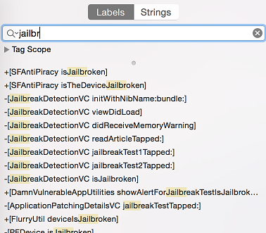

## iOS 反逆向防御

### 越狱检测 (MSTG-RESILIENCE-1)

#### 概述

添加了越狱检测机制增加了逆向工程防御，从而使在越狱设备上运行应用程序更加困难。 这阻碍了逆向工程师喜欢使用的一些工具和技术。 与大多数其他类型的防御一样，越狱检测本身并不是很有效，但是在应用程序的源代码中分散检查，可以提高整体防篡改方案的有效性。 [Trustwave发布了适用于iOS的典型越狱检测技术列表](https://www.trustwave.com/Resources/SpiderLabs-Blog/Jailbreak-Detection-Methods/ "Jailbreak Detection Methods on the Trustware Spiderlabs Blog").

##### 基于文件系统为基础的侦测

检查通常与越狱相关的`文件`和`目录`，例如：

```text
/Applications/Cydia.app
/Applications/FakeCarrier.app
/Applications/Icy.app
/Applications/IntelliScreen.app
/Applications/MxTube.app
/Applications/RockApp.app
/Applications/SBSettings.app
/Applications/WinterBoard.app
/Applications/blackra1n.app
/Library/MobileSubstrate/DynamicLibraries/LiveClock.plist
/Library/MobileSubstrate/DynamicLibraries/Veency.plist
/Library/MobileSubstrate/MobileSubstrate.dylib
/System/Library/LaunchDaemons/com.ikey.bbot.plist
/System/Library/LaunchDaemons/com.saurik.Cydia.Startup.plist

/bin/bash
/bin/sh
/etc/apt
/etc/ssh/sshd_config
/private/var/lib/apt
/private/var/lib/cydia
/private/var/mobile/Library/SBSettings/Themes
/private/var/stash
/private/var/tmp/cydia.log
/usr/bin/sshd
/usr/libexec/sftp-server
/usr/libexec/ssh-keysign
/usr/sbin/sshd
/var/cache/apt
/var/lib/apt
/var/lib/cydia
/usr/sbin/frida-server
/usr/bin/cycript
/usr/local/bin/cycript
/usr/lib/libcycript.dylib
```

##### 检查文件权限

检查越狱机制的另一种方法是尝试写入应用程序沙箱之外的位置。 您可以通过让应用程序尝试在`/private directory`中创建文件来实现。 如果文件创建成功，则表明该设备已越狱。

```objc
#Objective-C
NSError *error;
NSString *stringToBeWritten = @"This is a test.";
[stringToBeWritten writeToFile:@"/private/jailbreak.txt" atomically:YES
         encoding:NSUTF8StringEncoding error:&error];
if(error==nil){
   //Device is jailbroken
   return YES;
 } else {
   //Device is not jailbroken
   [[NSFileManager defaultManager] removeItemAtPath:@"/private/jailbreak.txt" error:nil];
 }
```

##### 检查协议处理程序

您可以通过尝试打开Cydia URL来检查协议处理程序。 Cydia应用商店(实际上，每个越狱工具都会默认安装)会安装cydia://协议处理程序。

```objc
#Objective-C
if([[UIApplication sharedApplication] canOpenURL:[NSURL URLWithString:@"cydia://package/com.example.package"]]){
```

##### 调用系统 API

在非越狱设备上使用`NULL`参数调用`system`函数将返回`0`; 在越狱设备上执行相同的操作将返回`1`。 这种差异是由于该功能仅检查越狱设备上对/bin/sh的访问。

#### 绕过越狱检测

一旦应用程序启动越狱检测功能并且在越狱设备上启动了，您将注意到以下情况之一：

1. 该应用程序立即关闭，恕不另行通知。
2. 一个弹出窗口指示该应用程序不会在越狱设备上运行。

在第一种情况下，请确保该应用程序在非越狱设备上可以正常运行。该应用程序可能崩溃了，或者存在导致其终止的错误。在测试应用程序的预生产版本时，可能会发生这种情况。

让我们再次以Damn Vulnerable iOS应用程序为例，绕过越狱检测。将二进制文件加载到Hopper中后，您需要等待直到应用程序完全反汇编（查看顶部栏以检查状态）。然后在搜索框中查找"jail"字符串。您将看到两个类:`SFAntiPiracy`和`JailbreakDetectionVC`。您可能需要反编译这些函数，以查看它们在做什么，尤其是它们返回什么。


 

如您所见，有一个class方法 (`+[SFAntiPiracy isTheDeviceJailbroken]`) 和一个instance方法 (`-[JailbreakDetectionVC isJailbroken]`). 主要区别在于我们可以在应用程序中注入Cycript并直接调用class方法，而instance方法则需要首先查找目标类的实例。 函数select将在内存堆中查找给定类的已知签名，并返回实例数组。 将应用程序置于所需状态（以便确实实例化该类）很重要。

让我们将Cycript注入到我们的过程中（用`top`查找您的PID）：

```shell
iOS8-jailbreak:~ root# cycript -p 12345
cy# [SFAntiPiracy isTheDeviceJailbroken]
true
```

如您所见，我们的类方法被直接调用，并且返回"true"。 现在，让我们调用`-[JailbreakDetectionVC isJailbroken]`实例方法。 首先，我们必须调用`choose`函数来查找`JailbreakDetectionVC`类的实例。

```shell
cy# a=choose(JailbreakDetectionVC)
[]
```

糟糕！ 返回值是一个空数组。 这意味着在运行时中不会注册此类的实例。 实际上，我们没有单击第二个“越狱测试”按钮，它会初始化该类：

```shell
cy# a=choose(JailbreakDetectionVC)
[#"<JailbreakDetectionVC: 0x14ee15620>"]
cy# [a[0] isJailbroken]
True
```


现在您了解了为什么使应用程序处于理想状态很重要。 此时，使用Cycript绕过越狱检测是微不足道的。 我们可以看到该函数返回一个布尔值； 我们只需要替换返回值即可。 我们可以通过用Cycript替换函数实现来替换返回值。 请注意，这实际上将以给定名称替换该函数，因此，如果该函数修改了应用程序中的任何内容，请注意副作用：

```shell
cy# JailbreakDetectionVC.prototype.isJailbroken=function(){return false}
cy# [a[0] isJailbroken]
false
```


在这种情况下，我们绕过了应用程序的越狱检测！

现在，假设应用程序在检测到设备已越狱后立即关闭。您没有时间启动Cycript和替换函数实现。取而代之的是，您必须使用CydiaSubstrate，使用适当的钩子函数（如“ MSHookMes​​sageEx”），然后编译该调整项。有关如何执行此操作的[好资料](http://delaat.net/rp/2015-2016/p51/report.pdf "Jailbreak/Root Detection Evasion Study on iOS and Android") 但是，通过使用Frida，我们可以更轻松地执行早期检测，并且可以在之前的测试中积累技能。

Frida可以用来绕过越狱检测的功能之一就是所谓的早期检测，即，我们将在启动时替换函数实现。

1. 确保您的iOS设备上正在运行`frida-server`。
2. 确保已在工作站上`Frida`[安装]( https://www.frida.re/docs/installation/ "Frida Installation").
3. iOS设备必须通过USB电缆连接。
4. 在工作站上使用`frida-trace`：

```shell
$ frida-trace -U -f /Applications/DamnVulnerableIOSApp.app/DamnVulnerableIOSApp  -m "-[JailbreakDetectionVC isJailbroken]"
```

这将启动DamnVulnerableIOSApp，跟踪对`-[JailbreakDetectionVC isJailbroken]`的调用，并使用`onEnter`和`onLeave`回调函数创建JavaScript钩子。 现在，通过`value.replace`替换返回值很简单，如以下示例所示：

```JavaScript
    onLeave: function (log, retval, state) {
    console.log("Function [JailbreakDetectionVC isJailbroken] originally returned:"+ retval);
    retval.replace(0);  
      console.log("Changing the return value to:"+retval);
    }
```

这将提供以下输出：

```shell
$ frida-trace -U -f /Applications/DamnVulnerableIOSApp.app/DamnVulnerableIOSApp  -m "-[JailbreakDetectionVC isJailbroken]:"

Instrumenting functions...                                           `...
-[JailbreakDetectionVC isJailbroken]: Loaded handler at "./__handlers__/__JailbreakDetectionVC_isJailbroken_.js"
Started tracing 1 function. Press Ctrl+C to stop.
Function [JailbreakDetectionVC isJailbroken] originally returned:0x1
Changing the return value to:0x0
           /* TID 0x303 */
  6890 ms  -[JailbreakDetectionVC isJailbroken]
Function [JailbreakDetectionVC isJailbroken] originally returned:0x1
Changing the return value to:0x0
 22475 ms  -[JailbreakDetectionVC isJailbroken]
```

请注意对“-[[JailbreakDetectionVC isJailbroken]””的两次调用，它们对应于应用程序GUI上的两次物理点击。

反对是绕过依赖文件系统检查的越狱检测机制的另一种方法。 您可以[在此处找到实现](https://github.com/sensepost/objection/blob/master/agent/src/ios/jailbreak.ts "jailbreak.ts").

参见下面的Python脚本，用于挂钩Objective-C方法和本机函数：

```python
import frida
import sys

try:
    session = frida.get_usb_device().attach("Target Process")
except frida.ProcessNotFoundError:
    print "Failed to attach to the target process. Did you launch the app?"
    sys.exit(0);

script = session.create_script("""

    // Handle fork() based check

    var fork = Module.findExportByName("libsystem_c.dylib", "fork");

    Interceptor.replace(fork, new NativeCallback(function () {
        send("Intercepted call to fork().");
        return -1;
    }, 'int', []));

    var system = Module.findExportByName("libsystem_c.dylib", "system");

    Interceptor.replace(system, new NativeCallback(function () {
        send("Intercepted call to system().");
        return 0;
    }, 'int', []));

    // Intercept checks for Cydia URL handler

    var canOpenURL = ObjC.classes.UIApplication["- canOpenURL:"];

    Interceptor.attach(canOpenURL.implementation, {
        onEnter: function(args) {
          var url = ObjC.Object(args[2]);
          send("[UIApplication canOpenURL:] " + path.toString());
          },
        onLeave: function(retval) {
            send ("canOpenURL returned: " + retval);
        }

    });

    // Intercept file existence checks via [NSFileManager fileExistsAtPath:]

    var fileExistsAtPath = ObjC.classes.NSFileManager["- fileExistsAtPath:"];
    var hideFile = 0;

    Interceptor.attach(fileExistsAtPath.implementation, {
        onEnter: function(args) {
          var path = ObjC.Object(args[2]);
          // send("[NSFileManager fileExistsAtPath:] " + path.toString());

          if (path.toString() == "/Applications/Cydia.app" || path.toString() == "/bin/bash") {
            hideFile = 1;
          }
        },
        onLeave: function(retval) {
            if (hideFile) {
                send("Hiding jailbreak file...");MM
                retval.replace(0);
                hideFile = 0;
            }

            // send("fileExistsAtPath returned: " + retval);
      }
    });


    /* If the above doesn't work, you might want to hook low level file APIs as well

        var openat = Module.findExportByName("libsystem_c.dylib", "openat");
        var stat = Module.findExportByName("libsystem_c.dylib", "stat");
        var fopen = Module.findExportByName("libsystem_c.dylib", "fopen");
        var open = Module.findExportByName("libsystem_c.dylib", "open");
        var faccesset = Module.findExportByName("libsystem_kernel.dylib", "faccessat");

    */

""")

def on_message(message, data):
    if 'payload' in message:
            print(message['payload'])

script.on('message', on_message)
script.load()
sys.stdin.read()
```

### 反调试检查 (MSTG-RESILIENCE-2)

#### 概述

在反转过程中，调试和浏览应用程序非常有用。使用调试器，反向工程师不仅可以跟踪关键变量，还可以读取和修改内存。

考虑到可以使用损坏调试，应用程序开发人员使用许多技术来防止它。这些称为防调试技术。如 Android 的`反逆工程测试恢复能力`一章中所述，防调试技术可以是预防性的，也可以是被动的。

预防性技术可防止调试器附加到应用程序，而反应技术允许验证调试器是否存在，并允许应用程序偏离预期行为。

有几种抗调试技术;下面将讨论其中几个。

##### 使用 ptrace

iOS 在 XNU 内核上运行。XNU内核实现了一个`ptrace`系统调用，它不如Unix和Linux实现那么强大。XNU 内核通过 Mach IPC 公开另一个接口以启用调试。iOS 实现的`ptrace`具有一个重要的功能：防止进程调试。此功能作为`ptrace`系统调用的PT_DENY_ATTACH选项实现。使用PT_DENY_ATTACH是一种相当著名的抗调试技术，因此在 iOS 笔测试期间可能会经常遇到它。

Mac 黑客手册对PT_DENY_ATTACH的描述：

> 此请求是跟踪进程使用的其他操作;它允许当前未跟踪的进程来拒绝其父进程的未来跟踪。所有其他参数将被忽略。如果当前正在跟踪进程，它将退出 ENOTSUP 的退出状态;否则，它会设置拒绝未来跟踪的标志。父级试图跟踪已设置此标志的进程将导致父级中的分段冲突。

换句话说，将`ptrace`与PT_DENY_ATTACH可确保没有其他调试器可以附加到调用进程;如果调试器尝试附加，进程将终止。

在深入了解详细信息之前，请务必了解`ptrace`不是公共 iOS API 的一部分。禁止非公共 API，应用商店可能会拒绝包含这些 API 的应用。因此，在代码中不直接调用`ptrace`;因此，在代码中，不会直接调用`ptrace`。当通过`dlsym`获得`ptrace`函数指针时，调用它。

下面是上述逻辑的示例实现：

```objc
#import <dlfcn.h>
#import <sys/types.h>
#import <stdio.h>
typedef int (*ptrace_ptr_t)(int _request, pid_t _pid, caddr_t _addr, int _data);
void anti_debug() {
  ptrace_ptr_t ptrace_ptr = (ptrace_ptr_t)dlsym(RTLD_SELF, "ptrace");
  ptrace_ptr(31, 0, 0, 0); // PTRACE_DENY_ATTACH = 31
}
```

下面示例是拆解二进制文件的实现此的方法：


让我们分解一下二进制文件中发生的事情。 以ptrace作为第二个参数（寄存器R1）调用dlsym。 寄存器R0中的返回值以偏移量 *0x1908A*移至寄存器R6。 在偏移量*0x19098*处，使用BLX R6指令调用寄存器R6中的指针值。 要禁用 `ptrace` 调用，我们需要将指令BLX R6（在Little Endian中为0xB0 0x47）替换为NOP（在Little Endian中为0x00 0xBF）。 修补后，代码将类似于以下内容：


[Armconverter.com](http://armconverter.com/ "Armconverter") 是在字节码和指令助记符之间转换的便捷工具。

##### 使用 sysctl

检测附加到调用过程的调试器的另一种方法涉及`sysctl`。 根据Apple文档：

>`sysctl`函数检索系统信息，并允许具有适当特权的进程设置系统信息。

sysctl还可以用于检索有关当前进程的信息（例如是否正在调试该进程）。 以下示例实现在[“如何确定是否正在调试器中运行？”](https://developer.apple.com/library/content/qa/qa1361/_index.html "How do I determine if I'm being run under the debugger?"):

```C
#include <assert.h>
#include <stdbool.h>
#include <sys/types.h>
#include <unistd.h>
#include <sys/sysctl.h>

static bool AmIBeingDebugged(void)
    // Returns true if the current process is being debugged (either
    // running under the debugger or has a debugger attached post facto).
{
    int                 junk;
    int                 mib[4];
    struct kinfo_proc   info;
    size_t              size;

    // Initialize the flags so that, if sysctl fails for some bizarre
    // reason, we get a predictable result.

    info.kp_proc.p_flag = 0;

    // Initialize mib, which tells sysctl the info we want, in this case
    // we're looking for information about a specific process ID.

    mib[0] = CTL_KERN;
    mib[1] = KERN_PROC;
    mib[2] = KERN_PROC_PID;
    mib[3] = getpid();

    // Call sysctl.

    size = sizeof(info);
    junk = sysctl(mib, sizeof(mib) / sizeof(*mib), &info, &size, NULL, 0);
    assert(junk == 0);

    // We're being debugged if the P_TRACED flag is set.

    return ( (info.kp_proc.p_flag & P_TRACED) != 0 );
}
```

编译上面的代码时，代码后半部分的反汇编版本类似于以下内容：


在偏移量为 *0xC13C* 的指令之后，将MOVNE R0，＃1修补并更改为MOVNE R0，＃0（字节码中为0x00 0x20），修补后的代码类似于以下内容：


您可以使用调试器本身并在对`sysctl`的调用中设置断点来绕过sysctl检查。 [iOS防调试保护＃2](https://www.coredump.gr/articles/ios-anti-debugging-protections-part-2/ "iOS Anti-Debugging Protections #2").

Needle包含旨在绕过非特定的越狱检测实现的模块。 Needle使用Frida挂钩可用于确定设备是否越狱的本机方法。 它还搜索可能在越狱检测过程中使用的功能名称，并在越狱设备时返回"false"。 使用以下命令执行此模块：

```shell
[needle] > use dynamic/detection/script_jailbreak-detection-bypass
[needle][script_jailbreak-detection-bypass] > run
```

### 文件完整性检查 (MSTG-RESILIENCE-3 and MSTG-RESILIENCE-11)

#### 概述

有两个与文件完整性有关的主题：

 1. _应用程序源代码完整性检查:_ 在"篡改和逆向工程"一章中，我们讨论了iOS IPA应用程序签名检查。我们还看到，坚定的反向工程师可以通过使用开发人员或企业证书重新打包和重新签名应用程序来轻松绕过此检查。一种增加难度的方法是添加内部运行时检查，以确定签名在运行时是否仍然匹配.

 2. _文件存储完整性检查:_ 当应用程序存储文件，钥匙串中的键值对，`UserDefaults`/`NSUserDefaults`，SQLite数据库或Realm数据库时，应保护其完整性。

##### 例子实现 - 应用程序源代码

Apple使用DRM进行完整性检查。但是，也可以使用其他控件（例如下面的示例）。解析`mach_header`以计算指令数据的开始，该指令用于生成签名。接下来，将签名与给定签名进行比较。确保将生成的签名存储或编码在其他地方。

```c
int xyz(char *dst) {
    const struct mach_header * header;
    Dl_info dlinfo;

    if (dladdr(xyz, &dlinfo) == 0 || dlinfo.dli_fbase == NULL) {
        NSLog(@" Error: Could not resolve symbol xyz");
        [NSThread exit];
    }

    while(1) {

        header = dlinfo.dli_fbase;  // Pointer on the Mach-O header
        struct load_command * cmd = (struct load_command *)(header + 1); // First load command
        // Now iterate through load command
        //to find __text section of __TEXT segment
        for (uint32_t i = 0; cmd != NULL && i < header->ncmds; i++) {
            if (cmd->cmd == LC_SEGMENT) {
                // __TEXT load command is a LC_SEGMENT load command
                struct segment_command * segment = (struct segment_command *)cmd;
                if (!strcmp(segment->segname, "__TEXT")) {
                    // Stop on __TEXT segment load command and go through sections
                    // to find __text section
                    struct section * section = (struct section *)(segment + 1);
                    for (uint32_t j = 0; section != NULL && j < segment->nsects; j++) {
                        if (!strcmp(section->sectname, "__text"))
                            break; //Stop on __text section load command
                        section = (struct section *)(section + 1);
                    }
                    // Get here the __text section address, the __text section size
                    // and the virtual memory address so we can calculate
                    // a pointer on the __text section
                    uint32_t * textSectionAddr = (uint32_t *)section->addr;
                    uint32_t textSectionSize = section->size;
                    uint32_t * vmaddr = segment->vmaddr;
                    char * textSectionPtr = (char *)((int)header + (int)textSectionAddr - (int)vmaddr);
                    // Calculate the signature of the data,
                    // store the result in a string
                    // and compare to the original one
                    unsigned char digest[CC_MD5_DIGEST_LENGTH];
                    CC_MD5(textSectionPtr, textSectionSize, digest);     // calculate the signature
                    for (int i = 0; i < sizeof(digest); i++)             // fill signature
                        sprintf(dst + (2 * i), "%02x", digest[i]);

                    // return strcmp(originalSignature, signature) == 0;    // verify signatures match

                    return 0;
                }
            }
            cmd = (struct load_command *)((uint8_t *)cmd + cmd->cmdsize);
        }
    }

}
```

##### 例子实现 - 存储

当确保应用程序存储本身的完整性时，可以在给定的键值对或设备上存储的文件上创建HMAC或签名。 CommonCrypto实现最适合创建HMAC。
如果需要加密，请确保先进行加密，然后按照[Authenticated Encryption](https://cseweb.ucsd.edu/~mihir/papers/oem.html "Authenticated Encryption: Relations among notions and analysis of the generic composition paradigm").

使用CC生成HMAC时：

1. 以“ NSMutableData”的形式获取数据。
2. 获取数据密钥（如果可能，从“钥匙串”中获取）。
3. 计算哈希值。
4. 将哈希值附加到实际数据。
5. 存储步骤4的结果。

```objc
    // Allocate a buffer to hold the digest and perform the digest.
    NSMutableData* actualData = [getData];
    //get the key from the keychain
    NSData* key = [getKey];
    NSMutableData* digestBuffer = [NSMutableData dataWithLength:CC_SHA256_DIGEST_LENGTH];
    CCHmac(kCCHmacAlgSHA256, [actualData bytes], (CC_LONG)[key length], [actualData bytes], (CC_LONG)[actualData length], [digestBuffer mutableBytes]);
    [actualData appendData: digestBuffer];
```

或者，您可以将NSData用于步骤1和3，但是您需要为步骤4创建一个新的缓冲区。

使用CC验证HMAC时，请按照下列步骤操作：

1. 提取消息和hmacbytes作为单独的`NSData`。
2. 重复在“ NSData”上生成HMAC的过程的步骤1-3。
3. 将提取的HMAC字节与步骤1的结果进行比较。

```objc
  NSData* hmac = [data subdataWithRange:NSMakeRange(data.length - CC_SHA256_DIGEST_LENGTH, CC_SHA256_DIGEST_LENGTH)];
  NSData* actualData = [data subdataWithRange:NSMakeRange(0, (data.length - hmac.length))];
  NSMutableData* digestBuffer = [NSMutableData dataWithLength:CC_SHA256_DIGEST_LENGTH];
  CCHmac(kCCHmacAlgSHA256, [actualData bytes], (CC_LONG)[key length], [actualData bytes], (CC_LONG)[actualData length], [digestBuffer mutableBytes]);
  return [hmac isEqual: digestBuffer];

```

##### 绕过文件完整性检查

###### 当您尝试绕过应用程序源完整性检查时

1. 修补防调试功能，并通过用NOP指令覆盖关联的代码来禁用有害行为。
2. 修补所有用于评估代码完整性的存储哈希。
3. 使用Frida挂接文件系统API，并将句柄返回到原始文件而不是修改后的文件。

###### 当您尝试绕过存储完整性检查时

1. 1.如"[设备绑定](#device-binding-mstg-resilience-10 "Device Binding")"一节中所述，从设备中检索数据。
2. 更改检索到的数据并将其返回存储。

#### 效果评估

*用于应用程序源代码完整性检查*
在设备上以未修改状态运行该应用程序，并确保一切正常。然后使用optool将补丁应用到可执行文件，按照“基本安全性测试”一章中的说明对应用重新签名，然后运行它。
该应用程序应检测到修改并以某种方式响应。至少，该应用应提醒用户和/或终止该应用。绕过防御工作并回答以下问题：

- 是否可以轻易地绕过机制（例如，通过挂钩单个API函数）？
- 通过静态和动态分析识别反调试代码有多困难？
- 是否需要编写自定义代码来禁用防御？您需要多少时间？
- 您对绕过机制的困难有何评价？

*用于存储完整性检查*
一种类似的方法有效。回答以下的问题：

- 是否可以轻易地绕过机制（例如，通过更改文件或键值对的内容）？
- 获取HMAC密钥或非对称私钥有多困难？
- 是否需要编写自定义代码来禁用防御？您需要多少时间？
- 您对绕过机制的困难有何评价？

### 设备绑定 (MSTG-RESILIENCE-10)

#### 概述

设备绑定的目的是阻止试图将应用程序及其状态从设备A复制到设备B并继续在设备B上执行该应用程序的攻击者。确定设备A为可信任设备后，它可能拥有比将应用程序从设备A复制到设备B时，这种情况不应改变。

[自iOS 7.0起](https://developer.apple.com/library/content/releasenotes/General/RN-iOSSDK-7.0/index.html "iOS 7 release notes"),硬件标识符（例如MAC地址）是禁区。将应用程序绑定到设备的方式基于“ identifierForVendor”，在钥匙串中存储内容或使用Google的iOS实例ID。有关更多详细信息，请参见“ [修复](#remediation "Remediation")" 部分。

#### 静态分析

当源代码可用时，您会发现一些不良的编码习惯，例如

- MAC地址：有几种查找MAC地址的方法。当您使用`CTL_NET`（网络子系统）或`NET_RT_IFLIST`（获取已配置的接口）时，或者在格式化mac地址时，通常会看到用于打印的格式化代码，例如`"％x：％x： ％x：％x：％x：％x"`。
- 使用UDID：在Swift3中使用`[[[[[UIDevice currentDevice] identifierForVendor] UUIDString];`和`UIDevice.current.identifierForVendor？.uuidString`。
- 任何不受`SecAccessControlCreateFlags`保护或不使用保护类的基于钥匙串或文件系统的绑定，例如`kSecAttrAccessibleAlways`和` kSecAttrAccessibleAlwaysThisDeviceOnly`。

#### 动态分析

有几种方法可以测试应用程序绑定。

##### 使用模拟器进行动态分析

要在模拟器中验证应用程序绑定时，请执行以下步骤：

1. 在模拟器上运行该应用程序。
2. 确保您可以提高对应用程序实例的信任度（例如，在应用程序中进行身份验证）。
3. 从模拟器中检索数据：
    -因为模拟器使用UUID来标识自己，所以您可以通过创建调试点并在该点上执行`po NSHomeDirectory（）`来简化存储的查找，这将揭示模拟器存储内容的位置。您也可以执行`find~//Library/Developer/CoreSimulator/Devices/| grep <appname>`用于可疑的plist文件。
    -转到给定命令输出指示的目录。
    -复制找到的所有三个文件夹（文档，库，tmp）。
    -复制钥匙串的内容。从iOS 8开始，它位于`~/Library/Developer/CoreSimulator/Devices/<Simulator Device ID>/data/Library/ Keychains`中。
4. 在另一个模拟器上启动该应用程序，然后按照步骤3中的说明查找其数据位置。
5. 在第二个模拟器上停止该应用程序。用在步骤3中复制的数据覆盖现有数据。
6. 您可以继续通过身份验证吗？如果是这样，则绑定可能无法正常工作。

我们说绑定“可能”不起作用，因为不是所有的东西在模拟器中都是唯一的。

##### 使用两个越狱设备的动态分析

当您想通过两个越狱设备验证应用程序绑定时，请执行以下步骤：

1. 在越狱设备上运行该应用程序。
2. 确保您可以提高对应用程序实例的信任度（例如，在应用程序中进行身份验证）。
3. 从越狱设备中检索数据：
    -您可以SSH进入设备并提取数据（与使用模拟器一样，使用调试或`find/private/var/mobile/Containers/Data/Application/| grep <应用程序名称>`）。该目录位于`/private/var/mobile/Containers/Data/Application/<Application uuid>`中。
    -SSH到给定命令输出指示的目录中，或使用SCP（`scp <ipaddress>：/ <folder_found_in_previous_step> targetfolder`）复制文件夹及其数据。您也可以使用FTP客户端，例如Filezilla。
    -从钥匙串中检索数据，该数据存储在`/private/var/Keychains/keychain-2.db`中，您可以使用[钥匙串转储器](https://github.com/ptoomey3/Keychain-Dumper "Keychain Dumper"). 首先使钥匙串具有世界性的可读性 (`chmod +r /private/var/Keychains/keychain-2.db`), 然后执行它 (`./keychain_dumper -a`).
4. 在第二台越狱设备上安装该应用程序。
5. 覆盖在步骤3中提取的应用程序数据。必须手动添加钥匙串数据。
6. 您可以继续通过身份验证吗？如果是这样，则绑定可能无法正常工作。

#### 补救措施

在描述可用标识符之前，让我们快速讨论如何将它们用于绑定。 iOS中有三种方法用于设备绑定：

- 您可以使用 `[[UIDevice currentDevice] identifierForVendor]` (in Objective-C),  `UIDevice.current.identifierForVendor?.uuidString` (in Swift3), 或 `UIDevice.currentDevice().identifierForVendor?.UUIDString` (in Swift2). 如果在安装了同一供应商的其他应用程序之后重新安装该应用程序，则`identifierForVendor`的值可能会不同，并且在更新应用程序捆绑包名称时可能会更改。因此，最好将它与钥匙串中的某些东西结合起来。
- 您可以在钥匙串中存储一些内容以标识应用程序的实例。为了确保不备份此数据，请使用 `kSecAttrAccessibleWhenPasscodeSetThisDeviceOnly` (if you want to secure the data and properly enforce a passcode or Touch ID requirement), `kSecAttrAccessibleAfterFirstUnlockThisDeviceOnly`, 或 `kSecAttrAccessibleWhenUnlockedThisDeviceOnly`.
- 您可以使用Google其实例ID及[iOS](https://developers.google.com/instance-id/guides/ios-implementation "iOS implementation Google Instance ID").

Any scheme based on these methods will be more secure the moment a passcode and/or Touch ID is enabled, the materials stored in the Keychain or filesystem are protected with protection classes (such as `kSecAttrAccessibleAfterFirstUnlockThisDeviceOnly` and `kSecAttrAccessibleWhenUnlockedThisDeviceOnly`), and the `SecAccessControlCreateFlags` is set either with `kSecAccessControlDevicePasscode` (for passcodes), `kSecAccessControlUserPresence` (passcode, Face ID or Touch ID), `kSecAccessControlBiometryAny` (Face ID or Touch ID) or `kSecAccessControlBiometryCurrentSet` (Face ID / Touch ID: but current enrolled biometrics only).

### 参考文献

- Dana Geist, Marat Nigmatullin: Jailbreak/Root Detection Evasion Study on iOS and Android - <http://delaat.net/rp/2015-2016/p51/report.pdf>

#### OWASP Mobile Top 10 2016

- M9 - 逆向工程 - <https://www.owasp.org/index.php/Mobile_Top_10_2016-M9-Reverse_Engineering>

#### OWASP MASVS

- MSTG-RESILIENCE-1: “应用程序通过提醒用户或终止应用程序来检测到存在根目录或越狱设备并对其做出响应。”
- MSTG-RESILIENCE-2: “该应用程序阻止调试和/或检测并响应所附加的调试器。必须覆盖所有可用的调试协议。”
- MSTG-RESILIENCE-3: “该应用程序会检测并响应其自身沙箱中的可执行文件和关键数据的篡改。”
- MSTG-RESILIENCE-10: “该应用程序使用从设备唯一的多个属性派生的设备指纹来实现'设备绑定'功能。”
- MSTG-RESILIENCE-11: “属于该应用程序的所有可执行文件和库都在文件级别进行了加密，并且/或者对可执行文件中的重要代码和数据段进行了加密或打包。简单的静态分析不会显示重要的代码或数据 ”。

#### 工具类

- Appsync Unified - <https://cydia.angelxwind.net/?page/net.angelxwind.appsyncunified>
- Frida - <http://frida.re/>
- Keychain Dumper - <https://github.com/ptoomey3/Keychain-Dumper>
