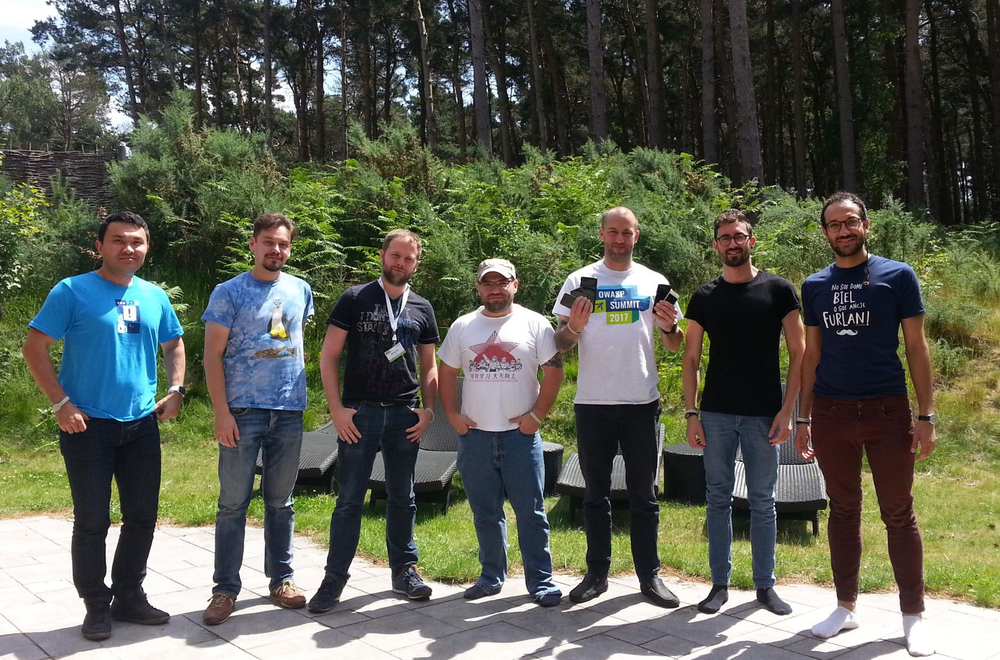

# 介绍

欢迎使用OWASP移动安全测试指南。随时浏览现有内容，但请注意，该内容可能随时更改。 iOS和Android在每个主要（次要）版本中都引入了新的API和最佳实践，并且每天都存在漏洞。

如果您有任何反馈或建议，或者想做出贡献，请在GitHub上创建问题或在Slack上ping我们。有关说明，请参见自述文件：

[https://www.github.com/OWASP/owasp-mstg/](https://www.github.com/OWASP/owasp-mstg/)

\*\*松鼠（名词复数）：鼠尾草属的任何树栖鞘内鼠类啮齿类动物，例如寻常葡萄球菌（S. vulgaris）（红松鼠）或S. carolinensis（灰松鼠），尾巴浓密，以坚果，种子等为食

在一个美丽的夏日，在OWASP安全峰会2017期间，一群约7名年轻男子，一名妇女和大约三只松鼠在沃本森林的别墅里相遇。到目前为止，没有什么异常。但您几乎不知道，在接下来的五天内，他们将不仅重新定义移动应用程序的安全性，而且重新定义书籍本身的基本原理（具有讽刺意味的是，该事件发生在布莱奇利公园附近，曾经是伟大的艾伦的住所和工作场所）图灵）。

也许那将是遥远的。但是至少，他们为不寻常的安全书提供了概念证明。 《移动安全测试指南》（MSTG）是一项开放，敏捷，众包的工作，它由来自世界各地的数十位作者和审阅者提供。

由于这不是一本普通的安全书，因此引言中并未列出令人印象深刻的事实和数据证明了当今时代移动设备的重要性。它还没有解释移动应用程序安全性是如何被破坏的，以及为什么迫切需要这样的书，而作者也不感谢没有他们的妻子和朋友，没有这本书是不可能的。

但是，我们确实向读者传达了一条信息！ OWASP移动安全测试指南的第一条规则是：不要仅仅遵循OWASP移动安全测试指南。要想在移动应用程序安全方面取得真正的卓越成就，就需要对移动操作系统，编码，网络安全性，密码学以及许多其他事物有深入的了解，其中许多内容我们只能在本书中简要介绍。不要停止安全性测试。编写自己的应用程序，编译自己的内核，剖析移动恶意软件，了解事物的发展趋势。随着您不断学习新事物，请考虑自己为MSTG做出贡献！或者，正如他们所说：“执行拉取请求”。

