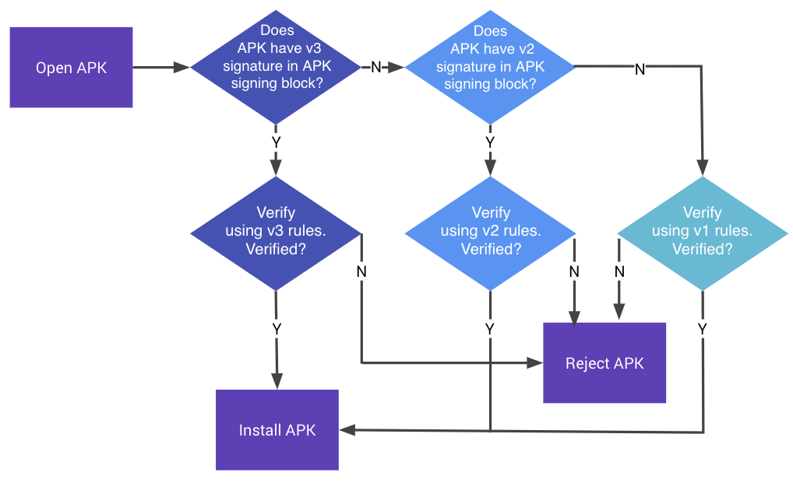

# Android 平台概述

本节从架构角度介绍Android平台。 讨论了以下五个关键领域：

1. Android安全架构
2. Android应用程序结构
3. 进程间通信（IPC）
4. Android应用程序发布
5. Android应用程序的攻击面

访问官方[Android开发人员文档网站](https://developer.android.com/index.html) 有关Android平台的更多详细信息。

## Android 安全架构

Android是Google开发的基于Linux的开放源代码平台，用作移动操作系统（OS）。 如今，该平台已成为各种现代技术（例如手机，平板电脑，可穿戴技术，电视和其他“智能”设备）的基础。 典型的Android版本附带了一系列预安装（“库存”）应用程序，并支持通过Google Play商店和其他市场安装第三方应用程序。

Android的软件堆栈由几个不同的层组成。 每一层定义接口并提供特定的服务。


在最低级别上，Android基于Linux内核的变体。 在内核之上，硬件抽象层（HAL）定义了用于与内置硬件组件进行交互的标准接口。 几种HAL实现打包在Android系统需要时调用的共享库模块中。 这是允许应用程序与设备的硬件进行交互的基础，例如，它允许股票电话应用程序使用设备的麦克风和扬声器。

Android应用程序通常用Java编写并编译为Dalvik字节码，这与传统的Java字节码有些不同。 通过首先将Java代码编译为.class文件，然后使用`dx`工具将JVM字节码转换为Dalvik .dex格式来创建Dalvik字节码。


当前版本的Android在Android运行时（ART）上执行此字节码。 ART是Android原始运行时Dalvik虚拟机的后继者。 Dalvik和ART之间的主要区别在于字节码的执行方式。

在Dalvik中，字节码在执行时转换为机器代码，该过程称为“即时”（JIT）编译。 JIT编译会对性能产生不利影响：每次执行应用程序时都必须执行编译。为了提高性能，ART引入了“提前”（AOT）编译。顾名思义，应用会在首次执行之前进行预编译。此预编译的机器代码用于所有后续执行。 AOT在降低功耗的同时将性能提高了两倍。

Android应用程序无法直接访问硬件资源，并且每个应用程序都在自己的沙箱中运行。这样可以精确控制资源和应用程序：例如，崩溃的应用程序不会影响设备上运行的其他应用程序。同时，Android运行时控制分配给应用程序的最大系统资源数量，从而防止任何一个应用程序垄断过多的资源。

### Android 用户和群组

即使Android操作系统基于Linux，它也无法像其他类似Unix的系统那样实现用户帐户。 在Android中，Linux内核向沙盒应用程序提供了多用户支持：除少数例外，每个应用程序都像在一个单独的Linux用户下运行，与其他应用程序和操作系统的其余部分有效隔离。

文件 [system/core/include/private/android\_filesystem\_config.h](http://androidxref.com/7.1.1_r6/xref/system/core/include/private/android_filesystem_config.h) 包括预定义的用户和系统进程所分配到的组的列表。 安装其他应用程序时，会添加其他应用程序的UID（用户ID）。 有关更多详细信息，请查看陈斌的 [blog post](https://pierrchen.blogspot.mk/2016/09/an-walk-through-of-android-uidgid-based.html) 在 Android 沙箱上.

例如，Android 7.0（API级别24）定义了以下系统用户：

```c
    #define AID_ROOT             0  /* traditional unix root user */
    #define AID_SYSTEM        1000  /* system server */
    #...
    #define AID_SHELL         2000  /* adb and debug shell user */
    #...
    #define AID_APP          10000  /* first app user */
    ...
```

### Android 设备加密

Android支持Android 2.3.4（API级别10）中的设备加密，此后发生了一些大变化。 Google规定，所有运行Android 6.0（API级别23）或更高版本的设备都必须支持存储加密。 尽管某些低端设备可以免税，因为这会严重影响性能。 在以下各节中，您可以找到有关设备加密及其算法的信息。

#### 全盘加密

Android 5.0（API级别21）及更高版本支持全盘加密。 这种加密使用受用户设备密码保护的单个密钥来加密和解密userdata分区。 现在认为这种加密已被弃用，并且应尽可能使用基于文件的加密。 全盘加密具有一些缺点，例如，如果用户未输入密码，则在重新启动后无法接听电话或没有可操作的警报。

#### 基于文件的加密

Android 7.0（API级别24）支持基于文件的加密。 基于文件的加密允许使用不同的密钥对不同的文件进行加密，以便可以独立解密它们。 支持这种加密方式的设备也支持直接启动。 通过直接引导，即使用户未输入密码，设备也可以访问警报或辅助功能等功能。

#### Adiantum

AES在大多数现代Android设备上用于存储加密。实际上，AES已经成为一种被广泛使用的算法，以至于最新的处理器实现具有专用的指令集来提供硬件加速的加密和解密操作，例如带有密码学扩展的ARMv8或具有AES-NI扩展的x86。 但是，并非所有设备都能及时使用AES进行存储加密。尤其是运行Android Go的低端设备。这些设备通常使用低端处理器，例如ARM Cortex-A7，它们没有硬件加速的AES。

Adiantum是由Google的Paul Crowley和Eric Biggers设计的密码结构，用于填补那些不能以至少50 MiB / s的速度运行AES的设备的空白。 Adiantum仅依赖于加法，循环和XOR。所有处理器本身都支持这些操作。因此，低端处理器的加密速度和解密速度比使用AES的速度快4倍，解密速度快5倍。

铁线蕨是其他密码的组成：

-NH：散列函数。 -Poly1305：消息验证码（MAC）。 -XChaCha12：流密码。 -AES-256：AES的单次调用。

只要ChaCha12和AES-256被认为是安全的，Adiantum是一种新密码，但是它是安全的。它的设计师没有创建任何新的密码原语，而是依靠其他众所周知且经过深入研究的原语来创建新的性能算法。

Adiantum适用于Android 9（API级别28）和更高版本。 Linux内核5.0及更高版本本身支持该功能，而内核4.19、4.14和4.9需要修补。 Android不向应用程序开发人员提供使用Adiantum的API。此密码将由ROM开发人员或设备供应商考虑并实施，他们希望在不牺牲低端设备性能的情况下提供全盘加密。在撰写本文时，尚无实现此密码的公共密码库可在Android应用程序上使用。 应该注意的是，AES在具有AES指令集的设备上运行得更快。在那种情况下，强烈不建议使用铁线蕨。

## Android上的应用

### 与操作系统通讯

Android应用程序通过Android框架与系统服务进行交互，Android框架是提供高级Java API的抽象层。这些服务中的大多数是通过常规Java方法调用来调用的，并转换为对在后台运行的系统服务的IPC调用。系统服务的示例包括：

* 连接（Wi-Fi，蓝牙，NFC等）
* 文件
* 相机
* 地理位置（GPS）
* 麦克风

该框架还提供了常见的安全功能，例如加密。

每个新的Android版本都会更改API规范。关键的错误修复程序和安全修补程序通常也适用于早期版本。在撰写本文时，支持的最旧的Android版本是Android 7.0（API级别24-25），当前的Android版本是Android 9（API级别28）。

值得注意的API版本：

* 2012年11月推出的Android 4.2（API级别16）（SELinux推出）
* 2013年7月的Android 4.3（API级别18）（默认情况下启用SELinux）
* 2013年10月推出的Android 4.4（API级别19）（引入了几个新的API和ART）
* 2014年11月采用Android 5.0（API级别21）（默认情况下使用的是ART，并添加了许多其他功能）
* 2015年10月的Android 6.0（API级别23）（许多新功能和改进，包括授予；在运行时设置详细的权限，而不是在安装过程中全部或全部设置）
* 2016年8月，Android 7.0（API级别24-25）（ART上的新JIT编译器）
* 2017年8月，Android 8.0（API级别26-27）（许多安全性改进）
* 2018年8月推出Android 9（API级别28）。

### 普通应用程序的Linux UID / GID

Android利用Linux用户管理来隔离应用程序。 这种方法不同于传统Linux环境中的用户管理用法，在传统Linux环境中，多个应用程序通常由同一用户运行。 Android为每个Android应用程序创建一个唯一的UID，并在单独的过程中运行该应用程序。 因此，每个应用只能访问自己的资源。 此保护由Linux内核强制执行。

通常，为应用程序分配的UID在10000和99999之间。Android应用程序会根据其UID接收用户名。 例如，UID为10188的应用程序收到用户名“ u0\_a188”。 如果授予了应用程序请求的权限，则会将相应的组ID添加到应用程序的进程中。 例如，下面的应用程序的用户ID是10188。它属于组ID 3003（inet）。 该组与android.permission.INTERNET权限相关。 id命令的输出如下所示。

```text
$ id
uid=10188(u0_a188) gid=10188(u0_a188) groups=10188(u0_a188),3003(inet),
9997(everybody),50188(all_a188) context=u:r:untrusted_app:s0:c512,c768
```

组ID和权限之间的关系在文件中定义 [frameworks/base/data/etc/platform.xml](http://androidxref.com/7.1.1_r6/xref/frameworks/base/data/etc/platform.xml)

```markup
<permission name="android.permission.INTERNET" >
    <group gid="inet" />
</permission>

<permission name="android.permission.READ_LOGS" >
    <group gid="log" />
</permission>

<permission name="android.permission.WRITE_MEDIA_STORAGE" >
    <group gid="media_rw" />
    <group gid="sdcard_rw" />
</permission>
```

### 应用沙箱

应用程序在Android应用程序沙箱中执行，该应用程序将应用程序数据和代码执行与设备上的其他应用程序分开。 这种分离增加了一层安全性。

安装新应用程序会创建一个以该应用程序包命名的新目录，该目录将导致以下路径：`/ data / data / [package-name]`。 此目录保存应用程序的数据。 设置Linux目录权限，以便只能使用应用程序的唯一UID读取和写入目录。


我们可以通过查看`/ data / data`文件夹中的文件系统权限来确认这一点。 例如，我们可以看到Google Chrome和Calendar分别分配了一个目录，并在不同的用户帐户下运行：

```text
drwx------  4 u0_a97              u0_a97              4096 2017-01-18 14:27 com.android.calendar
drwx------  6 u0_a120             u0_a120             4096 2017-01-19 12:54 com.android.chrome
```

希望其应用共享公用沙箱的开发人员可以避开沙箱。 当两个应用程序使用相同的证书签名并显式共享相同的用户ID时 \(having the _sharedUserId_ in their _AndroidManifest.xml_ files\), 每个人都可以访问对方的数据目录。 请参阅以下示例以在NFC应用中实现此目的：

```markup
<manifest xmlns:android="http://schemas.android.com/apk/res/android"
  package="com.android.nfc"
  android:sharedUserId="android.uid.nfc">
```

#### Zygote

`Zygote`进程在期间启动[Android初始化](https://github.com/dogriffiths/HeadFirstAndroid/wiki/How-Android-Apps-are-Built-and-Run). Zygote是用于启动应用程序的系统服务。 Zygote流程是一个“基本”流程，其中包含应用程序需要的所有核心库。 启动后，Zygote打开套接字`/ dev / socket / zygote`并侦听来自本地客户端的连接。 接收到连接后，它将派生一个新进程，然后该进程将加载并执行特定于应用程序的代码。

#### 应用生命周期

在Android中，应用进程的生存期由操作系统控制。当启动应用程序组件并且同一应用程序尚未运行任何其他组件时，将创建一个新的Linux进程。当不再需要后者或需要回收内存以运行更重要的应用程序时，Android可能会终止该过程。终止进程的决定主要与用户与进程交互的状态有关。通常，进程可以处于四种状态之一。

-前台进程（例如，在屏幕顶部运行的活动或正在运行的BroadcastReceive） -可见过程是用户意识到的过程，因此将其杀死将对用户体验产生明显的负面影响。一个示例是运行一种活动，该活动在屏幕上对用户可见，但在前台却不可见。

-服务进程是托管已由 `startService`方法启动的服务的进程。尽管这些进程对用户不是直接可见的，但是它们通常是用户关心的事情（例如，后台网络数据的上载或下载），因此，除非没有足够的内存来保留所有前景和内存，否则系统将始终保持这些进程运行。可见的过程。 -缓存进程是当前不需要的进程，因此系统可以在需要内存时随意杀死它。 应用必须实现对许多事件做出反应的回调方法；例如，在首次创建应用进程时会调用`onCreate`处理程序。其他回调方法包括`onLowMemory`，`onTrimMemory`和`onConfigurationChanged`。

#### 应用套件

Android应用程序可以以两种形式发送：Android软件包工具包（APK）文件或[Android应用程序捆绑包](https://developer.android.com/guide/app-bundle) \(.aab\). Android App Bundles提供了应用程序所需的所有资源，但推迟了APK的生成及其向Google Play的签名。 应用程序捆绑包是签名的二进制文件，其中包含几个模块中的应用程序代码。 基本模块包含应用程序的核心。 基本模块可以用各种模块扩展，这些模块包含该应用程序的新增强功能/功能，如中进一步说明[应用程序捆绑包的开发人员文档](https://developer.android.com/guide/app-bundle). 如果您有Android App Bundle，则最好使用 [bundletool](https://developer.android.com/studio/command-line/bundletool) Google提供的命令行工具来构建未签名的APK，以便使用APK上的现有工具。 您可以通过运行以下命令从AAB文件创建APK：

```text
$ bundletool build-apks --bundle=/MyApp/my_app.aab --output=/MyApp/my_app.apks
```

如果要创建已签名的APK，准备将其部署到测试设备，请使用：

```text
$ bundletool build-apks --bundle=/MyApp/my_app.aab --output=/MyApp/my_app.apks
--ks=/MyApp/keystore.jks
--ks-pass=file:/MyApp/keystore.pwd
--ks-key-alias=MyKeyAlias
--key-pass=file:/MyApp/key.pwd
```

我们建议您同时测试带有和不带有附加模块的APK，以便清楚了解附加模块是否引入和/或修复了基本模块的安全性问题。

#### Android 清单

每个应用程序都有一个Android Manifest文件，该文件以二进制XML格式嵌入内容。 该文件的标准名称是AndroidManifest.xml。 它位于应用程序的Android Package Kit（APK）文件的根目录中。

清单文件描述了应用程序的结构，其组件（活动，服务，内容提供者和意图接收者）以及请求的权限。 它还包含常规应用程序元数据，例如应用程序的图标，版本号和主题。 该文件可能会列出其他信息，例如兼容的API（最小，目标和最大SDK版本）以及[可以在其上安装的存储类型（外部或内部）](https://developer.android.com/guide/topics/data/install-location.html).

这是清单文件的示例，其中包括程序包名称（约定是反向URL，但是可以接受任何字符串）。 它还列出了应用程序版本，相关的SDK，所需的权限，公开的内容提供程序，与意图过滤器一起使用的广播接收器以及该应用程序及其活动的描述：

```markup
<manifest
    package="com.owasp.myapplication"
    android:versionCode="0.1" >

    <uses-sdk android:minSdkVersion="12"
        android:targetSdkVersion="22"
        android:maxSdkVersion="25" />

    <uses-permission android:name="android.permission.INTERNET" />

    <provider
        android:name="com.owasp.myapplication.myProvider"
        android:exported="false" />

    <receiver android:name=".myReceiver" >
        <intent-filter>
            <action android:name="com.owasp.myapplication.myaction" />
        </intent-filter>
    </receiver>

    <application
        android:icon="@drawable/ic_launcher"
        android:label="@string/app_name"
        android:theme="@style/Theme.Material.Light" >
        <activity
            android:name="com.owasp.myapplication.MainActivity" >
            <intent-filter>
                <action android:name="android.intent.action.MAIN" />
            </intent-filter>
        </activity>
    </application>
</manifest>
```

可用清单选项的完整列表在官方中 [Android Manifest文件文档](https://developer.android.com/guide/topics/manifest/manifest-intro.html).

### 应用组件

Android应用程序由几个高级组件组成。 主要组件有：

* 活动
* 碎片
* 目的
* 广播接收器
* 内容提供商和服务

所有这些元素均由Android操作系统以API可用的预定义类的形式提供。

#### 活动项目

活动构成任何应用程序的可见部分。 每个屏幕只有一个活动，因此具有三个不同屏幕的应用程序可以实现三个不同的活动。 通过扩展Activity类来声明活动。 它们包含所有用户界面元素：片段，视图和布局。

每个活动都需要使用以下语法在Android清单中声明：

```markup
<activity android:name="ActivityName">
</activity>
```

清单中未声明的活动无法显示，尝试启动它们将引发异常。

像应用程序一样，活动有其自己的生命周期，需要监视系统更改以进行处理。 活动可以处于以下状态：活动，暂停，停止和不活动。 这些状态由Android操作系统管理。 因此，活动可以实施以下事件管理器：

* onCreate
* onSaveInstanceState
* onStart
* onResume
* onRestoreInstanceState
* onPause
* onStop
* onRestart
* onDestroy

应用程序可能未明确实现所有事件管理器，在这种情况下，将采取默认操作。 通常，应用开发人员至少会覆盖`onCreate` 管理器。 这就是大多数用户界面组件的声明和初始化方式。 当必须明确释放资源（例如网络连接或数据库连接）或在应用程序关闭时必须执行特定操作时，可能会覆盖`onDestroy`。

#### 碎片

片段代表活动中的行为或用户界面的一部分。 片段是在Honeycomb 3.0版本（API级别11）中引入的。

片段旨在封装界面的各个部分，以促进重用性和适应不同的屏幕尺寸。 片段是自治实体，因为它们包含所有必需的组件（它们具有自己的布局，按钮等）。 但是，它们必须与活动集成在一起才有用：片段不能单独存在。 它们有自己的生命周期，与实施它们的活动的生命周期紧密相关。

因为片段具有自己的生命周期，所以Fragment类包含可以重新定义和扩展的事件管理器。 这些事件管理器包括onAttach，onCreate，onStart，onDestroy和onDetach。 还有其他几个。 读者应参考[Android Fragment规范](https://developer.android.com/reference/android/app/Fragment.html) 更多细节。

可以通过扩展Android提供的Fragment类轻松实现片段：

```java
public class myFragment extends Fragment {
    ...
}
```

片段不需要在清单文件中声明，因为它们取决于活动。

要管理其片段，活动可以使用片段管理器（FragmentManager类）。 此类使查找，添加，删除和替换关联的片段变得容易。

可以通过以下方式创建片段管理器：片段不一定具有用户界面。 它们可以是管理与应用程序用户界面有关的后台操作的便捷有效方式。 可以将一个片段声明为持久片段，以便即使系统的活动被销毁也可以保留其状态。

```java
FragmentManager fm = getFragmentManager();
```

Fragement 不一定具有用户界面。 它们可以是管理与应用程序用户界面有关的后台操作的便捷有效方式。 可以将一个片段声明为持久片段，以便即使系统的活动被销毁也可以保留其状态。

#### 进程间通讯

如我们所知，每个Android进程都有其自己的沙盒地址空间。进程间通信功能允许应用程序安全地交换信号和数据。 Android的IPC不再依赖默认的Linux IPC设施，而是基于Binder（OpenBinder的自定义实现）。大多数Android系统服务和所有高级IPC服务都依赖于Binder。

_活页夹_一词代表许多不同的事物，包括：

* 活页夹驱动程序：内核级驱动程序
* 活页夹协议：用于与活页夹驱动程序通信的基于ioctl的低级协议
* IBinder接口：Binder对象实现的明确定义的行为
* 活页夹对象：IBinder接口的通用实现
* 活页夹服务：活页夹对象的实现；例如位置服务和传感器服务
* 活页夹客户端：使用活页夹服务的对象

活页夹框架包括一个客户端-服务器通信模型。要使用IPC，应用程序会在代理对象中调用IPC方法。代理对象透明地将调用参数“封送”到“包裹”中，并将事务发送到作为字符驱动器（/ dev / binder）实现的Binder服务器。服务器拥有用于处理传入请求的线程池，并将消息传递到目标对象。从客户端应用程序的角度来看，所有这些似乎都像是一个常规方法调用—所有繁重的工作都是由Binder框架完成的。


_活页夹概述-图片来源：_[_Android Binder by Thorsten Schreiber_](https://www.nds.rub.de/media/attachments/files/2011/10/main.pdf)

允许其他应用程序绑定到它们的服务称为_绑定服务_。 这些服务必须为客户端提供IBinder接口。 开发人员使用Android接口描述符语言（AIDL）编写用于远程服务的接口。

Servicemanager是一个系统守护程序，用于管理系统服务的注册和查找。 它维护所有已注册服务的名称/活页夹对列表。 服务使用`addService`添加，并使用`android.os.ServiceManager`中的静态`getService`方法按名称检索：

```java
  public static IBinder getService(String name)
```

您可以使用以下命令查询系统服务列表 `service list` 命令.

```text
$ adb shell service list
Found 99 services:
0 carrier_config: [com.android.internal.telephony.ICarrierConfigLoader]
1 phone: [com.android.internal.telephony.ITelephony]
2 isms: [com.android.internal.telephony.ISms]
3 iphonesubinfo: [com.android.internal.telephony.IPhoneSubInfo]
```

### Intents

_意图消息传递_ 是建立在Binder之上的异步通信框架。此框架允许点对点和发布-订阅消息传递。 _Intent_ 是一个消息传递对象，可用于请求另一个应用程序组件的操作。尽管意图通过多种方式促进了组件间的通信，但是存在三个基本用例：

-开始活动 -活动代表应用程序中的单个屏幕。您可以通过向initActivity传递意图来启动活动的新实例。目的描述活动并携带必要的数据。 -开始服务 服务是在没有用户界面的情况下在后台执行操作的组件。在Android 5.0（API级别21）及更高版本中，您可以使用JobScheduler启动服务。 -播放广播 -广播是任何应用均可接收的消息。系统为系统事件提供广播，包括系统启动和充电初始化。您可以通过将意图传递给`sendBroadcast`或`sendOrderedBroadcast`来向其他应用传递广播。

有两种类型的意图。明确的意图为将要启动的组件命名（完全限定的类名）。例如：

```java
    Intent intent = new Intent(this, myActivity.myClass);
```

隐式意图被发送到OS，以对给定的数据集（在下面的示例中，OWASP网站的URL）执行给定的操作。 由系统决定哪个应用程序或类将执行相应的服务。 例如：

```java
    Intent intent = new Intent(Intent.MY_ACTION, Uri.parse("https://www.owasp.org"));
```

_意图过滤器_是Android清单文件中的一个表达式，用于指定组件希望接收的意图类型。例如，通过为活动声明一个意图过滤器，您可以使其他应用程序以某种意图直接启动您的活动。同样，如果您未为活动声明任何意图过滤器，则只能以明确的意图开始您的活动。

Android使用意图将消息广播到应用程序（例如来电或SMS），重要的电源信息（例如电池电量不足）和网络变化（例如连接断开）。可以将额外的数据添加到意图中（通过`putExtra` /`getExtras`）。

这是操作系统发送的意图的简短列表。所有常量都在Intent类中定义，整个列表在官方的Android文档中：

-ACTION\_CAMERA\_BUTTON -ACTION\_MEDIA\_EJECT -ACTION\_NEW\_OUTGOING\_CALL -ACTION\_TIMEZONE\_CHANGED

为了提高安全性和隐私性，本地广播管理器用于在应用程序中发送和接收意图，而无需将其发送到操作系统的其余部分。这对于确保敏感和私有数据不会离开应用程序边界（例如地理位置数据）非常有用。

#### 广播接收器

广播接收器是允许应用程序从其他应用程序和系统本身接收通知的组件。 使用它们，应用程序可以对事件做出反应（内部事件，其他应用程序发起或操作系统发起）。 它们通常用于更新用户界面，启动服务，更新内容以及创建用户通知。

有两种方法可以使系统知道广播接收器。 一种方法是在Android Manifest文件中声明它。 清单应指定广播接收器和意图过滤器之间的关联，以指示接收器要监听的动作。

在清单中具有意图过滤器的示例广播接收器声明：

```markup
<receiver android:name=".myReceiver" >
    <intent-filter>
        <action android:name="com.owasp.myapplication.MY_ACTION" />
    </intent-filter>
</receiver>
```

请注意，在此示例中，广播接收器不包括 [`android:exported`](https://developer.android.com/guide/topics/manifest/receiver-element) 属性。 定义了至少一个过滤器后，默认值将设置为“ true”。 如果没有任何过滤器，则将其设置为“ false”。

另一种方法是在代码中动态创建接收器，然后将其注册到 \[`Context.registerReceiver`\]\([https://developer.android.com/reference/android/content/Context.html\#registerReceiver\(android.content.BroadcastReceiver,%2520android.content.IntentFilter](https://developer.android.com/reference/android/content/Context.html#registerReceiver%28android.content.BroadcastReceiver,%2520android.content.IntentFilter)\) "Context.registerReceiver"\) method.

动态注册广播接收器的示例：

```java
// Define a broadcast receiver
myReceiver = new BroadcastReceiver() {
    @Override
    public void onReceive(Context context, Intent intent) {
        Log.d(TAG, "Intent received by myReceiver");
    }
};
// Define an intent filter with actions that the broadcast receiver listens for
IntentFilter intentFilter = new IntentFilter();
intentFilter.addAction("com.owasp.myapplication.MY_ACTION");
// To register the broadcast receiver
registerReceiver(myReceiver, intentFilter);
// To un-register the broadcast receiver
unregisterReceiver(myReceiver);
```

请注意，当提出相关意图时，系统会自动使用注册的接收者启动应用程序。

根据 [Broadcasts Overview](https://developer.android.com/guide/components/broadcasts), 如果广播没有专门针对某个应用，则将其视为“隐式”。 收到隐式广播后，Android会在其过滤器中列出已注册给定操作的所有应用。 如果已为同一操作注册了多个应用程序，则Android将提示用户从可用应用程序列表中进行选择。

广播接收器的一个有趣的功能是可以对它们进行优先级排序。 这样，将根据所有授权接收者的优先级将其意图传达给他们。 优先级可以通过android：priority属性分配给清单中的意图过滤器，也可以通过 \[`IntentFilter.setPriority`\]\([https://developer.android.com/reference/android/content/IntentFilter\#setPriority\(int](https://developer.android.com/reference/android/content/IntentFilter#setPriority%28int)\) "IntentFilter.setPriority"\) 方法。 但是，请注意，具有相同优先级的接收方将 [run in an arbitrary order](https://developer.android.com/guide/components/broadcasts.html#sending-broadcasts).

如果您的应用程序不应该跨应用程序发送广播，请使用本地广播管理器 \([`LocalBroadcastManager`](https://developer.android.com/reference/androidx/localbroadcastmanager/content/LocalBroadcastManager.html)\). 它们可用于确保仅从内部应用程序接收到意图，而来自任何其他应用程序的任何意图都将被丢弃。 由于不涉及进程间通信，因此对于提高应用程序的安全性和效率非常有用。 但是，请注意，`LocalBroadcastManager`类是 [deprecated](https://developer.android.com/reference/androidx/localbroadcastmanager/content/LocalBroadcastManager.html) 并且Google建议使用其他替代方法，例如 [`LiveData`](https://developer.android.com/reference/androidx/lifecycle/LiveData.html).

有关广播接收器的更多安全注意事项，请参阅[安全注意事项和最佳做法](https://developer.android.com/guide/components/broadcasts.html#security-and-best-practices).

**隐式广播接收器限制**

根据 [Background Optimizations](https://developer.android.com/topic/performance/background-optimization), 除非其使用“ Context.registerReceiver（）”注册其广播接收器，否则面向Android 7.0（API级别24）或更高版本的应用将不再接收“ CONNECTIVITY\_ACTION”广播。 系统也不会发送“ ACTION\_NEW\_PICTURE”和“ ACTION\_NEW\_VIDEO”广播。

根据 [Background Execution Limits](https://developer.android.com/about/versions/oreo/background.html#broadcasts), 针对Android 8.0（API级别26）或更高版本的应用不能 除了[Implicit Broadcast Exceptions](https://developer.android.com/guide/components/broadcast-exceptions). 在运行时通过调用Context.registerReceiver创建的广播接收器不受此限制的影响。

根据 [Changes to System Broadcasts](https://developer.android.com/guide/components/broadcasts#changes-system-broadcasts), 从Android 9（API级别28）开始，`NETWORK_STATE_CHANGED_ACTION` 广播不会接收到有关用户位置的信息或个人身份数据。

#### 内容提供者

Android使用SQLite永久存储数据：与Linux一样，数据存储在文件中。 SQLite是一种轻便，高效，开源的关系数据存储技术，不需要太多的处理能力，因此非常适合移动使用。提供了具有特定类（光标，ContentValues，SQLiteOpenHelper，ContentProvider，ContentResolver等）的完整API。 SQLite不是作为单独的进程运行；它是应用程序的一部分。 默认情况下，该应用只能访问属于给定应用的数据库。但是，内容提供者提供了一种抽象数据源（包括数据库和平面文件）的强大机制；它们还提供了一种标准高效的机制，可在应用程序（包括本地应用程序）之间共享数据。为了让其他应用程序可以访问，需要在将共享内容的应用程序的清单文件中明确声明内容提供程序。只要未声明内容提供者，它们就不会被导出，只能由创建它们的应用程序调用。

内容提供者是通过URI寻址方案实现的：它们都使用content：//模型。不管源的类型（SQLite数据库，平面文件等）如何，寻址方案始终是相同的，从而抽象化了源并为开发人员提供了独特的方案。内容提供者提供所有常规的数据库操作：创建，读取，更新，删除。这意味着清单文件中具有适当权限的任何应用程序都可以操纵其他应用程序中的数据。

#### 服务

服务是Android OS组件（基于Service类），它们在后台执行任务（数据处理，启动意图和通知等），而无需提供用户界面。 服务旨在长期运行流程。 它们的系统优先级低于活动应用程序的优先级，也高于非活动应用程序的优先级。 因此，它们不太可能在系统需要资源时被杀死，并且可以将它们配置为在有足够资源可用时自动重新启动。 活动在主应用程序线程中执行。 它们是运行异步任务的理想选择。

#### 权限

由于Android应用程序安装在沙箱中，并且最初无法访问用户信息和系统组件（例如相机和麦克风），因此Android为系统提供了针对该应用程序可以请求的某些任务的一组预定义权限。 例如，如果您希望您的应用使用手机的摄像头，则必须请求“ android.permission.CAMERA”权限。 在Android 6.0（API级别23）之前，安装时会授予应用请求的所有权限。 从API级别23开始，用户必须在应用执行期间批准一些权限请求。

**保护等级**

Android权限根据其提供的保护级别进行排名，分为四类：

* _正常_：较低的保护级别。它使应用程序可以访问隔离的应用程序级功能，而对其他应用程序，用户或系统的风险最小。它是在应用安装过程中授予的，并且是默认的保护级别：

  范例：「android.permission.INTERNET」

* _危险_：此权限允许该应用执行可能会影响用户隐私或用户设备正常操作的操作。在安装过程中可能不会授予该级别的权限；用户必须决定应用程序是否应具有此权限。

  范例：`android.permission.RECORD_AUDIO`

* _签名_：仅当使用与声明许可的应用相同的证书对请求的应用进行签名时，才授予此许可。如果签名匹配，则自动授予权限。

  范例：`android.permission.ACCESS_MOCK_LOCATION`

* _SystemOrSignature_：此权限仅授予嵌入在系统映像中或使用与声明该权限的应用程序签名的证书相同的证书签名的应用程序。

  示例：`android.permission.ACCESS_DOWNLOAD_MANAGER`

**申请权限**

应用可以在清单中包含`<uses-permission />`标签，以请求保护级别“正常”，“危险”和“签名”的权限。 下面的示例显示一个AndroidManifest.xml示例，该示例请求读取SMS消息的权限：

```markup
<manifest xmlns:android="http://schemas.android.com/apk/res/android"
    package="com.permissions.sample" ...>

    <uses-permission android:name="android.permission.RECEIVE_SMS" />
    <application>...</application>
</manifest>
```

**声明权限**

应用程序可以向系统上安装的其他应用程序公开功能和内容。 为了限制对自己组件的访问，它可以使用Android的任何[预定义权限](https://developer.android.com/reference/android/Manifest.permission.html) 或定义自己的。 使用`<permission>`元素声明新的许可。 以下示例显示了一个声明权限的应用程序：

```markup
<manifest xmlns:android="http://schemas.android.com/apk/res/android"
    package="com.permissions.sample" ...>

    <permission
    android:name="com.permissions.sample.ACCESS_USER_INFO"
    android:protectionLevel="signature" />
    <application>...</application>
</manifest>
```

上面的代码定义了一个新的名为`com.permissions.sample.ACCESS_USER_INFO`的权限，其保护级别为`Signature`。 只有具有相同开发者证书的应用才能访问受此权限保护的任何组件。

**在Android组件上执行权限**

Android组件可以使用权限进行保护。 活动，服务，内容提供者和广播接收者—都可以使用权限机制来保护其接口。 通过将属性 _android：permission_ 添加到AndroidManifest.xml中的相应组件标签，可以在 _Activity_，_Services_ 和 _Broadcast Receivers_ 上实施权限：

```markup
<receiver
    android:name="com.permissions.sample.AnalyticsReceiver"
    android:enabled="true"
    android:permission="com.permissions.sample.ACCESS_USER_INFO">
    ...
</receiver>
```

_内容提供者_有些不同。 它们支持一组单独的权限，用于使用内容URI读取，写入和访问内容提供者。

-`android：writePermission`，`android：readPermission`：开发人员可以设置单独的读取或写入权限。 -`android：permission`：一般权限，将控制对内容提供者的读写。 -`android：grantUriPermissions`：`“ true”`，如果可以使用内容URI访问内容提供者（访问会暂时绕过其他权限的限制），否则返回“ false”。

## 签名和发布过程

成功开发应用程序后，下一步就是发布并与他人共享。 但是，由于多种原因，不能将应用简单地添加到商店并进行共享-必须对其进行签名。 加密签名充当应用程序开发人员放置的可验证标记。 它标识了应用程序的作者，并确保该应用程序自首次发布以来就没有被修改过。

### 签署过程

在开发过程中，将使用自动生成的证书对应用进行签名。 该证书本质上是不安全的，仅用于调试。 大多数商店不接受这种发布证书。 因此，必须创建具有更安全功能的证书。 在Android设备上安装应用程序后，程序包管理器将确保已使用相应APK中包含的证书对应用程序进行了签名。 如果证书的公钥与用于在设备上签署任何其他APK的密钥相匹配，则新的APK可能会与先前存在的APK共享一个UID。 这促进了单个供应商的应用程序之间的交互。 或者，可以为签名保护级别指定安全权限。 这将限制对使用相同密钥签名的应用程序的访问。

### APK 签名方案

Android支持三种应用程序签名方案。 从Android 9（API级别28）开始，可以使用APK签名方案v3（v3方案），APK签名方案v2（v2方案）或JAR签名（v1方案）来验证APK。 对于Android 7.0（API级别24）及更高版本，可以使用APK签名方案v2（v2方案）或JAR签名（v1方案）来验证APK。 为了向后兼容，可以使用多种签名方案对APK进行签名，以使该应用程序可以同时在新旧SDK版本上运行。 [旧平台忽略v2签名，仅验证v1签名](https://source.android.com/security/apksigning/).

#### JAR签名（v1方案）

应用签名的原始版本将签名的APK实现为标准的签名JAR，其中必须包含“ META-INF / MANIFEST.MF”中的所有条目。 所有文件都必须使用通用证书签名。 此方案不保护APK的某些部分，例如ZIP元数据。 该方案的缺点是APK验证程序需要在应用签名之前处理不受信任的数据结构，并且验证程序会丢弃数据结构未涵盖的数据。 同样，APK验证程序必须解压缩所有压缩文件，这会占用大量时间和内存。

#### APK签名方案（v2方案）

使用APK签名方案，可以对完整的APK进行哈希处理和签名，然后创建一个APK签名块并将其插入APK。 在验证期间，v2方案检查整个APK文件的签名。 这种形式的APK验证速度更快，并提供了更全面的保护以防修改。 您可以在下面看到[v2方案的APK签名验证过程](https://source.android.com/security/apksigning/v2#verification)


### APK签名方案（v3方案）

v3 APK签名块格式与v2相同。 V3将有关受支持的SDK版本和旋转证明结构的信息添加到APK签名块。在Android 9（API级别28）及更高版本中，可以根据APK签名方案v3，v2或v1方案来验证APK。较旧的平台会忽略v3签名，并尝试先验证v2，然后再验证v1签名。

签名块的签名数据中的旋转证明属性由单链接列表组成，每个节点包含用于对应用程序的先前版本进行签名的签名证书。为了使向后兼容有效，旧的签名证书对新的证书集进行签名，从而为每个新密钥提供证据，证明它应该像旧密钥一样受信任。 不再可以单独对APK进行签名，因为旋转证明结构必须具有旧的签名证书才能对新的证书集进行签名，而不是一个个地对其进行签名。您可以在下面看到[APK签名v3方案验证过程](https://source.android.com/security/apksigning/v3)



#### 创建您的证书

Android使用公共/私有证书对Android应用程序（.apk文件）进行签名。 证书是一捆信息。 就安全性而言，密钥是此信息中最重要的类型。公用证书包含用户的公用密钥，专用证书包含用户的私钥。 公共证书和私有证书是链接的。 证书是唯一的，不能重新生成。 请注意，如果证书丢失，将无法恢复，因此无法更新使用该证书签名的任何应用程序。 应用程序创建者可以重用可用KeyStore中的现有私钥/公钥对，也可以生成新的对。 在Android SDK中，使用`keytool`命令会生成一个新的密钥对。 以下命令创建一个RSA密钥对，其密钥长度为2048位，有效时间为7300天= 20年。 生成的密钥对存储在文件“ myKeyStore.jks”中，该文件位于当前目录中：

```text
$ keytool -genkey -alias myDomain -keyalg RSA -keysize 2048 -validity 7300 -keystore myKeyStore.jks -storepass myStrongPassword
```

安全存储您的密钥并确保在其整个生命周期中都保持秘密是至关重要的。有权访问密钥的任何人都可以使用您无法控制的内容将更新发布到您的应用程序（从而添加不安全的功能或使用基于签名的权限来访问共享内容）。用户对应用程序及其开发人员的信任完全基于此类证书；因此，证书保护和安全管理对于声誉和客户保留至关重要，绝不能与其他个人共享密钥。密钥存储在可以用密码保护的二进制文件中；这样的文件称为“密钥库”。 KeyStore密码应该很强，并且只有密钥创建者才能知道。因此，密钥通常存储在开发人员无法访问的专用构建计算机上。 Android证书的有效期必须长于关联应用程序的有效期（包括应用程序的更新版本）。例如，Google Play将要求证书至少在2033年10月22日之前保持有效。

#### 签署申请

签名过程的目标是将应用程序文件（.apk）与开发人员的公钥关联。为此，开发人员计算了APK文件的哈希值，并使用自己的私钥对其进行了加密。然后，第三方可以通过使用作者的公钥解密加密的哈希并验证其与APK文件的实际哈希是否匹配，来验证该应用的真实性（例如，该应用确实来自声称是发起者的用户这一事实） 。

许多集成开发环境（IDE）集成了应用程序签名过程，以使用户更轻松。请注意，某些IDE将明文形式的私钥存储在配置文件中。如果其他人能够访问此类文件并在必要时删除信息，请仔细检查。 可以使用Android SDK（API级别24或更高）提供的“ apksigner”工具从命令行对应用进行签名。它位于`[SDK-Path] / build-tools / [version]`。对于API 24.0.2及更低版本，您可以使用“ jarsigner”，它是Java JDK的一部分。有关整个过程的详细信息，请参见官方的Android文档。然而，下面给出一个例子来说明这一点。

```text
$ apksigner sign --out mySignedApp.apk --ks myKeyStore.jks myUnsignedApp.apk
```

在此示例中，未签名的应用程序（“ myUnsignedApp.apk”）将使用开发人员密钥库“ myKeyStore.jks”（位于当前目录中）的私钥进行签名。 该应用程序将成为名为“ mySignedApp.apk”的已签名应用程序，并准备发布到商店。

**Zipalign**

分发前，应始终使用`zialign`工具来对齐APK文件。 此工具可在APK中对齐所有未压缩的数据（例如图像，原始文件和4字节边界），从而有助于在应用运行时改善内存管理。

> 必须先使用Zipalign，然后才能使用apksigner对APK文件进行签名。

### 发布过程

由于Android生态系统是开放的，因此可以从任何地方（您自己的站点，任何商店等）分发应用程序。但是，Google Play是最知名，最受信任和最受欢迎的商店，而Google本身提供了它。 Amazon Appstore是Kindle设备的受信任默认存储。如果用户要从不受信任的来源安装第三方应用程序，则必须在其设备安全设置中明确允许这样做。

可以通过多种方式将应用程序安装在Android设备上：通过USB在本地，通过Google的官方应用程序商店（Google Play商店）或其他商店安装。

其他供应商可能会在实际发布应用之前对其进行审核和批准，而Google只会扫描已知的恶意软件签名；这样可以最大程度地缩短发布流程开始到公共应用程序可用性之间的时间。

发布应用非常简单；主要操作是使已签名的APK文件可下载。在Google Play上，发布从创建帐户开始，然后通过专用界面交付应用。有关详细信息，请访问[Android官方文档](https://developer.android.com/distribute/googleplay/start.html).

## Android应用攻击面

Android应用程序的攻击面由应用程序的所有组件组成，包括发布应用程序和支持其功能所需的辅助材料。 如果Android应用程序不具备以下条件，则可能容易受到攻击：

* 通过IPC通信或URL方案验证所有输入，另请参阅：
  * [Testing for Sensitive Functionality Exposure Through IPC](0x05h-testing-platform-interaction.md#testing-for-sensitive-functionality-exposure-through-ipc-mstg-platform-4)
  * [Testing Custom URL Schemes](0x05h-testing-platform-interaction.md#testing-custom-url-schemes-mstg-platform-3)
* 验证用户在输入字段中的所有输入。
* 验证WebView内部加载的内容，另请参见：
  * [Testing JavaScript Execution in WebViews](0x05h-testing-platform-interaction.md#testing-javascript-execution-in-webviews-mstg-platform-5)
  * [Testing WebView Protocol Handlers](0x05h-testing-platform-interaction.md#testing-webview-protocol-handlers-mstg-platform-6)
  * [Determining Whether Java Objects Are Exposed Through WebViews](0x05h-testing-platform-interaction.md#determining-whether-java-objects-are-exposed-through-webviews-mstg-platform-7)
* 与后端服务器安全通信或容易受到服务器与移动应用程序之间的中间人攻击，另请参阅：
  * [Testing Network Communication](../tong-yong-yi-dong-ying-yong-ce-shi-zhi-nan/0x04f-testing-network-communication.md#testing-network-communication)
  * [Android Network APIs](0x05g-testing-network-communication.md#android-network-apis)
* 安全地存储所有本地数据，或从存储中加载不受信任的数据，另请参见：
  * [Data Storage on Android](0x05d-testing-data-storage.md#data-storage-on-android)
* 保护自己免受受到破坏的环境，重新包装或其他本地攻击的侵害，另请参阅：
  * [Android Anti-Reversing Defenses](0x05j-testing-resiliency-against-reverse-engineering.md#android-anti-reversing-defenses)

