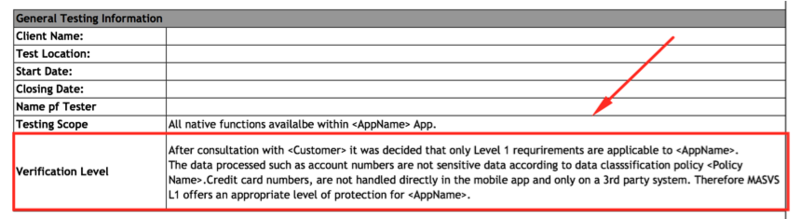

# 移动应用安全测试

在以下各节中，我们将简要概述一般的安全测试原理和关键术语。引入的概念与其他类型的渗透测试中发现的概念基本相同，因此，如果您是经验丰富的测试人员，则可能会熟悉其中的某些内容。

在整个指南中，我们使用“移动应用程序安全性测试”作为通俗易懂的词组，以指代通过静态和动态分析对移动应用程序安全性进行评估。在安全行业中，诸如“移动应用程序渗透测试”和“移动应用程序安全性审查”之类的术语在使用上有些不一致，但是这些术语指的是大致相同的事物。移动应用程序安全性测试通常是更大的安全性评估或渗透性测试的一部分，该测试包含了移动应用程序使用的客户端-服务器体系结构和服务器端API。

在本指南中，我们介绍了两种情况下的移动应用程序安全性测试。第一个是在开发生命周期即将结束时完成的“经典”安全测试。在这种情况下，测试人员将访问该应用程序即将完成或可用于生产的版本，识别安全问题，并编写一份（通常具有破坏性的）报告。从软件开发生命周期的开始就一直以需求的实现和安全测试的自动化为特征。相同的基本要求和测试用例适用于两种情况，但是高级方法和客户端交互的级别不同。

## 测试原理

### 白盒测试与黑盒测试

让我们从定义概念开始：

-进行了**黑盒测试**，而测试人员没有关于被测试应用程序的任何信息。此过程有时称为“零知识测试”。该测试的主要目的是让测试人员在探索公开可用和可发现信息的可能用途方面，表现得像真正的攻击者。 -**白盒测试**（有时称为“全面知识测试”）与黑盒测试完全相反，因为测试人员对应用程序具有充分的了解。该知识可能包含源代码，文档和图表。这种方法具有透明性，因此与黑盒测试相比，它的测试速度要快得多，并且通过获得更多的知识，测试人员可以构建更复杂，更精细的测试案例。 -**灰盒测试**”是介于上述两种测试类型之间的所有测试：某些信息提供给测试人员（通常仅用于凭据），而其他信息则打算被发现。这种测试是在测试用例的数量，成本，速度和测试范围上的有趣折衷。灰盒测试是安全行业中最常见的测试类型。

我们强烈建议您请求源代码，以便您可以尽可能高效地使用测试时间。测试人员的代码访问显然不会模拟外部攻击，但通过允许测试人员在代码级别验证每个已识别的异常或可疑行为，可以简化对漏洞的识别。如果以前没有测试过该应用程序，则可以通过白盒测试。

尽管在Android上进行反编译很简单，但是可能会混淆源代码，并且反混淆将非常耗时。因此，时间限制是测试人员可以访问源代码的另一个原因。

### 漏洞分析

漏洞分析通常是在应用程序中查找漏洞的过程。 尽管可以手动完成此操作，但通常使用自动扫描程序来识别主要漏洞。 静态和动态分析是漏洞分析的类型。

### 静态与动态分析

静态应用程序安全性测试（SAST）涉及通过手动或自动分析源代码来检查应用程序的组件而不执行它们。 OWASP提供有关[静态代码分析\]的信息](https://www.owasp.org/index.php/Static_Code_Analysis) 可以帮助您了解技术，优势，劣势和局限性。

动态应用程序安全测试（DAST）涉及在运行时检查应用程序。 此类分析可以是手动或自动的。 它通常不提供静态分析提供的信息，但它是从用户的角度检测有趣的元素（资产，功能部件，入口点等）的好方法。

现在我们已经定义了静态和动态分析，让我们深入研究。

### 静态分析

在静态分析期间，将检查移动应用程序的源代码，以确保安全控制的适当实施。 在大多数情况下，使用混合自动/手动方法。 自动扫描抓住了难以捉摸的果实，并且测试人员可以在考虑特定使用上下文的情况下探索代码库。

#### 手动代码审查

测试人员通过手动分析移动应用程序的源代码中的安全漏洞来执行手动代码检查。方法范围很广，从通过“ grep”命令进行基本关键字搜索到逐行检查源代码。 IDE（集成开发环境）通常提供基本的代码检查功能，并且可以使用各种工具进行扩展。

手动代码分析的常用方法是通过搜索某些API和关键字来识别关键的安全漏洞指标，例如与数据库相关的方法调用（例如“ executeStatement”或“ executeQuery”）。包含这些字符串的代码是进行手动分析的良好起点。

与自动代码分析相比，手动代码检查非常适合识别业务逻辑，标准违反和设计缺陷中的漏洞，特别是当代码在技术上是安全的但存在逻辑缺陷时。任何自动代码分析工具都不太可能检测到这种情况。

手动代码审查需要熟练的代码审查员，他们必须精通用于移动应用程序的语言和框架。对于审阅者而言，完整的代码审阅可能是一个缓慢，繁琐且耗时的过程，尤其是在给定具有大量依赖关系的大型代码库的情况下。

#### 自动化源代码分析

自动化分析工具可用于加快静态应用程序安全测试（SAST）的审查过程。 他们检查源代码是否符合一组预定义的规则或行业最佳实践，然后通常显示所有检测到的违规的发现或警告和标志的列表。 一些静态分析工具仅针对已编译的应用程序运行，某些必须提供原始源代码，而某些则作为集成开发环境（IDE）中的实时分析插件运行。

尽管某些静态代码分析工具包含了大量有关分析移动应用程序所需的规则和语义的信息，但它们可能会产生许多误报，尤其是如果未针对目标环境配置它们时。 因此，安全专业人员必须始终检查结果。

附录“测试工具”包括静态分析工具的列表，可以在本书的末尾找到。

### 动态分析

DAST的重点是通过实时执行对应用程序进行测试和评估。 动态分析的主要目标是在程序运行时发现安全漏洞或薄弱环节。 动态分析是在移动平台层以及针对后端服务和API进行的，后端服务和API可以分析移动应用的请求和响应模式。

动态分析通常用于检查安全机制，这些机制可针对大多数流行的攻击提供足够的保护，例如，传输中的数据泄露，身份验证和授权问题以及服务器配置错误。

### 避免误报

#### 自动扫描工具

自动化测试工具对应用程序上下文缺乏敏感性是一个挑战。这些工具可能会确定不相关的潜在问题。这样的结果称为“假阳性”。

例如，安全测试人员通常会报告可在Web浏览器中利用但与移动应用无关的漏洞。出现这种误报的原因是，用于扫描后端服务的自动化工具是基于常规的基于浏览器的Web应用程序。相应地报告了CSRF（跨站点请求伪造）和跨站点脚本（XSS）等问题。

让我们以CSRF为例。成功的CSRF攻击需要满足以下条件：

* 诱使登录用户在用于访问易受攻击站点的Web浏览器中打开恶意链接的功能。
* 客户端（浏览器）必须自动将会话cookie或其他身份验证令牌添加到请求中。

移动应用程序不能满足这些要求：即使使用WebView和基于cookie的会话管理，用户单击的任何恶意链接也会在默认浏览器中打开，该默认浏览器具有单独的cookie存储。

如果应用程序包含WebView，则存储的跨站点脚本（XSS）可能会成为问题，如果该应用程序导出JavaScript接口，则甚至可能导致命令执行。但是，由于上述原因，反映的跨站点脚本很少成为问题（即使它们是否应该存在也有争议-逃避输出只是一种最佳实践）。

> 无论如何，在执行风险评估时，请考虑利用场景。不要盲目地相信扫描工具的输出。

#### 剪贴板

在输入字段中键入数据时，剪贴板可用于复制数据。 剪贴板可在系统范围内访问，因此由应用程序共享。 恶意应用可能滥用此共享，以获取已存储在剪贴板中的敏感数据。

在iOS 9之前，恶意应用程序可能会在后台监视粘贴板，同时定期检索`[UIPasteboard generalPasteboard] .string`。 从iOS 9开始，粘贴板内容仅可用于前台的应用程序，这极大地减少了从剪贴板嗅探密码的攻击面。

对于[Android，已发布PoC漏洞](https://arstechnica.com/information-technology/2014/11/using-a-password-manager-on-android-it-may-be-wide-open-to-sniffing-attacks/) 如果密码存储在剪贴板中，以演示攻击媒介。 [禁用密码输入字段中的粘贴](https://github.com/OWASP/owasp-masvs/issues/106) 是MASVS 1.0中的要求，但由于以下几个原因而被删除：

* 防止粘贴到应用程序的输入字段中并不能防止用户仍然复制敏感信息。 由于该信息已经在用户注意到无法粘贴之前被复制了，因此恶意应用已经嗅探了剪贴板。
* 如果在密码字段上禁用了粘贴功能，则用户甚至可能会选择较弱的密码，他们会记住这些密码，并且无法再使用密码管理器，这与使应用程序更加安全的初衷相矛盾。

使用\[Facebook app\]应用程式时，您仍应注意其他应用程式会持续读取剪贴板。\([https://www.thedailybeast.com/facebook-is-spying-on-your-clipboard](https://www.thedailybeast.com/facebook-is-spying-on-your-clipboard) "Facebook正在监视您的剪贴板”）。仍然，粘贴粘贴密码是您应该意识到的安全风险，但应用程序也无法解决。

### 渗透（又称渗透测试）

经典方法涉及对应用程序最终或接近最终版本的全面安全测试，例如，在开发过程结束时可用的版本。 为了在开发过程结束时进行测试，我们建议使用[Mobile App Security Verification Standard（MASVS）](https://github.com/OWASP/owasp-masvs) 并将相关的清单作为测试的基准。 典型的安全测试的结构如下：

-**准备**-定义安全测试的范围，包括确定适用的安全控制，组织的测试目标和敏感数据。更一般而言，准备工作包括与客户端的所有同步以及合法地保护测试人员（通常是第三方）的保护。请记住，在未经书面授权的情况下攻击系统在世界许多地方都是非法的！ -“智能收集”-分析应用程序的“环境”和“建筑”上下文，以获得一般的上下文理解。 -**映射应用程序**-基于先前阶段的信息；可以通过自动扫描和手动浏览应用程序来补充。映射提供了对应用程序，其入口点，其拥有的数据以及主要潜在漏洞的透彻了解。然后可以根据漏洞的利用程度对漏洞进行排序，以便安全测试人员可以对漏洞进行优先级排序。此阶段包括创建可在测试执行期间使用的测试用例。 -**利用**-在此阶段，安全测试人员尝试利用在上一个阶段发现的漏洞来渗透应用程序。此阶段对于确定漏洞是真实的还是真实的肯定是必要的。 -**报告**-在此阶段（对于客户而言至关重要），安全测试人员将报告其能够利用的漏洞，并记录其能够执行的破坏类型，包括破坏的范围（例如，测试人员已能够非法访问的数据）。

#### 准备

在测试之前，必须确定将要测试的应用程序的安全级别。安全要求应在项目开始时确定。不同的组织具有不同的安全需求和可用于投资测试活动的资源。尽管MASVS 1级（L1）中的控件适用于所有移动应用程序，但与技术和业务利益相关者一起浏览L1级和2级（L2）MASVS控件的整个清单是确定测试覆盖范围的好方法。

组织在某些地区可能有不同的法规和法律义务。即使应用程序不处理敏感数据，某些L2要求也可能是相关的（由于行业法规或当地法律）。例如，两要素身份验证（2FA）对于金融应用可能是强制性的，并且由一个国家的中央银行和/或金融监管机构强制执行。

在与利益相关者的讨论过程中，也可以检查开发过程中较早定义的安全目标/控制。一些控件可能符合MASVS控件，但其他控件可能特定于组织或应用程序。

所有相关方必须就清单中的决定和范围达成一致，因为它们将为所有安全测试定义基准。

**与客户协调**

设置工作测试环境可能是一项艰巨的任务。例如，对企业无线访问点和网络的限制可能会阻止在客户端进行的动态分析。公司政策可能禁止在企业网络内使用有根电话或（硬件和软件）网络测试工具。实施根检测和其他逆向工程对策的应用程序可能会大大增加进一步分析所需的工作。

安全测试涉及许多侵入性任务，包括监视和操纵移动应用程序的网络流量，检查应用程序数据文件以及检测API调用。安全控制（例如证书固定和根检测）可能会阻止这些任务，并大大降低测试速度。

为了克服这些障碍，您可能需要向开发团队索取该应用的两个构建变体。一个变体应该是发布版本，以便您可以确定所实现的控件是否正常运行，并且不容易被绕开。第二个变体应该是已禁用某些安全控制的调试版本。测试两个不同的版本是覆盖所有测试用例的最有效方法。

根据参与范围的不同，这种方法可能无法实现。请求生产和调试版本以进行白盒测试将帮助您完成所有测试用例，并清楚说明应用程序的安全性成熟度。客户可能希望黑箱测试集中在生产应用程序及其安全控制有效性的评估上。

在准备阶段应讨论两种测试的范围。例如，应在测试之前确定是否应调整安全控制。下面讨论了其他主题。

**识别敏感数据**

敏感信息的分类因行业和国家而异。 此外，组织可能对敏感数据采取严格的限制，并且他们可能拥有明确定义敏感信息的数据分类策略。

可以从三种大致状态访问数据：

-**静止**-数据位于文件或数据存储中 -**正在使用**-应用程序已将数据加载到其地址空间中 -**传输中**-数据已在移动应用与终端或设备上的使用进程之间交换，例如，在IPC（进程间通信）期间

适用于每个状态的详细程度可能取决于数据的重要性和被访问的可能性。例如，保存在应用程序内存中的数据可能比Web服务器上的数据更容易通过核心转储访问，因为攻击者比Web服务器更有可能获得对移动设备的物理访问权限。

如果没有可用的数据分类策略，请使用以下通常认为敏感的信息列表：

-用户身份验证信息（凭证，PIN等） -可用于身份盗窃的个人身份信息（PII）：社会保险号，信用卡号，银行帐号，健康信息 -可以识别一个人的设备标识符 -高度敏感的数据，其妥协将导致声誉受损和/或财务成本 -任何具有法律义务的保护数据 -由应用程序（或其相关系统）生成并用于保护其他数据或系统本身的任何技术数据（例如，加密密钥）。

在测试开始之前，必须先确定“敏感数据”的定义，因为可能无法检测到没有定义的敏感数据泄漏。

**情报收集**

情报收集涉及以下信息的收集：应用程序的架构，应用程序服务的业务用例以及应用程序运行的环境。 此类信息可以分类为“环境”或“建筑”。

**环境信息**

环境信息包括：

* 组织对应用程序的目标。 功能影响用户与应用程序的交互，并且可能使某些表面比其他表面更有可能成为攻击者的目标。
* 相关行业。 不同的行业可能具有不同的风险状况。
* 利益相关者和投资者； 了解谁对该应用程序感兴趣并对其负责。
* 内部流程，工作流和组织结构。 特定于组织的内部流程和工作流可能为[业务逻辑漏洞利用创造机会](https://www.owasp.org/index.php/Testing_for_business_logic).

**架构信息**

架构信息包括：

-**移动应用程序：** 该应用程序如何访问数据并在过程中进行管理，如何与其他资源通信并管理用户会话，以及是否检测到自己在越狱或生根的电话上运行并对这些情况做出反应。 -**操作系统：** 应用程序运行所在的操作系统和操作系统版本（包括Android或iOS版本限制），该应用程序是否有望在具有移动设备管理（MDM）控件的设备上运行以及相关的操作系统 漏洞。 -**网络：** 使用安全传输协议（例如TLS），使用强密钥和加密算法（例如SHA-2）来保护网络流量加密，使用证书钉扎来验证端点等。 -**远程服务：** 应用程序使用的远程服务以及它们是否受到威胁可能会损害客户端。

#### 映射应用程序

一旦安全测试人员掌握了有关应用及其上下文的信息，下一步便是映射应用的结构和内容，例如，确定其入口点，功能和数据。

当在白盒或灰盒范式中执行渗透测试时，项目内部的任何文档（体系结构图，功能规范，代码等）都可以极大地促进该过程。如果源代码可用，则使用SAST工具可以揭示有关漏洞的宝贵信息（例如SQL注入）。 DAST工具可能支持黑盒测试并自动扫描应用程序：而测试人员将需要数小时或数天，而扫描仪可能会在几分钟内执行相同的任务。但是，重要的是要记住，自动工具有局限性，只能找到通过编程找到的东西。因此，可能需要人工分析来增加自动工具的结果（直觉通常是安全测试的关键）。

威胁建模是一个重要的工件：研讨会上的文档通常会极大地支持安全测试人员所需的许多信息（入口点，资产，漏洞，严重性等）的识别。强烈建议测试人员与客户讨论此类文档的可用性。威胁建模应该是软件开发生命周期的关键部分。它通常发生在项目的早期阶段。

[OWASP中定义的威胁建模准则](https://www.owasp.org/index.php/Application_Threat_Modeling) 通常适用于移动应用。

#### 渗透

不幸的是，时间或财务上的限制使许多渗透测试无法通过自动扫描仪进行应用程序映射（例如，用于漏洞分析）。 尽管在上一阶段发现的漏洞可能很有趣，但是必须从五个方面确认它们的相关性：

-**潜在损害**-利用此漏洞可能导致的损害 -**可重复性**-轻松再现攻击 -**可利用性**-易于执行攻击 -**受影响的用户**-受攻击影响的用户数 -**可发现性**-轻松发现漏洞

千方百计，某些漏洞可能无法利用，并且可能会造成较小的损害（如果有）。 乍看之下，其他漏洞似乎无害，但在实际测试条件下被确定为非常危险。 仔细经历开发阶段的测试人员通过描述漏洞及其影响来支持渗透测试。

### 报告

仅当安全测试人员的发现有明确记录时，它们才对客户有价值。 良好的渗透测试报告应包括（但不限于）以下信息：

-执行摘要 -范围和上下文的描述（例如目标系统） -使用的方法 -信息来源（由客户提供或在渗透测试中发现） -优先发现的结果（例如，通过DREAD分类构建的漏洞） -详细调查结果 -修复每个缺陷的建议

Internet上有许多渗透测试报告模板：Google是您的朋友！

## 安全测试和SDLC

尽管安全测试的原理在最近的历史上没有根本改变，但是软件开发技术却发生了巨大变化。 尽管敏捷实践的广泛采用加快了软件开发的速度，但安全测试人员必须变得更快，更敏捷，同时还要继续交付可信赖的软件。

下一节将重点介绍这种演变，并描述当代安全性测试。

### 软件开发生命周期中的安全性测试

毕竟，软件开发还不是很老，所以很容易观察到没有框架的情况。随着源代码的增长，我们都经历了最少的规则集来控制工作的需求。

过去，“瀑布”方法是最广泛采用的方法：开发工作按具有预定顺序的步骤进行。仅限于一步，回溯功能是Waterfall方法的一个严重缺陷。尽管它们具有重要的积极特性（提供结构，帮助测试人员明确需要进行的工作，清晰易懂等），但它们也具有消极特性（创建筒仓，行动缓慢，专业团队等）。

随着软件开发的成熟，竞争加剧，开发人员需要在创建预算较小的软件产品时对市场变化做出更快的反应。减少结构的想法变得流行，并且较小的团队进行了协作，打破了整个组织的孤岛。 “敏捷”概念诞生了（Scrum，XP和RAD是敏捷实现的著名示例）；它使更多的自治团队可以更快地合作。

安全性最初并不是软件开发的组成部分。这是事后才想到的，由运营团队在网络级别执行，他们必须弥补较差的软件安全性！尽管当软件程序位于外围时可以实现非集成的安全性，但是随着Web，移动和IoT技术出现新的软件消费类型，该概念已过时。如今，必须在软件内部“烘焙”安全性，因为补偿漏洞通常非常困难。

> 在下一节中，“ SDLC”将与“ Secure SDLC”互换使用，以帮助您将安全性视为软件开发过程的一部分的想法内部化。本着同样的精神，我们使用名称DevSecOps来强调安全性是DevOps的一部分这一事实。

### SDLC 概述

#### SDLC的一般说明

SDLC始终由相同的步骤组成（在瀑布范式中，整个过程是顺序的，在敏捷范式中是迭代的）：

* 对应用程序及其组件执行**风险评估**，以识别其风险概况。这些风险状况通常取决于组织的风险偏好和适用的法规要求。风险评估还基于各种因素，包括是否可以通过Internet访问应用程序以及应用程序处理和存储的数据类型。必须考虑各种风险：金融，营销，工业等。数据分类策略指定哪些数据是敏感数据以及如何保护它们。
* **安全要求**是在项目或开发周期的开始，即收集功能要求时确定的。创建用例时会添加 **滥用用例**。如果需要，团队（包括开发团队）将接受安全培训（例如安全编码）。

  您可以使用[OWASP MASVS](https://mobile-security.gitbook.io/masvs/) 在风险评估阶段确定移动应用程序的安全要求。 添加功能和数据类时，反复检查需求是很常见的，尤其是在敏捷项目中。

* **威胁建模**，基本上是对威胁的识别，枚举，优先级划分和初始处理，是必须在架构开发和设计过程中执行的基础工件。在威胁建模阶段之后，可以对安全模型**（威胁模型因素）**进行完善（对于软件和硬件方面）。建立**安全编码规则**，并创建将使用的“安全工具”列表。阐明了**安全测试**的策略。
* 所有安全要求和设计注意事项应存储在应用程序生命周期管理（ALM）系统（也称为问题跟踪器）中，开发/运营团队使用该系统来确保将安全要求紧密集成到开发工作流中。安全要求应包含相关的源代码片段，以便开发人员可以快速引用这些片段。创建受版本控制并仅包含这些代码段的专用存储库是一种安全的编码策略，它比传统方法（将指导文档存储在Word文档或PDF中）更有益。
* **安全地开发软件**。为了提高代码安全性，您必须完成诸如 **安全代码审查**，**静态应用程序安全性测试**和**安全性单元测试**之类的活动。尽管存在这些安全活动的质量类似物，但必须将相同的逻辑应用于安全性，例如检查，分析和测试代码中的安全缺陷（例如，缺少输入验证，无法释放所有资源等）。
* 接下来是期待已久的候选发布测试：手动和自动的 **渗透测试**（“ Pentests”）。 **动态应用程序安全测试**通常也在此阶段执行。
* 在所有利益相关者接受 **接受** 期间对软件进行 **认可** 之后，可以安全地将其转换为 **运营** 团队并投入生产。
* 经常被忽略的最后一个阶段是软件使用结束后的安全 **退役**。

下图说明了所有阶段和工件：

根据项目的总体风险状况，您可以简化（甚至跳过）某些工件，并可以添加其他工件（正式的中间批准，某些点的正式文档等）。 **始终记住两件事：SDLC旨在降低与软件开发相关的风险，并且它是一个可帮助您为此目的建立控件的框架。**这是SDLC的一般描述； 始终根据您的项目定制此框架。

#### 定义测试策略

测试策略指定了将在SDLC期间执行的测试以及测试频率。测试策略用于确保最终软件产品满足安全目标，该目标通常由客户的法律/营销/企业团队确定。 测试策略通常是在安全设计阶段，明确风险之后（在启动阶段）和代码开发之前（安全实施阶段）创建的。该策略需要诸如风险管理，先前的威胁建模和安全工程等活动的输入。

无需正式编写测试策略：它可以通过故事（在敏捷项目中）进行描述，可以在清单中快速列举，也可以指定为给定工具的测试用例。但是，必须绝对共享该策略，因为它必须由定义它的团队以外的其他团队来实施。而且，所有技术团队都必须同意它，以确保它不会给他们任何人带来不可接受的负担。

测试策略涉及以下主题：

-目标和风险描述 -实现目标的计划，降低风险，哪些测试是强制性的，谁将执行它们，如何以及何时进行

* 验收标准

为了跟踪测试策略的进度和有效性，应该定义指标，在项目期间不断更新指标，并定期进行沟通。可以写一整本有关选择相关指标的书；我们在这里只能说的是，它们取决于风险状况，项目和组织。指标示例包括以下内容：

-已成功实施的与安全控制有关的故事数目 -安全控制和敏感功能的单元测试的代码覆盖率 -通过静态分析工具为每个版本发现的安全错误的数量 -安全漏洞积压的趋势（可以按紧急程度排序）

这些只是建议；其他指标可能与您的项目更相关。度量标准是使项目处于受控状态的强大工具，只要它们为项目经理提供了有关正在发生的事情和需要改进的事情的清晰综合的观点。

区分内部团队进行的测试和独立第三方进行的测试很重要。内部测试通常对改善日常运营很有用，而第三方测试对整个组织更有利。内部测试可以经常执行，但是第三方测试每年最多进行一次或两次。同样，前者比后者便宜。 两者都是必要的，并且许多法规要求来自独立第三方的测试，因为这样的测试可能更值得信赖。

### Waterfall中的安全测试

#### 什么是瀑布以及如何安排测试活动

基本上，SDLC并不要求使用任何开发生命周期：可以肯定地说，在任何情况下都可以（并且必须！）解决安全问题。

瀑布方法在21世纪之前很流行。 最著名的应用程序称为“ V模型”，其中的阶段是按顺序执行的，您只能回溯单个步骤。 该模型的测试活动是按顺序进行的，并作为一个整体执行，主要是在生命周期的大部分应用程序开发完成时。 此活动序列意味着，即使在已确定缺陷后可以更改代码，也几乎不可能更改在项目开始时设置的体系结构和其他因素。

### 敏捷/ DevOps和DevSecOps的安全性测试

DevOps是指着重于参与软件开发（通常称为Devs）和运营（通常称为Ops）的所有利益相关者之间紧密协作的实践。 DevOps与合并Devs和Ops无关。 开发和运营团队最初是在孤岛上工作，而将开发的软件推向生产环境可能会花费大量时间。当开发团队通过与敏捷团队合作将更多的交付产品转移到生产中时，运营团队必须加快步伐以适应步伐。 DevOps是该挑战解决方案的必要改进，因为它可以使软件更快地发布给用户。这在很大程度上是通过广泛的构建自动化，测试和发布软件的过程以及基础架构更改（除了DevOps的协作方面）来实现的。这种自动化以持续集成和持续交付（CI / CD）的概念体现在部署管道中。

人们可能会认为“ DevOps”一词仅表示开发团队和运营团队之间的协作，但是，正如DevOps的思想领袖Gene Kim所说：“乍一看，问题似乎就在Devs和Ops之间，但是测试是在这里，您将拥有信息安全目标以及保护系统和数据的需求。这些都是管理的首要问题，它们已成为DevOps的一部分。”

换句话说，DevOps协作包括质量团队，安全团队以及与项目相关的许多其他团队。 今天当您听到“ DevOps”时，您可能应该想到的是[DevOpsQATestInfoSec](https://techbeacon.com/evolution-devops-new-thinking-gene-kim). 实际上，DevOps值不仅与提高速度有关，而且与提高质量，安全性，可靠性，稳定性和弹性有关。

安全对业务成功至关重要，与应用程序的整体质量，性能和可用性一样。 随着开发周期的缩短和交付频率的增加，确保从一开始就内置质量和安全性就变得至关重要。 **DevSecOps** 就是为DevOps流程增加安全性。 大多数缺陷是在生产过程中发现的。 DevOps指定了最佳实践，以在生命周期的早期尽可能多地识别缺陷，并最大程度地减少已发布应用程序中的缺陷数量。

但是，DevSecOps不仅是一个线性流程，旨在为运营提供最佳软件。 操作人员必须密切监视生产中的软件，以发现问题并通过与开发形成快速有效的反馈循环来解决问题，这也是一项任务。 DevSecOps是一个过程，在此过程中，重点强调持续改进。

这种强调的人为方面反映在创建跨职能的团队中，这些团队共同努力以实现业务成果。 本节重点讨论必要的交互并将安全性集成到开发生命周期中（从项目开始到为用户交付价值结束）。

#### 什么是敏捷和DevSecOps，以及如何安排测试活动

**总览**

自动化是DevSecOps的一项重要实践：如前所述，与传统方法相比，从开发到运营的交付频率增加了，通常需要时间的活动需要跟上，例如 提供相同的附加值，同时花费更多的时间。 因此，必须放弃非生产性活动，并必须完成基本任务。 这些更改会影响基础结构的更改，部署和安全性：

-基础架构正在以“基础架构即代码”的形式实现 -部署变得更加脚本化，通过“持续集成”和“持续交付”的概念进行翻译 -**安全活动**在整个生命周期中尽可能地自动化

以下各节提供有关这三点的更多详细信息。

**基础架构即代码**

无需手动配置计算资源（物理服务器，虚拟机等）和修改配置文件，“基础结构即代码”基于工具和自动化的使用来加快配置过程并使其更加可靠和可重复。相应的脚本通常存储在版本控制下，以方便共享和解决问题。

基础设施即代码实践促进了开发团队与运营团队之间的协作，并产生了以下结果：

-开发人员可以从熟悉的角度更好地了解基础架构，并可以准备正在运行的应用程序所需的资源。 -Ops运营的环境更适合该应用程序，并且它们与Devs共享一种语言。

基础设施即代码还促进了经典软件创建项目所需的环境的构建，例如**开发**（“ DEV”），**集成**（“ INT”），**测试**（“ PPR”试生产：一些测试通常在较早的环境中进行，而PPR测试则主要涉及不回归和性能，其数据类似于生产中使用的数据）和**生产**（“PRD”）。基础架构作为代码的价值在于环境之间可能的相似性（它们应该相同）。

基础架构即代码通常用于具有基于云的资源的项目，因为许多供应商提供了可用于供应项目（例如虚拟机，存储空间等）和进行配置（例如，修改内存大小或虚拟机使用的CPU数量）。这些API为管理员从监视控制台执行这些活动提供了替代方法。

该领域的主要工具是[Puppet](https://puppet.com/), [Terraform](https://www.terraform.io/), [Packer](https://www.packer.io/), [Chef](https://www.chef.io/chef/) 和 [Ansible](https://www.ansible.com/).

**部署方式**

部署管道的复杂程度取决于项目组织或开发团队的成熟度。在最简单的形式中，部署管道包括提交阶段。提交阶段通常涉及运行简单的编译器检查和单元测试套件，以及创建应用程序的可部署工件。候选版本是已检入版本控制系统主干的最新版本。候选发布者将由部署管道评估其是否符合为部署到生产而必须满足的标准。

提交阶段旨在向开发人员提供即时反馈，因此会在对干线的每次提交中运行。由于该频率而存在时间限制。提交阶段通常应在五分钟内完成，并且不应超过十分钟。在安全性方面，遵守此时间限制是非常具有挑战性的，因为许多安全性工具运行得不够快（＃paul，＃mcgraw）。

CI / CD在某些情况下表示“持续集成/连续交付”，在其他情况下表示“持续集成/连续部署”。实际上，逻辑是：

-持续集成构建动作（由提交触发或定期执行）使用所有源代码来构建候选版本。然后可以执行测试，并检查发行版是否符合安全性，质量等规则。如果确认符合案例，则该过程可以继续；否则，开发团队必须纠正问题并提出更改建议。 -持续交付候选版本可以进入预生产环境。如果可以随后（手动或自动）验证该版本，则部署可以继续。否则，将通知项目团队，并且必须采取适当的措施。 -连续部署版本直接从集成过渡到生产，例如，用户可以访问它们。但是，如果在先前的活动中发现了严重的缺陷，则不应释放任何产品。

具有低或中等敏感性的应用程序的交付和部署可以合并为一个步骤，并且可以在交付后执行验证。但是，强烈建议对敏感应用程序将这两个动作分开并使用强验证。

**安全**

此时，最大的问题是：既然交付代码所需的其他活动明显更快，更有效地完成了，那么如何保证安全性呢？我们如何保持适当的安全级别？降低安全性来更频繁地为用户提供价值绝对不是一件好事！

答案再次是自动化和工具：通过在整个项目生命周期中实施这两个概念，您可以维护和提高安全性。预期的安全级别越高，将进行的控制，检查点和重点就越多。以下是示例：

* 静态应用程序安全性测试可以在开发阶段进行，并且可以集成到持续集成过程中，或多或少强调扫描结果。您可以建立或多或少要求苛刻的安全编码规则，并使用SAST工具来检查其实施的有效性。
* 在构建应用程序之后（例如，在进行持续集成之后）并且在交付之前，可以再次自动执行动态应用程序安全性测试，或多或少强调结果。
* 您可以在连续阶段之间（例如，在交付和部署之间）添加手动验证检查点。

在操作过程中必须考虑使用DevOps开发的应用程序的安全性。以下是示例：

* 扫描应定期进行（在基础结构和应用程序级别）。
* 可能会定期进行渗透测试。 （生产中使用的应用程序的版本是应经过测试的版本，并且测试应在专用环境中进行，并包括与生产版本数据相似的数据。有关更多详细信息，请参阅渗透测试部分。）
* 应该进行主动监视，以发现问题并通过反馈回路尽快进行补救。

## 参考文献

* \[paul\] - M. Paul. Official \(ISC\)2 Guide to the CSSLP CBK, Second Edition \(\(ISC\)2 Press\), 2014
* \[mcgraw\] - G McGraw. Software Security: Building Security In, 2006

### OWASP MASVS

-V1.1：“已识别所有应用程序组件，并且知道它们是必需的。” -V1.3：“已经为移动应用程序和所有连接的远程服务定义了高级体系结构，并在该体系结构中解决了安全问题。” -V1.4：“明确识别了在移动应用程序上下文中被视为敏感的数据。” -V1.5：“所有应用程序组件均根据其提供的业务功能和/或安全功能进行了定义。” -V1.6：“已经为移动应用程序和相关的远程服务创建了威胁模型，用于识别潜在的威胁和对策。” -V1.7：“所有安全控件都有集中的实现。” -V1.10：“在软件开发生命周期的所有部分中都解决了安全问题。”

