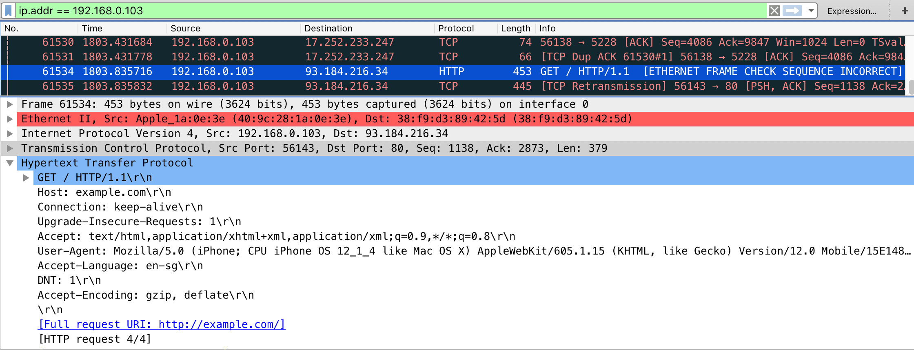

# 测试网络通信

实际上，每个网络连接的移动应用都使用超文本传输协议 （HTTP） 或 HTTP 通过传输层安全 （TLS） 发送和接收数据，并从远程端点发送和接收数据。因此，基于网络的攻击（如数据包嗅探和中间人攻击）是一个问题。在本章中，我们将讨论有关移动应用与其端点之间的网络通信的潜在漏洞、测试技术和最佳实践。

## 拦截 HTTP（S） 流量

在许多情况下，在移动设备上配置系统代理是最实用的，以便 HTTP（S） 流量通过主机上运行的 \[拦截代理\] 重定向。通过监视移动应用客户端和后端之间的请求，您可以轻松地映射可用的服务器端 API 并深入了解通信协议。此外，还可以重播和操作请求以测试服务器端漏洞。

提供几种免费的商业代理工具。下面是一些最流行的：

* [Burp Suite](https://portswigger.net/burp)
* [OWASP ZAP](https://www.owasp.org/index.php/OWASP_Zed_Attack_Proxy_Project)
* [Charles Proxy](https://www.charlesproxy.com)

要使用拦截代理，您需要在计算机上运行它，并将移动应用配置为将 HTTP（S） 请求路由到代理。在大多数情况下，在移动设备的网络设置中设置系统范围的代理就足够了 - 如果应用使用标准 HTTP API 或常用库（如"okhttp"），则会自动使用系统设置。


使用代理会中断 SSL 证书验证，应用通常无法启动 TLS 连接。要解决此问题，您可以在设备上安装代理的 CA 证书。我们将在特定于操作系统的"基本安全测试"章节中解释如何执行此操作。

## 用于处理非 HTTP 流量的 Burp 插件

拦截代理（如 Burp 和 OWASP ZAP）不会显示非 HTTP 流量，因为它们在默认情况下无法正确解码。但是，有 Burp 插件可用，例如：

* [Burp-non-HTTP-Extension](https://github.com/summitt/Burp-Non-HTTP-Extension) and
* [Mitm-relay](https://github.com/jrmdev/mitm_relay).

这些插件可以可视化非 HTTP 协议，您也将能够拦截和操作流量。

请注意，此设置有时可能会变得非常繁琐，并且不像测试 HTTP 那样简单。

## 拦截网络层上的流量

如果在应用中使用标准库，并且所有通信都通过 HTTP 完成，则使用拦截代理进行动态分析可以直接进行。但是，有几个情况下，这不起作用：

* 如果移动应用程序开发平台像 [Xamarin](https://www.xamarin.com/platform) 用于忽略系统代理设置;
* 如果移动应用程序验证是否使用了系统代理，并拒绝通过代理发送请求;
* 如果你想拦截推送通知，例如Android上的GCM/FCM;
* 如果使用 XMPP 或其他非 HTTP 协议。

在这些情况下，您需要首先监视和分析网络流量，以便决定下一步做什么。幸运的是，重定向和拦截网络通信有多种选项：

* 通过主机路由流量。您可以将计算机设置为网络网关，例如，通过使用操作系统的内置 Internet 共享功能。然后，您可以使用 [Wireshark](https://www.wireshark.org) 嗅探移动设备的任何流量;
* 有时您需要执行 MITM 攻击以强制移动设备与您通话。对于此方案，应考虑[bettercap](https://github.com/bettercap/bettercap) 将网络流量从移动设备重定向到主机（见下文）;

> Bettercap 是执行 MITM 攻击的强大工具，现在应该首选，而不是 ettercap。另请参阅 [Why another MITM tool?](https://www.bettercap.org/legacy/#why-another-mitm-tool) 在更好的上限网站。

* 在根设备上，可以使用挂钩或代码注入拦截网络相关的 API 调用（例如 HTTP 请求）并转储甚至操作这些调用的参数。这样就无需检查实际的网络数据。我们将在"反向工程和篡改"章节中更详细地讨论这些技术;
* 在 macOS 上，您可以创建一个"远程虚拟接口"，用于嗅探 iOS 设备上的所有流量。我们将在"iOS 上的基本安全测试"一章中介绍此方法。

### 模拟中间人攻击

[bettercap](https://github.com/bettercap/bettercap) 可在网络渗透测试期间使用，以模拟中间人 （MITM） 攻击。这是通过执行 [ARP poisoning or spoofing](https://en.wikipedia.org/wiki/ARP_spoofing) 目标机器。当此类攻击成功时，两台计算机之间的所有数据包将重定向到第三台计算机，该计算机充当中间人，并能够拦截流量进行分析。

要对移动应用进行全面的动态分析，应拦截所有网络流量。为了能够截取消息，应考虑几个步骤进行准备。

#### bettercap 安装

bettercap 适用于所有主要的 Linux 和 Unix 操作系统，并且应成为其各自的软件包安装机制的一部分。您需要将其安装在将充当 MITM 的计算机上。在 macOS 上，可以使用brew来安装。

```text
$ brew install bettercap
```

对于Kali Linux，你可以安装 bettercap with `apt-get`:

```text
$ apt-get update
$ apt-get install bettercap
```

还有 Ubuntu Linux 18.04 的安装说明。 [LinuxHint](https://linuxhint.com/install-bettercap-on-ubuntu-18-04-and-use-the-events-stream/).

#### 网络分析工具

安装一个工具，允许您监视和分析将重定向到计算机的网络流量。两种最常见的网络监视（或捕获）工具是：

* [Wireshark](https://www.wireshark.org) \(CLI pendant: [tshark](https://www.wireshark.org/docs/man-pages/tshark.html)\) and
* [tcpdump](https://www.tcpdump.org/tcpdump_man.html)

Wireshark 提供了 GUI，如果您不习惯命令行，则它更直接。如果您正在寻找命令行工具，则应使用 TShark 或 tcpdump。所有这些工具都可用于所有主要 Linux 和 Unix 操作系统，并且应成为其各自软件包安装机制的一部分。

#### 网络设置

为了能够获得中间位置，您的计算机应与移动电话及其通信网关处于同一无线网络中。一旦完成，你需要手机的IP地址。

### ARP Poisoning 与 bettercap

首先启动首选网络分析器工具，然后使用以下命令更好地启动，并将下面的 IP 地址 （X.X.X.X） 替换为要执行 MITM 攻击的目标。

```text
$ sudo bettercap -eval "set arp.spoof.targets X.X.X.X; arp.spoof on; set arp.spoof.internal true; set arp.spoof.fullduplex true;"
bettercap v2.22 (built for darwin amd64 with go1.12.1) [type 'help' for a list of commands]

[19:21:39] [sys.log] [inf] arp.spoof enabling forwarding
[19:21:39] [sys.log] [inf] arp.spoof arp spoofer started, probing 1 targets.
```

bettercap 然后，将自动将数据包发送到（无线）网络中的网络网关，并且您可以嗅到流量。2019 年初支持 [full duplex ARP spoofing](https://github.com/bettercap/bettercap/issues/426) was added to bettercap.

在移动电话上启动浏览器并导航到 `http://example.com`，您应该看到输出如下所示，当您使用 Wireshark。



如果是这样的话，您现在可以看到移动电话发送和接收的完整网络流量。这还包括 DNS、DHCP 和任何其他通信形式，因此可能相当"嘈杂"。因此，您应该知道如何使用 [DisplayFilters in Wireshark](https://wiki.wireshark.org/DisplayFilters) 或知道如何在tcpdump中过滤\]\([https://danielmiessler.com/study/tcpdump/\#gs.OVQjKbk](https://danielmiessler.com/study/tcpdump/#gs.OVQjKbk) "tcpdump 教程和入门示例"），仅关注相关的流量。

> 中间人攻击对任何设备和操作系统都起作用，因为攻击是通过 ARP 欺骗在 OSI 第 2 层上执行的。当您是 MITM 时，您可能无法看到清晰的文本数据，因为传输中的数据可能使用 TLS 进行加密，但它将为您提供有关所涉及的主机、使用的协议以及应用正在通信的端口的宝贵信息。

### Span Port / Port Forwarding

作为具有更好上限的 MITM 攻击的替代方案，也可以使用 Wifi 接入点 （AP） 或路由器。设置需要访问 AP 的配置，这应该在参与之前澄清。如果可以重新配置，应首先检查 AP 是否支持以下任一配置：

* 端口转发或
* 具有范围或镜像端口。

在这两种情况下，需要将 AP 配置为指向计算机 IP。然后，像Wireshark这样的工具可以再次用于监控和记录流量，以便进一步调查。

### 通过运行时检测设置代理

在根设备或越狱设备上，您还可以使用运行时挂钩来设置新的代理或重定向网络流量。这可以通过挂钩工具来实现，例如 [Inspeckage](https://github.com/ac-pm/Inspeckage) 或代码注入框架，如 [Frida](https://www.frida.re) 和 [cycript](http://www.cycript.org). 有关运行时检测的详细信息，请单击本指南的"反向工程和篡改"章节。

### 示例 - 处理 Xamarin

例如，我们现在将重定向所有请求从 Xamarin 应用程序到拦截代理。

Xamarin 是一个移动应用程序开发平台，能够生产 [native Android](https://developer.xamarin.com/guides/android/getting_started/) and [iOS apps](https://developer.xamarin.com/guides/ios/) 使用可视化工作室和 C\# 作为编程语言。

在测试 Xamarin 应用时，当您尝试在 WiFi 设置中设置系统代理时，您将无法在拦截代理中看到任何 HTTP 请求，因为 Xamarin 创建的应用不使用手机的本地代理设置。有两种方法可以解决此问题：

* 添加[default proxy to the app](https://developer.xamarin.com/api/type/System.Net.WebProxy/), 通过在"OnCreate"或"Main"方法中添加以下代码，并重新创建应用：

  ```csharp
    WebRequest.DefaultWebProxy = new WebProxy("192.168.11.1", 8080);
  ```

* 使用更好的上限来获得中间人位置 （MITM），请参阅上面有关如何设置 MITM 攻击的部分。当是 MITM 时，我们只需要将端口 443 重定向到在本地主机上运行的拦截代理。这可以通过在 macOS 上使用命令 `rdr`来实现：

  ```text
    $ echo "
    rdr pass inet proto tcp from any to any port 443 -> 127.0.0.1 port 8080
    " | sudo pfctl -ef -
  ```

拦截代理需要侦听上面端口转发规则中指定的端口，即 8080。

#### CA 证书

如果尚未完成，请在移动设备上安装 CA 证书，这将使我们能够拦截 HTTPS 请求：

* \[将拦截代理的 CA 证书安装到您的 Android 手机中\]\([https://support.portswigger.net/customer/portal/articles/1841102-installing-burp-s-ca-certificate-in-an-android-device](https://support.portswigger.net/customer/portal/articles/1841102-installing-burp-s-ca-certificate-in-an-android-device) "Installing Burp's CA Certificate in an Android Device"\).

  > 请注意，从 Android 7.0（API 级别 24）开始，操作系统不再信任用户提供的 CA 证书，除非在应用程序中指定。 绕过此安全措施将在"基本安全测试"章节中解决。

* [将拦截代理的 CA 证书安装到 iOS 手机中](https://support.portswigger.net/customer/portal/articles/1841108-configuring-an-ios-device-to-work-with-burp)

#### 拦截流量

开始使用该应用程序并触发其功能。您应该会看到 HTTP 消息显示在拦截代理中。

> 使用 bettercap 您需要在 "Support invisible proxying" 界面中激活 / Options / Edit Interface

## 验证网络上的数据加密 \(MSTG-NETWORK-1 and MSTG-NETWORK-2\)

### 概述

一个核心的移动应用功能是发送/接收数据通过不受信任的网络，如互联网。如果数据在传输过程中未得到适当保护，则有权访问网络基础设施任何部分（例如 Wi-Fi 接入点）的攻击者可能会拦截、读取或修改数据。这就是为什么纯文本网络协议很少可取的原因。

绝大多数应用都依赖于 HTTP 与后端通信。HTTPS 在加密连接中包装 HTTP（首字母缩略词 HTTPS 最初通过安全套接字层 （SSL） 引用 HTTP;SSL 是 TLS 的弃用前身）。TLS 允许对后端服务进行身份验证，并确保网络数据的机密性和完整性。

#### 推荐的 TLS 设置

确保服务器端的 TLS 配置也非常重要。SSL 已弃用，不应再使用。TLS v1.2 和 v1.3 被视为安全，但许多服务仍允许 TLS v1.0 和 v1.1 与较旧的客户端兼容。

当客户端和服务器都由同一组织控制，并且仅用于相互通信时，您可以通过以下方式提高安全性：[强化配置](https://dev.ssllabs.com/projects/best-practices/).

如果移动应用程序连接到特定服务器，则可以调整其网络堆栈，以确保服务器配置的最高安全级别。基础操作系统中缺乏支持可能会迫使移动应用程序使用较弱的配置。

**密码套件术语**

密码套件具有以下结构： **Protocol\_KeyExchangeAlgorithm\_WITH\_BlockCipher\_IntegrityCheckAlgorithm**

此结构可以描述如下：

* 密码使用的议定书
* 服务器和客户端在 TLS 握手期间用于身份验证的密钥交换算法
* 用于加密消息流的块密码
* 用于对消息进行身份验证的完整性检查算法

示例："TLS\_RSA\_WITH\_3DES\_EDE\_CBC\_SHA"

在上面的示例中，密码套件使用：

* TLS 作为协议
* RSA 非对称加密身份验证
* 3DES，用于EDE\_CBC模式的对称加密
* SHA 哈希完整性算法

请注意，在 TLSv1.3 中，密钥交换算法不是密码套件的一部分，而是在 TLS 握手期间确定。

在下面的列表中，我们将介绍密码套件的每个部分的不同算法。

协议：

* `SSLv1`
* `SSLv2` - [RFC 6176](https://tools.ietf.org/html/rfc6176)
* `SSLv3` - [RFC 6101](https://tools.ietf.org/html/rfc6101)
* `TLSv1.0` - [RFC 2246](https://www.ietf.org/rfc/rfc2246)
* `TLSv1.1` - [RFC 4346](https://tools.ietf.org/html/rfc4346)
* `TLSv1.2` - [RFC 5246](https://tools.ietf.org/html/rfc5246)
* `TLSv1.3` - [RFC 8446](https://tools.ietf.org/html/rfc8446)

密钥交换算法：

* `DSA` - [RFC 6979](https://tools.ietf.org/html/rfc6979)
* `ECDSA` - [RFC 6979](https://tools.ietf.org/html/rfc6979)
* `RSA` - [RFC 8017](https://tools.ietf.org/html/rfc8017)
* `DHE` - [RFC 2631](https://tools.ietf.org/html/rfc2631)  - [RFC 7919](https://tools.ietf.org/html/rfc7919)
* `ECDHE` - [RFC 4492](https://tools.ietf.org/html/rfc4492)
* `PSK` - [RFC 4279](https://tools.ietf.org/html/rfc4279)
* `DSS` - [FIPS186-4](https://nvlpubs.nist.gov/nistpubs/FIPS/NIST.FIPS.186-4.pdf)
* `DH_anon` - [RFC 2631](https://tools.ietf.org/html/rfc2631)  - [RFC 7919](https://tools.ietf.org/html/rfc7919)
* `DHE_RSA` - [RFC 2631](https://tools.ietf.org/html/rfc2631)  - [RFC 7919](https://tools.ietf.org/html/rfc7919)
* `DHE_DSS` - [RFC 2631](https://tools.ietf.org/html/rfc2631)  - [RFC 7919](https://tools.ietf.org/html/rfc7919)
* `ECDHE_ECDSA` - [RFC 8422](https://tools.ietf.org/html/rfc8422)
* `ECDHE_PSK`  - [RFC 8422](https://tools.ietf.org/html/rfc8422)  - [RFC 5489](https://tools.ietf.org/html/rfc5489)
* `ECDHE_RSA`  - [RFC 8422](https://tools.ietf.org/html/rfc8422)

块密码：

* `DES`  - [RFC 4772](https://tools.ietf.org/html/rfc4772)
* `DES_CBC`  - [RFC 1829](https://tools.ietf.org/html/rfc1829)
* `3DES`  - [RFC 2420](https://tools.ietf.org/html/rfc2420)
* `3DES_EDE_CBC` - [RFC 2420](https://tools.ietf.org/html/rfc2420)
* `AES_128_CBC` - [RFC 3268](https://tools.ietf.org/html/rfc3268)
* `AES_128_GCM`  - [RFC 5288](https://tools.ietf.org/html/rfc5288)
* `AES_256_CBC` - [RFC 3268](https://tools.ietf.org/html/rfc3268)
* `AES_256_GCM` - [RFC 5288](https://tools.ietf.org/html/rfc5288)
* `RC4_40`  - [RFC 7465](https://tools.ietf.org/html/rfc7465)
* `RC4_128`  - [RFC 7465](https://tools.ietf.org/html/rfc7465)
* `CHACHA20_POLY1305`  - [RFC 7905](https://tools.ietf.org/html/rfc7905)  - [RFC 7539](https://tools.ietf.org/html/rfc7539)

完整性检查算法：

* `MD5`  - [RFC 6151](https://tools.ietf.org/html/rfc6151)
* `SHA`  - [RFC 6234](https://tools.ietf.org/html/rfc6234)
* `SHA256`  - [RFC 6234](https://tools.ietf.org/html/rfc6234)
* `SHA384`  - [RFC 6234](https://tools.ietf.org/html/rfc6234)

请注意，密码套件的效率取决于其算法的效率。

在下面，我们将介绍更新的推荐密码套件列表，以便与 TLS 一起使用。IANA 在其 TLS 参数文档和 OWASP TLS 密码字符串秘籍表中都推荐这些密码套件：

* IANA 推荐的密码套件可在 [TLS Cipher Suites](https://www.iana.org/assignments/tls-parameters/tls-parameters.xhtml#tls-parameters-4).
* OWASP 推荐的密码套件可在 [TLS Cipher String Cheat Sheet](https://github.com/OWASP/CheatSheetSeries/blob/master/cheatsheets/TLS_Cipher_String_Cheat_Sheet.md).

某些 Android 和 iOS 版本不支持某些推荐的密码套件，因此出于兼容性目的，您可以检查支持的密码套件 [Android](https://developer.android.com/reference/javax/net/ssl/SSLSocket#cipher-suites) and [iOS](https://developer.apple.com/documentation/security/1550981-ssl_cipher_suite_values?language=objc) 版本，并选择顶部支持的密码套件。

### 静态分析

识别源代码中的所有 API/Web 服务请求，并确保不使用普通 HTTP URL。使用 [HttpsURLConnection](https://developer.android.com/reference/javax/net/ssl/HttpsURLConnection.html)或者 [SSLSocket](https://developer.android.com/reference/javax/net/ssl/SSLSocket.html) \(用于使用 TLS 进行套接字级通信\).

请注意， `SSLSocket` **不** 验证主机名。使用 `getDefaultHostnameVerifier` 以验证主机名。Android 开发人员文档包括 [代码示例](https://developer.android.com/training/articles/security-ssl.html#WarningsSslSocket).

验证 HTTPS 连接终止的服务器或终止代理是否按照最佳做法进行了配置。另请参阅 [OWASP Transport Layer Protection cheat sheet](https://github.com/OWASP/CheatSheetSeries/blob/master/cheatsheets/Transport_Layer_Protection_Cheat_Sheet.md) 和 [Qualys SSL/TLS Deployment Best Practices](https://dev.ssllabs.com/projects/best-practices/).

### 动态分析

拦截已测试应用的传入和传出网络流量，并确保此流量已加密。您可以通过以下任一方式拦截网络流量：

* 使用拦截代理（如 OWASP ZAP 或 Burp 套件）捕获所有 HTTP（S） 和 Websocket 流量，并确保所有请求都是通过 HTTPS 而不是 HTTP 发出。
* 拦截代理（如 Burp 和 OWASP ZAP）将仅显示 HTTP（S） 流量。但是，您可以使用 Burp 插件，例如 [Burp-non-HTTP-Extension](https://github.com/summitt/Burp-Non-HTTP-Extension) 或工具 [mitm-relay](https://github.com/jrmdev/mitm_relay) 通过XMPP和其他协议解码和可视化通信。

> 由于证书固定，某些应用程序可能无法与代理（如 Burp 和 ZAP）一起工作。在这种情况下，请检查"测试自定义证书存储和 SSL 固定"。

如果要验证服务器是否支持正确的密码套件，可以使用以下各种工具：

* nscurl - 有关更多详细信息，请参阅测试 iOS 的网络通信。
* [testssl.sh](https://github.com/drwetter/testssl.sh) 它"是一个自由的命令行工具，用于检查任何端口上的服务器服务，以查找 TLS/SSL 密码、协议以及某些加密缺陷的支持"。

## 确保关键操作使用安全通信通道 \(MSTG-NETWORK-5\)

### 概述

对于敏感应用程序（如银行应用程序） [OWASP MASVS](https://github.com/OWASP/owasp-masvs/blob/master/Document/0x03-Using_the_MASVS.md) 介绍"深度防御"验证级别。此类应用程序的关键操作（例如用户注册和帐户恢复）是攻击者最有吸引力的目标。这需要实施高级安全控制，例如用于确认用户操作的其他通道，而无需依赖 SMS 或电子邮件。

请注意，不建议将 SMS 用作关键操作的其他因素。像 SIM 交换诈骗这样的攻击在许多情况下被用于 [攻击Instagram账户，加密货币交易所](https://motherboard.vice.com/en_us/article/vbqax3/hackers-sim-swapping-steal-phone-numbers-instagram-bitcoin) 当然 [金融机构](https://www.fintechnews.org/sim-swapping-how-the-mobile-security-feature-can-lead-to-a-hacked-bank-account/) 绕过短信验证。SIM 卡交换是许多运营商为将您的手机号码切换到新的 SIM 卡而提供的一项合法服务。如果攻击者设法说服运营商或招募移动商店的零售人员进行 SIM 交换，则移动号码将转移到攻击者拥有的 SIM 卡上。 因此，攻击者将能够接收所有短信和语音呼叫，而受害者不知道。

有不同的方式 [保护您的 SIM 卡](https://www.wired.com/story/sim-swap-attack-defend-phone/), 但是，无法从正常用户预期这种安全成熟度和感知级别，也不会由运营商强制执行。

此外，电子邮件的使用不应视为安全通信渠道。服务提供商通常不提供加密电子邮件，即使普通用户无法使用，也无法保证使用电子邮件时数据的机密性。欺骗、网络钓鱼和垃圾邮件是通过滥用电子邮件来欺骗用户的其他方法。因此，除短信和电子邮件外，还应考虑其他安全通信渠道。

### 静态分析

查看代码并确定引用关键操作的部分。确保其他通道用于此类操作。以下是其他验证通道的示例：

* 令牌（例如，RSA 令牌、YubiKey）、
* 推送通知（例如，Google 提示），
* 您访问或扫描过的另一个网站的数据（例如 QR 码）或
* 来自物理信函或物理入口点的数据（例如，您仅在银行签署文档后收到的数据）。

确保关键操作强制使用至少一个附加通道来确认用户操作。执行关键操作时，不得绕过这些通道。如果要实施一个附加因素来验证用户的身份，请考虑通过[Google Authenticator](https://github.com/google/google-authenticator-android).

### 动态分析

确定所有已测试应用程序的关键操作（例如，用户注册、帐户恢复和金融交易）。确保每个关键操作至少需要一个额外的验证通道。确保直接调用函数不会绕过这些通道的使用。

## 参考资料

### OWASP 移动前 10 2016

* M3 - 不安全的通信 - [https://www.owasp.org/index.php/Mobile\_Top\_10\_2016-M3-Insecure\_Communication](https://www.owasp.org/index.php/Mobile_Top_10_2016-M3-Insecure_Communication)

### OWASP MASVS

* MSTG-NETWORK-1: "Data is encrypted on the network with TLS. The secure channel is used consistently throughout the app."
* MSTG-NETWORK-2: "The TLS settings are in line with current best practices, or as close as possible if the mobile operating system does not support the recommended standards."
* MSTG-NETWORK-5: "The app doesn't rely on a single insecure communication channel \(e-mail or SMS\) for critical operations such as enrollment and account recovery."

### CWE

* CWE-308 - Use of Single-factor Authentication
* CWE-319 - Cleartext Transmission of Sensitive Information

### 工具

* bettercap - [https://www.bettercap.org](https://www.bettercap.org)
* Burp Suite - [https://portswigger.net/burp/](https://portswigger.net/burp/)
* OWASP ZAP - [https://www.owasp.org/index.php/](https://www.owasp.org/index.php/)
* tcpdump - [https://www.androidtcpdump.com/](https://www.androidtcpdump.com/)
* Testssl.sh - [https://github.com/drwetter/testssl.sh](https://github.com/drwetter/testssl.sh)
* Wireshark - [https://www.wireshark.org/](https://www.wireshark.org/)

### Android

* Android supported Cipher suites - [https://developer.android.com/reference/javax/net/ssl/SSLSocket\#Cipher%20suites](https://developer.android.com/reference/javax/net/ssl/SSLSocket#Cipher%20suites)

### iOS

* iOS supported Cipher suites - [https://developer.apple.com/documentation/security/1550981-ssl\_cipher\_suite\_values?language=objc](https://developer.apple.com/documentation/security/1550981-ssl_cipher_suite_values?language=objc)

### IANA Transport Layer Security \(TLS\) Parameters

* TLS Cipher Suites - [https://www.iana.org/assignments/tls-parameters/tls-parameters.xhtml\#tls-parameters-4](https://www.iana.org/assignments/tls-parameters/tls-parameters.xhtml#tls-parameters-4)

### OWASP TLS Cipher String Cheat Sheet

* Recommendations for a cipher string - [https://github.com/OWASP/CheatSheetSeries/blob/master/cheatsheets/TLS\_Cipher\_String\_Cheat\_Sheet.md](https://github.com/OWASP/CheatSheetSeries/blob/master/cheatsheets/TLS_Cipher_String_Cheat_Sheet.md)

### SIM Swapping attacks

* The SIM Hijackers - [https://motherboard.vice.com/en\_us/article/vbqax3/hackers-sim-swapping-steal-phone-numbers-instagram-bitcoin](https://motherboard.vice.com/en_us/article/vbqax3/hackers-sim-swapping-steal-phone-numbers-instagram-bitcoin)
* SIM swapping: how the mobile security feature can lead to a hacked bank account - [https://www.fintechnews.org/sim-swapping-how-the-mobile-security-feature-can-lead-to-a-hacked-bank-account/](https://www.fintechnews.org/sim-swapping-how-the-mobile-security-feature-can-lead-to-a-hacked-bank-account/)

### NIST

* FIPS PUB 186 - Digital Signature Standard \(DSS\)

### SIM Swap Fraud

* [https://motherboard.vice.com/en\_us/article/vbqax3/hackers-sim-swapping-steal-phone-numbers-instagram-bitcoin](https://motherboard.vice.com/en_us/article/vbqax3/hackers-sim-swapping-steal-phone-numbers-instagram-bitcoin)
* How to protect yourself against a SIM swap attack - [https://www.wired.com/story/sim-swap-attack-defend-phone/](https://www.wired.com/story/sim-swap-attack-defend-phone/)

### IETF

* RFC 6176 - [https://tools.ietf.org/html/rfc6176](https://tools.ietf.org/html/rfc6176)
* RFC 6101 - [https://tools.ietf.org/html/rfc6101](https://tools.ietf.org/html/rfc6101)
* RFC 2246 - [https://www.ietf.org/rfc/rfc2246](https://www.ietf.org/rfc/rfc2246)
* RFC 4346 - [https://tools.ietf.org/html/rfc4346](https://tools.ietf.org/html/rfc4346)
* RFC 5246 - [https://tools.ietf.org/html/rfc5246](https://tools.ietf.org/html/rfc5246)
* RFC 8446 - [https://tools.ietf.org/html/rfc8446](https://tools.ietf.org/html/rfc8446)
* RFC 6979 - [https://tools.ietf.org/html/rfc6979](https://tools.ietf.org/html/rfc6979)
* RFC 8017 - [https://tools.ietf.org/html/rfc8017](https://tools.ietf.org/html/rfc8017)
* RFC 2631 - [https://tools.ietf.org/html/rfc2631](https://tools.ietf.org/html/rfc2631)
* RFC 7919 - [https://tools.ietf.org/html/rfc7919](https://tools.ietf.org/html/rfc7919)
* RFC 4492 - [https://tools.ietf.org/html/rfc4492](https://tools.ietf.org/html/rfc4492)
* RFC 4279 - [https://tools.ietf.org/html/rfc4279](https://tools.ietf.org/html/rfc4279)
* RFC 2631 - [https://tools.ietf.org/html/rfc2631](https://tools.ietf.org/html/rfc2631)
* RFC 8422 - [https://tools.ietf.org/html/rfc8422](https://tools.ietf.org/html/rfc8422)
* RFC 5489 - [https://tools.ietf.org/html/rfc5489](https://tools.ietf.org/html/rfc5489)
* RFC 4772 - [https://tools.ietf.org/html/rfc4772](https://tools.ietf.org/html/rfc4772)
* RFC 1829 - [https://tools.ietf.org/html/rfc1829](https://tools.ietf.org/html/rfc1829)
* RFC 2420 - [https://tools.ietf.org/html/rfc2420](https://tools.ietf.org/html/rfc2420)
* RFC 3268 - [https://tools.ietf.org/html/rfc3268](https://tools.ietf.org/html/rfc3268)
* RFC 5288 - [https://tools.ietf.org/html/rfc5288](https://tools.ietf.org/html/rfc5288)
* RFC 7465 - [https://tools.ietf.org/html/rfc7465](https://tools.ietf.org/html/rfc7465)
* RFC 7905 - [https://tools.ietf.org/html/rfc7905](https://tools.ietf.org/html/rfc7905)
* RFC 7539 - [https://tools.ietf.org/html/rfc7539](https://tools.ietf.org/html/rfc7539)
* RFC 6151 - [https://tools.ietf.org/html/rfc6151](https://tools.ietf.org/html/rfc6151)
* RFC 6234 - [https://tools.ietf.org/html/rfc6234](https://tools.ietf.org/html/rfc6234)
* RFC 8447 - [https://tools.ietf.org/html/rfc8447\#section-8](https://tools.ietf.org/html/rfc8447#section-8)

